# Quality Verifier for Live Traffic

**Status:** implemented
**Supersedes:** `sandboxed-executor-architecture.md` (deleted), and Phase G3 of
[`geval-shadow-scoring-plan.md`](geval-shadow-scoring-plan.md)
**Code:** `src/TotallyHotArcRouter.Quality/`

---

## 1. Purpose

The router learns which model is best at which kind of task by observing a quality score per served
response. This document describes how that score is produced.

The score comes from two independent graders, neither of which runs the model's code:

1. **Static analysis** — parse the extracted snippet and inspect it. Syntax validity, parse-level
   diagnostics, placeholder/stub detection, truncation detection, and complexity.
2. **The G-Eval judge** — ask a free, operator-configured model to grade the response against the
   dimension's criteria.

Their grades are joined by correlation id and blended into **one** unified score `u ∈ [0,1]`, written
once into `RouterMemory` and `EmbeddingMemory` under the `live:` dimension namespace.

### 1.1 What changed, and why

This replaced a verifier that **executed** the code in the response — inside a Linux jail with cgroups v2
and a seccomp allowlist (Tier 1), escalating to a Firecracker microVM on KVM (Tier 2). It scored what
happened: exit code, timeout, OOM kill, seccomp denial, wall-clock, peak memory.

That capability was removed outright. Running model-generated code is a risk this project is not willing
to carry regardless of how well it is isolated, and the isolation itself was substantial machinery — a
host-capability probe, warm pools, snapshot management, a vsock guest agent — that only existed to make
executing untrusted code survivable.

The consequences are worth stating plainly rather than glossing:

- **The strongest signal is gone.** "It compiled, ran, and exited cleanly" is more informative than
  anything static analysis can prove. The judge partially compensates; it does not replace it.
- **Non-C#/JS languages lost their authoritative check.** A Tier-1 subprocess used to be Python's real
  syntax verdict. There is no managed Python parser, so Python and shell now carry a heuristic verdict
  that is *explicitly marked* as such (§3.1) and weighted at half.
- **The pipeline is now platform-independent.** There is no capability probe, no degraded mode, and no
  OS-gated registration. The graph is identical on Windows, Linux, and macOS.

### 1.2 Non-goals

- Ground-truth correctness. There are no reference tests for live traffic; this is a **heuristic quality
  proxy**, not a paper-grade metric.
- Executing, evaluating, interpreting, or transpiling model output — by any mechanism, in-process or out.
- Blocking the routing hot path. Everything here is off-path and best-effort.

---

## 2. The in-process-only rule

> **No subprocess is ever spawned against model-generated code, and nothing in
> `TotallyHot.ArcRouter.Quality` can evaluate it.**

This is a structural property, not a policy one, and it is worth being precise about why the line is
drawn at "in-process parsing" rather than somewhere more permissive:

- `node --check`, `python -m py_compile`, `tsc --noEmit`, and linters would each give a better verdict
  than a heuristic. All are rejected. They reintroduce process spawning, a host-toolchain dependency, and
  parser-level CVE surface — and the boundary "this subprocess only parses" is one an operator has to
  take on trust, which is exactly the kind of trust this change exists to stop extending.
- Both in-process parsers used here (Roslyn, Acornima) build a syntax tree and stop. Neither has an
  evaluator, and neither package ships one. Acornima is specifically Jint's parser front-end taken
  *without* Jint's interpreter.
- `IronPython` would give Python a real parser. It is rejected for the same reason: it is a complete
  interpreter, and referencing it would make "we cannot execute model code" a claim about our own
  discipline rather than a fact about the assembly.

The assembly contains no `System.Diagnostics.Process`, no `/dev/kvm` probe, and no platform gate.

---

## 3. Pipeline

```mermaid
flowchart TD
    subgraph live["Live path — the only path that writes router memory"]
        A[ProxyMiddleware<br/>completed response] --> B[QualityIngress<br/>sample + extract fenced code]
        B --> C[QualityWorkQueue<br/>bounded, non-blocking]
        C --> D[QualityGradingService<br/>N workers]
        D --> E[QualityGrader]
        E --> F[StructuralParser<br/>syntax verdict]
        E --> G[CompositeStaticAnalyzer<br/>diagnostics · placeholder · truncation · complexity]
        F --> H[QualityScorer<br/>static score]
        G --> H
        H --> I{IJudgeAvailability<br/>WillJudge?}
        I -->|no| K[Write once]
        I -->|yes| J[QualityScoreAggregator<br/>hold by correlation id]
        J -.->|judge grade arrives| L[Blend · rescore]
        J -.->|timeout · evict · abstain| K
        L --> K
        K --> M[IQualityScoreObserver fan-out]
        M --> N[RouterMemory]
        M --> O[EmbeddingMemory]
        M --> P[Transcripts · Telemetry]
    end

    subgraph rescan["Rescan path — writes the transcript row only (§3.3)"]
        R[(request_transcripts<br/>saved prompt + response)] --> RS[QualityRescanService<br/>bounded periodic sweep]
        RS --> RE[QualityGrader<br/>same grader, saved input]
        RE --> RW[score + scorer_version]
        RW --> R
    end
```



### 3.1 Structural parsing

`StructuralParser` produces a `SyntaxVerdict` carrying an **`IsAuthoritative`** flag — the distinction the
scorer depends on.

| Language | Parser | Authoritative |
|---|---|---|
| C# | Roslyn (`CSharpSyntaxTree.ParseText`) | yes |
| JavaScript / TypeScript | Acornima (module grammar, then script grammar) | yes |
| Python | `DelimiterBalance` heuristic | **no** |
| Shell | `DelimiterBalance` heuristic | **no** |
| Unknown | `DelimiterBalance` heuristic | **no** |

JavaScript is tried as a module first and then as a script. A model's answer is as likely to be a bare
statement sequence as an ES module, and the two grammars disagree about top-level `await`, `import`, and
implicit strict mode — accepting either is what stops good code failing on a technicality.

A non-authoritative verdict is **marked**, never silently promoted: the result carries
`SyntaxAuthoritative = false` and `DegradedReason = "heuristic-syntax-check"`, and §4 halves its weight.
Letting a bracket count pass for a compiler's verdict would quietly inflate every Python score the router
learns from.

### 3.2 Static analyzers

Each implements `IStaticAnalyzer` and may **abstain** (return `null`) when it has nothing to say.
`CompositeStaticAnalyzer` averages the ones that had an opinion; an analyzer that throws is logged and
skipped rather than failing the grading.

| Analyzer | Measures | Range | Abstains when |
|---|---|---|---|
| `DiagnosticSeverityAnalyzer` | Roslyn warning-severity diagnostics | 1.0 → 0.2 | not C# |
| `PlaceholderAnalyzer` | `TODO`, elision comments, `NotImplementedException`, bare `pass` | 1.0 → 0.1 | empty snippet |
| `TruncationAnalyzer` | unterminated comment/string, final line mid-expression | 1.0 or 0.0 | empty snippet |
| `ComplexityAnalyzer` | nesting depth, branch density | 1.0 → 0.5 | fewer than 5 lines |
| `RelevanceAnalyzer` (Q2) | prompt/response token overlap | 1.0 → 0.3 | no prompt, or fewer than 3 salient prompt terms |
| `SmellDensityAnalyzer` (Q2) | magic numbers, long lines, empty catch/except, long parameter lists per 100 lines | 1.0 → 0.3 | fewer than 3 non-blank lines |

Four of these deserve their rationale stated:

**Placeholder detection is the most valuable non-syntactic signal available.** A response that hands back
a correct-looking skeleton whose body reads `// ... rest of the implementation ...` parses perfectly, and
under a syntax-only score it would grade identically to a complete answer. It is also the failure mode
that most separates weaker models from stronger ones.

**Complexity is deliberately a mild band, not a hard axis.** A genuinely hard algorithm is supposed to
branch, and penalizing it for doing so would teach the router to prefer models that dodge hard problems.
It reports 1.0 across the whole range a reasonable answer occupies, tapers only past a budget, and floors
at 0.5 so it can never dominate a score.

**Relevance is the analyzer that finally reads the question.** Every other analyzer here, and the judge
before Q2, scored the response in isolation - a complete, warning-free answer to a *different* question
graded identically to a correct one
(docs/research/code-quality-metrics-assessment.md §1's first finding). `RelevanceAnalyzer` is a token-overlap
heuristic, not a semantic check: salient words are extracted from `QualityRequest.Prompt` (a stop-word list
and short tokens removed) and checked for whole-word presence anywhere in the code, scanned as text rather
than parsed. It is reached through `IStaticAnalyzer`'s new three-argument `Analyze(code, language, prompt)`
overload, added as a C# default interface method that falls back to the existing two-argument overload - so
the other four analyzers, which have no use for the prompt, needed no change at all to keep implementing the
interface.

**Smell density follows Szych & Schwerk's ratio, not a borrowed catalog.** The paper supplies
`(findings / linesOfCode) * 100`, not a list of what counts as a finding, so `SmellDensityAnalyzer` counts a
small, self-contained catalog picked for being cheap to detect from text and structurally distinct from
what the other analyzers already report: magic numbers, overlong lines, empty `catch`/`except` blocks, and
long parameter/argument lists.

Both are approximate by design, in the same spirit as the `DelimiterBalance` heuristic in §3.1: a token
overlap or a regex-counted magic number is a proxy, not a compiler's verdict, and neither can zero a
snippet on its own (both floor at 0.3).

`DiagnosticSeverityAnalyzer` parses only — no `CSharpCompilation`, no reference resolution — so it never
reports "type or namespace not found" for a snippet whose imports simply were not pasted along with it, a
complaint that would say more about the extraction than the model.

### 3.3 The second source: grading saved rows

`QualityIngress` is triggered by a completed live response. `QualityRescanService` grades the *saved*
row instead — sweeping `request_transcripts` for rows whose `scorer_version` is missing or stale,
re-extracting from the stored response text, grading, and stamping the score and version back.

Three things the live trigger structurally cannot do, and this can:

- **Backfill.** A response dropped because `QueueCapacity` was full is never graded — and the queue fills
  under load, which is exactly when the evidence matters most.
- **Re-run.** Changing a weight or adding a grader otherwise only affects traffic from that moment on.
  Bumping `Quality:ScorerVersion` re-scores the corpus already captured, so two scorers can be compared
  on the same rows instead of on different weeks of traffic.
- **Throttle.** The live queue drops rather than defers. A bounded periodic sweep can batch and run
  off-peak, which is what makes an LLM grader affordable at all.

**It deliberately does not write to router memory.** `IQualityScoreObserver`'s contract is that
`QualityScoreAggregator` calls it exactly once per request, and `RouterMemory` accumulates a running sum
and count — so a rescan that also observed would add a second observation for every row the live path
had already scored, inflating the sample size the voters trust in a way that is invisible in the
resulting average. That is precisely the miscount §5's join exists to prevent, and re-introducing it
through a second writer would undo the guarantee. What the rescan produces is a re-measurable scored
*corpus*; which of those scores may reach live memory is a separate decision, and belongs with the rework
that generalizes the join from one judge to N.

A row that yields no code block is still stamped, with a null score. Leaving it unstamped would return it
at the head of every subsequent sweep — and because the sweep is bounded and ordered oldest-first, a run
of prose-only rows would consume every batch forever and no gradable row would ever be reached.

Gated on `TranscriptOptions.EnableQualityRescan` **and** `TranscriptOptions.Enabled`: with capture off
there is no saved task data to grade. Shape follows `EmbeddingBackfillService`, the established pattern
for a bounded periodic sweep over saved transcript rows.

---

## 4. Scoring

```
u = (w_syntax · s_syntax + w_analysis · s_analysis + w_judge · s_judge + Σ w_g · s_g)
    ──────────────────────────────────────────────────────────────────────────────
                  w_syntax + w_analysis + w_judge + Σ w_g
```

Weights are per-dimension (`Quality:DimensionWeights` in `appsettings.json`) and **need not sum to 1** —
the scorer normalizes by their total.

> **Phase Q1 (shipped)** generalized the trailing `Σ w_g · s_g` term: `QualityResult.GraderScores` is a
> keyed map for graders beyond the three built-in axes, matched against
> `DimensionWeightOptions.ExtraWeights` by the same key. It is empty for every result today — Q1 registers
> no new grader, only the plumbing — so the sum contributes nothing and the byte-identical-to-pre-Q1
> exit criterion holds by construction rather than by re-deriving the math. Phase Q3 wires CodeJudge,
> ICE-Score, and RACE through this map instead of adding named fields and touching `QualityScorer` again.
> The aggregator's judge join was generalized the same way: `QualityScoreAggregator` holds a *set* of
> pending grader keys per request (today populated with at most `GraderKeys.Judge` by `IJudgeAvailability`)
> rather than an implicit single slot, and per-grader abstain/timeout/eviction reasons land in
> `QualityResult.GraderDegradedReasons` alongside the legacy single `DegradedReason` field. A genuinely
> concurrent multi-grader hold is exercised by construction, not by a test with two live async graders —
> there is no second one to test against until Q3 lands.

**The rule that matters: an axis that could not be measured is dropped from both numerator and
denominator, never scored zero.** A missing judge grade and a judge grade of zero are different facts.
Scoring the first as the second would make "the judge was switched off" indistinguishable from "the judge
hated it", and the router would learn from the difference as though it were evidence about the model. The
same applies when every analyzer abstains.

A non-authoritative syntax verdict has its **weight halved** rather than its score reduced: a
confident-but-cheap "this looks fine" should move the total less, not report a worse snippet than it saw.

Defaults (`appsettings.json`):

| Dimension | Syntax | Analysis | Judge |
|---|---|---|---|
| `code_generation` | 0.35 | 0.25 | 0.40 |
| `algorithm_design` | 0.25 | 0.15 | 0.60 |
| `bug_fixing` | 0.30 | 0.25 | 0.45 |
| `data_science` | 0.30 | 0.20 | 0.50 |
| `code_completion` | 0.45 | 0.30 | 0.25 |
| `code_refactoring` | 0.30 | 0.30 | 0.40 |
| `code_understanding` | 0.10 | 0.10 | 0.80 |
| `test_generation` | 0.35 | 0.25 | 0.40 |
| *(unconfigured)* | 0.40 | 0.20 | 0.40 |

`code_understanding` leans hardest on the judge because an explanation's quality is almost entirely
outside what a parser can see. `code_completion` leans the other way: a completion is short, so syntax and
placeholder detection say most of what there is to say.

---

## 5. The judge join

`RouterMemory` keeps a running **sum and count** per `(dimension, model)` pair. If both graders wrote
independently, a judged request would count twice — inflating the sample size the voters trust, and
averaging two different scales together. A model would then look better-measured simply for having been
judged, and the distortion would be invisible in the resulting average.

`QualityScoreAggregator` guarantees **exactly one observation per request**:

| Path | Outcome | `DegradedReason` |
|---|---|---|
| No judge expected (`IJudgeAvailability.WillJudge` is false) | write static score immediately | — |
| Judge grade arrives | blend, rescore, write once | — |
| Judge abstains / no backbone / response text evicted | release static score eagerly | `judge-abstained`, `judge-text-evicted`, `judge-disabled` |
| `JudgeJoinTimeoutMs` elapses | sweep writes static score | `judge-join-timeout` |
| Held table exceeds `JudgeJoinCapacity` | oldest evicted **and written** | `judge-join-evicted` |
| Result has no correlation id | write immediately (nothing could join to it) | — |

**Exactly-once is enforced by removal, not by a flag.** Every path that writes must first win the race to
remove the held entry under a lock; the loser observes an empty slot and does nothing. That makes a double
write structurally impossible rather than merely unlikely.

Capacity eviction still *writes* the static score rather than dropping it. Dropping would lose signal the
verifier had already computed, and would do so precisely under load, when the router most needs evidence.
Only the judge's contribution is forfeited.

The held table follows the same Dictionary + Queue + `TimeProvider` shape as `PendingResponseTextCache`
and the router's other pending caches. `QualityJoinSweepService` sweeps every 5 seconds — one periodic
sweep rather than one timer per held result, so a fixed tiny cost never becomes a variable one that peaks
when the system is busiest.

**Q2: the judge is now prompt-aware.** `JudgeScoreRequest` carries an optional `Prompt` alongside
`ResponseText`, recovered from `PendingPromptCache` — a second cache mirroring `PendingResponseTextCache`
exactly (same TTL/capacity bounds, same in-process-only lifetime) and set at the same point in
`RequestTelemetryPublisher` the response text is, gated on the same live `JudgeOptions.Enabled` check.
`GEvalJudgeClient.BuildPrompt` weaves it into the G-Eval prompt as a "Task the response was written for"
section, present only when a prompt was actually recovered — an empty prompt (never cached, or aged out
faster than the queue drained) omits the section entirely rather than filling it with a placeholder, so the
judge is never told a task existed when none could be recovered.

### 5.1 Judge enablement

`JudgeOptions.Enabled` is an operator setting in the `router_settings` table, toggleable live from the
System Settings window and read through `IOptionsMonitor` everywhere.

Its **default is computed**, not constant: absent a stored row, `JudgeSettingsConfigureOptions` turns the
judge on when an eligible free backbone exists and leaves it off when none does. The judge stopped being
an optional analysis aid when it became one of the two graders feeding router memory; defaulting it off
would ship a verifier running at half strength for anyone who never found the toggle.

The auto-detect is a **default, not a gate** — an explicit stored `false` always wins, however many free
models turn up later.

`JudgeSettingsConfigureOptions` applies `JudgeModelSelector.EnumerateEligible` (the shared eligibility
predicate) rather than holding a `JudgeModelSelector`: the selector reads `IOptionsMonitor<JudgeOptions>`,
and an `IConfigureOptions<JudgeOptions>` depending on it would close a DI cycle through the options
factory.

`GEvalJudgeClient` reaches its backbone directly rather than through our own proxy. That was already true
and is now load-bearing: a judge call re-entering `ProxyMiddleware` would itself be graded and would
enqueue a further judging job.

### 5.2 Shadow rows

`judge_shadow_scores` still records both grades per request — `static_score` alongside `judge_score` — and
is written **before** the join completes. Order matters: the row is the audit trail for a score that is
about to influence routing, so it must exist before the score does.

---

## 6. Configuration

```jsonc
"Quality": {
  "Enabled": true,
  "SamplingRate": 1.0,
  "MaxCodeBytes": 65536,
  "MaxCodeBlocks": 4,
  "QueueCapacity": 256,
  "WorkerConcurrency": 2,
  "LiveMemoryPrefix": "live:",
  "JudgeJoinTimeoutMs": 60000,
  "JudgeJoinCapacity": 2000,
  "ScorerVersion": "2.0",
  "DimensionWeights": { /* see §4 */ }
}
```

`ScorerVersion` identifies the current scoring configuration and is stamped onto each rescanned
transcript row. **Bump it whenever a change would produce a different score for the same response** — a
new grader, a changed weight, a reworded judge prompt. Leaving it unchanged after a scoring change
freezes the corpus at the old scorer's verdicts; bumping it needlessly re-grades every row.

The rescan's own settings live on the `Transcript` section, not here, because they govern a sweep over
the transcript store. That section is absent from `appsettings.json` entirely — every value below is
a code default, and an operator opting in writes the section themselves:

```jsonc
"Transcript": {
  "Enabled": true,
  "EnableQualityRescan": true,
  "QualityRescanIntervalMinutes": 5,
  "QualityRescanBatchSize": 100
}
```

`LiveMemoryPrefix` keeps its historical value `"live:"` deliberately. Persisted `(live:dimension, model)`
score rows are keyed on this string, so changing it would orphan every score the router has already
learned rather than migrating it.

---

## 7. Component map

| Component | Responsibility |
|---|---|
| `QualityIngress` | Sampling + extraction + non-blocking enqueue. Never throws. |
| `CodeBlockSignalExtractor` | Pulls fenced code blocks out of the response. |
| `QualityWorkQueue` | Bounded channel; drops rather than back-pressures. |
| `QualityGradingService` | Drains the queue with `WorkerConcurrency` workers. |
| `QualityGrader` | Parse → analyze → score. |
| `StructuralParser` | Syntax verdict + authority flag. |
| `IStaticAnalyzer` / `CompositeStaticAnalyzer` | The analysis axis. |
| `QualityScorer` | The three-axis weighted blend. |
| `IJudgeAvailability` | Seam: "should this be held for a judge grade?" |
| `QualityScoreAggregator` | The join; exactly-once write. |
| `QualityJoinSweepService` | Periodic timeout sweep. |
| `IQualityScoreObserver` | Seam into the host's memory adapters. |
| `QualityRescanService` | The saved-data source (§3.3). Lives in the host beside the transcript store, not in this assembly - it needs `ITranscriptStore`, which this library does not reference. Writes scores to transcript rows only, never to router memory. |
| `PendingPromptCache` (Q2) | Mirrors `PendingResponseTextCache`: bridges the request's prompt to the judge's later-arriving job, in-process only. |

The `IJudgeAvailability` and `IQualityScoreObserver` seams exist so `TotallyHot.ArcRouter.Quality` never
references the core router or the judge subsystem. The host supplies `JudgeAvailability` and
`CompositeRouterScoreObserver`; the library's own defaults (`NoJudgeAvailability`,
`NullQualityScoreObserver`) keep it usable standalone and in tests.

---

## 8. Telemetry

`QualitySignalEvent` carries `syntax_valid`, `syntax_authoritative`, `analysis_score`, `judge_score`,
`unified_score`, and `degraded_reason`. The three optional fields are left **unset** rather than
defaulted, so a reader can tell "did not contribute" from "scored zero".

Proto field numbers 6, 8, 9, 10, 12, and 13 — the old `tier`, `executed`, `exit_code`, `timed_out`,
`wall_clock_ms`, `peak_memory_bytes` — are **reserved, not reused**. A stored v1 envelope decoded by a
current reader must not find a new meaning sitting on an old field.

`QualityResult.SchemaVersion` is `2.0`.

---

## 9. Testing

`src/TotallyHotArcRouter.Quality.Tests/` — 185 tests. The load-bearing ones:

- **`QualityScoreAggregatorTests`** asserts the **count** of observations on every path, not just the
  value. That is the invariant the join exists to protect, and a double write is invisible in the
  resulting average, so it has to be caught here or not at all. Includes a concurrent
  complete-vs-sweep race.
- **`QualityScorerTests`** pins the drop-rather-than-zero rule for each optional axis independently.
- **`StaticAnalyzerTests`** covers each analyzer's abstention condition and floor, plus the composite's
  containment of a throwing analyzer.
- **`StructuralParserTests`** pins which languages report `IsAuthoritative`, in both directions.
- **`QualityServiceCollectionExtensionsTests.AddQuality_GraphIsPlatformIndependent`** guards against a
  platform-gated registration creeping back in.

---

## 10. References

- [`geval-shadow-scoring-plan.md`](geval-shadow-scoring-plan.md) — the judge's design; G3 superseded here
- [`live-feedback-learning-plan.md`](live-feedback-learning-plan.md) — the observer fan-out
- [`security-hardening-plan.md`](security-hardening-plan.md) — T-11, T-12, T-18 closed by this change
- [`../how-it-learns.md`](../how-it-learns.md) — the plain-language walkthrough
