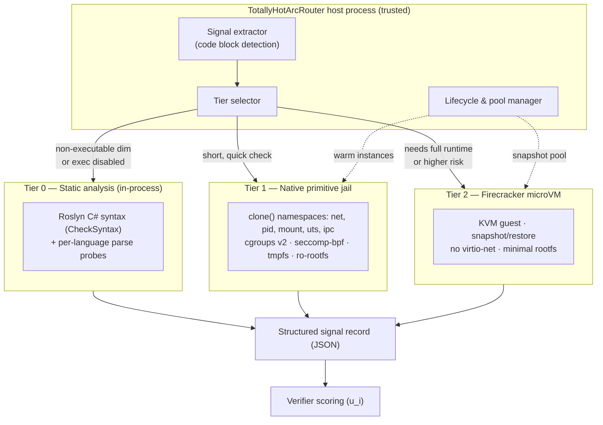
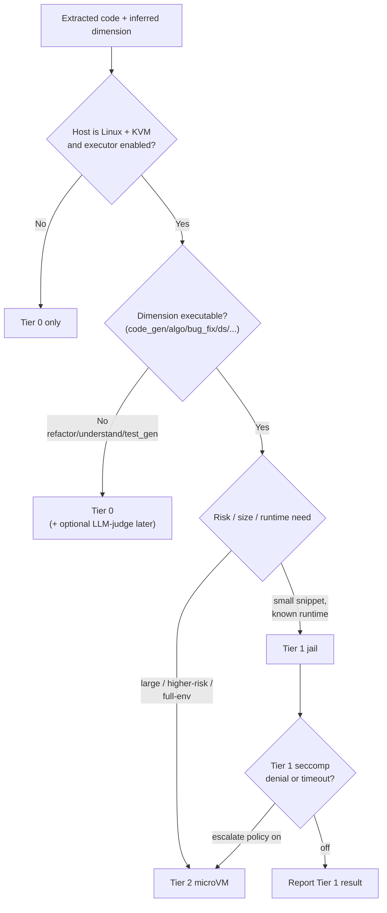
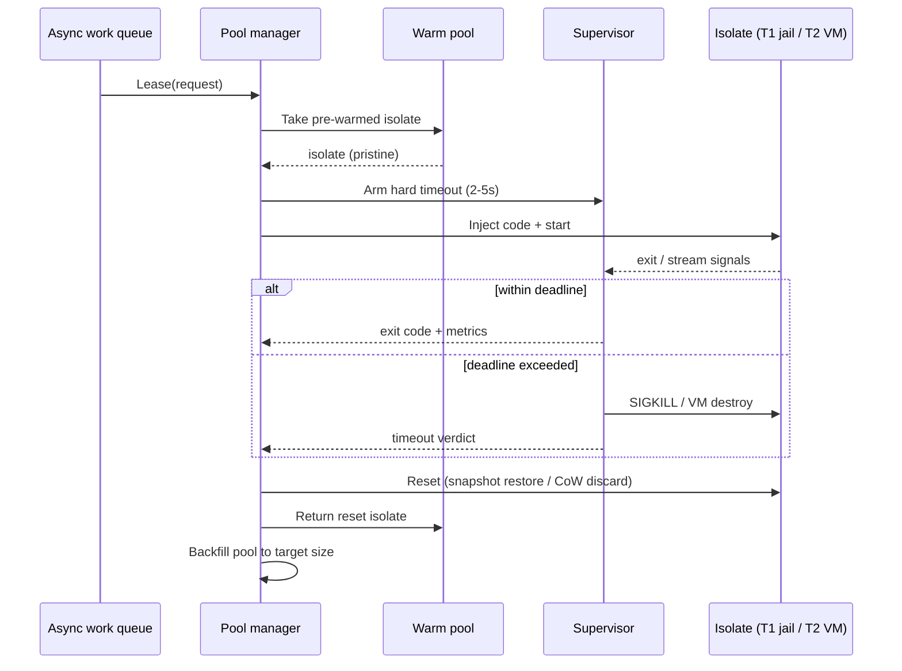
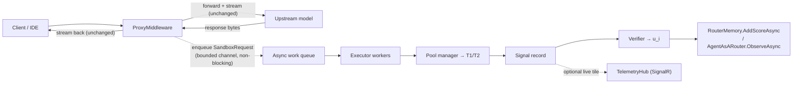
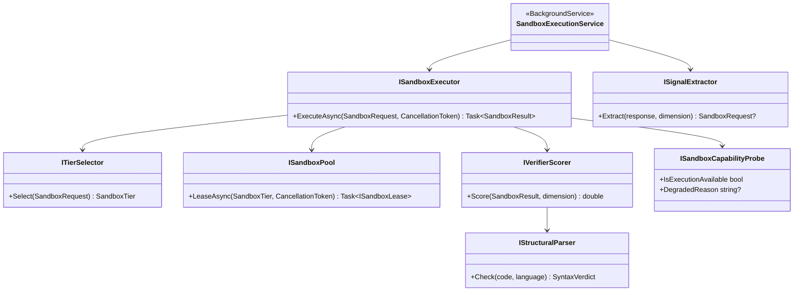

# Generic Sandboxed Executor for Live Traffic

> **Status: Implemented (Phases 1–6).** The `TotallyHot.ArcRouter.Sandbox` project implements this design:
> Tier-0 static analysis, off-path async orchestration, the Tier-1 native Linux jail, the Tier-2
> Firecracker microVM path, verifier weighting/learning into `RouterMemory` (live namespace), and the
> hardening pass. Execution tiers (1/2) are Linux-only and gated by a capability probe; on other hosts
> the executor degrades to Tier-0 static analysis. The Tier-1/Tier-2 guest images, Firecracker snapshot,
> and in-guest exec agent are **operational artifacts built out of band** (§6) — the code integrates
> with them but does not ship them. Cross-platform unit tests cover the OS-agnostic surface; real jail /
> microVM behavior is verified by Linux+KVM integration tests gated behind the capability probe.

## 1. Purpose

The TotallyHotArcRouter framework's **Verifier** module produces *execution-grounded* feedback — the new
information that each Context→Action→Feedback (C-A-F) loop contributes to `RouterMemory`
(see [`docs/research/technical-reference.md`](../research/technical-reference.md) §3.3 and the
paper's Eq. 8). In the **offline benchmark** that feedback comes from a Docker/Apptainer harness
with ground-truth unit tests (SWE-bench images). That harness belongs to the upstream reproduction
pipeline and is not part of this repository; see
[`docs/HANDBOOK.md`](../HANDBOOK.md) for what this repository covers.

**Live proxy traffic has no ground-truth verifier.** When the .NET proxy
(`Proxy/ProxyMiddleware.cs`) forwards a request and streams a response back, there is no held-out
test suite for the code the model just produced. Today the proxy therefore emits observability-only
telemetry (`RoutingTelemetryEvent`) and never calls `RouterMemory.AddScoreAsync` /
`AgentAsARouter.ObserveAsync` — the learning loop is open.

This executor closes that loop **safely**. It extracts code from live model responses, runs it
under strict isolation, and converts the execution outcome (compile/parse validity, exit code,
stdout/stderr signals, resource footprint) into the Verifier's unified score `u_i ∈ [0,1]`, which
becomes the reward signal fed back into `RouterMemory`. Because the code is untrusted model output
executed on the operator's own infrastructure, isolation and resource hardening are the dominant
design constraints — not raw throughput.

### 1.1 Design goals

1. **Isolation first.** Untrusted code must not read operator secrets, reach the network, exhaust
   host resources, or persist state across executions.
2. **No third-party language toolchains.** Per the chosen direction, avoid WebAssembly runtimes and
   specialized compilers. Use **Firecracker microVMs** plus **native Linux primitives** (cgroups v2,
   network namespaces, mount namespaces, tmpfs, seccomp) only.
3. **Rapid cold-start.** Never boot an isolation environment per request. Use a **warm pool** plus
   **snapshot/CoW reset** so per-execution latency is milliseconds, not seconds.
4. **Non-blocking.** Execution happens on an **async queue off the request path** — it must never
   delay or alter the user-facing response the proxy already streams.
5. **Robust telemetry.** Every execution yields a structured JSON signal record: stdout, stderr,
   exit code, syntax verdict, wall-clock duration, peak memory.
6. **Graceful degradation.** On non-Linux / non-KVM hosts the executor disables itself and the
   Verifier falls back to non-execution signals (Tier 0 static analysis + HTTP outcome).

### 1.2 Non-goals

- **Not** a general remote-code-execution service or user-facing REPL.
- **Not** a replacement for the offline benchmark harness; it produces *proxy* rewards for online
  learning, not paper-grade resolved-rate metrics.
- **No** provider-cache-hit accounting or exact dollar reconciliation (the paper treats monetary
  cost as a secondary reference metric; so do we).
- **No** Windows/macOS *execution* isolation. Those platforms get Tier-0 only (see §12).

## 2. Threat model

| Adversary capability | Assumption | Mitigation tier |
|---|---|---|
| Code attempts network exfiltration of host secrets | Untrusted by default | Empty network namespace (Tier 1) / no virtio-net device (Tier 2) — §5 |
| Code spins infinite loops / fork bombs | Untrusted | cgroup `pids.max`, CPU quota, external supervisor hard-kill — §4.3, §5 |
| Code allocates unbounded memory | Untrusted | cgroup `memory.max` (128 MB default) — §5 |
| Code fills disk | Untrusted | read-only root + tmpfs size cap (a few MB) — §5 |
| Code tries kernel-surface syscalls to escape | Untrusted | seccomp-bpf allowlist (Tier 1); KVM hardware boundary (Tier 2) — §5 |
| Code reads another execution's leftovers | Untrusted | snapshot/CoW reset to pristine state between runs — §4.2 |
| Malicious payload in the *extraction* step (e.g. crafted fenced block) | Untrusted input | Bounded parse, size caps, no shell interpolation of model text — §9.1 |

The trust boundary is the isolation layer. The .NET host process is **trusted**; guest code is
**never** trusted. All host↔guest communication is over an explicit, size-bounded, structured
channel (a vsock/pipe carrying JSON), never by sharing writable host paths.

## 3. Multi-tier architecture

Three tiers, escalating in isolation strength and cost. A **tier selector** picks the lowest tier
that satisfies the task's execution requirement, so most traffic never pays microVM cost.



### 3.1 Tier 0 — Static analysis (always available, cross-platform, in-process)

No execution, no OS primitives. Parses the extracted code to a validity verdict:

- **C#:** reuse the existing `Tools/CheckSyntax.cs` (Roslyn `CSharpSyntaxTree` diagnostics).
- **Python / JS / shell:** lightweight parse probes (see §8.2). A parse probe that itself *runs* an
  interpreter (`python -m py_compile`) is a Tier-1 job; a pure in-process parser stays Tier 0.

Tier 0 is the **only** tier on Windows/macOS and is the universal fallback when execution is
disabled or unavailable. It maps to the paper's Verifier "AST parsing" signal.

### 3.2 Tier 1 — Native Linux primitive jail (fast path)

A jailed child process launched directly by the host on Linux, isolated with kernel namespaces +
cgroups v2 + seccomp + tmpfs, with **no** virtual machine. Cold-start is sub-millisecond to a few
milliseconds because there is no kernel boot. This is the **default execution tier** for short,
bounded snippets (the bulk of extractable code). Isolation is strong but shares the host kernel, so
seccomp is mandatory.

### 3.3 Tier 2 — Firecracker microVM (hardened path)

A Firecracker microVM (KVM hardware isolation, separate guest kernel) restored from a **pre-booted
snapshot**. Used when the workload needs a fuller runtime environment, is larger, or is flagged
higher-risk, and as the tier that does *not* share the host kernel. Snapshot restore keeps
per-execution latency in the low tens of milliseconds despite the VM boundary. This maps to the
paper's "sandbox execution (Docker)" tool, upgraded to a lighter, faster microVM.

**Guest-side connectivity (vsock).** With no virtio-net device (§5.2), the host↔guest exec channel is
Firecracker's vsock, surfaced host-side as a Unix domain socket. Per run, `FirecrackerMicroVmLauncher`:
(1) issues `PUT /vsock` (guest CID + a fresh per-run UDS path) before `PUT /snapshot/load` — vsock wiring
is *not* baked into the snapshot the way machine sizing is, so a restored guest genuinely gets a clean
UDS endpoint each run; (2) after the snapshot-restore resumes the guest, waits for Firecracker to create
that UDS file — it only appears once the guest has actually booted and brought up its vsock device, not
at config time; (3) only then does the in-guest exec agent client (`IGuestAgentClient`) connect and issue
the `CONNECT <port>\n` handshake documented in `VsockGuestAgentClient`.

### 3.4 Tier selection



Selection inputs come from the inferred task **dimension** (the paper's `d(t_i)`), the extracted
code's language and size, and a configurable risk policy. Non-executable dimensions
(code refactoring, code understanding, test generation in the paper's taxonomy) skip execution and
use Tier 0; execution-scored dimensions prefer Tier 1 and escalate to Tier 2 by policy.

## 4. Lifecycle & Pool Manager

Booting isolation per request destroys performance, so the pool manager keeps environments warm and
resets them cheaply.



### 4.1 Warm pooling

- Maintain a configurable number of idle, pristine isolates per tier (`WarmPoolSize`, default e.g.
  Tier 1 = 8, Tier 2 = 2 — tuned to host capacity).
- A background maintainer backfills the pool asynchronously so a lease rarely waits on a cold boot.
- Pool acquisition is bounded: if the pool is exhausted and at the max concurrency cap, the request
  is **dropped from sampling** rather than queued unboundedly (execution is best-effort; see §10.3).

### 4.2 State reset

The invariant: **every execution starts from a byte-identical pristine environment.**

- **Tier 2 (Firecracker):** restore from a snapshot of a booted, runtime-loaded guest. Restore is
  milliseconds and guarantees a clean memory + filesystem state. The writable layer is a
  Copy-on-Write overlay discarded on return.
- **Tier 1 (native jail):** the writable surface is a fresh `tmpfs` mount created per lease and
  unmounted on return; the root is read-only and shared. "Reset" is therefore just discarding the
  per-lease tmpfs and namespaces — no residue can survive.

### 4.3 Strict timeouts (external supervisor)

- A **supervisor** distinct from the guest enforces a hard wall-clock ceiling
  (`MaxWallClockMs`, default 2000–5000 ms). It is the authority that kills runaway work; the guest
  cannot extend or disable it.
- Tier 1: supervisor sends `SIGKILL` to the jailed process group.
- Tier 2: supervisor destroys the microVM.
- A timeout is a **valid signal**, not an error — it maps to a low `u_i` and is recorded, because
  "the model's code hangs" is exactly the kind of quality information `RouterMemory` should learn.

## 5. Resource & network hardening

Applied to Tier 1 (native primitives) and enforced by the microVM configuration in Tier 2.

### 5.1 Network air-gapping (default deny)

- **Tier 1:** run in a fresh, empty **network namespace** with no veth pair and loopback down —
  there is simply no route out. No inbound, no outbound.
- **Tier 2:** configure the microVM with **no virtio-net device** at all.
- Network is *never* enabled implicitly. A future opt-in "network-allowed" mode would attach a
  filtered egress path per explicit request and is out of scope for the initial design.

### 5.2 cgroups v2 limits (per execution)

| Controller | Key | Default | Purpose |
|---|---|---|---|
| memory | `memory.max` | 128 MB | Hard memory ceiling; OOM-kill on breach |
| memory | `memory.swap.max` | 0 | No swap escape hatch |
| cpu | `cpu.max` | 1 core-equiv quota | Bound CPU so one job can't starve the host |
| pids | `pids.max` | e.g. 64 | Fork-bomb protection |
| io | `io.max` | capped | Bound disk IO (Tier 2 backing) |

Also cap file descriptors (`RLIMIT_NOFILE`) and total CPU time (`RLIMIT_CPU`) as a second line under
the cgroup ceilings.

### 5.3 Storage limits

- **Read-only root filesystem** bound into the isolate (shared, immutable base image with the
  runtimes from §8).
- **Writable layer only in RAM:** a `tmpfs` mount (e.g. `/work`) capped at a few MB
  (`TmpfsSizeMb`, default 8). All guest writes land here and vanish on reset.
- No host directory is ever bind-mounted writable into the guest.

### 5.4 Syscall hardening

- **Tier 1:** a **seccomp-bpf allowlist** permitting only the syscalls the target runtimes need
  (read/write/mmap/exit-group/etc.), defaulting everything else to `EPERM` or `SIGSYS`. A seccomp
  denial escalates (by policy) to Tier 2 or fails closed to Tier 0.
- **Tier 2:** the KVM boundary is the primary control; Firecracker's own minimal device model and
  jailer provide defense in depth.

## 6. Guest image / runtimes

A single minimal read-only rootfs (built reproducibly, checked into CI as an artifact — not into
git) carries the runtimes. Chosen runtimes:

| Runtime | Tier support | Notes |
|---|---|---|
| **Python 3** (CPython + stdlib) | T1/T2 | First-class. Covers code_gen, algo, bug_fix, data_science — the paper's execution-heavy dimensions. |
| **Node.js** (JavaScript) | T1/T2 | Second runtime for JS/TS snippets. |
| **POSIX shell + coreutils** (BusyBox) | T1/T2 | Near-zero image cost; runs shell snippets and simple binary checks. |
| **.NET runtime** (C#) | Tier 0 primarily | C# gets its validity signal from in-process Roslyn (`CheckSyntax`). A full in-guest .NET execution runtime is heavy; deferred — C# is **syntax-check-only** at launch, execution added later if warranted. |

Data-science Python libraries (numpy/pandas) are intentionally **excluded** from the base image at
launch to keep it small and boot-fast; import failures for missing deps degrade to a syntax-valid
but not-executed signal (still useful — see §9.2). A larger optional image can be added later.

## 7. Verifier scoring model

The extracted signals collapse into the paper's unified score `u_i ∈ [0,1]` (Eq. 8), a weighted sum
of per-tool scores. For live traffic with no ground-truth tests, the available tools are structural
validity, execution outcome, and (optionally, later) prompt-embedded tests and LLM-judge:

```
u_i = w_syntax · s_syntax + w_exec · s_exec + w_tests · s_tests   (Σw = 1, per dimension)
```

Launch configuration (no prompt-embedded tests yet, `w_tests = 0`):

| Signal | Score contribution |
|---|---|
| `s_syntax` | 1.0 if parse/compile clean, else 0.0 (Tier 0, always present) |
| `s_exec` | 1.0 exit 0 within limits; partial for clean-exit-with-stderr; 0.0 on non-zero exit, timeout, OOM, or seccomp kill |

The reward function from the paper is `r_i = ε₁·s_i + ε₂·κ_i` with `(ε₁, ε₂) = (1, −0.1)`
(technical-reference §3.2). Here `s_i = u_i` and `κ_i` reuses the proxy's existing per-request cost
estimate (`RoutingTelemetryEvent.EstimatedCostUsd`). We feed `u_i` (quality) to `RouterMemory` and
keep cost accounting in telemetry. The `[0,1]` range constraint is enforced in `AgentAsARouter.ObserveAsync`
(see Router.cs), not in `RouterMemory` itself, which accepts any double and relies on callers to clamp.

> **Weights are configurable per dimension** to mirror the paper's `w_{d(t_i),k}`. Executable
> dimensions weight `s_exec` heavily; non-executable ones fall back to `s_syntax` (and later
> LLM-judge). All weights and the exec-partial-credit rule are documented as a **heuristic proxy**
> for quality, not a ground-truth measure — see §14 risks.

## 8. Signal extractor

### 8.1 Code extraction

Runs in the host (trusted) just after the proxy has finished streaming the response to the client
(reusing the already-captured `capturedResponseBytes` in `ProxyMiddleware`, so no second copy of the
model output is needed). It:

1. Parses assistant text (via the existing `IResponseTextExtractor`) for fenced code blocks.
2. Reads the language hint on the fence; falls back to lightweight language detection.
3. Applies **size and count caps** (e.g. first N blocks, ≤ K KB total) — model text is untrusted, so
   extraction is bounded and never shell-interpolated.
4. Emits an internal `SandboxRequest` onto the async queue (§10). If no runnable block is found, it
   records a Tier-0-only "no executable content" signal and stops.

### 8.2 Structural parsing (syntax even when execution fails)

Per the requirement, syntax is verified **independently of execution**, so a snippet that can't run
(missing dependency, needs a network call) still yields a validity signal:

- **C#:** Roslyn in-process (Tier 0).
- **Python:** AST via `ast.parse()` or in-process library (Tier 0); subprocess-based `py_compile` is Tier 1.
- **JavaScript:** in-process parser library or `acorn` (Tier 0); `node --check` subprocess is Tier 1.
- **Shell:** in-process shell parser lib (Tier 0); `sh -n` subprocess check is Tier 1.

Structural parsing is cheap and always contributes `s_syntax`, decoupled from `s_exec`.

### 8.3 Structured output contract

Every execution — success, failure, timeout, or extraction-only — produces one record:

```jsonc
{
  "schemaVersion": "1.0",
  "requestCorrelationId": "…",        // ties back to the RoutingTelemetryEvent
  "sessionId": "…",
  "dimension": "code_generation",
  "language": "python",
  "tier": "Tier1",                     // Tier0 | Tier1 | Tier2
  "syntaxValid": true,                 // s_syntax source
  "executed": true,
  "exitCode": 0,                       // null if not executed
  "timedOut": false,
  "oomKilled": false,
  "seccompDenied": false,
  "stdoutTruncated": "…",              // size-capped
  "stderrTruncated": "…",              // size-capped
  "wallClockMs": 143,                  // resource metric
  "peakMemoryBytes": 20447232,         // resource metric → cost/efficiency
  "unifiedScore": 1.0,                 // u_i ∈ [0,1]
  "degradedReason": null               // e.g. "host-not-linux", "kvm-unavailable"
}
```

stdout/stderr are captured, size-capped, and **redaction-scanned** before logging (they may echo
prompt content). Wall-clock and peak memory feed the router's cost/efficiency view alongside the
existing token-based cost.

## 9. Orchestration flow (async, non-blocking)

The executor sits **off the request path**. The proxy's existing behavior — resolve route, forward,
stream response to the client, publish `RoutingTelemetryEvent` — is unchanged and never waits on the
sandbox.



### 9.1 Queue

A bounded `System.Threading.Channels.Channel<SandboxRequest>`. Enqueue is a non-blocking
`TryWrite`; if the channel is full the request is dropped from sampling (best-effort learning) and a
counter is incremented. This guarantees the proxy hot path has **zero** added latency and cannot be
back-pressured by a slow sandbox.

### 9.2 Workers

A `BackgroundService` (`SandboxExecutionService`) drains the channel with a bounded degree of
parallelism (≤ pool capacity), leases an isolate, runs, extracts signals, scores, and observes into
`RouterMemory`. A snippet that is syntax-valid but fails to execute (missing dep) still observes its
`s_syntax` component — partial information is better than none.

### 9.3 Sampling & backpressure

Execution is **sampled**, not mandatory for every request (`SamplingRate`, default e.g. 1.0 for
executable dimensions, 0.0 for non-executable). Under load the pool cap + bounded channel shed work
gracefully. None of this affects user-facing responses.

## 10. Integration with existing code

| Existing element | Interaction |
|---|---|
| `Proxy/ProxyMiddleware.cs` | After its best-effort `PublishTelemetryAsync`, add an equally best-effort `TryEnqueue(SandboxRequest)` using the already-captured response bytes and inferred dimension. Wrapped in the same swallow-and-log guard so sandbox failure never affects the forward. |
| `Telemetry/RoutingTelemetryEvent.cs` | Correlation id links a sandbox signal record back to its routed request. Optionally extend telemetry with an execution-signal side event for the dashboard. |
| `Router/RouterMemory.cs` (`AddScoreAsync`) | Receives `u_i ∈ [0,1]` keyed by `(dimension, model)`. No change to its shape. |
| `Router/AgentAsARouter.cs` (`ObserveAsync`) | The natural entry point for observing the score (already validates `[0,1]`). |
| `Tools/CheckSyntax.cs` | Reused verbatim as the C# Tier-0 signal. |
| `Hosting/ServiceCollectionExtensions.cs` | Register the new sandbox services + `SandboxExecutionService` hosted service (see §11). |
| Dimension inference | The paper's `d(t_i)`. A `IDimensionInferrer` (prompt/metadata heuristic) is needed; start simple (keyword/heuristic) and refine. |

## 11. Proposed components & project layout

New project `src/TotallyHotArcRouter.Sandbox/` (+ `src/TotallyHotArcRouter.Sandbox.Tests/`), keeping the OS-heavy
isolation code isolated from the core router and behind interfaces so non-Linux builds compile and
the core has no hard dependency on it.



Key records: `SandboxRequest` (code, language, dimension, correlation id, tier hint),
`SandboxResult` (the §8.3 JSON contract), `SyntaxVerdict`, `SandboxTier` enum
(`Tier0Static`, `Tier1Jail`, `Tier2MicroVm`).

Per `AGENTS.md`: **.NET 10**, nullable reference types, options binding, **XML doc comments on all
new public types/members**, **Serilog structured logging** for every lease/execution/observation
(`_logger.LogInformation("Sandbox executed {Language} dim {Dimension} tier {Tier} → u={Score}", …)`),
and **Mermaid-only** diagrams (as above).

## 12. Configuration & off-Linux degradation

New `Sandbox` section in `appsettings.json` (bound via the options pattern, consistent with
`ModelRoutingOptions` / `SpendTrackingOptions`):

```jsonc
{
  "Sandbox": {
    "Enabled": true,
    "SamplingRate": 1.0,
    "MaxWallClockMs": 3000,
    "MemoryMaxBytes": 134217728,     // 128 MB
    "PidsMax": 64,
    "TmpfsSizeMb": 8,
    "MaxCodeBytes": 65536,
    "WarmPool": { "Tier1": 8, "Tier2": 2 },
    "EscalateOnSeccompDenial": true,
    "Runtimes": ["python", "node", "shell"],
    "DimensionWeights": {
      "code_generation": { "syntax": 0.2, "exec": 0.8 },
      "code_refactoring": { "syntax": 1.0, "exec": 0.0 }
    }
  }
}
```

Environment overrides (deployment): `SANDBOX_ENABLED`, `SANDBOX_MAX_WALLCLOCK_MS`,
`SANDBOX_MEMORY_MAX_BYTES`, etc.

**Capability probe (`ISandboxCapabilityProbe`)** runs at startup: verifies Linux + `/dev/kvm` +
cgroup v2 + required binaries. If any is missing (e.g. Windows dev machine, macOS, container without
KVM), execution tiers are disabled, `Enabled` is forced false with a logged
`degradedReason`, and the Verifier uses **Tier 0 only** (`s_syntax` + the HTTP-outcome heuristic the
proxy already has). This matches the app's cross-platform posture (Serilog EventLog / netsh proxy are
Windows features; the sandbox is a Linux feature) without breaking startup anywhere.

## 13. Phased implementation plan

Each phase ends compilable, warning-free, with unit tests passing and ≥ 80% coverage on new code, and
individual unit tests bounded at ≤ 5 s (`AGENTS.md`). OS-primitive and Firecracker phases gate their
integration tests behind the capability probe so CI on non-KVM runners still goes green.

| Phase | Scope | Exit criteria |
|---|---|---|
| **1. Contracts & Tier 0** | `TotallyHot.ArcRouter.Sandbox` project; `SandboxRequest`/`SandboxResult`/`SyntaxVerdict` records; `ISignalExtractor` (code-block extraction) + `IStructuralParser` (C# via Roslyn, Python/JS/shell parse probes); `IVerifierScorer`; `ISandboxCapabilityProbe`. No execution yet. | Extraction + Tier-0 syntax scoring unit-tested; scorer maps verdicts to `u_i`; capability probe reports correctly on this Linux host and (mocked) on non-Linux. |
| **2. Async orchestration** | Bounded `Channel`, `SandboxExecutionService` background worker, enqueue hook in `ProxyMiddleware` (best-effort, swallowed), DI registration, `Sandbox` options binding, sampling + drop-on-full. Workers run Tier 0 only for now. | Proxy path provably unaffected (enqueue is non-blocking/drops when full); worker observes Tier-0 scores into `RouterMemory`; tests cover full-channel shedding and disabled mode. |
| **3. Tier 1 jail** | Native-primitive isolate: namespaces (net/pid/mount/uts/ipc), cgroups v2 limits, tmpfs writable, ro-rootfs, seccomp allowlist, external supervisor with hard timeout; Python/Node/shell runtimes in the base rootfs; `ISandboxPool` warm pool + per-lease tmpfs reset. | Linux+KVM integration tests: air-gap verified (no egress), memory/pids/timeout limits enforced and reported, reset leaves no residue; unit tests mock the process boundary; non-Linux CI skips via probe. |
| **4. Tier 2 microVM** | Firecracker integration: minimal guest rootfs + kernel, **snapshot/restore** pool, no virtio-net, jailer, CoW writable overlay; `ITierSelector` escalation (size/risk/seccomp-denial). | Snapshot-restore reset validated; microVM has no network device; selection + escalation unit-tested; integration tests gated on Firecracker availability. |
| **5. Verifier weighting & learning** | Per-dimension weight config; wire `u_i` into `AgentAsARouter.ObserveAsync`; correlation-id linkage to `RoutingTelemetryEvent`; optional live execution-signal tile on `TelemetryHub`. | End-to-end: a routed request with a Python block yields an observation in `RouterMemory`; weights configurable; dashboard shows execution signal; documented as heuristic proxy. |
| **6. Hardening & docs** | Redaction of stdout/stderr in logs, resource-metric plumbing (wall-clock/peak mem), load/backpressure tests, security review of the isolation boundary, update this doc's status banner. | Security review passed; backpressure/soak test stable; banner removed; this doc's Phase 5/verifier cross-links confirmed accurate. |

## 14. Testing strategy

- **Unit (cross-platform, deterministic):** extraction, structural parsers, tier selection, scorer,
  capability probe (mocked OS facts), channel shedding, options binding. Mock the process/VM boundary
  so these run on any OS in < 5 s each.
- **Integration (Linux + KVM only, probe-gated):** real air-gap (attempt egress → fails), cgroup
  enforcement (allocate > 128 MB → OOM-killed), timeout (infinite loop → SIGKILL/VM-destroy within
  ceiling), reset purity (write file in run A → absent in run B), snapshot-restore correctness.
- **Security regression:** a corpus of hostile snippets (fork bomb, `/etc/passwd` read attempt,
  socket open, disk fill) asserting each is contained and produces the expected low `u_i` signal.
- **Non-blocking proof:** assert proxy latency percentiles are unchanged with the sandbox saturated.

## 15. Risks & mitigations

| Risk | Mitigation |
|---|---|
| Heuristic score pollutes memory the offline benchmark relies on | Live observations write to a **separate live memory namespace/store**, never the checked-in benchmark matrices; weights + sampling documented as heuristic. |
| Kernel-shared Tier 1 escape | Mandatory seccomp allowlist; escalate/deny on unexpected syscalls; Tier 2 microVM for higher-risk work. |
| Firecracker/KVM unavailable in target deploy | Capability probe → graceful Tier-0 degradation; Tier 2 optional. |
| Snapshot/rootfs drift or corruption | Reproducible image build + checksum; validate snapshot on load; rebuild on mismatch. |
| stdout/stderr leaking prompt content into logs | Size-cap + redaction scan before logging; structured fields only. |
| Sandbox slowness back-pressuring proxy | Off-path bounded channel with drop-on-full; pool concurrency cap; proven by non-blocking tests. |
| Resource exhaustion of the host by many isolates | Global concurrency cap + warm-pool sizing tied to host capacity; cgroup limits per isolate. |
| Missing runtime deps make many snippets non-executable | Syntax signal still recorded; optional richer image later; sampling avoids over-weighting failures. |

## 16. Open questions / future work

- **Prompt-embedded tests** (paper Verifier tier 3): extract in-prompt test cases and run them for a
  stronger `s_tests` signal — high-value follow-up once Tier 1/2 are stable.
- **LLM-as-Judge** for non-executable dimensions (refactoring, understanding) — deferred; needs a
  judge-model budget policy.
- **Optional filtered egress** mode for tasks that legitimately need network (documented default-deny
  today).
- **Task-embedding memory** (voyage-code-3 / BGE-large kNN) to match the paper's Memory design more
  closely than the current dimension→model score store.
- **Larger optional guest image** (numpy/pandas) behind config for data-science dimensions.

## 17. References

- [`docs/research/technical-reference.md`](../research/technical-reference.md) — Verifier (Eq. 8),
  C-A-F loop, reward weights `(ε₁, ε₂) = (1, −0.1)`, dimension taxonomy.
- [`docs/research/paper-notes.md`](../research/paper-notes.md) — verification tool tiers, Memory design.
- [`docs/HANDBOOK.md`](../HANDBOOK.md) — offline sandbox harness (Docker/Apptainer, upstream only)
  this online executor complements.
- [`system-proxy-architecture.md`](./system-proxy-architecture.md),
  [`telemetry.md`](./telemetry.md) — the proxy + telemetry path this executor hooks into.
- `AGENTS.md` — .NET 10 conventions, Serilog logging, Mermaid diagrams, 80% coverage, ≤ 5 s tests.

