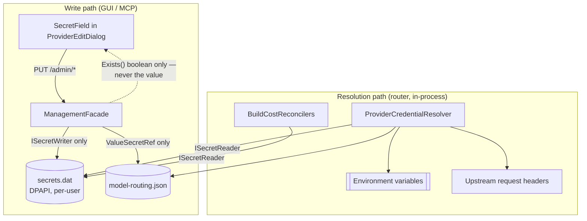

# Secrets at rest — a generic protected store, with the Anthropic Admin-API path as its first consumer

> **Status: planned.** Phases 1-3 are unconditional and are the higher-value work. Phases 4-6 are
> gated on [§2's eligibility check](#2-step-0--admin-key-eligibility-gate-product-decision) and revise
> [`../gui/backlog.md`](../gui/backlog.md) item #3, whose stated blocker is stale. Complements
> [`anthropic-reported-usage-plan.md`](anthropic-reported-usage-plan.md), which deliberately sources
> accurate usage *without* any admin credential; nothing here conflicts with it.

## 1. Why

Two things prompted this plan. The narrow one: [`../gui/backlog.md`](../gui/backlog.md) item #3 calls
the Usage & Cost Admin API path blocked for want of a key-sourcing mechanism. The broad one, found
while investigating that claim: **every secret this application persists is plaintext at rest**, and
the worst-protected file is not the one the backlog is about.

### 1.1 The backlog's two premises are stale

1. **A sourcing mechanism already shipped.** `CostTracking:Reconciliation:Providers:anthropic:AdminApiKeyEnvVar`
   names an environment variable; `TryResolveAdminApiKey`
   ([`ServiceCollectionExtensions.cs`](../../src/TotallyHotArcRouter/Hosting/ServiceCollectionExtensions.cs))
   resolves it through `IEnvironmentVariableProvider`; and
   [`AnthropicCostReconciler`](../../src/TotallyHotArcRouter/Telemetry/AnthropicCostReconciler.cs)
   already calls `GET /v1/organizations/cost_report` with it - paginated, retried, unit-tested. The
   "env var convention vs. a dedicated provider-editor field" choice the backlog calls open was made
   and shipped. What is actually missing is discoverability (`appsettings.json` ships
   `"Providers": {}` with no example) and any GUI surface at all - reconciliation writes
   `provider_cost_reconciliation` rows and log lines that nothing renders.
2. **The gate is "not an individual account", not "enterprise".** Anthropic's
   [Usage and Cost API](https://platform.claude.com/docs/en/manage-claude/usage-cost-api) doc states:
   *"The Admin API is unavailable for individual accounts. To collaborate with teammates and add
   members, set up your organization in Console → Settings → Organization."* Any **Claude Console**
   organization member holding the **admin** role can create an `sk-ant-admin01-…` key, and Console
   keys carry no selectable scopes. Converting an individual Console account into an organization is
   self-serve, so the prerequisite is a five-minute settings change rather than an enterprise
   contract.

### 1.2 Secret inventory - what is at rest today

| Secret | Where it lives | Protection today |
|---|---|---|
| Provider header literals (the inference API keys) - `ProviderHeader.Value` with `Locked = true` | `model-routing.json`, resolved against `AppContext.BaseDirectory` (the **install directory**) | **None.** Plaintext, no ACL. `ManagementFacade`'s locked-header masking is transport-only |
| Telemetry certificate password | `%LOCALAPPDATA%\TotallyHotArcRouter\telemetry-cert-pwd.txt` | **None.** Plain `File.WriteAllText`, no ACL, sitting beside the `.pfx` it decrypts |
| Management token | `%LOCALAPPDATA%\TotallyHotArcRouter\management-token.txt` | ACL-restricted via `WriteRestricted`; contents plaintext |
| Admin API keys (OpenAI/Anthropic reconcilers) | Environment variable only | n/a - nothing is stored |
| AWS credentials | Environment variable only, by design (`AwsAccessKeyIdEnvVar` et al.) | n/a - no change needed |

[`ManagementAccessToken`](../../src/TotallyHotArcRouter/Proxy/Management/ManagementAccessToken.cs)'s
remarks contrast itself against the certificate - "there is no separate password protecting it the way
the certificate's `.pfx` has" - but that separate password is itself unprotected, which inverts the
comparison. Fixing it is Phase 3, and it is the cheapest item in the table.

### 1.3 Where secrets flow after this plan



## 2. Step 0 - Admin-key eligibility gate (product decision)

Not a code task. Open <https://platform.claude.com/settings/admin-keys>, signed in to the Console
account whose `x-api-key` the `anthropic` provider uses.

| What the page shows | Meaning | Action |
|---|---|---|
| A **Create key** button | Already an organization admin | Nothing is blocked; Phases 4-6 are buildable |
| "unavailable for individual accounts" | Individual Console account | Self-serve: Console → Settings → Organization, then create the key |
| No Console account exists (a claude.ai subscription only) | The Admin API is out of reach | **Stop after Phase 3** and rewrite backlog #3 as "requires a Claude Console organization" |

A Claude Pro or Max subscription is a claude.ai consumer plan. It is neither a Console organization
(which carries Admin API keys) nor Claude Enterprise (which carries Analytics API keys), so a
subscription alone never yields a credential for this feature.

Two constraints hold regardless of the outcome:

- **Bedrock is excluded.** Claude Platform on AWS has no programmatic Usage/Cost API, so the
  `bedrock-anthropic` provider can never populate the Phase 6 card.
- **Claude Enterprise is a different API.** Enterprise parent organizations carry no Admin keys and
  use `/v1/organizations/analytics/…` with an Analytics API key (`sk-ant-api01-…`, created by the
  primary owner in claude.ai). The two key types are not interchangeable; do not make one client
  serve both.

## 3. Phase 1 - The generic protected secret store

New `src/TotallyHotArcRouter/Proxy/Management/ProtectedSecretStore.cs`. Name-keyed rather than
purpose-specific, and split into two surfaces so that the read path is unreachable from management
code:

```csharp
// Resolution surface - internal to the router. The ONLY reader of secret material.
// Consumers: ProviderCredentialResolver, BuildCostReconcilers, TelemetryTlsCertificate.
internal interface ISecretReader
{
    bool TryRead(string name, out string value);
}

// Management surface - what ManagementFacade is handed. Deliberately has no reader.
public interface ISecretWriter
{
    void Write(string name, string value);
    bool Delete(string name);
    bool Exists(string name);           // boolean only, never the value
    int  DeleteByPrefix(string prefix); // cascade cleanup
}
```

One implementation satisfies both. `ManagementFacade` is injected with `ISecretWriter` alone, making
[§4's write-only invariant](#4-invariant--the-management-surface-is-write-only-for-secrets) a
compile-time boundary rather than a convention a later change can drift past.

**Naming convention**, deterministic so that prefix cascades work:

| Secret | Name |
|---|---|
| A provider header value | `provider:{providerKey}:header:{headerName}` |
| A reconciler's Admin API key | `reconciliation:{provider}:admin-key` |
| The telemetry certificate password | `telemetry:cert-password` |

**Storage.** One file, `%LOCALAPPDATA%\TotallyHotArcRouter\secrets.dat`, holding a DPAPI-encrypted
JSON map. The whole blob is encrypted rather than each value individually: that hides the *names*
too - `provider:anthropic:header:x-api-key` is itself informative - and the data is small and rarely
written, so there is no cost to reading and rewriting all of it per edit. A fixed application-specific
`optionalEntropy` is passed so that another process running as the same user cannot trivially
`Unprotect` the file. Writes are atomic (temp file, then `File.Move` overwrite) so that a crash
mid-write cannot leave a truncated map that would read as "every secret is gone".

**Reuse, do not reinvent, the file-protection sequence.** `ManagementAccessToken.WriteRestricted`
already implements precisely what this needs, and its ordering is load-bearing: create the file empty
and closed, apply the ACL (Windows) or `UnixFileMode.UserRead | UserWrite` (POSIX), and only then
reopen it `FileShare.None` to write - so the secret is never briefly readable under the directory's
inherited permissions. It also carries `RestrictToCurrentUserWindows` under
`[SupportedOSPlatform("windows")]` and a path-scoped named `Mutex` that serializes the whole
check-read-write sequence across the router and GUI processes. Factor these helpers out for shared use
rather than copying them.

**Build constraint - not optional polish.** `TotallyHotArcRouter.csproj` targets plain `net10.0`, not
`net10.0-windows`, and [`Directory.Build.props`](../../src/Directory.Build.props) sets
`TreatWarningsAsErrors`. `System.Security.Cryptography.ProtectedData` is a **new NuGet reference**, and
an unguarded call to it raises **CA1416**, which fails the build. Every call must sit behind
`OperatingSystem.IsWindows()` with `[SupportedOSPlatform("windows")]` on the private helpers, exactly
as `ManagementAccessToken` already does.

**Non-Windows behavior: refuse, do not degrade.** `Write` throws `PlatformNotSupportedException`;
`TryRead` and `Exists` return `false` so callers fall through to their existing environment-variable
path. Never write an unencrypted file - a store named "protected" that silently is not would be worse
than today's honest plaintext.

**Phase 1 tests** (`src/TotallyHotArcRouter.Tests/Proxy/Management/ProtectedSecretStoreTests.cs`,
following `ManagementAccessTokenTests`' temp-path-and-cleanup pattern): round-trip; overwrite replaces;
delete; `DeleteByPrefix` removes only the matching subtree; a missing name returns `false`; **the
on-disk bytes contain neither the plaintext value nor the secret name**; concurrent writes from two
store instances do not lose entries; on non-Windows, `Write` throws and `TryRead` returns `false`.

## 4. Invariant - the management surface is write-only for secrets

**No secret that reaches the protected store is ever readable back through any API** - not `/admin/*`,
not MCP, not for a convenience case. This governs Phases 2 and 4, and it closes a gap that exists
today.

Readability is currently decided by the per-header `Locked` flag: `ManagementFacade` withholds locked
literals but **returns unlocked ones in full** (`ListProviders_ReturnsAnUnlockedHeaderValueInFull`),
which is deliberate, so that public configuration such as `anthropic-version` and `X-Title` stays
editable in the provider editor. The consequence is that an operator who leaves a key-bearing header
unlocked has it echoed back over the management API. Replace the flag-driven rule with a
location-driven one:

| Value kind | Where it is stored | Readable via `/admin` and MCP |
|---|---|---|
| Non-secret literal (`anthropic-version`, `X-Title`) | Plaintext in `model-routing.json` | **Yes** - editable exactly as today |
| Secret literal (`Locked = true`) | Protected store, referenced by `ValueSecretRef` | **Never** |
| Environment-variable-backed | Only the variable *name* is in config | Name yes, value never (unchanged) |

`Locked` keeps its existing job - deciding which bucket a header lands in on write, defaulting to
`true` so that a header of unknown provenance stays secret. It simply no longer decides what a read
returns.

Concretely:

- **There is no `GET /admin/secrets/{name}`, ever.** `PUT` and `DELETE` only. This is recorded as an
  explicit non-goal in `secrets-at-rest.md` (see [§9](#9-documentation)) so that it is not added later
  "for debugging".
- `ManagementFacade` receives `ISecretWriter` and therefore *cannot* read a secret even by mistake.
- Existence is exposed as a boolean - `HeaderValueSource.Protected`, `HasStoredAdminKey`. The GUI's
  `HasStoredLiteralValue` placeholder logic already works from a boolean, so `SecretField` itself needs
  no change.
- **MCP counts as a management surface.** `ProviderMcpTools`/`McpServer` call the same
  `ListProviders()`, so masking is inherited - but it sits behind the same token and needs its own
  test rather than an assumption.
- Unlocking stays destructive (it clears the value) because there is nothing to reveal. That becomes
  the universal rule rather than a per-header quirk.
- Server-side probing is unaffected: `DiscoverModelsCoreAsync` and `ProviderEndpointScanner` resolve
  headers in-process through `ProviderCredentialResolver` and never ship key material to the GUI.

## 5. Phase 2 - Provider header secrets move behind a reference

This is the main win: today a locked literal API key is serialized verbatim into `model-routing.json`
in the install directory. Change what is *persisted*, not what is *resolved*.

- **[`ProviderHeader`](../../src/TotallyHotArcRouter/Models/ModelRoutingOptions.cs)** gains
  `string? ValueSecretRef`, the store key. Documented precedence: literal `Value` → `ValueEnvVar` →
  `ValueSecretRef`.
- **[`ProviderCredentialResolver`](../../src/TotallyHotArcRouter/Proxy/ProviderCredentialResolver.cs)**'s
  `ResolveExtraHeaders`/`ApplyToRequest` gain a third resolution branch, taking the reader as an
  **optional parameter defaulting to `null`** - the `budgetStore` pattern already used for optional
  dependencies. `IEnvironmentVariableProvider` has roughly fifteen call sites (`ModelRouteResolver`,
  `ManagementFacade`, `ModelDialectResolver`, `ProviderEndpointScanner`, plus test factories) and a
  required parameter would churn all of them. This one method is the choke point that the forwarding
  path and model discovery already share, so a single change covers both.
- **`ManagementFacade`** - `HeaderValueSource` gains `Protected` and `ClassifyHeaderSource` reports it.
  On upsert, a locked literal is written to the store and only its ref is persisted.
  `RemoveProviderAsync` calls `DeleteByPrefix($"provider:{key}:")` so that removing a provider does not
  orphan ciphertext; the same applies to a header dropped during an upsert.
- **GUI** - no new UX. `SecretField`'s padlock and its "•••••••• (saved, blank keeps it)" placeholder
  in [`ProviderEditDialog.razor`](../../src/TotallyHotArcRouter.Gui/Components/ProviderEditDialog.razor)
  already describe this behavior exactly; only the storage behind it changes.

**One-time migration** in [`ProviderConfigStore`](../../src/TotallyHotArcRouter/Proxy/ProviderConfigStore.cs):
on load, for each header with `Locked == true` and a non-empty `Value`, write the value to the store,
set `ValueSecretRef`, null out `Value`, and persist the file once. Idempotent, and logged with a static
message template per the Serilog rule in [`AGENTS.md`](../../AGENTS.md). If the store is unavailable
(non-Windows), leave the configuration untouched and log a warning - a machine that cannot encrypt must
keep working, not lose its keys.

### 5.1 Phase 2 tests

Migration moves a locked literal and leaves unlocked ones (`anthropic-version`) alone; migration is
idempotent; resolution precedence across all three sources; provider removal cascades; a round-trip
through `model-routing.json` shows no plaintext key.

**Write-only tests assert on the whole response, not per field.** Serialize the full `ListProviders()`
payload, and the MCP `list_providers` payload, for a provider carrying a protected header, and assert
that the secret value appears **nowhere** in the JSON. A per-field assertion only proves that the field
you thought of is masked; a whole-response assertion also catches a value leaking through some future
field nobody remembered to mask. Add the mirror case for `HasStoredAdminKey`. Keep
`ListProviders_ReturnsAnUnlockedHeaderValueInFull` passing - non-secret literals must stay readable -
and add its counterpart proving a store-backed value never is.

## 6. Phase 3 - The telemetry certificate password

[`TelemetryTlsCertificate`](../../src/TotallyHotArcRouter/Telemetry/TelemetryTlsCertificate.cs) writes
`telemetry-cert-pwd.txt` with a bare `File.WriteAllText` and no ACL, immediately next to the `.pfx` it
opens. Move it to `telemetry:cert-password` in the store, falling back to the existing file when the
store holds no entry, then migrating that file's content in and deleting it. Small, isolated, and it
removes the weakest link in [§1.2](#12-secret-inventory---what-is-at-rest-today)'s table.

### 6.1 Deferred - the management token

`management-token.txt` is deliberately left as it is.
[`TotallyHotArcRouter.Gui.Admin.csproj`](../../src/TotallyHotArcRouter.Gui.Admin/TotallyHotArcRouter.Gui.Admin.csproj)
states that it "deliberately does not reference the TotallyHotArcRouter proxy project - it's an
independent wire contract for a separately deployable process", and `ManagementTokenReader` lives
there. Encrypting the token would mean either duplicating the store into `Gui.Admin` or inventing a
shared assembly - breaking a documented architectural boundary for the one secret in the inventory
that is *already* ACL-restricted. Record the decision in
[`signalr-hub-security.md`](signalr-hub-security.md).

## 7. Phase 4 - Admin key sourcing (gated on Step 0)

Resolution order in `BuildCostReconcilers`: **stored secret first, then `AdminApiKeyEnvVar`.** Extend
`TryResolveAdminApiKey` only - both existing reconcilers inherit the change, and every current
environment-variable deployment keeps working untouched.

`BuildCostReconcilers` runs once at DI construction, so a key saved from the GUI must not require a
restart to take effect. Resolve lazily per cycle - a factory, or a reconciler that reads the store on
each call - rather than capturing the string at startup.
[`CostReconciliationHostedService`](../../src/TotallyHotArcRouter/Hosting/CostReconciliationHostedService.cs)
already re-enters `RunCycleAsync` on a timer, which is the natural seam.

Write path: `PUT /admin/secrets/{name}` and `DELETE /admin/secrets/{name}` on
[`ProviderAdminEndpoints.cs`](../../src/TotallyHotArcRouter/Proxy/Management/ProviderAdminEndpoints.cs),
already gated by `x-admin-token`, delegating to `ManagementFacade`. **No `GET` counterpart** - see
[§4](#4-invariant--the-management-surface-is-write-only-for-secrets). The GUI routes every
configuration write through `/admin/*` today and this must not become the exception.
`GET /admin/providers` reports only a `HasStoredAdminKey` boolean.

## 8. Phases 5 and 6 - Reported usage and its card (gated on Step 0)

### 8.1 Phase 5 - Client and storage

New `src/TotallyHotArcRouter/Telemetry/AnthropicUsageReportClient.cs`, shaped like
`AnthropicCostReconciler`: the same `x-api-key` and `anthropic-version: 2023-06-01` headers, the same
`CostReconciliationRetryPolicy.SendWithRetryAsync`, and the same `has_more`/`next_page` loop.

`GET /v1/organizations/usage_report/messages` with `bucket_width=1d`, `group_by[]=model`, over a
trailing 30-day window. Note the documented limit: `1d` granularity caps at **31 buckets**, so 30 days
fits one window, but `group_by[]=model` still multiplies rows - pagination is required, not optional.

Refresh on the existing hourly `CostReconciliationHostedService` cycle, **not** on card load. Anthropic
documents sustained polling of at most one request per minute and explicitly recommends caching for
dashboards; the backlog's "fetched automatically whenever the card loads" would hit the endpoint on
every re-render. The credential and the schedule both already live in that service.

Storage follows the shipped `provider_rate_limit_snapshot` precedent in
[`PriceCatalogDatabase`](../../src/TotallyHotArcRouter/PriceCatalog/PriceCatalogDatabase.cs)'s
`SchemaSql`: a `provider_reported_usage_snapshot` table keyed by `(provider_key, usage_day, model)`
with token columns and a `fetched_at`, created via `CREATE TABLE IF NOT EXISTS` (a new table needs no
`Migrate*` method). Raw reported values are stored; totals are derived at read time.

Exposure: `ManagementFacade`'s `ProviderView` gains a `ProviderReportedUsageView` (rows plus
`FetchedAtUtc`), populated in `BuildProvidersResponse` and mirrored onto
[`ProviderAdminModels.cs`](../../src/TotallyHotArcRouter.Gui.Admin/ProviderAdminModels.cs)'s
`ProviderAdminView`. It rides the existing `GET /admin/providers` payload - no new route and no
`ProviderAdminClient` change, exactly how the shipped rate-limit view reached the GUI.

### 8.2 Phase 6 - The card

[`ProvidersAdmin.razor`](../../src/TotallyHotArcRouter.Gui/Components/ProvidersAdmin.razor) gains a
read-only section after the shipped "Reported by Anthropic" rate-limit block, gated on
`ProviderType == Anthropic` **and** a non-null reported-usage view.

- Daily token bars grouped by model, via the existing `EChart` host and the `BudgetBarJson` /
  `CostChartBuilder` pattern already used by Monthly Budget and Cost Analytics.
- Footer: "Fetched {FetchedAtUtc:yyyy-MM-dd HH:mm 'UTC'}", rendered from the backend value and never
  the GUI clock - Anthropic's numbers are trustworthy only as of the pull.
- Empty state: a single "No reported usage fetched yet" line.

This is a card section, not a window, so the `SettingsModal` shell contract in
[`../gui/DESIGN.md`](../gui/DESIGN.md) §4.1 does not apply. There are no inputs and no save button.

**Tests**: `Gui.Tests/ProvidersAdminLoadedTests.cs` (renders for Anthropic-typed providers only, empty
state, timestamp taken from the backend) and `Gui.Admin.Tests/ProviderAdminModelsTests.cs` (JSON
round-trip of the new view fields).

## 9. Documentation

- **New `secrets-at-rest.md`** - the [§1.2](#12-secret-inventory---what-is-at-rest-today) inventory,
  the naming convention, the non-Windows behavior, the no-`GET` non-goal, and the deferred
  management-token decision.
- [`../gui/backlog.md`](../gui/backlog.md) item #3 - replace both stale claims; record the Bedrock
  exclusion and the Enterprise/Analytics fork.
- [`agent-cost-tracking.md`](agent-cost-tracking.md) §4 - document the stored-secret-then-environment-variable
  resolution order.
- [`signalr-hub-security.md`](signalr-hub-security.md) - the management-token deferral
  ([§6.1](#61-deferred---the-management-token)).
- `appsettings.json` - seed the commented `anthropic` reconciliation example so the environment-variable
  path is discoverable without reading source.

## 10. Verification

Each phase must end with a clean build, a green suite, ≥80% coverage, and accurate XML docs on every
touched member, per [`AGENTS.md`](../../AGENTS.md).

1. `dotnet build` - zero warnings and errors. Watch specifically for **CA1416** from the DPAPI calls;
   `TreatWarningsAsErrors` turns it into a build failure.
2. `dotnet test` - full suite green, ≥80% coverage, no unit test over 5 seconds.
3. **Phase 2 is the one to verify by hand.** With a real provider key saved, confirm that
   `model-routing.json` contains a `ValueSecretRef` and **no key material**; confirm traffic still
   routes, proving resolution works end to end; delete the provider and confirm the store entry is
   gone.
4. **Write-only, by hand, against both surfaces.** `curl` `GET /admin/providers` with the admin token
   and grep the raw response for the key - expect nothing. Repeat through the MCP `list_providers`
   tool. Confirm `GET /admin/secrets/{name}` returns 404/405 because no such route exists.
5. **Migration.** Start from a pre-change `model-routing.json` holding a locked literal, launch once,
   and confirm the key moved and the file no longer holds it; launch again and confirm nothing changes.
6. **Phase 4.** Paste a key into the editor, confirm `HasStoredAdminKey: true`, and confirm
   reconciliation picks it up on the next cycle **without a restart**.
7. **Phase 6.** Run the proxy and GUI against a Console organization key; confirm the card populates
   and that the fetched-at timestamp advances on the next cycle.

## 11. Sources

- [Usage and Cost API](https://platform.claude.com/docs/en/manage-claude/usage-cost-api) - Admin key
  requirement, the individual-account restriction, freshness and polling guidance, and the Bedrock
  exclusion
- [Create an Admin API key](https://platform.claude.com/docs/en/manage-claude/admin-api-keys) - who can
  create one, key prefixes, and the Console/Enterprise split
- [Analytics APIs](https://platform.claude.com/docs/en/manage-claude/analytics-api) - the Claude
  Enterprise Analytics API key, and why it is not interchangeable with an Admin key
