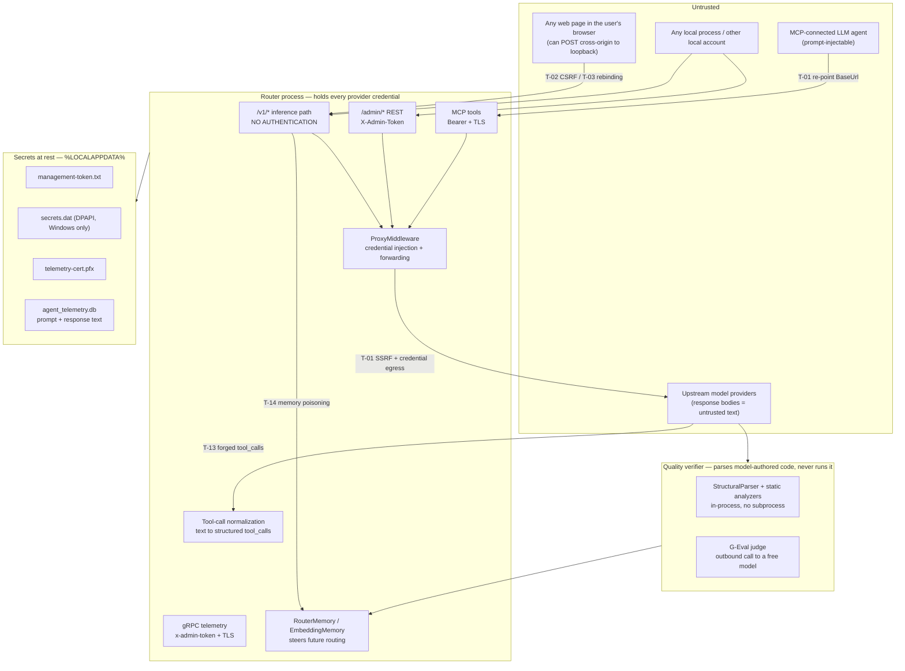

# Security Hardening Plan

A prioritized, multi-phase remediation plan for the TotallyHot Arc Router threat surface.

**Status:** Proposed, with a stale blanket claim now qualified. This plan was written as a pure
action list, and its original wording — "no code has been changed" — is **no longer true as a blanket
statement**: [`mcp-endpoint-plan.md`](mcp-endpoint-plan.md) subsequently shipped and overlaps this
plan's management-authentication surface. Concretely, `Proxy/Management/ManagementAccessToken.cs` now
backs an `X-Admin-Token` header that `ProviderAdminEndpoints` and `UsageAdminEndpoints` require on every
`/admin/*` request, and the MCP endpoint enforces the same token through `McpBearerAuthMiddleware` over
TLS — which is the subject matter of **T-02** and **T-04** below.

**The per-finding statuses in this document have not been re-audited against that work.** Nothing here
should be read as either confirmed-open or confirmed-fixed until someone walks each finding against the
current tree; that is a security review, not a documentation pass, and is deliberately not attempted
here. Treat each item as *unverified* rather than *proposed*.

**Method.** Every finding was derived from the current `main` working tree via CodeGraph symbol
exploration plus targeted reads. Each carries a `file:line` citation so it can be re-verified
independently. Findings are stated against the code as it exists, not against the design docs'
description of it — where the two disagree, that disagreement is itself recorded as a finding
(see [T-12](#t-12--seccomp-allowlist-is-defined-but-never-installed), since closed).

> **Note (post-audit change).** The sandboxed executor that T-11, T-12, and T-18 concern has since been
> removed from the codebase; those three findings are closed as no longer applicable. The trust boundary
> below reflects the current design, in which model-authored code is parsed but never executed.

---

## 1. Threat model

### 1.1 Deployment posture

Every listener binds loopback only:

| Listener | Bind | Transport | Source |
|---|---|---|---|
| Proxy `/v1/*` + `/admin/*` | `ListenLocalhost` / `IPAddress.Loopback` | Plain HTTP/1.1 | [`ProxyServer.cs:176-187`](../../src/TotallyHotArcRouter/Proxy/ProxyServer.cs) |
| Telemetry + price-source gRPC | `ListenLocalhost` / `IPAddress.Loopback` | TLS + HTTP/2 (ALPN) | [`ProxyServer.cs:198-213`](../../src/TotallyHotArcRouter/Proxy/ProxyServer.cs) |
| MCP endpoint (:5003) | `ListenLocalhost` / `IPAddress.Loopback` | TLS | [`McpServer.cs:85-93`](../../src/TotallyHotArcRouter/Mcp/McpServer.cs) |

The governing assumption for this plan, per the scoping decision that produced it: **loopback-only
today, but "someone binds this to `0.0.0.0`, puts it behind a tunnel, or runs it on a shared host"
is an in-scope scenario.** Each finding therefore carries two severities — `Today` under the
current loopback posture, and `Exposed` under network reachability. Items whose two ratings
diverge sharply are the ones that make exposure dangerous, and they are the reason exposure is
currently unsafe rather than merely unsupported.

### 1.2 Trust boundaries



### 1.3 What is already done well

These are load-bearing and should not be regressed by any remediation below. They are recorded so
a later change does not undo them by accident.

- **Constant-time token comparison.** `ManagementAccessToken.Verify` uses
  `CryptographicOperations.FixedTimeEquals` with an explicit length pre-check
  ([`ManagementAccessToken.cs:103-117`](../../src/TotallyHotArcRouter/Proxy/Management/ManagementAccessToken.cs)).
- **Strong token generation.** 32 bytes from `RandomNumberGenerator`, base64url-encoded
  ([`ManagementAccessToken.cs:120-124`](../../src/TotallyHotArcRouter/Proxy/Management/ManagementAccessToken.cs)).
- **One token, three surfaces.** REST, MCP, and gRPC all verify through the same primitive, so
  there is a single place to strengthen rather than three that can drift.
- **Write-only secret surface.** There is deliberately no `GET /admin/secrets/{name}` — the
  invariant that a secret reaching the protected store is never readable back through any
  management API is enforced by omission, not by masking
  ([`ProviderAdminEndpoints.cs:144-152`](../../src/TotallyHotArcRouter/Proxy/Management/ProviderAdminEndpoints.cs)).
- **Ordered secure-file writes.** `SecureFile.WriteRestricted` creates the file, applies the
  ACL/mode, and only then writes content — the secret is never briefly readable under an
  inherited ACL ([`SecureFile.cs:24-46`](../../src/TotallyHotArcRouter/Proxy/Management/SecureFile.cs)).
- **Sandbox capability probe fails closed.** Non-Linux or no cgroups v2 degrades to Tier 0 static
  analysis; it never falls back to unjailed execution
  ([`SandboxCapabilityProbe.cs:19-28`](../../src/TotallyHotArcRouter.Quality/Capability/SandboxCapabilityProbe.cs)).
- **Client auth header is stripped before forwarding**, and stripped on configuration intent
  rather than on whether the credential happened to resolve — so a provider with an unset
  credential env var fails closed
  ([`ProxyMiddleware.cs:478-495`](../../src/TotallyHotArcRouter/Proxy/ProxyMiddleware.cs)).
- **Tier-1 network air-gap.** An empty network namespace with no veth, so there is no route out
  of a jailed run ([`JailCommandBuilder.cs:22-32`](../../src/TotallyHotArcRouter.Quality/Tier1/JailCommandBuilder.cs)).

### 1.4 Severity scale

| Severity | Meaning |
|---|---|
| **Critical** | Credential compromise or arbitrary code execution, reachable without operator error. |
| **High** | Credential/data exposure or unauthorized state change, reachable with a plausible precondition. |
| **Medium** | Meaningful weakening of a control; needs chaining or an unusual precondition. |
| **Low** | Hardening, consistency, or defense-in-depth with no direct exploit path today. |

---

## 2. Findings index

Ordered by remediation priority (`Today` severity first, `Exposed` as tiebreak).

> **T-11, T-12, and T-18 are closed as no longer applicable.** All three were findings about the
> sandboxed executor that ran model-generated code. That executor was removed outright — see
> [`quality-verifier-architecture.md`](quality-verifier-architecture.md) — and nothing replaces it, so
> the environment it inherited, the syscall filter it never installed, and the working directory it wrote
> to no longer exist. They are retained below rather than deleted: the analysis is still the reason the
> capability is gone, and a future proposal to reintroduce execution should have to read them first.

| ID | Finding | Today | Exposed | CWE | Phase |
|---|---|---|---|---|---|
| [T-01](#t-01--provider-baseurl-is-unvalidated-ssrf--credential-exfiltration) | Provider `BaseUrl` unvalidated → SSRF + credential exfiltration | **Critical** | Critical | CWE-918, CWE-522 | 1 |
| [T-11](#t-11--sandboxed-code-inherits-the-routers-full-environment) | ~~Sandboxed model code inherits router environment~~ — **CLOSED, not applicable** | ~~Critical~~ | — | CWE-526, CWE-497 | — |
| [T-02](#t-02--v1-has-no-authentication-and-no-csrf-defense) | `/v1/*` unauthenticated + CSRF-reachable from any web page | **High** | Critical | CWE-352, CWE-306 | 1 |
| [T-03](#t-03--host-header-is-unvalidated-dns-rebinding) | `AllowedHosts: "*"` → DNS rebinding reads responses | **High** | High | CWE-350 | 1 |
| [T-12](#t-12--seccomp-allowlist-is-defined-but-never-installed) | ~~`SeccompAllowlist` defined but never installed~~ — **CLOSED, not applicable** | ~~High~~ | — | CWE-693, CWE-1059 | — |
| [T-04](#t-04--management-auth-fails-open-on-a-blankmissing-token) | Management auth fails **open** on blank/missing token | **High** | Critical | CWE-636, CWE-1188 | 2 |
| [T-13](#t-13--upstream-text-is-promoted-into-executable-tool_calls) | Upstream text promoted into structured `tool_calls` | **High** | High | CWE-74, CWE-807 | 3 |
| [T-05](#t-05--client-headers-are-forwarded-upstream-on-a-denylist) | Client headers forwarded upstream on a denylist | **Medium** | High | CWE-644 | 2 |
| [T-06](#t-06--tls-certificate-password-written-plaintext-and-unrestricted-on-posix) | Cert password plaintext + unrestricted on POSIX | **Medium** | Medium | CWE-256, CWE-732 | 2 |
| [T-14](#t-14--router-memory-is-poisonable-by-unauthenticated-traffic) | Router memory poisonable by unauthenticated traffic | **Medium** | High | CWE-349 | 3 |
| [T-15](#t-15--no-rate-limiting-or-cost-ceiling-on-the-inference-path) | No rate limit / cost ceiling on the inference path | **Medium** | High | CWE-770 | 3 |
| [T-07](#t-07--telemetry-database-holds-prompt-and-response-text-unprotected) | Telemetry DB holds prompt/response text unprotected | **Medium** | Medium | CWE-311, CWE-532 | 4 |
| [T-16](#t-16--output-redactor-misses-common-key-formats) | Output redactor misses Anthropic/Google key formats | **Medium** | Medium | CWE-532 | 2 |
| [T-08](#t-08--management-token-has-no-rotation-and-no-provenance-check) | Management token has no rotation, no provenance check | **Medium** | High | CWE-798, CWE-613 | 4 |
| [T-17](#t-17--client-supplied-tool-schemas-are-injected-into-the-system-prompt) | Client tool schemas injected verbatim into system prompt | **Medium** | Medium | CWE-74 | 3 |
| [T-09](#t-09--protectedsecretstore-is-windows-only) | `ProtectedSecretStore` is Windows-only | **Medium** | Medium | CWE-311 | 4 |
| [T-18](#t-18--jail-working-directory-and-interpreter-path-are-not-hardened) | ~~Jail workdir permissions + PATH-resolved interpreters~~ — **CLOSED, not applicable** | ~~Medium~~ | — | CWE-732, CWE-426 | — |
| [T-10](#t-10--pfx-private-key-and-password-generation-are-inconsistent-with-the-projects-own-standard) | `.pfx` private key unrestricted; GUID-derived password | **Low** | Medium | CWE-732, CWE-330 | 4 |
| [T-19](#t-19--unbounded-per-request-response-buffering) | Unbounded per-request response buffering (4 MB × N) | **Low** | Medium | CWE-770 | 4 |

---

## 3. Phase 1 — Stop credential egress and unauthenticated reachability

The four items that together make an accidental exposure — or a single prompt injection —
immediately expensive. Nothing else should be started before these land.

### T-01 — Provider `BaseUrl` is unvalidated (SSRF + credential exfiltration)

**Today: Critical · Exposed: Critical · CWE-918, CWE-522**

**Evidence.** The only validation applied to a provider's `BaseUrl` is a syntactic absolute-URI
check:

```csharp
// src/TotallyHotArcRouter/Models/ModelRoutingOptions.cs:61
if (!Uri.TryCreate(provider.BaseUrl, UriKind.Absolute, out _))
```

There is no scheme restriction, no host allowlist, and no private/link-local/loopback address
rejection. `BaseUrl` is writable from three surfaces:

- `PUT /admin/providers/{key}` ([`ProviderAdminEndpoints.cs:59-60`](../../src/TotallyHotArcRouter/Proxy/Management/ProviderAdminEndpoints.cs))
- the `upsert_provider` MCP tool ([`ProviderMcpTools.cs:31-40`](../../src/TotallyHotArcRouter/Mcp/Tools/ProviderMcpTools.cs))
- the Governance UI, which calls the same facade

**Impact.** `ProviderOptions.Headers` resolves the credential at request time and
`ProxyMiddleware` injects it into the outbound request
([`ProxyMiddleware.cs:510-516`](../../src/TotallyHotArcRouter/Proxy/ProxyMiddleware.cs)). Changing
only `BaseUrl` — leaving the header configuration untouched — causes the operator's **real**
provider API key to be sent to an attacker-chosen host on the next routed request. The credential
never has to be read back through the (correctly write-only) secrets API; it is simply redirected.

The MCP path makes this reachable without a human operator. An MCP-connected agent holds the
bearer token by construction, so a prompt injection carried in any content that agent processes
can call `upsert_provider` and re-point `openai` at `https://attacker.example`. `discover_models`
and `scan_provider_capabilities` give the same primitive a lower-noise variant: they issue
credentialed requests to the configured base URL on demand
([`ManagementFacade.DiscoverModelsCoreAsync`](../../src/TotallyHotArcRouter/Proxy/Management/ManagementFacade.cs)),
which also reaches cloud metadata endpoints (`http://169.254.169.254/`) and internal hosts from
the router's network position.

**Remediation.**

1. Add a `ProviderUrlPolicy` validator invoked from `ModelRoutingOptions.EnsureValid` **and** from
   `ManagementFacade.UpsertProviderAsync`, so neither the config-file path nor the runtime-write
   path can bypass it:
   - Scheme must be `https`, **or** `http` with a loopback/`.localhost` host (local runtimes such
     as Ollama and LM Studio legitimately need plain HTTP on loopback, and the seeded
     `appsettings.json` relies on it).
   - Reject literal or resolved addresses in RFC 1918, RFC 4193, link-local (`169.254.0.0/16`,
     `fe80::/10`), and carrier-grade NAT ranges, unless the host is loopback.
   - Reject any scheme outside `http`/`https` outright (`Uri.TryCreate` currently accepts `file:`).
2. Re-resolve and re-check the host **immediately before** `SendAsync` to close the DNS-rebinding
   TOCTOU between validation and use, or pin the resolved address via a custom
   `SocketsHttpHandler.ConnectCallback`.
3. Treat a `BaseUrl` change on an existing provider as a **credential-invalidating** event: clear
   the stored/`Locked` header values for that provider and require re-entry. This is the control
   that makes the injection chain non-silent — the attacker gets a provider with no credential
   rather than one carrying the operator's key.
4. Classify `upsert_provider` as a mutating, high-consequence MCP tool and gate `BaseUrl` changes
   behind an explicit operator confirmation rather than allowing an agent to apply them unattended.

**Acceptance criteria.**

- `EnsureValid` and `UpsertProviderAsync` both reject `file://`, `http://169.254.169.254/`,
  `http://192.168.1.1/`, and `http://10.0.0.1/`, and both accept `https://api.openai.com`,
  `http://localhost:11434/v1`, and `http://127.0.0.1:1234/v1`.
- Changing `BaseUrl` on a provider with a stored header credential clears that credential; a
  test asserts the next forwarded request carries **no** auth header.
- A regression test asserts `discover_models` on a provider whose `BaseUrl` was mutated to a
  private address fails validation before any HTTP request is issued.

**Tests.** New `ProviderUrlPolicyTests`; extend `ProviderAdminEndpointsTests` and
`ProviderMcpToolsTests` with the rejection matrix; extend `SecretHeaderMigrationTests` with the
credential-invalidation case.

---

### T-11 — Sandboxed code inherits the router's full environment

**Today: Critical · Exposed: Critical · CWE-526, CWE-497**

> **CLOSED — no longer applicable.** The jailed interpreter this describes no longer exists: model code
> is never executed, so there is no child process to inherit the router's environment. The remediation
> below (an explicit environment allowlist) was never implemented and is not needed. Retained for the
> record — if execution is ever reintroduced, this is the first thing that must be solved.

**Evidence.** The jailed interpreter is launched with no environment scrubbing:

```csharp
// src/TotallyHotArcRouter.Quality/Tier1/LinuxJailLauncher.cs:115-134
startInfo.FileName = "unshare";
// ... flags, "--", interpreter, script ...
startInfo.UseShellExecute = false;
```

`ProcessStartInfo.Environment` is never cleared — a repo-wide search for
`Environment.Clear`/`startInfo.Environment` returns nothing. With `UseShellExecute = false`, the
child inherits the parent's full environment block.

**Impact.** The router's environment is, by design, where provider credentials live — the seeded
`appsettings.json` references `OPENAI_API_KEY`, `ANTHROPIC_API_KEY`, `QWEN_API_KEY`,
`GLM_API_KEY`, `KIMI_API_KEY`, `MINIMAX_API_KEY`, `GEMINI_API_KEY`, `AWS_ACCESS_KEY_ID`,
`AWS_SECRET_ACCESS_KEY`, and `AWS_SESSION_TOKEN`. Model-authored code reaching Tier 1 can read all
of them with `import os; print(os.environ)`.

The Tier-1 network air-gap prevents direct egress, which is what keeps this from being trivially
exploitable — but it does not contain the disclosure. Captured stdout flows into
`ExecutionOutcome.Stdout` → `QualityResult` → telemetry broadcast and Serilog sinks, and
`OutputRedactor` is explicitly documented as best-effort. Per [T-16](#t-16--output-redactor-misses-common-key-formats),
it does not match the Anthropic or Google key formats at all. Any Tier-2 configuration that
provisions network access, or any future runtime that relaxes `--net`, converts this directly into
exfiltration.

**Remediation.**

1. Clear the child environment and repopulate it with an explicit minimal allowlist
   (`PATH`, `HOME`, `LANG`, `TMPDIR`) in `ConfigureStartInfo`:
   ```csharp
   startInfo.Environment.Clear();
   startInfo.Environment["PATH"] = SandboxPath;   // fixed, not inherited
   startInfo.Environment["HOME"] = spec.WorkingDirectory;
   ```
   `ProcessStartInfo.Environment` is pre-populated from the parent, so `Clear()` is required —
   assigning only the allowlisted keys is not sufficient.
2. Apply the same scrubbing to the Firecracker Tier-2 launch path
   (`FirecrackerMicroVmLauncher`, `FirecrackerArgumentBuilder`) so the two tiers cannot diverge.
3. Add a defense-in-depth assertion in `QualityGradingService`: if the resolved child
   environment contains any key matching the configured providers' `ValueEnvVar` names, fail the
   run rather than execute it. This makes a future regression loud instead of silent.

**Acceptance criteria.**

- A test sets a sentinel environment variable in the test host, runs a Tier-1 snippet that prints
  its full environment, and asserts the sentinel is absent from the captured stdout.
- The same assertion exists for the Tier-2 path.
- The allowlist is a single named constant referenced by both launchers.

**Tests.** New `LinuxJailLauncherEnvironmentTests` (Linux-gated, as the existing Tier-1 tests are);
extend the Firecracker launcher tests with the parallel case. Keep both under the 5-second cap.

---

### T-02 — `/v1/*` has no authentication and no CSRF defense

**Today: High · Exposed: Critical · CWE-352, CWE-306**

**Evidence.** `/admin/*` and the gRPC endpoints are token-gated. The inference path is not: it is
the terminal middleware that handles everything unmatched by a mapped endpoint.

```csharp
// src/TotallyHotArcRouter/Proxy/ProxyServer.cs:301
app.Run(context => proxyMiddleware.InvokeAsync(context, _ => Task.CompletedTask));
```

`ResolveModelRouteAsync` reads the body and parses it as JSON with **no `Content-Type` check**
([`RequestInterceptor.cs:199-227`](../../src/TotallyHotArcRouter/Proxy/RequestInterceptor.cs)). A
repo-wide search finds no `AddCors`, `UseCors`, or antiforgery registration anywhere in `src/`.

**Impact.** `Content-Type: text/plain` is a CORS *simple* request type, so a cross-origin `POST`
carrying a JSON body under that content type is dispatched by the browser **without a preflight**.
Any web page the user visits can therefore drive `http://127.0.0.1:5001/v1/chat/completions`.
The Same-Origin Policy blocks the attacker from reading the response, but every side effect still
occurs: the operator's provider credentials are spent, usage is recorded, the sandbox verifier
executes the resulting model output, and router memory is updated ([T-14](#t-14--router-memory-is-poisonable-by-unauthenticated-traffic)).

`/admin/*` is not directly forgeable this way — the custom `X-Admin-Token` header forces a
preflight that will fail — but it shares the same port and the same unauthenticated origin, which
is what makes [T-03](#t-03--host-header-is-unvalidated-dns-rebinding) severe.

**Remediation.**

1. Require the management token on `/v1/*` as well, via the standard OpenAI-compatible
   `Authorization: Bearer <token>` header, with a documented opt-out
   (`Proxy:RequireClientAuth: false`) for the local-tool workflows that assume an open loopback
   proxy. Default to **on**. This is the single change that most reduces blast radius, and it
   aligns the inference path with the three management surfaces that already require the token.
2. Independently of (1), reject requests whose `Content-Type` is not `application/json` on the
   body-carrying inference routes. This removes the no-preflight path even when client auth is
   opted out.
3. Reject cross-origin requests explicitly: if `Origin` is present and is not a loopback origin,
   respond `403`. Do not add a permissive CORS policy — the correct posture here is "no browser
   origin may call this", not "these origins may".
4. Add `Vary: Origin` and an explicit `Cross-Origin-Resource-Policy: same-origin` response header.

**Acceptance criteria.**

- A `POST /v1/chat/completions` with `Content-Type: text/plain` returns `415`, and no upstream
  request is issued.
- A request with `Origin: https://evil.example` returns `403` regardless of content type.
- With `RequireClientAuth` at its default, a request with no `Authorization` header returns `401`
  in the OpenAI error envelope shape already used by `ProviderAdminEndpoints.Error`.
- With `RequireClientAuth: false`, items (2) and (3) still apply.

**Tests.** New `InferencePathAuthTests`; extend `ProxyInterceptionTests`' real-socket `HttpListener`
harness to assert the opt-out path preserves existing client compatibility.

---

### T-03 — `Host` header is unvalidated (DNS rebinding)

**Today: High · Exposed: High · CWE-350**

**Evidence.** [`appsettings.json`](../../src/TotallyHotArcRouter/appsettings.json) sets
`"AllowedHosts": "*"`. `ProxyServer` builds its inner host with `Host.CreateDefaultBuilder()` +
`ConfigureWebHostDefaults`, so ASP.NET Core's `HostFilteringMiddleware` **is** in the pipeline —
configured to accept every `Host` value.

**Impact.** DNS rebinding defeats the loopback boundary. An attacker serves a page from
`evil.example`, whose DNS record then rebinds to `127.0.0.1`. Subsequent requests are *same-origin*
from the browser's perspective, so the attacker can now **read** responses, not merely trigger
them. That yields:

- Full read of `GET /v1/models` — the configured model and provider inventory.
- Read of every routed completion response, including prompt content echoed back.
- A path to `/admin/*` that is no longer blocked by preflight, leaving only the token as the
  barrier — which is exactly the barrier [T-04](#t-04--management-auth-fails-open-on-a-blankmissing-token)
  can remove.

**Remediation.**

1. Set `AllowedHosts` to an explicit list: `localhost;127.0.0.1;[::1]`. This is a one-line
   configuration change that closes the rebinding vector for the proxy port.
2. Add the same restriction to the MCP host (`McpServer`) and confirm it applies to the Kestrel
   HTTP/2 gRPC listener.
3. Add a startup assertion that fails fast if `AllowedHosts` is `*` while any listener is bound to
   a non-loopback address — the configuration that is safe today becomes unsafe precisely when
   someone changes the bind address, and that is the moment to catch it.

**Acceptance criteria.**

- A request with `Host: evil.example` to the proxy port returns `400` before reaching
  `ProxyMiddleware`.
- A request with `Host: localhost:5001` succeeds.
- Startup throws when `AllowedHosts` is `*` and the configured bind address is not loopback.

**Tests.** New `HostFilteringTests`; extend `ProxyServerTests` with the startup-assertion case.

---

### Phase 1 exit criteria

- All four findings above have landed with the acceptance criteria met.
- Solution builds clean — zero warnings, per the `TreatWarningsAsErrors` rule in
  [`src/Directory.Build.props`](../../src/Directory.Build.props).
- Full test suite green; coverage ≥ 80%.
- `docs/router/secrets-at-rest.md` and `docs/router/mcp-endpoint.md` updated to describe the new
  `BaseUrl` policy and the credential-invalidation rule.

---

## 4. Phase 2 — Close the fail-open paths and restore the missing controls

Controls that exist on paper, are believed to be active, and are not.

### T-12 — `seccomp` allowlist is defined but never installed

**Today: High · Exposed: High · CWE-693, CWE-1059**

> **CLOSED — no longer applicable.** `SeccompAllowlist.cs` and the entire `Tier1/` directory were deleted
> along with the executing verifier. There is no syscall filter to install because there is no untrusted
> process to filter. Retained for the record.

**Evidence.** [`SeccompAllowlist.cs`](../../src/TotallyHotArcRouter.Quality/Tier1/SeccompAllowlist.cs)
defines a syscall allowlist. A repo-wide search for its usages finds **no call site that installs
it** — no `libseccomp` P/Invoke, no `prctl(PR_SET_SECCOMP)`, no `bwrap --seccomp`. The only other
`seccomp` references are the *detection* constant and the types that carry the result:

```csharp
// src/TotallyHotArcRouter.Quality/Tier1/LinuxJailLauncher.cs:20
private const int SeccompKillExitCode = 128 + 31;
```

`ConfigureStartInfo` ([`LinuxJailLauncher.cs:115-134`](../../src/TotallyHotArcRouter.Quality/Tier1/LinuxJailLauncher.cs))
launches `unshare <flags> -- <interpreter> <script>` and nothing else.

**Impact.** Tier 1 is namespaces + cgroups only. Three consequences:

1. The syscall attack surface available to model-authored code is the **entire kernel ABI**
   reachable from an unprivileged user namespace — the exact surface that historically carries
   local privilege-escalation CVEs, and the reason the allowlist was written.
2. `ExecutionOutcome.SeccompDenied` can never be `true` from a real filter, so
   `QualityOptions.EscalateOnSeccompDenial` (default `true`,
   [`QualityOptions.cs:41-42`](../../src/TotallyHotArcRouter.Quality/QualityOptions.cs)) is dead
   configuration, and `QualityGrader`'s escalation branch
   ([`QualityGrader.cs:79-86`](../../src/TotallyHotArcRouter.Quality/Execution/QualityGrader.cs))
   is unreachable.
3. The type-level documentation is **wrong** in a security-relevant way:
   `SandboxTier.Tier1Jail` is documented as "namespaces, cgroups v2, seccomp, tmpfs"
   ([`SandboxTier.cs:15`](../../src/TotallyHotArcRouter.Quality/SandboxTier.cs)). Under the
   project's own rule that stale docs are treated as missing docs, this is a defect in its own
   right — a reader auditing the sandbox is told a control is present that is not.

**Remediation.** Choose one, then make the documentation match reality either way:

- **Preferred — install the filter.** Wrap the launch in a small helper that applies the allowlist
  via `libseccomp` before `execve`. The cleanest route on .NET is to shell through
  `bwrap --seccomp <fd>` (bubblewrap) rather than P/Invoking `seccomp_load` from managed code
  after `Process.Start`, which cannot install a filter in the child at the right moment. Add
  bubblewrap availability to `ISandboxHostFacts` and to `SandboxCapabilityProbe`'s degradation
  logic, so a host without it degrades to Tier 0 rather than silently running unfiltered.
- **Alternative — remove the illusion.** Delete `SeccompAllowlist`, `SeccompDenied`,
  `EscalateOnSeccompDenial`, and `SeccompKillExitCode`, and correct `SandboxTier.Tier1Jail`'s
  summary. This is strictly worse for defense-in-depth but strictly better than the present state,
  where an unenforced control is documented as enforced.

**Acceptance criteria.**

- If installing: a Tier-1 snippet invoking a denied syscall (e.g. `socket(AF_INET, …)`) exits
  `159`, and `ExecutionOutcome.SeccompDenied` is `true`. `SandboxCapabilityProbe.DegradedReason`
  reports `seccomp-unavailable` on a host without the mechanism.
- If removing: no symbol named `Seccomp*` remains, and `SandboxTier`'s summary no longer claims it.
- Either way, the architecture doc matches the implemented behavior. (Moot: both the control and the doc are gone.)

**Tests.** New `SeccompEnforcementTests` (Linux-gated); update
`SandboxCapabilityProbeTests` for the new degradation reason.

---

### T-04 — Management auth fails **open** on a blank/missing token

**Today: High · Exposed: Critical · CWE-636, CWE-1188**

**Evidence.** All three management surfaces treat a null/blank token as "no authentication"
rather than "deny":

```csharp
// src/TotallyHotArcRouter/Proxy/Management/ProviderAdminEndpoints.cs:43-55
if (!string.IsNullOrWhiteSpace(managementToken))
{
    group.AddEndpointFilter(async (context, next) => { /* verify */ });
}
// ...no else. A blank token means the filter is never added.
```

```csharp
// src/TotallyHotArcRouter/Proxy/ProxyServer.cs:231-239
if (!string.IsNullOrWhiteSpace(managementToken))
{
    services.AddSingleton(new TelemetryAuthInterceptor(managementToken));
    services.AddGrpc(options => options.Interceptors.Add<TelemetryAuthInterceptor>());
}
else
{
    services.AddGrpc();   // no interceptor — every RPC unauthenticated
}
```

`UsageAdminEndpoints` follows the same shape. `McpBearerAuthMiddleware` is the one exception: its
constructor calls `ArgumentException.ThrowIfNullOrWhiteSpace(expectedToken)`, so it cannot be
constructed in a bypassed state — which is the pattern the other two should adopt.

**Impact.** In production the token is supplied by `ManagementAccessToken.GetOrCreate()`, so this
is not currently exploitable — the severity is about the *shape of the failure*, not a live bypass.
But the failure mode is the worst available one: any path that yields an empty string (a truncated
token file that reads back blank, a future configuration binding, a refactor that reorders
construction) silently disables authentication on the entire `/admin/*` surface **and** every gRPC
method, with no log line and no startup error. The intended use — tests exercising forwarding only
— is better served by an explicit opt-out than by an implicit one keyed on emptiness.

**Remediation.**

1. Replace the nullable `string? managementToken` parameter with an explicit discriminated intent:
   a `ManagementAuth` type with `ManagementAuth.Required(token)` and
   `ManagementAuth.ExplicitlyDisabledForTests()`. Make the disabled variant `internal` so it cannot
   be selected from outside the test assemblies.
2. Have the endpoint mappers throw on a blank token rather than skipping the filter, matching
   `McpBearerAuthMiddleware`'s existing constructor contract.
3. Log a `Warning` at startup whenever auth is disabled, naming the surface, so the state is never
   silent even in tests.

**Acceptance criteria.**

- `MapProviderAdminEndpoints`, `MapUsageAdminEndpoints`, and the gRPC registration all throw
  `ArgumentException` when handed a blank token via the production path.
- The test-only disabled variant is not reachable from `TotallyHotArcRouter`'s public API.
- A test asserts the startup warning is emitted when auth is disabled.

**Tests.** Extend `ProviderAdminEndpointsTests`, `UsageAdminEndpointsTests`, and
`ProxyServerTests`. Note that `MapProviderAdminEndpoints` and `MapUsageAdminEndpoints` currently
have **no covering tests** per CodeGraph's blast-radius analysis — this phase should close that gap
regardless.

---

### T-05 — Client headers are forwarded upstream on a denylist

**Today: Medium · Exposed: High · CWE-644**

**Evidence.** Header forwarding is deny-list based — everything the client sends goes upstream
except five always-skipped names, hop-by-hop headers, and the provider's own auth header:

```csharp
// src/TotallyHotArcRouter/Proxy/ProxyMiddleware.cs:58
private static readonly string[] AlwaysSkippedRequestHeaders =
    ["Host", "Content-Type", "Content-Length", "Authorization", "Accept-Encoding"];

// src/TotallyHotArcRouter/Proxy/ProxyMiddleware.cs:488-498
foreach (var header in context.Request.Headers)
{
    if (AlwaysSkippedRequestHeaders.Contains(header.Key, StringComparer.OrdinalIgnoreCase) ||
        requestHopByHopHeaders.Contains(header.Key) ||
        (providerSuppliesAuthHeader && string.Equals(header.Key, route.AuthHeaderName, …)))
    {
        continue;
    }
    requestMessage.Headers.TryAddWithoutValidation(header.Key, header.Value.ToArray());
}
```

And operator-configured headers are applied **only if the client did not already send that name**:

```csharp
// src/TotallyHotArcRouter/Proxy/ProxyMiddleware.cs:510-516
foreach (var (headerName, headerValue) in route.ExtraHeaders)
{
    if (!requestMessage.Headers.Contains(headerName)) { /* add */ }
}
```

**Impact.** A local client can inject arbitrary headers into the router's authenticated session
with a third-party provider — `OpenAI-Organization`, `OpenAI-Project`, `anthropic-beta`,
per-provider routing or billing headers — attributing spend or unlocking behaviors the operator did
not configure. It can also **suppress** an operator-configured non-auth header by sending its own
value: `anthropic-version` is the concrete case, and downgrading it changes the API contract the
translators were written against.

The auth header itself is safe: it is stripped from the client whenever the provider declares one,
based on configuration intent rather than on whether the credential resolved, so a provider with an
unset env var fails closed rather than letting the client's header stand in. That behavior is
correct and should be preserved by any fix here.

**Remediation.**

1. Invert to an allowlist. Forward only headers the proxy has a reason to relay:
   `Accept`, `User-Agent`, `X-Request-Id`, `X-Stainless-*` (SDK telemetry), and an explicitly
   configurable per-provider extension list. Everything else is dropped.
2. Make `route.ExtraHeaders` authoritative — operator configuration overwrites a client-supplied
   header of the same name rather than yielding to it. The current "client wins" rule is the
   opposite of the desired trust ordering.
3. Log at `Debug` when a client header is dropped, so the allowlist can be tuned against real
   client traffic without guesswork.

**Acceptance criteria.**

- A request carrying `OpenAI-Organization: attacker` does not forward that header.
- A request carrying `anthropic-version: 2020-01-01` forwards the operator-configured value.
- The existing `ProxyInterceptionTests` real-socket suite still passes, confirming real SDK clients
  are unaffected.

---

### T-16 — Output redactor misses common key formats

**Today: Medium · Exposed: Medium · CWE-532**

**Evidence.**

```csharp
// src/TotallyHotArcRouter.Quality/Redaction/OutputRedactor.cs:23
new Regex("sk-[A-Za-z0-9]{16,}", RegexOptions.CultureInvariant, MatchTimeout),
```

The character class excludes `-`. An Anthropic key of the form `sk-ant-api03-…` matches only
`sk-ant` — three characters after the prefix — which fails the `{16,}` quantifier. **The pattern
does not redact Anthropic keys at all.** Google AI Studio keys (`AIza…`), Azure OpenAI keys
(32 hex chars, no distinguishing prefix), and Moonshot/Zhipu/MiniMax formats are likewise
uncovered.

**Impact.** This was the last line of defense for
[T-11](#t-11--sandboxed-code-inherits-the-routers-full-environment) (since closed)
and for prompt content echoed through captured output into telemetry and Serilog sinks. Its
failure is what turns that finding from "contained disclosure" into "logged disclosure".

**Remediation.**

1. Extend the `sk-` pattern to `sk-[A-Za-z0-9_\-]{16,}` and add patterns for `AIza[0-9A-Za-z_\-]{35}`,
   `gsk_`, `xai-`, and the generic `[A-Za-z0-9_\-]{32,}` high-entropy fallback gated on an adjacent
   key-like token.
2. Add a **known-secret** pass: redact any value that exactly matches a currently-resolved provider
   credential. Format-based patterns will always lag new providers; an exact-value check will not,
   and the router already holds those values. Compare in constant time and never log the needle.
3. Keep the bounded `MatchTimeout` and the per-pattern `try`/`catch` — both are correct as written.

**Acceptance criteria.**

- `OutputRedactor.Redact("sk-ant-api03-" + new string('a', 40))` returns `[REDACTED]`.
- A test asserts an exact provider credential value is redacted even when it matches no format
  pattern.

**Tests.** Extend the existing `OutputRedactor` tests with a per-provider key-format matrix.

---

### T-06 — TLS certificate password written plaintext and unrestricted on POSIX

**Today: Medium · Exposed: Medium · CWE-256, CWE-732**

**Evidence.**

```csharp
// src/TotallyHotArcRouter/Telemetry/TelemetryTlsCertificate.cs:139-149
private static void StorePassword(string passwordPath, ProtectedSecretStore secretStore, string password)
{
    try { secretStore.Write(PasswordSecretName, password); }
    catch (PlatformNotSupportedException) { File.WriteAllText(passwordPath, password); }
}
```

`ProtectedSecretStore.Write` throws `PlatformNotSupportedException` on every non-Windows platform
([`ProtectedSecretStore.cs:134-138`](../../src/TotallyHotArcRouter/Proxy/Management/ProtectedSecretStore.cs)),
so the fallback is the *normal* path on Linux and macOS — and it uses `File.WriteAllText`, not
`SecureFile.WriteRestricted`. The file lands with default umask permissions (typically `0644`),
world-readable.

`SecureFile.WriteRestricted` already implements the POSIX case correctly
(`File.SetUnixFileMode(path, UserRead | UserWrite)`,
[`SecureFile.cs:40`](../../src/TotallyHotArcRouter/Proxy/Management/SecureFile.cs)) — it is simply
not called here.

**Impact.** On POSIX, any local account can read the `.pfx` password. Combined with
[T-10](#t-10--pfx-private-key-and-password-generation-are-inconsistent-with-the-projects-own-standard)
— the `.pfx` itself is written with `File.WriteAllBytes` and is likewise unrestricted — another
local account obtains the telemetry endpoint's TLS private key and can impersonate it to the GUI,
which trusts any certificate presenting `CN=localhost` rather than pinning a thumbprint.

**Remediation.**

1. Route both the password fallback and the `.pfx` write through `SecureFile.WriteRestricted`.
2. Have the GUI pin the certificate thumbprint by reading the same `.pfx`'s public certificate,
   as `TelemetryTlsCertificate`'s own remarks already propose as the stronger follow-up.

**Acceptance criteria.**

- On POSIX, both `telemetry-cert-pwd.txt` and `telemetry-cert.pfx` are mode `0600` after creation.
- A test asserts the GUI client rejects a different `CN=localhost` certificate.

---

### T-18 — Jail working directory and interpreter path are not hardened

**Today: Medium · Exposed: Medium · CWE-732, CWE-426**

> **CLOSED — no longer applicable.** `NativeJailPool`, the per-lease `/dev/shm` directories, and the
> PATH-resolved interpreter launch were all deleted with the executing verifier. Nothing writes model code
> to disk and nothing resolves an interpreter to run it with. Retained for the record.

**Evidence.**

- Per-lease directories are created with default permissions:
  `Directory.CreateDirectory(directory)` ([`NativeJailPool.cs:44`](../../src/TotallyHotArcRouter.Quality/Tier1/NativeJailPool.cs)),
  under `/dev/shm` on Linux — a world-writable, sticky tmpfs.
- The snippet is written there before launch:
  `await File.WriteAllTextAsync(scriptPath, request.Code, …)`
  ([`Tier1JailRuntime.cs:59-60`](../../src/TotallyHotArcRouter.Quality/Tier1/Tier1JailRuntime.cs)).
- Both `unshare` and the interpreter are resolved via `PATH`, not absolute paths
  ([`LinuxJailLauncher.cs:119, 126`](../../src/TotallyHotArcRouter.Quality/Tier1/LinuxJailLauncher.cs)).

**Impact.** Two distinct issues. First, default-permission directories under `/dev/shm` let any
local account read the snippet and any artifacts it writes, and create a TOCTOU window between the
`WriteAllTextAsync` and the `execve` in which another local account can replace `snippet.py`.
Second — and more seriously — `unshare` itself runs **outside** the jail it is about to create. A
`PATH` entry that an attacker can write to yields code execution as the router user with the
router's full environment, entirely bypassing the sandbox.

**Remediation.**

1. Create per-lease directories with `UnixFileMode.UserRead | UserWrite | UserExecute` (0700), and
   write the snippet with the same restriction.
2. Resolve `unshare` and each interpreter to an absolute path once at startup, validate that the
   resolved binary is not writable by non-root, and cache the result. Surface an unresolvable
   interpreter through `SandboxCapabilityProbe.DegradedReason` so the host degrades to Tier 0
   rather than failing per-run.
3. ~~Set the child's `PATH` to a fixed system value as part of the~~ [T-11](#t-11--sandboxed-code-inherits-the-routers-full-environment)
   environment allowlist — the two fixes share a code path and should land together.

**Acceptance criteria.**

- A per-lease directory is mode `0700`; a test asserts it on Linux.
- `LinuxJailLauncher` invokes an absolute path; a test asserts a `PATH`-only `unshare` is not used.

---

### Phase 2 exit criteria

- Every management surface throws rather than silently disabling authentication.
- Tier 1 either enforces seccomp or no longer claims to, with docs matching.
- `MapProviderAdminEndpoints` and `MapUsageAdminEndpoints` have direct test coverage.
- Build clean, tests green, coverage ≥ 80%.

---

## 5. Phase 3 — LLM-specific threat vectors

Vectors that exist because the payloads are model-authored, and would not appear in a
threat model for a generic HTTP proxy.

### T-13 — Upstream text is promoted into executable `tool_calls`

**Today: High · Exposed: High · CWE-74, CWE-807**

**Evidence.** The tool-call normalization pipeline scans upstream response bodies for
dialect-framed content and rewrites it into a real OpenAI `tool_calls` structure —
`ToolCallEnvelopeParser`, `EnvelopeContentScanner`, `ToolCallNormalizingTranslator`, and
`ToolCallNormalizingStreamTranslator` in
[`src/TotallyHotArcRouter/Proxy/Translation/ToolCalling/`](../../src/TotallyHotArcRouter/Proxy/Translation/ToolCalling/).

**Impact.** This is the highest-consequence LLM-specific vector because it changes the *type* of
the data: untrusted upstream text becomes a structured action that the calling agent will execute.
A compromised or attacker-controlled upstream — reachable exactly via
[T-01](#t-01--provider-baseurl-is-unvalidated-ssrf--credential-exfiltration) — can emit
`<tool_call>{"name":"run_command","arguments":{…}}</tool_call>` as ordinary prose and have the
proxy hand the calling agent a tool call the model never natively emitted. Indirect prompt
injection reaching a legitimate model produces the same result without any compromise at all: the
model repeats attacker-supplied text, and the proxy promotes it.

`ToolCallNormalizerFactory` already gates on whether the request carried `tools`, which is the
right first control and meaningfully narrows this. The gap is that nothing validates the *contents*
of what it promotes.

**Remediation.**

1. Validate every synthesized tool call against the client's own declared `tools` array: reject any
   `function.name` the client did not declare, and validate `arguments` against that tool's
   declared JSON Schema before emitting. A promoted call for an undeclared tool is unambiguously
   an injection and should be left as literal text.
2. Promote at most the number of calls the request's `tool_choice` permits, and never promote from
   a response to a request that carried no `tools`.
3. Emit a structured `Warning` whenever a promotion is rejected, carrying the model, provider, and
   rejected name — this is the signal that an upstream is misbehaving, and it is currently invisible.
4. Record in `docs/router/tool-call-normalization.md` that promotion is a trust-elevating operation,
   so future dialect additions inherit the constraint rather than re-deriving it.

**Acceptance criteria.**

- A response containing a dialect-framed call for an undeclared tool name is passed through as
  literal text, and a warning is logged.
- A promoted call whose arguments violate the declared schema is rejected.
- Existing normalization tests for legitimately declared tools still pass.

**Tests.** Extend the `ToolCallNormalizing*` test suites with an injection matrix per dialect.

---

### T-17 — Client-supplied tool schemas are injected into the system prompt

**Today: Medium · Exposed: Medium · CWE-74**

**Evidence.**

```csharp
// src/TotallyHotArcRouter/Proxy/Translation/ToolCalling/ToolCallInstructionInjector.cs:69-77
var prompt = dialect.EmulationPrompt!;
var (schemaText, included) = SerializeSchemas(tools, logger);
var instructions = $"{prompt.Preamble}{schemaText}{prompt.Postamble}";
```

`schemaText` is the client's `tools` array serialized verbatim — including each tool's
free-text `description` — and spliced into the system message between the dialect's preamble and
postamble.

**Impact.** A tool `description` containing the dialect's own delimiters (`<tool_call>`,
`<tools>`) or instruction-shaped text escapes the schema region and becomes part of the emulation
frame itself. The attacker controls text the model reads as protocol instruction rather than as
data — and since the response is then scanned for exactly those delimiters
([T-13](#t-13--upstream-text-is-promoted-into-executable-tool_calls)), the two compose: craft a
description that induces the model to emit a delimiter-framed payload, and the proxy promotes it.

This matters most for the emulation path's target — small local models on LM Studio and Ollama —
which are the least resistant to instruction-injection in the first place.

**Remediation.**

1. Escape or strip every registered dialect delimiter from serialized schema text before splicing.
   `ToolCallDialectRegistry` already enumerates them, so the neutralization list stays in sync
   automatically.
2. Fence the schema region with an explicit, non-guessable boundary token generated per request,
   and instruct the model that content within the fence is data.
3. Apply the same neutralization to `ToolCallHistoryRenderer`, which renders prior tool results —
   also attacker-influenced — back into the prompt.

**Acceptance criteria.**

- A tool whose `description` contains `<tool_call>` is serialized with that sequence neutralized.
- A test asserts the fence token differs between two requests.

---

### T-14 — Router memory is poisonable by unauthenticated traffic

**Today: Medium · Exposed: High · CWE-349**

**Evidence.** Sandbox verifier scores are written to router memory under the `live:` dimension
namespace by `RouterMemoryScoreObserver`, and read back by
`RequestInterceptor.ResolveAgenticRouteAsync` to rank candidates
([`RequestInterceptor.cs:229-236, 260-308`](../../src/TotallyHotArcRouter/Proxy/RequestInterceptor.cs)).
`QualityOptions.SamplingRate` defaults to `1.0`, so every eligible response is scored.

**Impact.** Because `/v1/*` is unauthenticated ([T-02](#t-02--v1-has-no-authentication-and-no-csrf-defense))
and CSRF-reachable, an attacker can submit crafted prompts that classify into a chosen dimension
and reliably produce low verifier scores for whichever model handles them. Repeated, this drives
`auto` selection away from the operator's preferred model and toward one the attacker prefers —
the most expensive configured model, or a local `ollama`/`lmstudio` endpoint whose output the
attacker controls. The routing decision is the security-relevant asset here, and it is currently
writable by anyone who can reach the port.

**Remediation.**

1. Authenticate `/v1/*` (Phase 1, [T-02](#t-02--v1-has-no-authentication-and-no-csrf-defense)) —
   this is the primary fix and most of the mitigation.
2. Bound per-dimension score influence: cap how far a single session or source can move a model's
   running average within a window, so no single client can dominate a dimension.
3. Add an operator-visible anomaly signal when a model's `live:` score moves more than a
   configured delta within a window — a poisoning attempt and a genuinely degraded upstream look
   the same to the router, and both warrant a human look.
4. Keep an operator-pinnable floor: a model explicitly enabled in Governance should not be routed
   away from entirely on memory scores alone.

**Acceptance criteria.**

- A test submits N identical low-scoring requests and asserts the target model's average moves by
  no more than the configured per-window cap.
- The anomaly warning fires with a structured log event.

---

### T-15 — No rate limiting or cost ceiling on the inference path

**Today: Medium · Exposed: High · CWE-770**

**Evidence.** No rate-limiting middleware is registered anywhere in `src/`. Budget enforcement
exists but is opt-in per provider and evaluated monthly:

```csharp
// src/TotallyHotArcRouter/Proxy/ProxyMiddleware.cs:240
if (_budgetStore is not null && candidates.All(c => _budgetStore.IsBreached(c.Route.Provider)))
```

The sandbox queue is bounded (`QueueCapacity: 256`, `WorkerConcurrency: 2`) which limits
verification amplification, but nothing bounds request arrival.

**Impact.** An unauthenticated, CSRF-reachable endpoint that spends real money on each request is
a direct financial-loss vector. A monthly cap limits the total but not the rate — an attacker can
exhaust an entire month's budget in minutes, which is a denial of service against the operator's
own use of the tool as well as a cost event. Each request also drives a sandbox execution and a
memory write, compounding [T-14](#t-14--router-memory-is-poisonable-by-unauthenticated-traffic).

**Remediation.**

1. Add ASP.NET Core rate limiting (`AddRateLimiter`) on the inference path — a fixed window plus a
   concurrency limiter, defaults tuned for single-user interactive use and configurable.
2. Add a **daily** spend ceiling alongside the existing monthly cap, defaulting to on with a
   conservative value. A cap that can be exhausted in one sitting is not a cost control.
3. Enforce the budget check before the sandbox enqueue as well as before the upstream call, so a
   breached budget does not still consume local CPU.
4. Log and surface rate-limit rejections in the Governance UI, so the operator can tell "the tool
   is broken" from "something is hammering the port".

**Acceptance criteria.**

- Exceeding the configured rate returns `429` with the OpenAI error envelope shape.
- A daily ceiling breach blocks routing and is visible in Governance.

---

### Phase 3 exit criteria

- Tool-call promotion validates against the client's declared tools.
- Rate limiting and a daily spend ceiling are enabled by default.
- Build clean, tests green, coverage ≥ 80%.
- `docs/router/tool-call-normalization.md` and `docs/router/agent-cost-tracking.md` updated.

---

## 6. Phase 4 — Data protection and credential lifecycle

Lower-urgency items that reduce standing exposure and make the system auditable.

### T-07 — Telemetry database holds prompt and response text unprotected

**Today: Medium · Exposed: Medium · CWE-311, CWE-532**

**Evidence.** `Storage:DatabasePath` resolves to
`%ProgramData%\TotallyHotArcRouter\agent_telemetry.db`. `RequestTextExtractor`,
`ResponseTextExtractor`, and `TextTruncator` capture prompt and completion text into the usage
ledger and telemetry stream. The database is created with default permissions — it does not go
through `SecureFile`, and there is no at-rest encryption.

Moving this file to `%ProgramData%` (so the interactive user can read and back it up at all — the
`LocalSystem` service previously wrote it into an administrators-only system profile) **widened** this
finding rather than narrowing it. The inherited `%ProgramData%` ACL grants `BUILTIN\Users` read, so
`agent_telemetry.db` and `transcripts.db` — the two files that carry prompt and response text — are now
readable by every local account, not just by administrators. That is an accepted tradeoff for a
single-user, personal-scale tool and is the reason prompt-text capture is opt-in and retention-bounded;
it would not be acceptable on a shared machine.

**Impact.** Prompt content is the most sensitive data the router handles: it routinely contains
source code, internal identifiers, and — for a coding-workload router specifically — credentials
pasted into prompts. It is retained indefinitely with no configured retention policy, readable by
any local account on POSIX and by any process running as the user on Windows.

**Remediation.**

1. Create the database file through `SecureFile.WriteRestricted`'s permission sequence, or apply
   the equivalent ACL/mode immediately after SQLite creates it.
2. Add a configurable retention window (default 30 days, matching the Serilog file-sink retention
   the project's own logging guidance uses) with a background prune.
3. Add a `Telemetry:CaptureMessageText` option, defaulting to **off**, that stores only token
   counts and routing metadata. Text capture is a debugging affordance; it should be opt-in.
4. Run captured text through the (now-strengthened) `OutputRedactor` before persistence, not only
   before logging.

**Acceptance criteria.**

- The database file is user-restricted after creation on both platforms.
- With `CaptureMessageText: false`, no prompt or completion text is written to any table.
- A retention test asserts rows older than the window are pruned.

---

### T-08 — Management token has no rotation and no provenance check

**Today: Medium · Exposed: High · CWE-798, CWE-613**

**Evidence.** `ManagementAccessToken.GetOrCreate` adopts any non-empty existing file:

```csharp
// src/TotallyHotArcRouter/Proxy/Management/ManagementAccessToken.cs:67-74
if (File.Exists(tokenPath))
{
    var existing = File.ReadAllText(tokenPath).Trim();
    if (!string.IsNullOrEmpty(existing)) { return existing; }
}
```

There is no length or entropy validation on the adopted value, no check that the file's ACL is
still restrictive, no expiry, and no rotation API.

**Impact.** A token planted before first run — by local malware, or by a restored/synced profile
backup, or by a roaming profile — is adopted permanently and gates all three management surfaces.
Because there is no rotation, a token disclosed once (a screenshot, a support log, a synced backup)
is valid forever. The one-token-for-three-surfaces design that is a strength for consistency is a
weakness for revocation: there is no way to invalidate it.

**Remediation.**

1. Validate the adopted token's shape — reject anything shorter than the 43-character base64url
   form `GenerateToken` produces — and regenerate rather than adopt a malformed value.
2. Verify the file's ACL/mode on read; if it is not user-restricted, log a `Warning`, regenerate,
   and re-restrict. A token file that became world-readable should not keep being trusted.
3. Add an explicit rotation path: a `POST /admin/token/rotate` endpoint and a Governance UI action
   that generates a new token, writes it, and returns it once. Document that connected MCP clients
   and the GUI must be re-paired afterward.
4. Consider per-surface derived tokens (HKDF from the root token, salted per surface) so an MCP
   client's token cannot be replayed against `/admin/*`. This meaningfully limits the blast radius
   of [T-01](#t-01--provider-baseurl-is-unvalidated-ssrf--credential-exfiltration)'s agent path.

**Acceptance criteria.**

- A planted 4-character token file is rejected and regenerated.
- A world-readable token file triggers a warning, regeneration, and re-restriction.
- Rotation invalidates the previous token on all three surfaces.

---

### T-09 — `ProtectedSecretStore` is Windows-only

**Today: Medium · Exposed: Medium · CWE-311**

**Evidence.** Every operation is gated on `OperatingSystem.IsWindows()`
([`ProtectedSecretStore.cs:108, 134, 148, 171, 187`](../../src/TotallyHotArcRouter/Proxy/Management/ProtectedSecretStore.cs)):
`TryRead` returns `false`, `Write` throws, `Delete`/`Exists` return `false`, `DeleteByPrefix`
returns `0`.

**Impact.** On Linux and macOS there is no secret-at-rest protection. `docs/router/secrets-at-rest.md`
§4 documents this as a deliberate "refuse, do not degrade" decision, and that reasoning is sound —
a fake protection layer would be worse than honest plaintext. This item is therefore **not** a
defect in the decision; it is a gap in the outcome. The practical consequence is that
[T-06](#t-06--tls-certificate-password-written-plaintext-and-unrestricted-on-posix) and
[T-10](#t-10--pfx-private-key-and-password-generation-are-inconsistent-with-the-projects-own-standard)
have no store to fall back to on POSIX, and provider credentials there live as plaintext literals
in `model-routing.json`.

**Remediation.**

1. Implement POSIX backends behind the existing `ISecretReader`/`ISecretWriter` interfaces:
   libsecret / Secret Service on Linux, Keychain on macOS. The interfaces already exist, so this is
   additive.
2. Until then, ensure `model-routing.json` itself is written through `SecureFile.WriteRestricted`
   on POSIX so plaintext credentials are at least mode `0600` — this is the cheap partial mitigation
   and should land regardless of whether (1) does.
3. Log a startup `Warning` on non-Windows naming which credentials are stored unprotected, so the
   posture is visible rather than inferred from documentation.

**Acceptance criteria.**

- `model-routing.json` is mode `0600` on POSIX after any credential write.
- The startup warning enumerates unprotected credential names (names only, never values).

---

### T-10 — `.pfx` private key and password generation are inconsistent with the project's own standard

**Today: Low · Exposed: Medium · CWE-732, CWE-330**

**Evidence.**

```csharp
// src/TotallyHotArcRouter/Telemetry/TelemetryTlsCertificate.cs:95-98
var password = Guid.NewGuid().ToString("N");
var certificateBytes = certificate.Export(X509ContentType.Pkcs12, password);
File.WriteAllBytes(certificatePath, certificateBytes);
```

Two inconsistencies with the project's own established practice. `ManagementAccessToken` uses
`RandomNumberGenerator.GetBytes(32)` — 256 bits — while this uses a v4 GUID, which carries 122
bits in a fixed, well-known format. And `File.WriteAllBytes` bypasses `SecureFile.WriteRestricted`,
which every other secret in this directory uses.

`Guid.NewGuid()` is cryptographically random on modern .NET, so this is not a weak-RNG finding —
it is a consistency and defense-in-depth one. The unrestricted write is the more material half.

**Remediation.**

1. Generate the password with `RandomNumberGenerator.GetBytes(32)`, base64url-encoded, reusing the
   same helper `ManagementAccessToken.GenerateToken` uses — extract it to a shared internal helper
   so the two cannot drift.
2. Write the `.pfx` through `SecureFile.WriteRestricted`.

**Acceptance criteria.**

- The `.pfx` is user-restricted on both platforms.
- Password generation and token generation call the same primitive.

---

### T-19 — Unbounded per-request response buffering

**Today: Low · Exposed: Medium · CWE-770**

**Evidence.** `MaxCapturedResponseBytes = 4 * 1024 * 1024`
([`ProxyMiddleware.cs:70`](../../src/TotallyHotArcRouter/Proxy/ProxyMiddleware.cs)) caps capture
per request, but nothing caps concurrent in-flight requests.

**Impact.** Concurrent requests each buffer up to 4 MB for usage parsing. With no rate limit
([T-15](#t-15--no-rate-limiting-or-cost-ceiling-on-the-inference-path)), concurrency is attacker-controlled,
giving a straightforward memory-pressure vector. Low today because it requires local reachability
and the process is a personal-scale tool; higher if exposed.

**Remediation.** Bound total concurrent captured bytes with a shared semaphore or
`System.IO.Pipelines` budget, degrading to no-capture (not to failure) when the ceiling is hit —
usage parsing already handles a truncated buffer gracefully, so degradation is safe. Set an
explicit `MaxRequestBodySize` on the inference path rather than relying on the Kestrel default.

**Acceptance criteria.** A test issuing N concurrent large responses asserts total captured bytes
stay under the configured ceiling and every response still forwards intact.

---

### Phase 4 exit criteria

- Every file under `%LOCALAPPDATA%\TotallyHotArcRouter\` is user-restricted on both platforms. This no
  longer covers the operational databases or the management token, which are machine-wide under
  `%ProgramData%\TotallyHotArcRouter\` so the `LocalSystem` service and the interactive-user GUI can both
  reach them; the token is hardened per-file by `SecureFile.WriteMachineShared`, the databases inherit
  `%ProgramData%`'s `Users`-read ACL (see T-07).
- Token rotation exists and is documented.
- Prompt-text capture is opt-in and retention-bounded.
- Build clean, tests green, coverage ≥ 80%.

---

## 7. Explicitly out of scope

Excluded by the scoping decision for this pass. Recorded here so the omission is deliberate and
visible rather than an apparent gap, and so a later pass has a starting list:

- **Supply chain** — NuGet dependency CVEs, `dependabot.yml` coverage, GitHub Actions workflow
  permissions and action pinning in `.github/workflows/`.
- **Runtime model download** — the BGE-large ONNX model and `tokenizer.json` fetched from
  Hugging Face on first use (`Embeddings:ModelUrl`, `Embeddings:TokenizerJsonUrl` in
  `appsettings.json`) with no integrity verification. This is a code-execution-adjacent supply
  chain risk and is a strong candidate for the next pass.
- **`scripts/fetch-coderouterbench.sh`** — data fetch and verification.
- **GUI** — the MAUI Blazor Hybrid WebView, CSP, and render-mode configuration in
  `src/TotallyHotArcRouter.Gui/`.

---

## 8. Final validation gate

Applies at the end of every phase, per the repository's standing rules in `AGENTS.md`:

- The solution compiles with **zero** warnings and errors —
  [`src/Directory.Build.props`](../../src/Directory.Build.props) sets `TreatWarningsAsErrors`, and
  `GenerateDocumentationFile` makes a missing XML doc a build failure.
- All unit tests pass; no test exceeds the 5-second cap.
- Coverage is at or above 80%.
- Every new or changed type and member carries accurate XML documentation. Where a remediation
  changes what a security control actually does, the doc comment describing that control is updated
  in the same change — [T-12](#t-12--seccomp-allowlist-is-defined-but-never-installed) exists
  precisely because that did not happen once already.
- Any diagram added to documentation uses Mermaid.
- Structured logging with static message templates; log every routing decision, management
  mutation, and rejected request.

## 9. Cross-references

- [`secrets-at-rest.md`](secrets-at-rest.md) / [`secrets-at-rest-plan.md`](secrets-at-rest-plan.md)
  — the protected-store design T-06, T-09, and T-10 build on.
- [`signalr-hub-security.md`](signalr-hub-security.md) — the original management-token design that
  `TelemetryAuthInterceptor` translates to gRPC.
- [`mcp-endpoint.md`](mcp-endpoint.md) — the MCP surface T-01 and T-08 concern.
- [`quality-verifier-architecture.md`](quality-verifier-architecture.md) — what replaced the tier model
  T-11, T-12, and T-18 concerned. The executing verifier those findings describe no longer exists;
  `sandboxed-executor-architecture.md` was deleted with it.
- [`tool-call-normalization.md`](tool-call-normalization.md) — the promotion pipeline T-13 and
  T-17 concern.
- [`agent-cost-tracking.md`](agent-cost-tracking.md) — the budget model T-15 extends.
