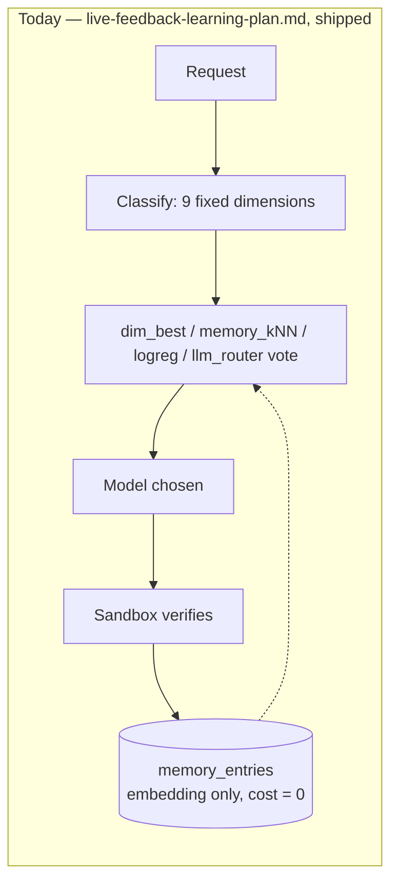
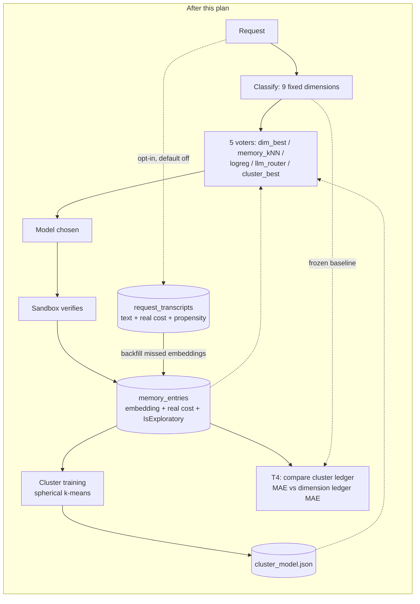

# Self-Organizing Request Classification Plan

Gives the router a taxonomy it learns from its own traffic, alongside the fixed nine-dimension
vocabulary CodeRouterBench defines, and closes the biggest structural gap in
`docs/router/live-feedback-learning-plan.md`'s voter set: three of the four Orchestrator voters
(`memory_kNN`, `logreg`, `llm_router`) need task text or a task embedding, and CodeRouterBench's ID
splits — the corpus `docs/router/regret-evaluation-harness-plan.md` scores PLAN.md's Phase N exit
criterion against — publish neither. Live traffic is therefore the *only* corpus on which those
voters, and any text/embedding-based learner, can ever be trained or exercised at meaningful scale.
This plan builds the pipeline that makes live traffic usable for that purpose: an opt-in transcript
store, a self-organizing clustering job over accumulated task embeddings, a fifth Orchestrator voter
over the learned clusters, an honest comparison against the frozen 9-dimension baseline, and the
GUI/admin surface an operator uses to turn it on.

**Status:** proposed. **Ordering:** after `docs/router/live-feedback-learning-plan.md` Phases 1-4
(shipped), which this plan builds directly on top of; **before PLAN.md Phase N** (the regret harness).
Landing first matters for a reason beyond sequencing convenience — Phase T1 below fills in three named
prerequisites `regret-evaluation-harness-plan.md` records as blocking any future live-regret arm
(`RoutingDecision.IsExploratory` persisted nowhere, propensity never computed, `cost: 0.0` written
unconditionally). Phase N does not require this plan to complete, but every phase of it removes a
blocker Phase N would otherwise have to solve itself.

## Why

### The constraint, restated

`docs/router/regret-evaluation-harness-plan.md` established, verified against the synced corpus, that
**CodeRouterBench publishes no task text for the ID splits.** `benchmark_id_tasks` carries exactly four
columns — `task_id`, `split`, `source_split`, `dimension` — across all 9,999 rows; no `prompt`, nothing
embeddable. The upstream dataset card confirms this is permanent: `id_tasks.jsonl` is documented as "ID
task metadata with split and dimension," while `ood176_tasks.jsonl` is documented as "OOD176 task
prompts and metadata." Only the 176-row OOD split has text.

The consequence, spelled out in that doc's own constraint table:

| Component | Needs task text/embedding? | Runs on ID test? |
|---|---|---|
| `dim_best` voter / DimensionBest baseline | No | Yes |
| Always-*m* baseline | No | Yes |
| Categorical-context LinUCB / LinTS | No | Yes |
| `memory_kNN` voter / kNN Retrieval baseline | Yes | **No** |
| `logreg` voter / LogReg baseline | Yes | **No** |
| `llm_router` voter | Yes | **No** |
| Embedding-projection LinUCB / LinTS | Yes | **No** |

On the benchmark corpus, three of the Orchestrator's four voters — and any future voter built the same
way — structurally cannot fire on the split Phase N's exit criterion is measured against. That is not
a defect in those voters; it is a fixed property of the published data. **The only place text-based
learning can ever happen is live traffic.** This plan is the design for making that traffic usable:
capturing it (opt-in, bounded), organizing it into a taxonomy the router discovers rather than one the
benchmark hands it, and feeding that taxonomy back into routing as a fifth vote.

### Decision: the learned taxonomy is additive, not a replacement

Two designs were considered for how a learned taxonomy should relate to `RouterDimension`'s fixed
nine-value vocabulary, which `dim_best`, `RouterMemory`'s `live:` keys, and the benchmark prior are all
keyed on:

1. **Replace the keyword classifier's mapping, keep the nine labels.** Train
   embedding → one-of-nine classification from live data to supersede
   `KeywordDimensionInferrer`'s heuristic. Fully compatible with everything downstream, but the
   training labels are themselves derived from the heuristic's own guesses — it can smooth noise, it
   cannot discover a category the nine labels were never designed to hold.
2. **Replace the vocabulary itself.** Let embeddings cluster into however many groups the traffic
   actually contains, and re-key `RouterMemory`, `dim_best`, and the classifier onto those groups.
   Truly self-organizing, but every new cluster cold-starts with zero benchmark prior, cluster
   identity is unstable across retrains (a pile can split or merge), and it breaks Phase N's
   DimensionBest comparison outright.

**Decision (locked in with the user): neither alone.** The learned taxonomy runs as a **new, additive
Orchestrator voter** (`cluster_best`) with its own per-(cluster, model) score ledger, alongside — not
instead of — the existing four voters and the fixed nine dimensions. `dim_best`, `RouterMemory`'s
`live:` keys, and the benchmark prior are untouched by this plan. The user's own framing of the
decision, recorded verbatim because it states the doc's evaluation posture precisely:

> "The original 9-dimension categorizer will be used as the baseline to measure how adept the router
> has become over time and possibly assist in evaluating token-cost savings."

Phase T4 below is that measurement. A future plan may promote the learned taxonomy past this additive
role, but only against an explicit, pre-declared criterion (also defined in T4) — not asserted here.

### Decision: agents means backend models

"Which agents are most appropriate for the next incoming request" refers to the backend models this
router already selects among — the configured providers and the models they serve, per `README.md`'s
Agent-as-a-Router framing. This plan introduces no new routing-target concept; every voter, baseline,
and ledger below scores the same candidate set `OrchestratorRoutingPolicy` already sees.

### Decision: this plan does not retire either benchmark split

**Question this settles.** Once transcript capture, embedding backfill, and the learned cluster
taxonomy are all live, is there still a reason to keep the CodeRouterBench ID test split or the OOD176
split around?

**Answer: yes to both, and the case for OOD gets stronger, not weaker, once this plan ships.**

**ID test (2,919 tasks) — kept for a reason nothing in this plan touches.** `benchmark_id_results`
`split = 'probing'` is already live routing infrastructure (`DimBestVoter.EnsureMatrixLoaded` loads
`DimensionModelScoreMatrix.FromDatabase(_database, "probing")` — see
`Router/Orchestrator/DimBestVoter.cs`), so the question is really about the held-out `id_test` half,
which is evaluation-only, consumed by PLAN.md Phase N. `regret-evaluation-harness-plan.md` already
settled why it cannot be replaced by live data: live traffic produces rows with exactly one filled
cell (the model that actually served); epsilon-greedy exploration changes *which* cell gets filled,
never fills a second one in the same row; and `CumReg` is defined on the per-task oracle
`r*_i = max_j R_ij`, which requires a complete row. This plan does not change that arithmetic:

- **T4's cluster-vs-dimension comparison is not a substitute.** It measures which of two taxonomies
  this project built better explains *observed* quality (rolling MAE against what was actually
  scored) — a relative measure between two things under test, not a distance from optimal. Only a
  filled outcome row (which only the benchmark provides) answers "was the best available model
  chosen."
- **T1's propensity work moves toward a live regret *estimate*, not a measurement**, and inherits the
  trap `regret-evaluation-harness-plan.md` already recorded: any surrogate oracle synthesized from
  live data would need `logreg`'s (or now `cluster_best`'s) own regression heads, and scoring the
  router with a component of the router biases the estimate downward exactly where the two share an
  error mode. Estimate, not measurement — labeled as such if ever built.
- **A tension this plan actually widens:** `cluster_best`, like `memory_kNN`/`logreg`/`llm_router`,
  needs `VotingContext.TaskEmbedding`, so it cannot fire on `id_test` either — `benchmark_id_tasks`
  carries no text for any voter to embed. Replaying the five-voter live ensemble against `id_test`
  still reduces to `dim_best` casting the only non-abstaining vote, exactly as it does today for the
  four-voter ensemble. `id_test` remains the only source of exact regret while becoming a *narrower*
  slice of what live routing actually does — which is itself the argument for OOD as the second
  replay target, not a reason to drop `id_test`.

**OOD176 — this plan adds a second live dependency on it, making it strictly more load-bearing than
today.** OOD is the only benchmark split with published task text, so it is the only offline corpus
where the embedding-based voters (and any baseline built the same way) can run at all. One live-path
component already depends on it for cold start: `OodBootstrapSampleSource` bootstraps the `logreg`
artifact before live volume exists. **Phase T2d adds a second, structurally identical dependency**:
the cluster model's own OOD bootstrap, so `cluster_best` is functional from a fresh install rather
than abstaining until enough live traffic accumulates. This dependency also recurs, not just runs
once — both artifacts carry an embedding-dimension guard, so any future change to
`EmbeddingOptions.EmbeddingDimension` or the embedding model invalidates every trained artifact
simultaneously, at which point even a high-traffic installation is back to cold start and OOD is the
only corpus that can re-seed it.

**Retention cost is already near zero**, which is why neither split is worth trading away for a small
maintenance win: the corpus is sync-on-demand (~11.7 MB, not checked in — PLAN.md Phase K2), and every
consumer already tolerates its absence by design (`DimBestVoter` degrades to live-memory-only scoring
when the corpus isn't synced; `OodBootstrapSampleSource` and its T2d counterpart report "corpus not
synced" and the dependent voter abstains rather than failing). Dropping either split would remove a
capability this plan **increases** reliance on, to save storage the repository already keeps at
sync-on-demand size.

**Consequence for future plans:** neither `id_test` nor OOD176 is a candidate for removal as a result
of self-organizing classification landing. Any future proposal to drop one needs new evidence, per
this repository's "settled deferrals are not reopened without new evidence" convention — this section
is that settlement for both splits with respect to this plan.

### Decision: no task is ever executed more than once on a paid model

**Operator decision, recorded verbatim, in two parts:**

> "I absolutely do not want to run the same set of tasks multiple times. This is an unacceptable and
> expensive operation."

amended by the operator with one carve-out:

> "tasks may be executed more than once on free models."

Every request is served exactly once by exactly one model *for the response the client receives*, and
**paid** backends never see the same task twice. This rules out, permanently and for every phase of
this plan and any follow-on it spawns:

- **Parallel fan-out across paid models** — routing one request to multiple paid models to compare
  their answers directly.
- **Duplicate serving / A-B re-execution on paid models** — re-sending previously served requests (or
  any task suite) to paid backends to measure a policy change, including "replay the last N requests
  under the new router state."
- **Evaluation-motivated re-runs of the benchmark tasks against paid models** — the corpus's outcome
  matrices were executed once, upstream, by the dataset's authors; this project never re-executes them
  (`docs/HANDBOOK.md`'s "no API keys required" property already encodes this).

**The free-model carve-out.** A task *may* additionally be executed on models whose candidate is
flagged `RoutingCandidate.IsFree` — the flag `UtilityRoutingPolicy.ResolveCost` already cost-ranks at
zero. This is a genuine measurement capability the dollar-cost ban does not otherwise allow: a task
served once by the chosen model can also be run through free models in the background, producing
**extra filled cells in the same outcome row** — real, same-task scores for the free subset of the
candidate pool, plus extra `memory_entries` training rows at zero dollar cost. Boundaries that keep
the carve-out inside this plan's existing ground rules, should any phase or follow-on implement it:

- **Never on the hot path.** Free re-execution is background work, subject to the same
  off-the-request-path rule as every other learning task; the client's response never waits on it.
- **Dollar-free is not cost-free.** Compute, rate limits, and Verifier sandbox time are real; any
  implementation is budget-bounded and configuration-gated, defaulting off like every other feature
  this plan adds.
- **Provenance is mandatory.** A score obtained by shadow execution on a free model is labeled as such
  (distinct from the served response's score and from exploration), so selection-bias bookkeeping —
  propensity, exploration-vs-exploitation labeling — stays honest. A same-task free-model comparison
  is a *partial* row: it supports within-task comparisons among free models, and only among them; it
  never yields the full-row oracle, because the paid cells stay empty.

What the paid-model ban does **not** affect — named explicitly so it is never misread as banning the
free alternatives that exist precisely because paid re-execution is off the table:

- **Offline decision replay** (PLAN.md Phase N's harness): iterating stored benchmark outcome rows and
  asking a policy which model it *would have* picked is pure table lookup plus local decision code —
  zero model invocations, zero tokens, zero API spend, however many times it runs. Comparing router
  states (e.g. cold-start versus current artifacts) this way re-runs *decisions*, never *tasks*.
- **Shadow picks on live traffic** (Phase T4): recording what a baseline policy would have chosen for
  a request that was served once — the alternative pick is computed, priced from observed per-model
  averages, and labeled an estimate; the request itself is never served twice.
- **Propensity-weighted estimation** (Phase T1): statistically reweighting outcomes that were each
  observed exactly once.

This is why the plan's measurement machinery (T4's comparison report, T1's propensity capture, and
the Phase N replay it feeds) is built entirely from single-execution data plus labeled estimates,
optionally enriched by free-model shadow scores where an operator enables them. Any future proposal
that requires serving a task more than once **on a paid model** is rejected on this ground without
further analysis, absent new evidence and an explicit reversal of this decision by the operator.

### Honest scope statement on data scarcity

This plan increases the *volume* of live samples recovered (T1's embedding backfill turns a skipped
embedding from a permanently lost sample into a recoverable one), the *information* carried per sample
(T1 also adds real cost, propensity, and exploratory-vs-exploitation provenance — currently
`EmbeddingMemoryScoreObserver` writes `cost: 0.0` unconditionally and `IsExploratory` is persisted
nowhere), the *window size* available for training (T6 raises the configurable ceiling to 50,000
entries), and the *cold-start floor* (T2's OOD bootstrap gives the cluster voter something to score
before live volume exists). None of this creates data that was not otherwise obtainable, and under low
traffic voters — including the new `cluster_best` — still abstain. Abstention remains the designed,
correct outcome (`live-feedback-learning-plan.md`'s ground rule: an honestly-abstaining voter beats a
confidently-wrong one). The ID-split text gap is permanent; no design closes it.

### Supersession notice

This plan reopens two settled decisions elsewhere in the repository, each recorded here because the
repository's own convention (PLAN.md's "Settled deferrals... not re-opened without new evidence")
requires naming a reopening rather than silently overriding it:

- **`live-feedback-learning-plan.md`'s "Storing prompt text in `memory_entries`" out-of-scope item.**
  That plan deliberately holds only the embedding in `memory_entries`, reasoning that raw prompts would
  turn router memory into an unbounded transcript store. This plan does not add text to
  `memory_entries` — it adds a **separate, opt-in, retention-bounded transcript store** (Phase T1),
  default off, so the original reasoning (don't silently grow retention obligations) is preserved for
  anyone who never enables it.
- **PLAN.md Phase M3.2's "editable toggle deferred to a config-management sub-project."** Phase T6
  below builds exactly that sub-project's first two settings (an adaptive-routing master switch and
  the memory sample size), via a small router-side mutable settings store and admin RPC.





## Ground rules

Carried forward from `live-feedback-learning-plan.md`, which apply with equal force here:

- **Never fabricate training data.** No synthetic prompts, no simulated scores. A voter with no real
  model abstains — abstention is a correct, designed outcome.
- **The routing hot path must never block on learning.** Transcript writes, embedding backfill,
  clustering, and retraining are all off the request path or budgeted with a timeout; a failure in any
  of them degrades to today's behavior and is logged, never a failed request.
- **Artifacts are per-installation and never committed.** Derived from the operator's own traffic.
  Nothing under `%LOCALAPPDATA%` enters the repository.
- **Partial feedback is labeled as such.** Any metric, log line, or UI element distinguishes
  observations from exploration versus exploitation.

New for this plan:

- **No task is ever executed more than once on a paid model.** Every request is served exactly once
  by exactly one model — no parallel fan-out, no duplicate serving, no re-running task sets against
  paid backends for evaluation. Comparison comes from stored outcomes (offline decision replay — zero
  model invocations), clearly-labeled statistical estimates (shadow picks, propensity reweighting),
  and — the one carve-out — optional, background, budget-bounded re-execution on
  `RoutingCandidate.IsFree` models, whose scores are provenance-labeled as shadow executions. See
  "Decision: no task is ever executed more than once on a paid model" above for the full scope and
  the operator's recorded wording.
- **Privacy-first transcripts.** Capture defaults **off** (`TranscriptOptions.Enabled = false`);
  retention is enforced (`RetentionDays`, `MaxRows`); the store lives in its own SQLite file under
  `%LOCALAPPDATA%\TotallyHot.ArcRouter\`, resolved through `StorageOptions` the same way
  `StorageOptions.ResolveLogRegModelPath` resolves the logreg artifact; never synced, never committed;
  disabling capture is documented to stop new writes (existing rows still age out under retention,
  not deleted immediately, to avoid a disable-toggle doubling as an unexpected bulk delete).
- Repository conventions apply throughout: zero build warnings (`TreatWarningsAsErrors`), XML
  documentation on every public/protected member, Serilog with static message templates, ≥80%
  per-assembly line coverage, no individual test over 5 seconds, all diagrams in Mermaid.

## Phase map

| Phase | Deliverable | Depends on | Status |
|---|---|---|---|
| T1 | Opt-in transcript capture; provenance columns (`IsExploratory`, propensity, real cost); embedding backfill | live-feedback-learning-plan.md Phases 1-4 | Shipped — 1a-1e complete |
| T2 | Self-organizing clustering job over `memory_entries` embeddings | T1 (bootstrap path only needs the synced corpus) | Shipped — 2a-2g complete |
| T3 | `ClusterBestVoter` — fifth Orchestrator voter | T2 | Shipped |
| T4 | Baseline comparison: learned clusters vs. the frozen 9-dimension categorizer | T1, T2, T3 | Shipped |
| T5 | Admin surface for cluster training (Governance pane + gRPC + CLI) | T2 | Proposed |
| T6 | System Settings: Adaptive Routing toggle + Sample Size, unified Save, router-side mutable settings | T1, T2, T3 | Proposed |

---

## Phase T1 — Opt-in transcript capture and provenance

The prerequisite everything else in this plan rests on, and the phase that closes the three live-arm
gaps `regret-evaluation-harness-plan.md` names.

**1a. Transcript store.** A new `TranscriptDatabase` (its own SQLite file, e.g. `transcripts.db`),
created via the same additive-migration convention `PriceCatalogDatabase.MigrateEnabledColumn` and
`RouterMemoryDatabase` already use. Schema, one row per request:

`id`, `correlation_id`, `created_at_utc`, `requested_model`, `routed_model`, `dimension` (the heuristic
label at capture time — `RequestClassification.Dimension`), `difficulty`, `language`, `is_utility`,
`prompt_text`, `response_text` (nullable until the response completes), `score` (nullable, backfilled
when the verifier result arrives), `cost`, `is_exploratory`, `propensity`, `input_tokens`,
`output_tokens`, `memory_entry_id` (nullable — set once T1c's backfill links this row to a
`memory_entries` row).

**1b. Capture points — reuse, don't re-parse.** `RequestInterceptor.ResolveModelRouteAsync` already
computes the prompt text (`RequestTextExtractor.ExtractNewestUserMessage`) and the classification
(`IRequestClassifier.Classify`) before routing; a transcript writer reuses both rather than re-parsing
the request body. Response text and token usage are captured at the same point
`RoutingTelemetryEvent` is already emitted. The score, cost, and exploratory flag arrive later and
asynchronously, exactly the timing `EmbeddingMemoryScoreObserver` already handles via
`PendingTaskEmbeddingCache` — a transcript-aware `IRouterScoreObserver`, registered alongside the two
existing observers, backfills them by `SandboxResult.RequestCorrelationId`.

**1c. Provenance repairs (unblocks Phase N's live arm).** Three gaps
`regret-evaluation-harness-plan.md` names as blocking for any future live-regret estimate, all closed
here:

- **`RoutingDecision.IsExploratory` persisted.** Today it reaches one Serilog line and nowhere else.
  Add it to the transcript row and, additively, to `memory_entries` — every consumer of live data
  (T2's clustering, T4's comparison, any future live-regret arm) can now separate exploration from
  exploitation rather than treating all rows as exploitation-only.
- **Propensity computed and persisted.** Under epsilon-greedy, the propensity of the arm actually
  chosen is closed-form: `(1 − ε) + ε/K` for the greedy arm, `ε/K` for any exploratory arm, where `K`
  is the eligible-candidate count. Compute it at decision time (the Orchestrator already knows both
  quantities) and persist it on the transcript row. This is the input inverse-propensity estimation
  needs; it is not itself used by any phase below, but its absence would otherwise block every future
  live-regret estimate the same way it blocks the harness plan's deferred live arm.
- **Real cost wired into `EmbeddingMemoryScoreObserver`.** It currently writes `cost: 0.0`
  unconditionally, with a comment naming this the reason. Wire it to the same per-request spend
  attribution `SpendTracker.RecordAsync` already receives, so `memory_entries.cost` and the transcript
  row's `cost` agree and `r = ε₁·s + ε₂·κ` is computable from live data for the first time.

**1d. Embedding backfill — recovers otherwise-lost training samples.** Today, when
`RoutingOptions.EmbeddingBudgetMs` expires or the embedding model isn't warm, no embedding is
computed, and the request produces **no** `memory_entries` row — a permanently lost sample for
`memory_kNN`, `logreg`, and (once it exists) `cluster_best`. With transcripts enabled, a background job
(piggybacking the cadence `LogRegRetrainHostedService` already uses) finds scored transcript rows with
no `memory_entry_id`, computes their embedding off the hot path through the same `IEmbeddingClient`,
and backfills `memory_entries`, linking the transcript row. This is the plan's primary answer to "do
the voters have enough data": it does not manufacture data, but it stops throwing already-served
requests away.

**1e. Retention.** A startup purge plus a periodic hosted-service purge remove rows past
`RetentionDays` or beyond `MaxRows`, whichever binds first — both configurable, both defaulting to
values conservative enough that enabling capture is a deliberate, bounded choice.

**Exit:** with capture enabled, one routed-and-scored request produces exactly one complete transcript
row, including `is_exploratory`/`propensity`/`cost`; with capture disabled (the default), no table is
created and nothing is written; retention purges verifiably under both bounds; a request whose
embedding was skipped is backfilled into `memory_entries` within one background cycle once scored;
routing latency is unaffected — no test in the suite exceeds 5 seconds, and all new writes are off the
hot path or fire-and-forget with a logged failure.

**Where things stand.** 1a (transcript store), 1b (capture points), and 1c (the three provenance
repairs — `IsExploratory` and propensity computed and persisted, real cost wired into
`EmbeddingMemoryScoreObserver`) shipped in this pass. Concretely: `RoutingDecision.Propensity` is
computed in `OrchestratorRoutingPolicy.DecideAsync` under the closed-form epsilon-greedy formula and
persisted through a new `IRoutingPolicy.DecideOutcomeAsync` (additive default-interface method,
overridden by `OrchestratorRoutingPolicy` and `CompositeRoutingPolicy`) threaded through
`RequestInterceptor`/`ModelRouteResolutionResult`/`ProxyMiddleware` into a new
`Transcripts.TranscriptDatabase`/`SqliteTranscriptStore` (its own `transcripts.db`, schema created only
when `TranscriptOptions.Enabled` is true) and additively into `memory_entries`
(`is_exploratory`/`propensity` columns, migrated via `RouterMemoryDatabase`'s existing additive-column
convention). `EmbeddingMemoryScoreObserver` no longer writes `cost: 0.0` unconditionally — it recovers
the real estimated cost and exploration provenance from two new request-scoped caches
(`PendingRequestCostCache`, `PendingRequestProvenanceCache`, mirroring `PendingTaskEmbeddingCache`'s
shape) set alongside the existing embedding cache in `ProxyMiddleware`. The `memory_entry_id` column is
present in the transcript schema, per 1a's design, but left unused by every phase this pass ships — 1d's
backfill is the first consumer.

**1d (embedding backfill) and 1e (retention) are now complete.** A background `EmbeddingBackfillService`
scans scored transcript rows with no `memory_entry_id` on a 5-minute check interval and backfills
`memory_entries` by computing their embeddings off-path. A periodic `TranscriptRetentionService` enforces
both the configured `RetentionDays` and `MaxRows` bounds, with a startup purge in
`StartupHealthCheckHostedService` to clean retention-expired rows from before each restart.

**`MemoryEntry.Dimension` (additive, Phase T2e prerequisite).** T2e's per-cluster heuristic-dimension
histogram needed to work independently of transcript capture (T4's promotion criterion and Phase N both
outlive an operator's choice to leave transcripts off), so this pass adds a `dimension` column to
`memory_entries` (nullable, additively migrated) alongside the request's classification, threaded through
a widened `PendingRequestProvenanceCache` (now also carrying the dimension label, set at the same point as
`IsExploratory`/`Propensity` in `ProxyMiddleware`) rather than a new fourth cache.

## Phase T2 — Self-organizing clustering

**2a. Trainer.** A background service mirroring `EmbeddingLogRegTrainingService` /
`LogRegRetrainHostedService`'s shape: plain-C# **spherical k-means** (cosine similarity — embeddings
from `IEmbeddingClient` are already unit-normalized, so this reduces to a dot product, exactly as
`EmbeddingMemory.CosineSimilarity` already exploits) over `IMemoryEntryStore.LoadAllAsync`'s working
set. No external ML package, matching `EmbeddingLogRegTrainer`'s existing precedent.

**2b. Choosing k.** Sweep a small, configurable range (default 6-24 clusters) and pick by silhouette
score (or a simplified Davies-Bouldin index if silhouette proves too slow at the FIFO ceiling) under a
deterministic seed; record the sweep's outcome in the artifact's provenance so a chosen k is always
explainable, not arbitrary.

**2c. Guards**, mirroring `logreg`'s training guards exactly: a minimum row count
(`ClusterMinTrainingRows`, default 200) below which training is declined and the prior artifact kept;
the embedding dimension recorded and enforced on every subsequent load; a `SemaphoreSlim(1,1)`
single-flight guard so a retrain never runs concurrently with itself; an atomic write via a temp file
plus `File.Move` so a reader never sees a torn artifact.

**2d. OOD cold-start bootstrap.** When live rows fall short of `ClusterMinTrainingRows` but a synced
corpus exists, cluster over the 176 embedded `benchmark_ood_tasks` prompts, reusing
`OodBootstrapSampleSource`'s embed-and-iterate pattern, so `cluster_best` has something to score before
live volume accumulates — the same role `EmbeddingLogRegTrainer`'s OOD bootstrap plays for `logreg`.
Live rows blend in as they arrive, live weighted above bootstrap using the same
`LogRegLiveSampleWeight`-style convention, and the source mix is recorded in provenance. Without a
synced corpus, this path reports "corpus not synced" and the voter continues to abstain — the same
posture `logreg`'s bootstrap takes when nothing is synced.

**2e. Artifact.** `%LOCALAPPDATA%\TotallyHot.ArcRouter\cluster_model.json`: centroids, chosen k,
embedding dimension, trained-at timestamp, per-cluster sizes, a **per-cluster heuristic-dimension
histogram** (each member entry's request carries a heuristic dimension label, recovered via the
transcript link when T1 is enabled, or tagged going forward otherwise), and — when transcripts are
enabled — the top TF-IDF-distinguishing terms per cluster (reusing `LogRegTextTokenizer`) to produce
human-readable names such as `"mostly bug_fixing: sql, migration, schema"`. Without transcripts,
naming falls back to the dominant-dimension histogram alone.

**2f. Ledger-as-view — the answer to cluster drift.** Per-(cluster, model) score ledgers are
**recomputed from `memory_entries` after every retrain**, never incrementally owned by a long-lived
cluster identity. Cluster ids are meaningless across retrains — a cluster numbered `3` today may not
correspond to anything after the next retrain — but because `memory_entries` already holds
embedding + model + score, the ledger for whatever clusters exist *now* is always fully derivable by
re-assigning every entry to its nearest current centroid and aggregating. This sidesteps split/merge
bookkeeping entirely rather than trying to solve it.

**2g. Retrain triggers.** A `--retrain-clusters` CLI flag (following `--retrain-logreg`'s extraction
pattern) plus an automatic threshold hosted service (default 500 new memory entries since the current
artifact), the same shape `LogRegRetrainHostedService` already establishes.

**Exit:** fixture embeddings with planted cluster structure recover the planted clusters
deterministically under the fixed seed; a degenerate training set is declined with the prior artifact
intact; a dimension mismatch on load abstains rather than throwing; the artifact round-trips through
its serializer with validation rejecting malformed centroids and dimension disagreements; no test
exceeds 5 seconds.

**Where things stand.** 2a-2g shipped in this pass. `SphericalKMeansTrainer` implements deterministic
k-means++ initialization and weighted Lloyd-style refinement over cosine similarity, with an O(n·k)
centroid-distance approximate silhouette score (the plan's own "simplified index if exact silhouette
proves too slow" allowance) driving the `[ClusterCountMin, ClusterCountMax]` sweep (defaults 6-24).
`ClusterTrainingService` (`IClusterTrainingService`) mirrors `EmbeddingLogRegTrainingService`'s
gather/blend/train/validate/write sequence exactly: `OodClusterBootstrapSampleSource` embeds the 176-task
OOD split (one sample per task, `Dimension: null` since the OOD split carries no dimension label of its
own) for cold start; live `memory_entries` rows are weighted by `RoutingOptions.ClusterLiveSampleWeight`
and skipped on an embedding-dimension mismatch; a `ClusterMinTrainingRows` guard (default 200) declines a
too-small retrain leaving the prior artifact untouched; a `SemaphoreSlim(1,1)` prevents concurrent
retrains; the artifact is written via temp-file-plus-`File.Move`. `ClusterModelArtifact`
(`cluster_model.json`, resolved through `StorageOptions.ResolveClusterModelPath`) carries centroids,
chosen k, per-cluster sizes, a per-cluster heuristic-dimension histogram (populated from
`MemoryEntry.Dimension` regardless of transcript capture), and - only when transcript capture is enabled,
via the new `ITranscriptStore.LoadPromptTextByMemoryEntryIdAsync` reverse lookup - top TF-IDF-distinguishing
terms per cluster computed by the new `ClusterTermExtractor` (a class-based TF-IDF over
`LogRegTextTokenizer`'s shared tokenization rule). `ClusterModelArtifact.DescribeCluster` names a cluster
from whichever of the two signals is available, falling back to a bare index when neither is. `ClusterLedger`
implements 2f's "ledger-as-view": given an artifact and the live `memory_entries` working set, it
re-assigns every entry to its nearest *current* centroid and aggregates a per-(cluster, canonicalized
model) mean score fresh on every call, rather than tracking a ledger incrementally against an unstable
cluster identity. `ClusterRetrainHostedService` mirrors `LogRegRetrainHostedService`'s poll-and-threshold
shape (`RoutingOptions.ClusterRetrainThreshold`/`EnableAutomaticClusterRetrain`), and a headless
`--retrain-clusters` CLI flag mirrors `--retrain-logreg`. `ClusterBestVoter` itself (consuming
`ClusterModelArtifact`/`ClusterLedger` to cast a vote) is Phase T3, not this pass.

## Phase T3 — `ClusterBestVoter`

A fifth voter registered alongside the existing four in `OrchestratorRoutingPolicy`
(`VoterNames.ClusterBest`), gated by `RoutingOptions.EnableClusterBestVoter` /
`ClusterBestVoterWeight`, matching every existing voter's enablement pattern.

At vote time: assign `VotingContext.TaskEmbedding` to its nearest centroid, requiring similarity at or
above `ClusterAssignmentThreshold` — below that, the request is "unclustered" and the voter abstains,
a designed outcome rather than a forced, low-confidence guess. Score each candidate by that cluster's
per-model ledger mean (score-only until T1's real cost is flowing everywhere it needs to; once it is,
the reward mean `s − 0.1·κ`, and the artifact records which). Require a minimum observation count per
(cluster, model) cell (`ClusterBestMinObservations`) before a candidate is scored at all. Softmax over
the restricted candidate set for a confidence figure, canonicalizing model names through
`ModelNameCanonicalizer` on both training and lookup — mirroring `DimBestVoter`'s and
`MemoryKnnVoter`'s established idioms throughout.

Abstains cleanly on: no task embedding, no artifact present, an embedding-dimension mismatch, no
cluster clearing the assignment threshold, or no candidate meeting the observation floor. Its vote
appears in `RoutingDecision.CandidateScores` as `voter:cluster_best:{modelName}`, exactly like the
other four, so the existing vote-breakdown logging and any GUI surfacing it needs no format change.

**Exit:** every abstention condition above is covered by a dedicated test; given a hand-built artifact
and ledger, the voter selects the expected candidate and correctly restricts to `VotingContext
.Candidates`; an ensemble integration test confirms all five voters appear in a single decision's
breakdown.

**Where things stand.** Shipped in this pass. `ClusterBestVoter` (`VoterNames.ClusterBest`, gated by the
new `RoutingOptions.EnableClusterBestVoter` / `ClusterBestVoterWeight`) loads `cluster_model.json` lazily
on first vote via `StorageOptions.ResolveClusterModelPath`, mirroring `LogRegVoter`'s
load-once-cache-until-`Reload()` pattern; on a cache miss it also pulls the current
`IMemoryEntryStore.LoadAllAsync` working set and builds the (cluster, model) ledger via the new
`ClusterLedger.AssignNearestCluster` (a public wrapper around the same centroid-assignment logic
`ClusterLedger.Build` already used internally). A request's task embedding is assigned to its nearest
centroid; below `RoutingOptions.ClusterAssignmentThreshold` the request is "unclustered" and the voter
abstains; a candidate whose ledger cell has fewer than `RoutingOptions.ClusterBestMinObservations`
observations is excluded from scoring rather than trusted from a thin sample. `ClusterTrainingService`
now takes `ClusterBestVoter` as a constructor dependency and calls `Reload()` after writing a new
artifact, exactly as `EmbeddingLogRegTrainingService` already does for `LogRegVoter`, so a retrain takes
effect without a process restart. Registered in `ServiceCollectionExtensions` alongside the other four
voters (both by concrete type and as `IRoutingVoter`).

## Phase T4 — Baseline comparison: learned clusters vs. the frozen 9-dimension categorizer

> **Status: shipped; extended by [`routing-roi-regret-plan.md`](routing-roi-regret-plan.md).**
> `TaxonomyComparisonService` drains a queue of scored, embedded transcript rows and writes one
> `taxonomy_comparisons` row per request. As of the regret plan the timer is **one minute** and each cycle
> **drains the entire backlog** (originally: one 200-row batch per five-minute tick), each row also
> records an **estimated regret** vs the `dim_best` counterfactual under the canonical reward
> `r = ε₁·s + ε₂·κ` (`baseline_predicted_score` / `estimated_regret`, weights from
> `RoutingOptions.Epsilon1/Epsilon2`, store-only — the ROI API/GUI contract is unchanged), the heavy
> per-cycle inputs (memory-entry snapshot, cluster artifact/ledger, probing prior) are cached across
> cycles behind cheap change stamps, and the whole loop **hard-pauses while any proxy request is in
> flight** (`InFlightRequestGauge`), so ROI computation can never contend with serving traffic.
> `request_transcripts.dim_best_model` is retained after comparison (an erasure-on-consumption variant
> was considered and rejected). `DimensionLedger` (extracted
> from `DimBestVoter` so the measured rule is the voted rule) and `ClusterLedger` supply the two
> predictions; `TaxonomyPromotionCriterion` implements the promotion predicate. Four implementation
> decisions worth recording, since each departs from or sharpens what this section originally specified:
>
> - **Predictions are leave-one-out.** By the time the asynchronous job runs, the observation being scored
>   has already been folded into *both* ledgers — `RouterMemory` via `RouterMemoryScoreObserver`, and the
>   cluster ledger via the `memory_entries` rebuild. Scoring either taxonomy against a number it had
>   already absorbed would report an optimistically biased error on both sides and feed that bias straight
>   into the promotion criterion. Each prediction therefore removes its own observation from its cell
>   first; a cell with only that one observation yields no prediction and is excluded from the error
>   series rather than answered with a fabricated number.
> - **The `dim_best` counterfactual is captured at decision time**, not recomputed later. It rides
>   `AgenticRouteResult` → `ModelRouteResolutionResult` → `request_transcripts.dim_best_model`, the same
>   path T1c built for `IsExploratory`/propensity. Recomputing it at comparison time would answer "what
>   would `dim_best` pick *now*", a different question, since its ledgers move with every observation. An
>   abstaining `dim_best` stores `NULL` and yields no savings figure — never the served model, which would
>   manufacture a zero-savings counterfactual out of a decision nobody made.
> - **Cluster assignment is recomputed per cycle, never stored**, because T2f's ledger-as-view makes
>   cluster ids meaningless across retrains; a persisted assignment would silently rot.
> - **The comparison runs off the request path entirely.** It needs a verifier score *and* a backfilled
>   embedding, neither of which exists when the response is sent, so it cannot run inline. Comparison data
>   is deliberately not real-time.
>
> The cost half is surfaced; the predictive-adequacy half is not. `GET /admin/usage/routing-roi` (via
> `ManagementFacade.GetRoutingRoiAsync`) feeds the Cost Analytics **Routing ROI** screen, which the GUI
> polls every 30 seconds rather than receiving over telemetry — there is no live event for a figure the
> background job produces. This **redefines that chart's baseline** from a worst-case model to
> `dim_best`'s own pick, which is what finally gives it a real data source: `docs/gui/backlog.md` had
> deferred it precisely because no baseline cost existed. Two fabricated inputs were deleted in the
> process — a baseline reconstructed from a cost-reduction percentage, and an invented `$2.50/M`
> remediation rate for turns with no ROI. A turn with no counterfactual is now skipped rather than drawn
> at zero. Exploratory turns are rendered in a muted tone but still count toward the net headline: a probe
> is visually distinct from a routing miss without being excluded from the all-in position. The MAE series
> stays in the store and the structured `[TAXONOMY-COMPARE]` logs, per its purpose as a promotion gate
> rather than an operator metric.

This phase is the literal implementation of the user's decision record. `HeuristicRequestClassifier`'s
nine-dimension output is the **frozen baseline** — untouched by learning, exactly as it is today — and
this phase measures the learned taxonomy against it on two axes:

1. **Predictive adequacy.** For every scored request, both keys are already known: the heuristic
   dimension recorded at capture time, and the cluster assignment from T2/T3. For each taxonomy,
   compare its ledger's predicted score for the chosen model against the observed score and track a
   rolling mean absolute error, one series per taxonomy. The taxonomy with lower MAE better explains
   observed model quality on this operator's traffic.
2. **Token-cost savings.** A counterfactual spend estimate: the cost of the model the router actually
   chose versus the model `dim_best` alone would have chosen (already present as a vote in
   `RoutingDecision.CandidateScores`, requiring no new computation to obtain), priced from the
   transcript row's token counts. Labeled explicitly as an **estimate** — the counterfactual model's
   true token count is never observed, so this uses each model's own observed-average token count as
   the estimator, following the same "label an estimate as an estimate" rule
   `regret-evaluation-harness-plan.md` states for its own surrogate-oracle discussion.

Output: structured Serilog per decision (which taxonomy predicted better, by how much, whether the
decision was exploratory) plus a periodic summary report, either a queryable table or a
`--report-taxonomy-comparison` CLI flag. Every row is labeled exploration versus exploitation, per this
plan's ground rules.

**Promotion criterion — defined now, executed by nothing in this plan.** The learned taxonomy becomes
eligible for a future promotion (replacing the keyword classifier, per the "additive now, promote
later" decision) only once, over `K` consecutive reporting windows (default 4): the cluster ledger's
MAE is strictly lower than the dimension ledger's MAE, **and** cluster coverage (the fraction of
requests receiving a non-abstaining cluster assignment) is at least 80%. Meeting this criterion
authorizes writing a promotion plan; it does not itself promote anything.

**Exit:** fixture traffic engineered so clusters are strictly more predictive than dimensions produces
the expected MAE ordering; the cost-savings report labels its numbers as estimates in its own output;
the promotion predicate is implemented and tested as a pure function over the two MAE series and the
coverage rate.

## Phase T5 — Admin surface for cluster training

Mirrors `live-feedback-learning-plan.md` Phase 5's pattern, itself modeled on
`BenchmarkDataAdminService`.

```
service ClusterModelAdminService {
  rpc GetClusterModelStatus (GetClusterModelStatusRequest) returns (ClusterModelStatusResponse);
  rpc RetrainClusterModel (RetrainClusterModelRequest) returns (stream ClusterRetrainProgress);
}
```

Status reports artifact presence, chosen k and how it was selected, per-cluster sizes and names,
row-count provenance (bootstrap vs. live), training timestamp, and entries accumulated since the last
retrain. A Governance sub-tab follows `PriceSourcesAdmin.razor`'s layout — header action button, status
cards below — with button states matching the existing vocabulary ("Train" / "Retrain" /
"Training…" / router-unreachable). Transcript retention settings are also surfaced here, since they
are this pane's closest existing home.

**Exit:** service tests cover status, streaming retrain, and a decline-on-insufficient-data path;
bUnit tests cover each button state, in-progress rendering, and the router-unreachable state.

## Phase T6 — System Settings: Adaptive Routing toggle + Sample Size

Adds the two GUI controls the user specified directly onto the existing "System Settings" window
(`SettingsModal.razor`), and the router-side machinery that makes them do something rather than sit as
a mock-backed control — a posture the repository's backlog conventions already discourage
(`docs/gui/backlog.md`'s "deliberately mock-backed" bullets exist precisely to flag when a control has
no real backing, and this plan does not want to add another one).

### Router side — a mutable settings store

This deliberately reopens PLAN.md Phase M3.2's settled deferral: *"No mutation controls — an editable
toggle remains deferred to a separate config-management sub-project."* That sub-project starts here,
scoped to exactly the two settings this phase needs.

- A new `router_settings` key/value table, added via the same additive-migration convention
  `PriceCatalogDatabase.MigrateEnabledColumn` established, living in `RouterMemoryDatabase`. Two keys
  to start: `AdaptiveRoutingEnabled` (bool, default `false`) and `EmbeddingMemoryCapacity` (int,
  default `20000`, matching `RoutingOptions`'s existing shipped default).
- **Precedence:** a stored override beats `appsettings.json`, which beats the coded default. Applied
  both at startup and at runtime — a small mutable options wrapper (e.g. an
  `IOptionsMonitor<RoutingOptions>`-backed adapter) that the admin service updates, so a Save takes
  effect immediately rather than requiring a restart. Server-side validation clamps
  `EmbeddingMemoryCapacity` to `[500, 50000]` and rejects out-of-range values with a structured error
  rather than silently clamping — the GUI enforces the same bounds client-side so this path is rarely
  exercised, but the server is the actual authority.
- **`RoutingOptions.EnableAdaptiveRouting`** (new, default `false`) is the single master gate for this
  plan's own features: transcript capture (T1), the cluster-retrain hosted service (T2), and
  `ClusterBestVoter` (T3) all check it in addition to their individual per-feature flags. It does
  **not** gate anything already shipped — the Orchestrator itself, `dim_best`, `memory_kNN`, `logreg`,
  `llm_router`, and exploration are unaffected by this toggle and keep their existing defaults.
- **Capacity-change semantics.** Lowering `EmbeddingMemoryCapacity` at runtime triggers the same
  oldest-first trim `EmbeddingMemory.InitializeAsync` already performs on load, deleting evicted rows
  from `memory_entries`. This is documented both in this doc and in the GUI's own warning copy, since
  shrinking the window also shrinks the corpus `memory_kNN`, `logreg`, and `cluster_best` all train
  from — an operator lowering the value is making a real tradeoff, not adjusting a cosmetic setting.
- A new `RouterSettingsAdminService` gRPC service exposes `GetRouterSettings` /
  `UpdateRouterSettings`, mirroring `BenchmarkDataAdminService`'s conventions.
  `RoutingModeAdminService` (Phase M3's read-only reporting service) is left exactly as-is — read-only
  reporting and settings mutation stay separate services.

### GUI side — `SettingsModal.razor`

Keeps the window's existing §4.1 contract (`overlay-backdrop`/`overlay-panel`, header bar, `x` close
glyph, `EventCallback` close) intact; only the body and footer change.

- A new "Adaptive Routing" row: a toggle, default off, beside a numeric "Sample Size" input —
  `type="number"`, `min="500"`, `max="50000"`, integer-only entry, with client-side clamping backed by
  the server-side validation described above (defense in depth, not a substitute for it).
- **Warning affordance.** When the entered value is below 20000, render the same yellow
  `alert-triangle` `Icon` the modal already uses for its Destructive Actions Zone label, with tooltip
  text *"a sample size of 20000 is recommended."* Use the design system's tooltip mechanism if
  `docs/gui/DESIGN.md` names one; fall back to the native `title` attribute otherwise — checked against
  the design doc at implementation time rather than assumed here.
- **Unified Save.** The telemetry address field's dedicated Save button is removed; one footer "Save"
  button persists every option on the window in a single action: the telemetry address through the
  existing `IGuiSettingsStore` mechanism (unchanged), and the toggle plus sample size through
  `RouterSettingsAdminService` (new). The button disables while a save is in flight. Outcome messaging
  stays per-concern rather than one blended banner: the telemetry address keeps its existing "Saved.
  Restart the app to connect to the new address" note, and the router settings report either
  "Applied" or the router-unreachable state `PriceSourcesAdmin.razor` already renders for its own gRPC
  calls. The Destructive Actions Zone is unchanged by this phase.

**Exit:** bUnit tests cover the toggle's default-off state, numeric bounds enforcement at both the
input and the clamp, the warning icon and tooltip appearing exactly when the value is below 20000 and
absent at or above it, the unified Save button invoking both persistence paths and reporting their
outcomes independently, and the router-unreachable state. Router-side tests cover override precedence
(stored > appsettings > default), runtime application (a lowered capacity actually trims), validation
clamping, and a full persistence round-trip.

## Deliberately out of scope

- **Executing the promotion this plan's T4 criterion defines.** Promotion — replacing the keyword
  classifier with the learned taxonomy — is a separate future plan, gated on the criterion, not a
  deliverable here.
- **Re-keying `RouterMemory` or `dim_best` onto learned clusters.** Both stay on the fixed nine-value
  vocabulary; the frozen baseline this plan measures against must remain frozen.
- **Changing Phase N's baselines or exit criterion.** This plan feeds Phase N (by closing the
  live-arm prerequisites); it does not modify what Phase N measures or how.
- **Fleet-wide sharing of transcripts, clusters, or ledgers.** Per-installation by design, matching
  every other trained artifact in this codebase.
- **LLM-assisted or otherwise automated cluster naming beyond TF-IDF term extraction.** The transcript
  store makes richer naming possible later; not attempted in T1-T6.
- **Replacing epsilon-greedy exploration**, or any change to how exploration itself is selected — out
  of scope here exactly as it is in `live-feedback-learning-plan.md`.
- **Retiring the CodeRouterBench ID test split or the OOD176 split.** Settled above ("Decision: this
  plan does not retire either benchmark split") — `id_test` remains the only source of exact regret,
  and this plan adds a second live dependency on OOD (T2d's cluster bootstrap), not a reason to drop
  either.
- **Any evaluation technique that serves a task more than once on a paid model** — parallel fan-out,
  duplicate serving, or re-executing task suites against paid backends. Settled above ("Decision: no
  task is ever executed more than once on a paid model"); rejected on that ground without further
  analysis. Free-model shadow execution (the decision's carve-out) is permitted but not scheduled by
  this plan — implementing it is its own future work item, subject to the boundaries the decision
  records.

## Existing code this plan builds on

- Classification: `Router/Classification/HeuristicRequestClassifier.cs`, `IRequestClassifier.cs`,
  `RequestClassification.cs`; `Sandbox/RouterDimension.cs`, `IDimensionInferrer.cs` — the frozen
  baseline T4 measures against.
- Live memory: `Router/EmbeddingMemory.cs`, `Router/SqliteMemoryEntryStore.cs` (the `memory_entries`
  schema T1/T2 extend), `Router/IMemoryEntryStore.cs`, `Router/EmbeddingMemoryScoreObserver.cs` (the
  `cost: 0.0` gap T1c closes).
- Voter and training precedent: `Router/Orchestrator/DimBestVoter.cs`, `MemoryKnnVoter.cs`,
  `LogRegVoter.cs`, `EmbeddingLogRegTrainer.cs`, `EmbeddingLogRegTrainingService`,
  `Hosting/LogRegRetrainHostedService.cs`, `OodBootstrapSampleSource.cs`.
- Request path: `Proxy/RequestInterceptor.cs` (T1's capture point).
- GUI: `TotallyHotArcRouter.Gui/Components/SettingsModal.razor` (the window T6 modifies),
  `Services/GuiSettingsStore.cs` (telemetry-address persistence, unchanged), `PriceSourcesAdmin.razor`
  (the router-unreachable state pattern reused), `docs/gui/DESIGN.md` §4.1 (the window contract).
- Design docs: `docs/router/regret-evaluation-harness-plan.md` (the constraint and the three live-arm
  prerequisites this plan closes), `docs/router/live-feedback-learning-plan.md` (the template this doc
  follows and the deferral it partially reopens), `src/PLAN.md` Phase M3.2 (the admin-mutation
  deferral T6 reopens).
