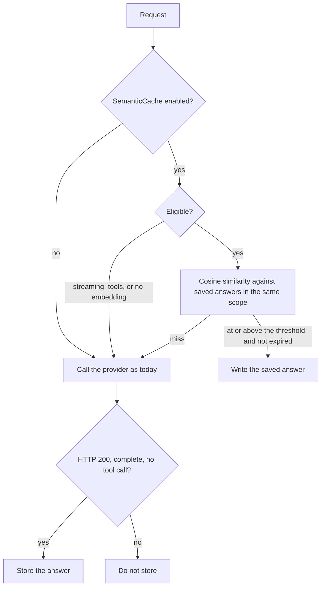

# Local semantic cache

Optional, off by default. When it is on, the router can answer a request from a saved completion if the new request means the same thing as an earlier one, instead of calling the provider again.

This is **not** provider prompt caching. Provider prompt caching is the upstream model's reuse of a prefix (`cache_read_tokens` / `cache_creation_input_tokens` on a usage record, and the Cost Analytics **Cache Hit** chart built by `CostChartBuilder`). That chart and those fields are unchanged by this feature. A semantic-cache hit never calls the provider, so it does not appear as a prompt-cache hit.

## What it reuses

The cache does not embed text itself. `RequestInterceptor` already computes a task embedding with `IEmbeddingClient` (`OnnxEmbeddingClient` in the running app) for routing. The cache stores that vector next to the answer and compares a later request with `EmbeddingMemory.CosineSimilarity`, the same function routing kNN uses. There is no second embedding model.



## Turn it on

In `appsettings.json`:

```json
"SemanticCache": {
  "Enabled": true,
  "SimilarityThreshold": 0.92,
  "TimeToLive": "01:00:00",
  "MaxEntries": 256,
  "MaxStoredResponseBytes": 1048576,
  "CacheEpoch": 0
}
```

`Enabled` defaults to `false`. While it is false the router does not look up, does not store, does not add `X-ArcRouter-Semantic-Cache`, and does not log cache lines.

| Setting | Default | Role |
|---|---|---|
| `Enabled` | `false` | Master switch. |
| `SimilarityThreshold` | `0.92` | Minimum cosine similarity required to reuse an answer. Must be in `(0, 1]`. |
| `TimeToLive` | `01:00:00` | Age after which an entry is not served. Applied at lookup time from the current value. |
| `MaxEntries` | `256` | Oldest entries are dropped past this. |
| `MaxStoredResponseBytes` | `1048576` | Larger responses are not stored. Must stay below the 4 MiB response capture cap so a truncated capture is never replayed. |
| `CacheEpoch` | `0` | Raise this to drop every stored answer. |

### Why 0.92

Routing's own `EmbeddingSimilarityThreshold` is `0.5` because a loose neighbor is still a useful vote for which model to pick. This cache replays the answer. A false hit is a wrong completion presented as the model's, which is worse than paying for another call. `0.92` is a high bar on the unit-normalized vectors the embedding client already produces: near-paraphrases can clear it, merely related questions should not. It is a starting point, not a measurement from this repository's corpus. Raise it if a reused answer was wrong. Lower it only after you have seen the misses you want to absorb.

## When an answer is reused

All of the following have to hold:

- The cache is enabled.
- The routing embedding was computed (the embedding client is warm and the request had a plain-text newest user message). If there is no embedding, the provider is called and nothing is stored.
- Cosine similarity with a stored entry is **at or above** `SimilarityThreshold`.
- The entry is younger than the current `TimeToLive`.
- The entry was embedded by the same model identity (`IEmbeddingClient.ModelIdentity`, the configured embedding model URL for `OnnxEmbeddingClient`). A model swap does not serve old vectors.
- The request is in the same **scope** as the entry.

Scope is the resolved provider key plus the upstream provider model id, plus a hash of the generation settings and the conversation with the newest user message's text removed. Consequences:

- Two client-facing names that resolve to the same provider and provider model id, with the same settings, share an entry. An alias reuses the answer.
- A different upstream model never reuses it, even when the wording matches.
- `temperature`, `top_p`, `max_tokens`, `seed`, `response_format`, the system prompt, earlier turns, and any other field besides `model` and the newest user text must match. Omitted and explicit values are different.
- `auto` routes are scoped to the model the router actually selected. A later request that routes somewhere else is a miss.

## What is never cached

- Streamed requests (`stream: true`) and streamed responses (`text/event-stream`), including partial streams.
- Requests that carry `tools`, a `tool_choice` other than `none`, or tool-call history (`role: tool`, `tool_calls`, `function_call`, `tool_use`, `tool_result`).
- Newest user content that is not a plain string (images and other structured parts). The embedding is text, so those requests are not comparable.
- Any response that is not HTTP 200.
- Error envelopes (`error` at the top of the JSON).
- Answers that themselves contain a tool call.
- Bodies that are not a JSON object, are empty, or are larger than `MaxStoredResponseBytes`.
- Responses from the Bedrock SDK path. Lookup still runs before that path, so a Bedrock request can be served from an entry stored earlier for the same scope, but a Bedrock response is not written into the cache.

## Invalidation

- **TTL.** Entries expire from the time they were stored. Shortening `TimeToLive` takes effect on the next lookup. Lengthening it can serve an entry that is still inside the new window. A hit does not refresh the timestamp.
- **Clear.** `SemanticResponseCache.Clear()` drops every entry. Raising `CacheEpoch` does the same on the next lookup or store, which is the config-file way to clear without a restart. Restarting the process also clears the cache: the store is in memory, not a database.
- **Embedding model change.** Entries stamped with a different `ModelIdentity` are not served.
- **Scope change.** A different model, alias that resolves elsewhere, or different generation settings is a miss. Saved entries for the old scope are left alone until they expire, are evicted, or the cache is cleared.

## How to see a hit

Hits and misses are Information logs, forwarded to the dashboard **Console** tab by `TelemetryLogEventSink` like every other router log. They say "local semantic cache" and "separate from provider prompt caching" so they are not the Cost Analytics cache-hit series.

An eligible request also sets the response header `X-ArcRouter-Semantic-Cache` to `hit` or `miss`. The header is absent when the cache is off or the request was skipped (streaming, tools, no embedding).

A hit does not publish a routing-telemetry turn and does not spend provider budget: the provider was not called. The Console line is the record of the reuse.

The store is process-local and is not a per-user vault. Two clients that send the same model, the same settings, and the same conversation (aside from the newest user wording) can receive the same saved answer. A `user` field on the request is part of the scope, so clients that send one are separated. Leave the cache off for traffic where that sharing is wrong.
