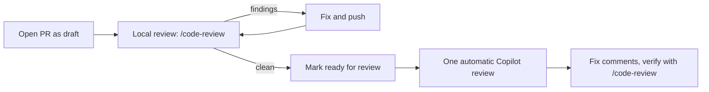

# Standing rules

Process rules for Arc Router board work. They bind every contributor — human, bot, or cloud
agent — until David changes them.

## Approved plan before coding

**Set by David on 2026-09-28.**

Before coding begins on any boarded item, a markdown plan must be written and approved by David.
No implementation starts until the plan is approved. A boarded item is a GitHub issue that has
been signed off for work. This applies to issue
[#165](https://github.com/davidpizon/TotallyHot-ArcRouter/issues/165) and to every future boarded
item.

- **Plan path.** Plans live at `docs/plans/issue-<N>-<slug>.md`, where `<N>` is the issue number
  and `<slug>` is a short kebab-case name.
- **Approval.** Approval is David's explicit sign-off. A comment on the issue, or a comment on the
  pull request that adds the plan, is an explicit sign-off. The issue being boarded is not approval
  of the plan.
- **Implementation pull request.** The pull request that implements the boarded item must link the
  approved plan.

## Review locally, Copilot reviews once

**Set by David on 2026-10-05.**

Each Copilot code review uses one Copilot premium request. In the three weeks to 2026-10-05,
manual re-requests after each round of fixes drove up to 16 reviews on a single pull request
([#183](https://github.com/davidpizon/TotallyHot-ArcRouter/pull/183)). Iterate locally instead,
and let Copilot review each pull request once.

- **Open pull requests as drafts.** The "Preserve main" ruleset skips draft pull requests and does
  not re-review on push, so a draft costs no Copilot requests while you iterate.
- **Review locally before marking ready.** Run `/code-review` in Claude Code on the branch, or a
  reviewer on a different model (a subagent on another model, or another vendor's CLI), and fix
  what it finds. Local review uses no Copilot premium requests.
- **Mark ready once.** Marking the pull request ready triggers exactly one Copilot review. Do not
  request it by hand.
- **Do not re-request Copilot after fixing its comments.** Verify those fixes with a local
  `/code-review` on the new diff. Re-request a Copilot review only after a substantive redesign of
  the change, and say why in a pull request comment.
- **Dependabot pull requests** do not need a Copilot review.
