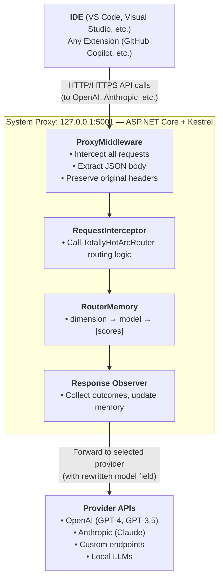
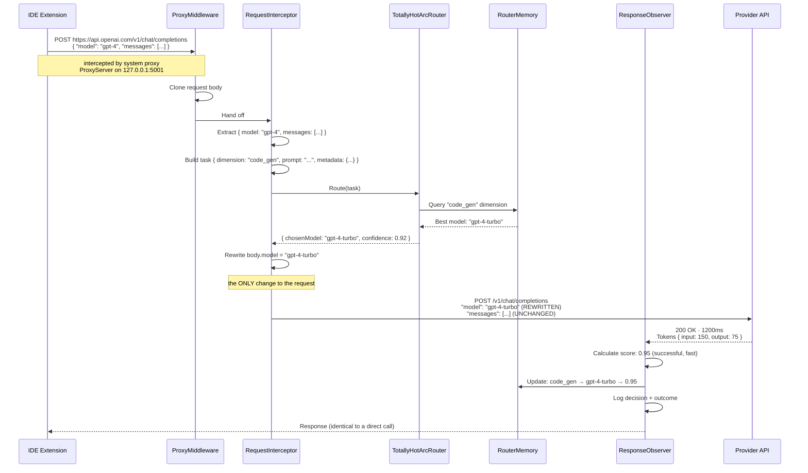

# System Proxy Architecture for TotallyHotArcRouter .NET Implementation

> **Status: Proposed — not yet implemented.** No OS-level proxy registration, WinInet/registry
> interception, or upstream-proxy chaining exists in `src/TotallyHotArcRouter/` today. What *is*
> implemented is a plain local HTTP reverse proxy (`Proxy/ProxyServer.cs`,
> `Proxy/ProxyMiddleware.cs`, `Proxy/RequestInterceptor.cs`, `Proxy/ModelRouteResolver.cs`) that
> clients must be pointed at explicitly (e.g. via `base_url`/`OPENAI_BASE_URL`) — it does not
> register itself as the OS/IDE system proxy. Everything below is a design for a **future**
> capability; treat code-level claims as aspirational until this note is removed.

## Overview

This document describes the **System Proxy Interception** pattern proposed for a future phase of the TotallyHotArcRouter C# migration. This architecture is based on the proven design from `cc-switch` (Rust/Tauri implementation) and would provide transparent integration with GitHub Copilot, Visual Studio, VS Code, and all other IDE extensions without requiring IDE-specific modifications.

## Why System Proxy?

| Concern | System Proxy | Direct HTTP API | IDE Plugin |
|---------|--------------|-----------------|-----------|
| **IDE Coverage** | All (Windows, Mac, Linux) | VS Code only | IDE-specific |
| **Setup Complexity** | Simple (1 config line) | Extension hook needed | Marketplace installation |
| **Latency** | 2-5ms | 50-200ms | <1ms (complex) |
| **Maintenance** | Centralized | Per-extension duplication | Very high |
| **GitHub Copilot** | Automatic ✅ | Requires modification ❌ | Not applicable |
| **Visual Studio** | Supported ✅ | Limited ⚠️ | Complex |
| **Real-world scale** | Battle-tested (cc-switch) | Untested | Complex |

**Decision: System Proxy on localhost:5001**

## Architecture



## Key Components

### 1. ProxyServer (Kestrel-based)
- **Port:** `localhost:5001` (non-privileged, matches cc-switch)
- **Protocol:** HTTP/1.1 with HTTPS MITM support
- **Header Handling:** Preserve original casing for wire-level compatibility
- **Connection Pool:** Support ~100 concurrent connections per provider

```csharp
// Pseudocode
public class ProxyServer : BackgroundService
{
	// Listen on 127.0.0.1:5001
	// Use Kestrel with custom header-casing preservation
	// Implement graceful shutdown with request flushing
}
```

### 2. ProxyMiddleware
- **Request Interception:** Capture all incoming API requests before processing
- **Body Extraction:** Read JSON to identify provider and current model
- **TotallyHotArcRouter Integration:** Call routing logic to determine best model
- **Request Rewriting:** Mutate only `body.model` field (leave everything else untouched)
- **Provider Forwarding:** Forward modified request to actual provider

```csharp
// Pseudocode
public class ProxyMiddleware
{
	// 1. Intercept request (clone body for inspection)
	// 2. Extract JSON and call TotallyHotArcRouter
	// 3. Rewrite body.model = routed_model
	// 4. Forward to upstream provider
	// 5. Observe response
}
```

### 3. RequestInterceptor
- **JSON Parsing:** Extract `body.model` and `body.messages[].content` (for dimension inference)
- **Routing Decision:** Call `TotallyHot.ArcRouter.Route(task)` to get `{ model, confidence, reasoning }`
- **Request Mutation:** Rewrite `body.model` to selected model
- **Context Preservation:** Maintain all other request fields (auth, parameters, etc.)

```csharp
public class RequestInterceptor
{
	public async Task<RouteDecision> InterceptAsync(HttpRequest request)
	{
		var body = await ExtractJsonAsync(request);
		var task = BuildRoutingTask(body);
		var decision = await _routerService.RouteAsync(task);

		body["model"] = decision.ChosenModel;
		return decision;
	}
}
```

### 4. SystemProxyManager (Windows)
- **Enable Proxy:** `netsh winhttp set proxy 127.0.0.1:5001`
- **Disable Proxy:** `netsh winhttp reset proxy`
- **Graceful Shutdown:** Restore original proxy settings on exit (with timeout)
- **Elevation:** Run with admin privileges (UAC prompt on first launch)

```csharp
public class SystemProxyManager
{
	public void EnableSystemProxy(string address, int port)
	{
		// Execute: netsh winhttp set proxy <address>:<port>
	}

	public void DisableSystemProxy()
	{
		// Execute: netsh winhttp reset proxy
	}
}
```

### 5. ResponseObserver
- **Capture Response:** Monitor response status, latency, tokens used
- **Score Calculation:** Determine quality from HTTP status + response time
- **Memory Update:** Feed (task_id, model, score) into RouterMemory
- **Logging:** Audit trail of all routing decisions and observations

```csharp
public class ResponseObserver
{
	public async Task ObserveAsync(RouteDecision decision, HttpResponse response)
	{
		var outcome = ExtractOutcome(response);
		_memory.Update(decision.Dimension, decision.ChosenModel, outcome.Score);
		_logger.LogInformation("Observed: {Decision} -> {Outcome}", decision, outcome);
	}
}
```

## Request Flow



## Configuration

### appsettings.json
```json
{
  "ProxySettings": {
	"ListenAddress": "127.0.0.1",
	"ListenPort": 5001,
	"SystemProxyEnabled": true,
	"SystemProxyRestoreTimeoutMs": 10000,
	"PreserveHeaderCase": true,
	"MaxConnectionsPerProvider": 100,
	"RequestTimeoutSeconds": 120,
	"EnableHttps": true,
	"CertificatePath": "./certs/proxy-ca.pem"
  },
  "TotallyHotArcRouter": {
	"Enabled": true,
	"CheapChain": ["gpt-4-turbo"],
	"EscalateTo": "gpt-4",
	"MemoryPath": "./router_memory.json",
	"MaxNeighbors": 10
  },
  "Logging": {
	"LogLevel": {
	  "TotallyHot.ArcRouter.Proxy": "Information",
	  "TotallyHot.ArcRouter.Router": "Debug"
	}
  }
}
```

### Environment Variables
```bash
# Optional overrides (for deployment)
export PROXY_LISTEN_PORT=5002
export TotallyHotArcRouter_MEMORY_PATH=/var/lib/TotallyHotArcRouter/memory.json
export TotallyHotArcRouter_CHEAP_CHAIN="gpt-3.5-turbo,llama2"
```

## Deployment Scenarios

### Scenario 1: Local Development (Windows)
```powershell
# Start TotallyHotArcRouter service
dotnet run --project src/TotallyHotArcRouter/TotallyHotArcRouter.csproj

# System proxy is automatically enabled on startup
# GitHub Copilot in VS Code will use routing automatically

# Verify proxy is active
netsh winhttp show proxy

# View memory to see routing decisions
cat ./router_memory.json
```

### Scenario 2: System-Wide (Windows + All IDEs)
```powershell
# Install as Windows Service
sc.exe create TotallyHotArcRouter binPath="C:\Program Files\TotallyHotArcRouter\TotallyHotArcRouter.exe"
sc.exe start TotallyHotArcRouter

# System proxy is enabled for all applications
# All IDEs (VS Code, Visual Studio, Rider, etc) use routing

# View logs
Get-EventLog -LogName Application -Source "TotallyHotArcRouter" -Newest 50
```

### Scenario 3: Docker Container
```dockerfile
FROM mcr.microsoft.com/dotnet/runtime:10.0
WORKDIR /app
COPY bin/Release/net10.0/publish .

# Note: System proxy only works on Windows containers
ENTRYPOINT ["./TotallyHotArcRouter"]
```

## Testing Strategy

### Unit Tests
- **ProxyServerTests:** Startup, shutdown, port binding, error handling
- **ProxyMiddlewareTests:** Request rewriting, header preservation, no-op mutations
- **RequestInterceptorTests:** JSON extraction, TotallyHotArcRouter integration, decision injection
- **SystemProxyManagerTests:** Enable/disable commands, command execution

### Integration Tests
- **ProxyInterceptionTests:** Mock provider endpoint, verify full flow
- **HTTPS/MITMTests:** Certificate handling, encrypted traffic
- **SystemProxyTests:** OS integration (Windows only)
- **LatencyTests:** Verify <5ms overhead
- **RegressionTests:** Compare with Python baseline routing decisions

### Example Test
```csharp
[Test]
public async Task ProxyMiddleware_RewritesModelField_PreservesOtherFields()
{
	// Arrange
	var originalRequest = new
	{
		model = "gpt-4",
		temperature = 0.7,
		messages = new[] { new { role = "user", content = "Hello" } }
	};

	var router = new MockTotallyHotArcRouter(); // returns gpt-4-turbo
	var middleware = new ProxyMiddleware(router);

	// Act
	var rewritten = await middleware.InterceptAsync(originalRequest);

	// Assert
	Assert.AreEqual("gpt-4-turbo", rewritten["model"]);
	Assert.AreEqual(0.7, rewritten["temperature"]); // unchanged
	Assert.AreEqual("Hello", rewritten["messages"][0]["content"]); // unchanged
}
```

## Benefits

✅ **Zero IDE Changes:** Transparent to extensions  
✅ **All IDEs Supported:** Windows, Mac, Linux + VS Code, Visual Studio, etc.  
✅ **GitHub Copilot Ready:** No extension modification needed  
✅ **Low Latency:** 2-5ms overhead (vs. 50-200ms for HTTP API)  
✅ **Centralized Logic:** Single source of truth for routing  
✅ **Audit Trail:** Full logging of routing decisions  
✅ **Scalable:** Supports 100+ concurrent connections  
✅ **Battle-Tested:** Proven in production (cc-switch)  

## Next Steps

1. **Phase 5a:** Implement `ProxyServer` and `Kestrel` configuration
2. **Phase 5b:** Implement `ProxyMiddleware` with request/response interception
3. **Phase 5c:** Integrate `TotallyHotArcRouter` routing logic into middleware
4. **Phase 5d:** Implement `SystemProxyManager` for Windows integration
5. **Phase 5e:** Add unit and integration tests
6. **Phase 5f:** End-to-end testing with real IDE extensions

## References

- **Reference Implementation:** `cc-switch/src-tauri/src/proxy/server.rs`, `cc-switch/src-tauri/src/proxy/TotallyHotArcRouter.rs`
- **Design Pattern:** System Proxy Interception (HTTP MITM)
- **Standard Protocol:** HTTP/1.1 with optional HTTPS (with MITM certificates)
- **Configuration:** ASP.NET Core Options Pattern + appsettings.json

