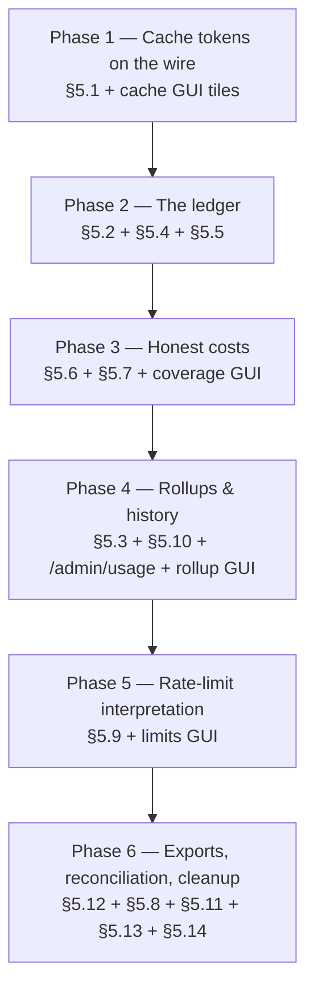

# Token Tracking Implementation Plan

> **Status: Proposed — not yet implemented.** This is the phase-by-phase execution plan for every
> finding adopted from [`token-tracking-improvements.md`](token-tracking-improvements.md) (the
> analysis; section references like §5.1 below point into it). The maintainer has adopted the
> analysis's recommended position on all three contested findings — the §5.7 resolution ladder
> (superseding [`d3-alias-resolution.md`](d3-alias-resolution.md)'s exact-only rule, see the note
> there), the §5.5 persistent turn tracker (superseding [`telemetry.md`](telemetry.md)'s
> process-lifetime model, see the note there), and the §5.11 incremental scanner fallback. Remove
> this banner only when every phase below is complete; strike each phase's checkbox list as it lands.

## Ground rules (apply to every phase)

- **Phase completion criteria** (from `AGENTS.md`): zero build warnings/errors (repo-wide
  `TreatWarningsAsErrors`), full test suite green, ≥80% coverage, no unit test over 5 seconds,
  accurate XML docs on every touched member (`GenerateDocumentationFile` + `CS1591`).
- **The GUI only ever talks to the proxy** ([`telemetry.md`](telemetry.md#gui-consumption)). Every
  new GUI data need in this plan is served by a proxy surface — the telemetry gRPC stream, or new
  `/admin/usage/*` REST endpoints behind the existing `ManagementAccessToken` — never by the GUI
  opening `agent_telemetry.db`.
- **Proto changes are additive only**: new `optional` fields with fresh field numbers; existing
  numbers never change meaning, so an old client still parses every event.
- **Money is never `REAL`.** Costs stored in SQLite are invariant-culture decimal strings (`TEXT`),
  matching `PriceCatalogRepository`'s existing convention; `null`/absent means unknown, never `0`.
- **Every write on the request path is best-effort**: logged and swallowed on failure, run under
  `CancellationToken.None` after the response is sent (the reasoning documented at the existing
  budget-store call in `ProxyMiddleware.PublishTelemetryAsync`).
- **Logging** is Serilog structured logging with static message templates, per `AGENTS.md`.
- New GUI work extends existing tabs/cards (the operator's decision); no new windows, so the
  `SettingsModal` window-shell contract is not triggered. Charts reuse the `EChart`/`ChartJson`
  pattern; pure chart math goes in `TotallyHotArcRouter.Gui.Charts` so it stays unit-testable.

## Phase map

Phases are strictly ordered — each consumes the previous phase's data layer — and each ships its own
GUI surface, so no phase completes invisible work (§5.15's requirement).

---

## Phase 1 — Cache tokens on the wire, and a real cache-hit tile (§5.1) — **Implemented**

The smallest change with the largest visible effect: the proxy already extracts, prices, and
budget-charges all four token dimensions; this phase stops dropping two of them at the
`RoutingTelemetryEvent` boundary and lights up the GUI tiles that are currently hardcoded to zero.

**Proxy**

1. `Telemetry/RoutingTelemetryEvent.cs` — append `int? CacheCreationTokens = null` and
   `int? CacheReadTokens = null` (before the existing trailing optionals, per the analysis §5.1
   sketch, so no call site breaks).
2. `src/Protos/telemetry.proto` — `optional int32 cache_creation_tokens` and
   `optional int32 cache_read_tokens` at the next unused field numbers. Existing fields untouched.
3. `Proxy/ProxyMiddleware.cs` (`PublishTelemetryAsync`, the event construction around line 1365) —
   pass the already-extracted `cacheCreationTokens`/`cacheReadTokens` locals through.
4. `Telemetry/TelemetryBroadcaster.cs` / `TelemetryGrpcService` mapping — copy both fields onto the
   wire message, presence-preserving (`null` ⇒ field absent, distinct from `0`).

**GUI**

5. `Gui.Telemetry` — `RoutingTelemetryEventDto` gains both fields; `ConversationAggregator` sums
   them per conversation (null-safe, like the existing token sums).
6. `Gui.Charts/CostChartBuilder.cs` — a shared `CacheHitRate(prompt, cacheCreation, cacheRead)`
   helper using the additive total as denominator (`UsageInfo.TotalInputTokens` semantics — the
   provider's own `input_tokens` excludes cached tokens, so dividing by it can exceed 100%).
7. `Gui/Services/LiveConversationMapper.cs` — replace the hardcoded `CacheHitRate: 0m` with the real
   derived value; delete the stale remarks at lines 21–22 claiming cache usage "is not parsed".
8. Surfaces that light up with no further changes: `TurnCard.razor`'s Cache stat, the Cost Analytics
   **Cache Hit** metric for live turns.

**Docs** — [`telemetry.md`](telemetry.md)'s real-vs-defaulted table (Cache Hit Rate moves out of the
"honest defaults" list), [`../gui/backlog.md`](../gui/backlog.md) item 1, and the analysis §5.1.

**Tests** — proto round-trip presence/absence of both fields; broadcaster field mapping; aggregator
null-handling; `CacheHitRate` (zero-input turn ⇒ 0, fully-cached turn ⇒ ≤100); a
`ProxyMiddlewareTests` case asserting a cache-bearing Anthropic response produces an event carrying
both counts.

**Exit criteria** — ground rules; plus: a live Anthropic cache-hit conversation shows a non-zero
Cache stat end-to-end.

---

## Phase 2 — The durable ledger: `usage_ledger`, dedup key, persistent turns (§5.2, §5.4, §5.5) — **Implemented**

History stops evaporating. These three land together because the ledger without a dedup key
double-counts on the first restart, and a durable `(sessionId, turnNumber)` key is corrupt without a
restart-surviving turn counter.

**Schema** (in `PriceCatalog/PriceCatalogDatabase.cs` `EnsureCreated` — new tables need no
migration): the `usage_ledger` table exactly as specified in the analysis §5.2 — `dedup_key` with a
unique index, cache-token columns, `estimated_cost_usd TEXT` (nullable, decimal-as-string),
`cost_confidence TEXT` (written as `"Unknown"` until Phase 3 computes it), timestamps in
`PriceCatalogRepository.TimestampFormat`, plus the time and `(provider, requested_model, time)`
indexes.

**Proxy**

1. New `Telemetry/UsageLedger.cs` (`IUsageLedger` + SQLite implementation) and
   `Telemetry/UsageLedgerEntry.cs`. `RecordAsync` never throws;
   `INSERT ... ON CONFLICT(dedup_key) DO NOTHING` makes replay idempotent. Includes the analysis
   §5.4 validation gate: reject negative token counts, future timestamps, inconsistent totals — log
   at Warning and drop, so a translator regression is caught at ingest.
2. `BuildDedupKey` per §5.4: upstream request id (`request-id`, `x-request-id` — read from the
   upstream response headers in `ProxyMiddleware`, which already has them in hand) when present,
   else the composite SHA-256 over
   `(session, turn, provider, model, four token counts, second-truncated timestamp)`.
3. Wire-up: one `RecordAsync` call in `ProxyMiddleware.PublishTelemetryAsync` immediately after the
   `_budgetStore` block, same `CancellationToken.None` reasoning; DI registration in
   `Hosting/ServiceCollectionExtensions.cs` mirroring the budget store's optional pattern.
4. Retention: `Storage:UsageLedgerRetentionDays` (default **370**, token-monitor's bounded-archive
   discipline) — a delete-by-`occurred_at_utc` sweep folded into the existing startup health check.
5. §5.5: new `PersistentConversationTurnTracker` implementing `IConversationTurnTracker` — on first
   sight of a session, seed the counter from `MAX(turn_number)` for that `session_id` in the ledger,
   then count in memory; evict entries after 12h idle (safe *because* of the seeding). Registered in
   place of the in-memory tracker; the in-memory one remains for tests/no-ledger configurations.

**Tests** — replayed entry does not double-count (the reason §5.4 exists); request-id preferred over
composite; composite stability across re-parse timestamps; validation-gate rejections; retention
sweep boundary; turn tracker seeds N+1 after simulated restart; eviction then re-seed; concurrency
(the existing 200-parallel-calls test pattern against the persistent tracker).

**Docs** — [`agent-cost-tracking.md`](agent-cost-tracking.md): mark the ledger half implemented
(banner + §2 note already point here); [`telemetry.md`](telemetry.md): turn-tracker superseding note
becomes "implemented".

**Exit criteria** — ground rules; plus: kill and restart the proxy mid-session and verify (a) no
duplicate ledger rows, (b) the resumed session's next turn number continues rather than restarting.

---

## Phase 3 — Honest costs: confidence, coverage, and the resolution ladder (§5.6, §5.7) — **Implemented**

The "unknown ≠ zero" discipline the codebase holds at the type level, extended to aggregates and to
model-identity resolution.

**Cost confidence (§5.6)**

1. New `Telemetry/CostConfidence.cs` — the five-value enum exactly as in the analysis (`NoUsage`,
   `Unknown`, `CatalogApproximate`, `Catalog`, `Exact`).
2. `ProxyMiddleware.PublishTelemetryAsync` computes it where cost is computed today: free provider ⇒
   `Exact`; fresh catalog price with all applicable rates ⇒ `Catalog`; priced but a cache dimension
   fell back to the input rate ⇒ `CatalogApproximate` (`ModelPrice` must report whether the fallback
   fired — a small `EstimateCost` companion or out-param); no fresh price ⇒ `Unknown`; no usage ⇒
   `NoUsage`.
3. Carried on `RoutingTelemetryEvent` + proto (`optional string cost_confidence`), written to the
   ledger's `cost_confidence` column (replacing Phase 2's placeholder).
4. `SpendSummary` gains `UnpricedRequests`; `SpendTracker.RecordAsync` counts `null` costs instead
   of silently `?? 0m`-ing them into the total.

**Resolution ladder + operator overrides (§5.7, executing d3's Slice 4 as the top rung)**

5. New override store: a `model_alias_overrides` table (`source`, `aggregator_model_key`,
   `model_name`) in the catalog database — the operator's recourse when auto-match can't reach a
   model — plus `PUT/DELETE /admin/price-overrides` management endpoints behind
   `ManagementAccessToken` (runtime-editable, no restart, per d3's own future-UI reasoning).
6. `ConfigModelIdentityResolver` becomes the ladder: `OperatorOverride` → `Exact` (today's behavior)
   → `SnapshotSuffixStripped` → `VersionNormalized` → `ProviderAlias` — returning
   `IdentityResolution(Identity, Rung)`; no fuzzy rung, terminates in `null` exactly as today. Every
   rung below `Exact` flags the stored price so lookups yield `CostConfidence.CatalogApproximate`.
7. GUI (Governance → Price Sources or an adjacent pane, per d3's "Future: UI-managed overrides"):
   per configured `ModelName`, show whether a price resolves and via which rung (read-only diagnosis
   first), and let the operator add/remove an override mapping.

**GUI coverage rendering**

8. Wherever a cost total renders (Live Stream conversation cards/summary, Cost Analytics tooltips),
   a non-zero unpriced count changes the presentation from `$4.10` to `≥ $4.10 · 3 unpriced` (chip +
   tooltip). Turn cards get a confidence indicator on the cost stat's tooltip.

**Tests** — every enum branch explicitly (the analysis calls these out as needing non-incidental
coverage); every ladder rung, including precedence (override beats exact beats stripped) and the
approximate-flag propagation into lookup results; `UnpricedRequests` accounting; override endpoints'
auth + validation.

**Docs** — [`d3-alias-resolution.md`](d3-alias-resolution.md): Slice 4 closes, superseding note
becomes "implemented"; [`pricing-seed-removal.md`](pricing-seed-removal.md) unchanged (this extends
its principle; the analysis §5.6 records how).

**Exit criteria** — ground rules; plus: a model priced only under a dated snapshot id resolves via
the ladder, displays as approximate, and an operator override corrects it live without a restart.

---

## Phase 4 — Rollups, budget windows, the query surface, and the rollup GUI (§5.3, §5.10, §5.15) — **Implemented**

The phase an operator actually notices: history becomes queryable, and Model Distribution stops
being a mock.

> **Implementation notes (deviations from the sketch above):** the Governance per-model cards land as
> a new "Models" sub-view (Governance > Models) rather than a second section stacked under the
> existing provider cards, and read spend via the `/admin/usage` REST surface this phase builds
> rather than `governance-model-cards.md`'s older gRPC-RPC sketch — that doc's dependency #1 (a live
> model price catalog channel to the GUI) is still unbuilt, so every card reads "Price unavailable"
> rather than a real price; only the spend half is live. The budget-window "resets in" text and a
> window-kind selector are exposed via `ProviderView.WindowKind`/`NextResetUtc` and
> `SetBudget`'s optional window parameters, but the Governance budget editor itself does not yet
> expose a window-kind picker in the UI (windows can be set via the REST API; the default `Monthly`
> UI editor is unchanged). Item 7's Total Saved / Avg. Cost Reduction ticker tiles are labeled
> "(demo)" per their stated scoping.

**Rollups (§5.3)**

1. `usage_rollup` table exactly as the analysis specifies (`PT30M` base grain rolled to `PT1H`/`P1D`,
   `WITHOUT ROWID`, cost as TEXT, `unpriced_requests` column) plus the write-once `BucketTimezone`
   (stored in the database, IANA id, immutable after first run — tokscale's reproducible-bucket
   rule).
2. A rollup maintainer folded into the ledger write path (increment the current bucket) with a
   startup back-fill for buckets missed while down. **Never publish the in-progress bucket** to
   readers (honeycomb's rule): queries end at the last complete bucket boundary.

**Budget windows (§5.10)**

3. `BudgetWindow` abstraction (`Monthly` default — nothing changes for existing operators —
   `Weekly`, `RollingHours(5)`); `ProviderBudgetStore.CurrentPeriod()` generalizes to
   `window.PeriodKey(now)`; per-provider budget config gains an optional window kind, surfaced in
   the existing budget editor and utilization bars ("resets in 2h 10m" instead of assuming
   month-end).

**Query surface** (the piece §5.15 identifies as architecturally required)

4. New `/admin/usage` endpoints in `Proxy/Management/` behind `ManagementAccessToken`, served by
   `IUsageLedger.Query`/rollup reads:
   - `GET /admin/usage/summary?window=` — totals + `UnpricedRequests` for ticker/summary tiles.
   - `GET /admin/usage/rollup?from=&to=&width=&groupBy=model|provider|day` — the chart feed.
   - `Gui.Admin`'s `ProviderAdminClient` pattern gains a `UsageQueryClient`; a `UsageStore` in
     `Gui/Services/` caches responses per range.

**GUI rollup rendering**

5. **Model Distribution** goes live: `TokenBuckets` from `P1D` rollups, `ModelShares` from per-model
   request/token shares; the Day/Month/3-Month/6-Month/Year filter bar and From/To inputs actually
   refilter (closing the "cosmetic only" gap); axes become dynamic (the backlog's known gap).
6. **Cost Analytics** history: the metric-explorer corpus merges ledger-backed history fetched on
   load, so charts survive GUI restarts instead of starting empty; mock history remains only as the
   offline/no-proxy demo (unchanged policy).
7. **Header ticker**: System Tokens becomes real from `summary`. Total Saved / Avg. Cost Reduction
   stay mock **and get labeled as demo values** — they need a worst-case-baseline ROI concept this
   plan deliberately does not invent (tracked in [`../gui/backlog.md`](../gui/backlog.md)).
8. **Governance per-model cards** ([`../gui/governance-model-cards.md`](../gui/governance-model-cards.md)):
   now unblocked — one card per configured model, live price + date-range spend from
   `rollup?groupBy=model`, honoring that doc's `$0.00`-vs-"Price unavailable" distinction and its
   informational-only scope.

**Tests** — bucket math across the pinned timezone (including a DST boundary); in-progress-bucket
exclusion; back-fill correctness; `PeriodKey` for all three window kinds (lexicographic ordering
property); endpoint auth/range validation; chart-model builders for the new live series
(`Gui.Charts`, platform-neutral).

**Exit criteria** — ground rules; plus: close the GUI, route traffic, reopen — Model Distribution
and Cost Analytics show the traffic that happened while it was closed; two reports over the same
past day, generated a month apart, agree.

---

## Phase 5 — Rate-limit interpretation: burn rate, trends, staleness (§5.9)

The capture → parse → display pipeline shipped with
[`anthropic-reported-usage-plan.md`](anthropic-reported-usage-plan.md); this phase adds the missing
interpretation layer. This is the "provider-imposed limits" GUI deliverable.

1. `ProjectExhaustion` (pure, in `PriceCatalog/` beside `RateLimitSnapshotParser`) over two
   observations of a `(provider, dimension)` — from `provider_rate_limit_history` minute buckets —
   returning `null` when flat/refilled/reset-before-empty, per the analysis §5.9 contract.
2. Staleness state: a threshold (config, default e.g. 15 min) turning `ObservedAtUtc` into
   Fresh/Stale; the provider card's "As of" footer gains the state (stale renders dimmed + labeled),
   and the **last-good contract gets pinned by a test**: a header-free response must leave the prior
   snapshot standing.
3. History trend charts on the provider card — the "pure GUI change" the anthropic plan provisioned
   for: per-dimension remaining-over-time from `provider_rate_limit_history` (exposed via
   `ManagementFacade`, riding the existing `GET /admin/providers` shape or a
   `/admin/providers/{key}/rate-limit-history` sibling), rendered with the existing
   `EChart`/`BudgetBarJson` pattern.
4. Burn-rate on the card: "Input tokens: 340,000 remaining · **~19 min at current rate**" when a
   projection exists; nothing shown when `null` (no fabricated urgency).
5. Optional stretch (decide at phase start): a `rate_limit` oneof case on the telemetry stream so
   the header status banner can warn on projected exhaustion without a Providers-card load. Additive
   to the REST path, not a replacement.

**Tests** — projection math (flat, refill, reset-before-empty, normal depletion); staleness
threshold; last-good pin; history read shape; card render states (`Gui.Tests` alongside
`ProvidersAdminLoadedTests`).

**Exit criteria** — ground rules; plus: throttled traffic against a live Anthropic key produces a
visible countdown and a history curve on the provider card.

---

## Phase 6 — Close the loop: exports, reconciliation, capture recovery, cleanup (§5.12, §5.8, §5.11, §5.13, §5.14)

Independent items, grouped because each is small once Phases 2–4 exist. They can land as separate
PRs within the phase.

1. **Exports (§5.12)** — `GET /admin/usage/export?from=&to=&format=csv|json&groupBy=…` reusing
   Phase 4's queries verbatim; an optional `System.Diagnostics.Metrics` meter
   (`TotallyHot.ArcRouter.Usage`) emitting `arcrouter.usage.tokens{provider,model,kind}`,
   `arcrouter.usage.cost_usd{provider,model}`, `arcrouter.usage.unpriced_requests{provider}` for
   OTLP/Prometheus, following honeycomb's attribute naming where it maps.
2. **Reconciliation (§5.8)** — `CostReconciliationHostedService` per
   [`agent-cost-tracking.md`](agent-cost-tracking.md) §3.4/§3.5 with the four honeycomb disciplines
   baked in (never scrape the in-progress bucket; checkpoint the cursor; paginate to exhaustion;
   capped-backoff retry on 429/408/5xx), writing `provider_cost_reconciliation` rows with the
   org-vs-proxy scope caveat recorded per row. Optional per provider; no Admin key ⇒ no reconciler
   registered.
3. **Capture recovery (§5.11)** — first the counter (`usage_extraction_failed_total` +
   the Debug log line), then `IncrementalUsageScanner` as a fallback consulted only when the
   buffered parse fails — the single-shot `UsageExtractor` remains the primary path, per its own
   documented rationale.
4. **Retire `spend_log.jsonl` (§5.13)** — the ledger strictly supersedes it. Keep
   `SpendTracking:Enabled` gating the `[SPEND]` console line; deprecate `SpendTracking:LogPath`
   (warn when configured, stop writing after one release). This deletes an operator-visible file
   behavior — call it out in release notes.
5. **`ReasoningTokens` (§5.14)** — added to `UsageInfo` with the inclusive-subset doc contract (a
   subset of `CompletionTokens`, never added to cost); parsed from
   `completion_tokens_details.reasoning_tokens` (OpenAI shape) and Anthropic thinking deltas when
   present. `ModelPrice.EstimateCost` unchanged. Web-search counts stay blocked on the catalog
   publishing per-request rates.

**Tests** — export golden files (CSV quoting, JSON shape); reconciliation window/cursor/pagination
against a fake Admin API; scanner against oversized streamed fixtures (> capture cap) asserting
usage still extracted; reasoning-token subset invariant; spend-log deprecation warning.

**Exit criteria** — ground rules; plus: the analysis doc's status banner and this doc's banner both
updated to reflect completion; [`agent-cost-tracking.md`](agent-cost-tracking.md)'s reconciliation
half marked implemented.

---

## Deliberately out of scope

- **Routing ROI / worst-case baseline cost** (drives the ticker's Total Saved and the ROI metric) —
  a routing-policy feature, not a token-tracking one; stays in
  [`../gui/backlog.md`](../gui/backlog.md).
- **Fuzzy model matching** — permanently rejected (analysis §7).
- **Active rate-limit probing, browser-cookie scraping, cloud sync, gamification** — permanently
  rejected (analysis §7).
- **Telemetry-stream authentication** — still needed, still tracked in
  [`signalr-hub-security.md`](signalr-hub-security.md) / [`../gui/backlog.md`](../gui/backlog.md)
  item 2; this plan adds no new unauthenticated surface (everything new is behind
  `ManagementAccessToken`) but doesn't fix the existing gap either.
