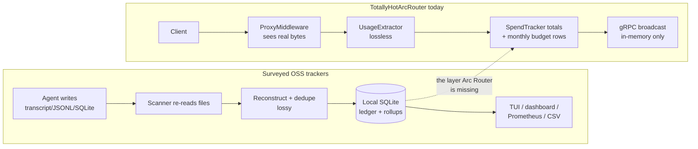
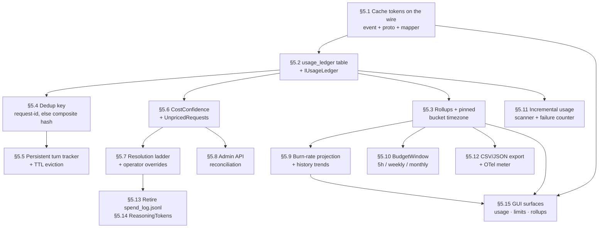

# Token Tracking: Improvements Adapted from Open-Source Usage Trackers

> **Status: Analysis and proposal — nothing here is implemented.** This document surveys seven
> external open-source token/cost trackers (plus two on-path proxy peers, LiteLLM and Helicone — see
> §3), compares each technique against TotallyHotArcRouter's
> *current, on-disk* token-tracking implementation, and proposes concrete changes. Every "current
> behavior" claim below was read from source in this repository at the time of writing and cites the
> file and line. Every "proposed" block is a sketch, not shipped code.
>
> Where a proposal conflicts with an architectural decision already documented in
> [`agent-cost-tracking.md`](agent-cost-tracking.md), [`model-price-catalog.md`](model-price-catalog.md),
> [`d3-alias-resolution.md`](d3-alias-resolution.md), or [`telemetry.md`](telemetry.md), the conflict is
> called out explicitly under a **⚠ Conflicts with** heading and the tradeoff is argued rather than
> glossed over. The maintainer has since **adopted** the recommended position on all three contested
> findings (§5.5, §5.7, §5.11) — the conflicting docs carry superseding-decision notes — and the
> phase-by-phase execution of everything below, including the GUI rendering work in §5.15, lives in
> [`token-tracking-implementation-plan.md`](token-tracking-implementation-plan.md).

---

## 1. The one thing to understand before reading the rest

**TotallyHotArcRouter is on-path. Six of the seven surveyed projects are not.**

Almost every tool in this space is doing *forensic reconstruction*: it scans `~/.claude/projects/*.jsonl`,
`~/.codex/sessions/`, Cursor's SQLite files, and so on, after the fact, and tries to rebuild what was
billed. That is a fundamentally lossy exercise, and the projects say so out loud. `cccost`'s README states
that "the transcript does not contain all requests Claude Code issues to the Anthropic servers" — which is
why that project abandoned transcript parsing and monkey-patches Node's `fetch()` instead. `tokscale`
documents that "Claude Code rewrites a session transcript in place when you resume or compact it," so a
naive re-scan double-counts or silently loses turns. `TokenTracker` reports that deduplicating on request
IDs alone produces **1.6×–3.7× over-counting**, because some providers omit them.

TotallyHotArcRouter has none of those problems, because it *is* the wire. `ProxyMiddleware` sees the real
request, the real response bytes, the real `usage` block, and the real rate-limit headers, once, at the
moment they exist.

The correct conclusion is therefore **not** "adopt their capture techniques." It is:

> Arc Router's *capture* is already better than any of these projects'. Its *retention*, *identity
> resolution*, *confidence modeling*, and *presentation* are behind all of them.

Every high-priority finding in this document falls into one of those latter three buckets. The capture
findings (§5.11, §5.14) are narrow and low-priority by comparison.



---

## 2. Current implementation, as read from source

| Concern | Where it lives | State |
|---|---|---|
| Token extraction (Anthropic) | [`AnthropicUsageParser.cs`](../../src/TotallyHotArcRouter/Telemetry/AnthropicUsageParser.cs) | Solid. Handles `message_start` + last `message_delta`, and lets a final delta's cache fields override the start's. |
| Token extraction (OpenAI-shape) | [`OpenAiUsageParser.cs`](../../src/TotallyHotArcRouter/Telemetry/OpenAiUsageParser.cs) | Solid. Normalizes OpenAI's *inclusive* `cached_tokens` into the additive model, with a `Math.Max` guard. |
| Usage shape | [`UsageInfo.cs:27`](../../src/TotallyHotArcRouter/Telemetry/UsageInfo.cs#L27) | 4 dimensions: prompt, completion, cache-creation, cache-read. No reasoning tokens, no web-search counts. |
| Dispatch | [`UsageExtractor.cs:42`](../../src/TotallyHotArcRouter/Telemetry/UsageExtractor.cs#L42) | Single-shot parse over a fully-buffered, capped byte capture. |
| Pricing | [`ModelPrice.cs:55`](../../src/TotallyHotArcRouter/Telemetry/ModelPrice.cs#L55) | 4-term cost formula. Cache rates fall back to the standard input rate (deliberate conservative overestimate). |
| Price lookup | [`PriceCatalogModelPriceLookup.cs`](../../src/TotallyHotArcRouter/PriceCatalog/PriceCatalogModelPriceLookup.cs) | SQLite catalog with a 24-hour freshness floor; returns `null` when stale. |
| Model identity | [`ConfigModelIdentityResolver.cs:64`](../../src/TotallyHotArcRouter/PriceCatalog/ModelIdentityResolver.cs#L64) | **Exact match only.** Provider name equal (case-insensitive) + model id equal after stripping the source's own `provider/` prefix. |
| Running spend | [`SpendTracker.cs:68`](../../src/TotallyHotArcRouter/Telemetry/SpendTracker.cs#L68) | Process-lifetime in-memory totals + append-only `spend_log.jsonl`. **Nothing reads the file back.** |
| Budget enforcement | [`ProviderBudgetStore.cs`](../../src/TotallyHotArcRouter/PriceCatalog/ProviderBudgetStore.cs) | Per-provider caps, `YYYY-MM` UTC calendar-month window, auto-reset on rollover. Persisted. |
| Rate-limit headers | [`RateLimitHeaderCapture.cs:80`](../../src/TotallyHotArcRouter/Telemetry/RateLimitHeaderCapture.cs#L80), [`RateLimitSnapshotParser.cs`](../../src/TotallyHotArcRouter/PriceCatalog/RateLimitSnapshotParser.cs) | Captured verbatim (snapshot + minute-bucketed 30-day history), parsed into a typed `RateLimitSnapshotView`, and shown on the Providers card via `GET /admin/providers`. **Displayed but never interpreted**: no burn-rate projection, no history charts, no staleness state. |
| Turn counting | [`ConversationTurnTracker.cs:26`](../../src/TotallyHotArcRouter/Telemetry/ConversationTurnTracker.cs#L26) | `ConcurrentDictionary<string,int>`, no eviction, resets on process restart. |
| Broadcast shape | [`RoutingTelemetryEvent.cs`](../../src/TotallyHotArcRouter/Telemetry/RoutingTelemetryEvent.cs), [`telemetry.proto:161`](../../src/Protos/telemetry.proto#L161) | Carries `PromptTokens`, `CompletionTokens`, `EstimatedCostUsd`. **No cache fields.** |
| GUI consumption | [`LiveDataStore.cs:50`](../../src/TotallyHotArcRouter.Gui/Services/LiveDataStore.cs#L50), [`LiveConversationMapper.cs:69`](../../src/TotallyHotArcRouter.Gui/Services/LiveConversationMapper.cs#L69) | In-memory `List<RoutingTelemetryEventDto>`, populated only while connected. `CacheHitRate` hardcoded to `0m`. |

**The two structural gaps this table exposes:**

1. Cache tokens are extracted, priced, and charged against budgets — then **thrown away** at the
   `RoutingTelemetryEvent` boundary. The GUI's cache-hit-rate tile can never show a real number.
2. Per-request history exists nowhere durable. `spend_log.jsonl` is write-only; the GUI's history
   evaporates when the window closes; the ledger in [`agent-cost-tracking.md`](agent-cost-tracking.md)
   is still marked "Proposed — not yet implemented."

---

## 3. The surveyed projects

| Project | Lang | Approach | The one technique worth stealing |
|---|---|---|---|
| [junhoyeo/tokscale](https://github.com/junhoyeo/tokscale) | Rust + TS | Scans 40+ agents' session stores | **8-step ranked pricing-resolution ladder**; pinned, write-once bucket timezone |
| [badlogic/cccost](https://github.com/badlogic/cccost) | TypeScript | Injects a `fetch()` interceptor into Claude Code | Per-model cumulative record incl. **both cache dimensions as first-class**; correct on session resume |
| [658jjh/claude-usage-tracker](https://github.com/658jjh/claude-usage-tracker) | — | Local scan of 10+ tools, dashboard | Per-provider scoping; heat-map of usage by hour; "most expensive session" callouts |
| [mm7894215/TokenTracker](https://github.com/mm7894215/TokenTracker) | — | Hooks + plugins + passive readers, SQLite | **Composite-key dedup** (fixes 1.6–3.7× over-count); 30-min UTC buckets; LiteLLM daily refresh w/ 24h cache |
| [Javis603/token-monitor](https://github.com/Javis603/token-monitor) | Electron | Widget over tokscale's parser | **370-day rolling archive that survives source pruning**; multi-window quota model (session/weekly/billing/credits) |
| [honeycombio/anthropic-usage-receiver](https://github.com/honeycombio/anthropic-usage-receiver) | Go | OTel receiver over Anthropic's Admin API | **Never scrape the in-progress bucket**; checkpointed cursor; cursor pagination; typed retry policy |
| [github.com/topics/ai-cost-tracking](https://github.com/topics/ai-cost-tracking?o=asc&s=updated) | mixed | 18 repos | [openusage](https://github.com/janekbaraniewski/openusage) (159★): **5-hour blocks + burn-rate projection**; [agenttrace](https://github.com/luoyuctl/agenttrace) (115★): **capability stratification** (Detailed/Aggregate/Limited) |

Also noted from the topic page but not analyzed in depth: `xops-labs/llm-usage-exporter` (C#, 9★, a
Prometheus exporter — closest-language prior art for §5.12), `nujovich/hermes-telemetry` (23★, budget
*enforcement* as a plugin), `vladar107/claudescope` (14★).

### On-path prior art: the two projects that share Arc Router's vantage point

The seven surveyed projects are (with the partial exception of `cccost`) all off-path, which is why §1
frames their capture techniques as not worth adopting. Two large open-source projects **are** on-path
proxies, and they validate this document's retention/rollup findings from the same seat Arc Router sits
in:

- **[BerriAI/litellm](https://github.com/BerriAI/litellm)** (LLM gateway, 50k+★). Its proxy persists a
  per-request **`SpendLogs` table** in PostgreSQL — precisely the durable ledger §5.2 proposes — and
  builds budget enforcement per key/user/team/org **with daily and monthly resets** on top of it,
  validating §5.10's multi-window budget shape. Notably it also ships a `disable_spend_logs` switch
  because the ledger's write volume is a real operational cost — the same reason §5.2 keeps the ledger
  write best-effort and off the hot path. Arc Router already consumes LiteLLM's price data
  ([`model-price-catalog.md`](model-price-catalog.md)); this is its *proxy's* storage design, a separate
  thing worth studying in its own right.
- **[Helicone](https://github.com/Helicone/helicone)** (proxy-first observability, Apache-2.0). Logs
  every request's tokens/cost/error at the proxy and answers analytics queries from **pre-aggregated
  ClickHouse rollups**, not raw rows — the same raw-ledger-plus-rollup split §5.2/§5.3 propose, proven at
  ~10⁹-request scale. For providers it can't see through its gateway it falls back to an open-source
  **cost repository covering 300+ models** plus best-effort model detection — prior art for §5.7's
  position that a labeled approximation beats a blank. (Helicone entered maintenance mode after its
  March 2026 acquisition, which makes it a design reference rather than a dependency candidate.)

The lesson from both: an on-path proxy that persists per-request rows and pre-aggregates them is the
*normal, proven* architecture in this space — Arc Router's missing ledger is the anomaly, not the
proposal.

---

## 4. Findings at a glance

| # | Finding | Priority | Effort | Conflicts with an existing decision? |
|---|---|---|---|---|
| [5.1](#51-cache-tokens-are-dropped-at-the-telemetry-boundary) | Cache tokens dropped at the telemetry boundary | **P0** | S | No |
| [5.2](#52-no-persistent-per-request-usage-ledger) | No persistent per-request usage ledger | **P0** | M | No — it *implements* an existing design doc |
| [5.3](#53-no-pre-aggregated-time-buckets-and-no-pinned-bucket-timezone) | No time buckets; no pinned bucket timezone | P1 | M | No |
| [5.4](#54-no-request-level-dedup-key) | No request-level dedup key | P1 | S | No |
| [5.5](#55-turn-numbers-reset-on-restart-and-the-map-never-evicts) | Turn numbers reset on restart; map never evicts | P1 | S | Yes — the "no persistence beyond the process" telemetry model |
| [5.6](#56-cost-confidence-is-not-modeled--four-different-unknowns-collapse-into-null) | Cost confidence not modeled | P1 | S | No — it *strengthens* the no-fabricated-cost principle |
| [5.7](#57-model-identity-resolution-is-exact-match-or-nothing) | Model identity resolution is exact-or-nothing | P1 | M | **Yes** — `d3-alias-resolution.md`'s "deliberately exact" rule |
| [5.8](#58-no-reconciliation-against-provider-reported-billing) | No reconciliation vs. provider-reported billing | P2 | L | No — implements `agent-cost-tracking.md` §3.5 |
| [5.9](#59-rate-limit-snapshots-are-displayed-but-never-interpreted) | Rate-limit snapshots displayed but never interpreted | P2 | M | Partial — reject openusage's *probing*, adopt its *projection* |
| [5.10](#510-budget-windows-are-calendar-month-only) | Budget windows are calendar-month only | P2 | M | No |
| [5.11](#511-a-truncated-capture-loses-usage-silently) | Truncated capture loses usage silently | P2 | M | **Yes** — `UsageExtractor`'s "single-shot is simpler and lower-risk" |
| [5.12](#512-no-export-surface) | No export surface (CSV/JSON/OTel) | P2 | M | No |
| [5.13](#513-spend_logjsonl-is-unversioned-unbounded-and-unread) | `spend_log.jsonl` unversioned, unbounded, unread | P3 | S | No |
| [5.14](#514-reasoning-tokens-and-web-search-requests-are-not-modeled) | Reasoning tokens / web-search not modeled | P3 | S | No |
| [5.15](#515-the-durable-data-has-no-gui-surface) | The durable data has no GUI surface | P1 | L | No — it closes the GUI docs' own backlog items |

---

## 5. Findings

### 5.1 Cache tokens are dropped at the telemetry boundary

**Current behavior.** `ProxyMiddleware.PublishTelemetryAsync` extracts all four token dimensions
(`ProxyMiddleware.cs:1304-1307`), uses them for the cost estimate (`:1320-1325`) and passes all four to
`IBudgetEnforcer.RecordUsageAsync` (`:1345-1353`). It then constructs a `RoutingTelemetryEvent`
(`:1365-1383`) that has **no cache fields at all**. `telemetry.proto` confirms the wire shape stops at
`prompt_tokens = 8` / `completion_tokens = 9`. Downstream,
`LiveConversationMapper.ToModel` hardcodes `CacheHitRate: 0m` with a comment explaining that
"prompt-cache usage is not parsed from provider responses" — which is no longer true. It *is* parsed; it
just never leaves the proxy.

**What the sources do.** `cccost`'s per-model record carries `cache_creation_input_tokens` and
`cache_read_input_tokens` as first-class sibling fields to input/output, and its cost table publishes four
distinct rates (e.g. Sonnet: $3 / $15 / $3.75 / $0.30 per million). The honeycomb receiver emits
`anthropic.usage.cache_creation.ephemeral_1h` and `anthropic.usage.cache_read_tokens` as **separate
metrics**, not a rolled-up input figure. `agenttrace` tracks "cache hit trends across sessions" as a
headline analytic. Every serious tracker in this space treats cache tokens as a primary dimension,
because on a long agent session cache reads dominate input volume and are ~10× cheaper — a dashboard that
can't show the hit rate can't explain why cost is or isn't compounding.

**Proposed.** Widen the event, the proto, and the mapper. This is a purely additive change; every field is
`optional`.

```csharp
// RoutingTelemetryEvent.cs — append four optional parameters before the existing trailing optionals.
/// <param name="CacheCreationTokens">
/// Input tokens written to a new prompt-cache entry, or <see langword="null"/> when usage couldn't be
/// determined. Additive with <paramref name="PromptTokens"/> (see <see cref="UsageInfo"/>), so a consumer
/// summing input must add this rather than treating it as a subset.
/// </param>
/// <param name="CacheReadTokens">Input tokens served from an existing prompt-cache entry, or <see langword="null"/>.</param>
/// <param name="CostConfidence">How the cost was arrived at; see <see cref="Telemetry.CostConfidence"/> (§5.6).</param>
public sealed record RoutingTelemetryEvent(
    // ... existing parameters unchanged ...
    int? CacheCreationTokens = null,
    int? CacheReadTokens = null,
    CostConfidence CostConfidence = CostConfidence.Unknown,
    string? RequestSummary = null,
    string? ResponseSummary = null,
    string? CorrelationId = null);
```

```protobuf
// telemetry.proto — new field numbers only; 8/9/10 keep their meaning, so old clients still parse.
optional int32 cache_creation_tokens = 20;
optional int32 cache_read_tokens     = 21;
optional string cost_confidence      = 22;
```

The hit rate then becomes a real derived value rather than a placeholder. Note the denominator: Anthropic's
`input_tokens` counts only tokens *after* the last cache breakpoint, which is exactly why
`UsageInfo.TotalInputTokens` exists — reuse it rather than re-deriving the sum.

```csharp
/// <summary>
/// Cache-read tokens as a percentage of the turn's true total input. Uses
/// <see cref="UsageInfo.TotalInputTokens"/> as the denominator because a provider's own reported
/// input-token field excludes cached tokens, so dividing by it would overstate the rate (and can exceed
/// 100% on a fully-cached turn). Returns 0 when the turn carried no input at all.
/// </summary>
public static decimal CacheHitRate(int promptTokens, int cacheCreationTokens, int cacheReadTokens)
{
    var total = promptTokens + cacheCreationTokens + cacheReadTokens;
    return total == 0 ? 0m : cacheReadTokens * 100m / total;
}
```

**Files touched.** `Telemetry/RoutingTelemetryEvent.cs`, `Protos/telemetry.proto`,
`Telemetry/TelemetryGrpcService.cs`, `Proxy/ProxyMiddleware.cs:1365`,
`Gui.Telemetry/` DTO + aggregation, `Gui/Services/LiveConversationMapper.cs:69`, plus the stale remarks
block at `LiveConversationMapper.cs:21-22` and the real-vs-defaulted field table in
[`telemetry.md`](telemetry.md#gui-consumption) (which `docs/gui/dashboard.md` links to).

**Why P0.** Smallest change with the largest visible effect: it lights up a dashboard tile that is
currently, and misleadingly, always zero, using data the proxy already has in hand.

---

### 5.2 No persistent per-request usage ledger

**Current behavior.** Three partial stores, none of which answers "what did I spend yesterday, by model?":

- `SpendTracker` holds process-lifetime totals and appends `spend_log.jsonl`. Nothing in the codebase
  ever reads that file back — confirmed by search: the only references to `spend_log` are the options
  default and its own writer.
- `ProviderBudgetStore` persists real rows, but only aggregated to `(provider, YYYY-MM)`. No model
  dimension, no time resolution finer than a month.
- `LiveDataStore` keeps a plain `List<RoutingTelemetryEventDto>` in GUI process memory, populated only
  while the gRPC stream is connected.

Close the GUI, restart the proxy, and every per-request fact is gone.

**What the sources do.** This is the single most universal pattern in the survey — all seven persist
per-request or per-session rows locally, and two of them call out precisely Arc Router's failure mode:

- **openusage**: "Background collection: continuous snapshotting preserves historical data **even when the
  dashboard closes**."
- **token-monitor**: archives observed daily tool/model usage on a **rolling 370-day window**, explicitly
  so the record "survives source tool session pruning (e.g. Claude Code's default 30-day transcript
  cleanup)."
- **TokenTracker**: local SQLite at `~/.tokentracker/tracker/`, aggregated into 30-minute UTC buckets,
  read by the dashboard, menu-bar app, and widgets from "the same local snapshot."

The 370-day figure is worth internalizing: these tools treat the *upstream* record as the ephemeral one
and their own store as the durable one. Arc Router is in an even stronger position — it is not scavenging
a file someone else owns, it is the origin.

**Proposed.** Implement the `usage_ledger` table already designed in
[`agent-cost-tracking.md`](agent-cost-tracking.md) §4, in the existing shared `agent_telemetry.db`
(`StorageOptions.ResolveDatabasePath()`), written from the same best-effort seam as the budget store.

```sql
CREATE TABLE IF NOT EXISTS usage_ledger (
    ledger_id             INTEGER PRIMARY KEY AUTOINCREMENT,
    dedup_key             TEXT    NOT NULL,           -- see §5.4
    occurred_at_utc       TEXT    NOT NULL,           -- 'yyyy-MM-ddTHH:mm:ss.fffffffZ', matching PriceCatalogRepository.TimestampFormat
    session_id            TEXT    NOT NULL,
    turn_number           INTEGER NOT NULL,
    requested_model       TEXT    NOT NULL,
    resolved_model        TEXT    NOT NULL,
    provider              TEXT    NOT NULL,
    is_fallback           INTEGER NOT NULL,
    is_streaming          INTEGER NOT NULL,
    status_code           INTEGER NOT NULL,
    prompt_tokens         INTEGER,                    -- NULL = usage not extractable, distinct from 0
    completion_tokens     INTEGER,
    cache_creation_tokens INTEGER,
    cache_read_tokens     INTEGER,
    estimated_cost_usd    TEXT,                       -- decimal as invariant string; NULL = unknown, never 0
    cost_confidence       TEXT    NOT NULL,           -- see §5.6
    latency_to_headers_ms INTEGER NOT NULL,
    total_duration_ms     INTEGER NOT NULL
);

-- Idempotency: a replayed or retried record collapses onto the existing row rather than double-counting.
CREATE UNIQUE INDEX IF NOT EXISTS ux_usage_ledger_dedup ON usage_ledger (dedup_key);
-- The two access paths the GUI and the rollup job actually use.
CREATE INDEX IF NOT EXISTS ix_usage_ledger_time  ON usage_ledger (occurred_at_utc);
CREATE INDEX IF NOT EXISTS ix_usage_ledger_model ON usage_ledger (provider, requested_model, occurred_at_utc);
```

```csharp
namespace TotallyHot.ArcRouter.Telemetry;

/// <summary>
/// Durable, append-only record of every routed request's usage and cost. This is the historical
/// counterpart to <see cref="ITelemetryPublisher"/>'s live broadcast: the broadcast answers "what is
/// happening now" to whoever is connected, this answers "what happened" to whoever asks later. Writes are
/// best-effort and idempotent on <c>dedup_key</c> (see docs/router/token-tracking-improvements.md §5.4),
/// so a retry or a replayed capture collapses onto the existing row instead of inflating totals.
/// </summary>
public interface IUsageLedger
{
    /// <summary>
    /// Appends one completed request. Never throws: a storage failure is logged and swallowed, matching
    /// every other telemetry sink on the request path (see <see cref="SpendTracker"/>'s file write).
    /// </summary>
    Task RecordAsync(UsageLedgerEntry entry, CancellationToken cancellationToken = default);

    /// <summary>
    /// Sums usage and cost over a half-open time range <c>[fromUtc, toUtc)</c>, grouped by the requested
    /// dimensions. Rows whose <c>estimated_cost_usd</c> is NULL contribute to the token totals and to
    /// <see cref="UsageRollup.UnpricedRequests"/>, never silently to the cost total as zero.
    /// </summary>
    IReadOnlyList<UsageRollup> Query(DateTimeOffset fromUtc, DateTimeOffset toUtc, UsageGrouping grouping);
}
```

Wiring is one call, adjacent to the existing budget-store call, with the same `CancellationToken.None`
reasoning already documented at `ProxyMiddleware.cs:1331-1334` (the response is already sent; the request's
own token would cancel the write for streaming clients):

```csharp
// ProxyMiddleware.PublishTelemetryAsync, immediately after the _budgetStore block (~line 1354).
if (_usageLedger is not null)
{
    await _usageLedger.RecordAsync(
        UsageLedgerEntry.From(telemetryEvent, dedupKey),
        CancellationToken.None).ConfigureAwait(false);
}
```

**⚠ Retention.** Adopt token-monitor's bounded-archive discipline rather than growing forever: a
`Storage:UsageLedgerRetentionDays` option (default 370, matching token-monitor, which covers a full year
plus a comparison margin) with a delete-by-`occurred_at_utc` sweep folded into the existing startup health
check. Unbounded growth is how a local-first tracker becomes a support burden.

**Files touched.** New `Telemetry/UsageLedger.cs` + `Telemetry/UsageLedgerEntry.cs`; schema in
`PriceCatalog/PriceCatalogDatabase.cs` (`EnsureCreated`); DI in `Hosting/ServiceCollectionExtensions.cs`;
one call in `Proxy/ProxyMiddleware.cs`; new query surface for the GUI. Remove the "Proposed — not yet
implemented" banner from `agent-cost-tracking.md` for gap 2 only.

---

### 5.3 No pre-aggregated time buckets, and no pinned bucket timezone

**Current behavior.** The only time bucket anywhere in the proxy is `ProviderBudgetStore.CurrentPeriod()`,
a UTC `YYYY-MM` string. The GUI's Cost Analytics tab buckets turns on the fly from whatever
`LiveDataStore` happens to hold in memory. There is no hourly or daily rollup, and no notion of *which*
day boundary — a report generated at 23:00 local time covers a different set of requests than the same
report generated an hour later, with no way to tell.

**What the sources do.**

- **tokscale** pins `scanner.bucketTimezone` to an IANA name on first run and then **refuses to change
  it**, "preserving monotonic submitted-day rows" so that "re-scanning produces identical buckets." This
  is a small decision with an outsized payoff: it makes historical aggregates reproducible and
  comparable, rather than shifting under the user whenever they travel or the host's TZ database updates.
- **TokenTracker** aggregates into fixed **30-minute UTC buckets** in SQLite — fine enough for an
  intraday burn chart, coarse enough that a year of data stays small.
- **honeycomb** makes `bucket_width` explicit and configurable (`1m` / `1h` / `1d`), and pins cost to `1d`
  because that is the API's own granularity.

**Proposed.** A rollup table maintained alongside the ledger, plus a write-once timezone.

```csharp
/// <summary>
/// The wall-clock timezone day/hour rollup boundaries are computed in. Recorded on first run and then
/// immutable: changing it would silently re-cut every historical bucket, so two reports generated a month
/// apart would disagree about the same past day. Adopted from tokscale's <c>scanner.bucketTimezone</c>,
/// which pins the same value for the same reason. Stored in the database rather than in configuration so
/// an edit to appsettings.json cannot retroactively invalidate the archive.
/// </summary>
/// <remarks>
/// A caller that wants a different presentation timezone should convert at read time; the stored buckets
/// stay canonical. <see cref="TimeZoneInfo.FindSystemTimeZoneById"/> accepts IANA ids on .NET 10 across
/// Windows and Linux, so the same pinned value resolves identically on both.
/// </remarks>
public sealed record BucketTimezone(string IanaId, DateTimeOffset PinnedAtUtc);
```

```sql
CREATE TABLE IF NOT EXISTS usage_rollup (
    bucket_start_utc TEXT    NOT NULL,   -- inclusive
    bucket_width     TEXT    NOT NULL,   -- 'PT30M' | 'PT1H' | 'P1D' (ISO 8601 duration)
    provider         TEXT    NOT NULL,
    model            TEXT    NOT NULL,
    requests         INTEGER NOT NULL,
    unpriced_requests INTEGER NOT NULL,  -- requests whose cost was unknown; see §5.6
    prompt_tokens    INTEGER NOT NULL,
    completion_tokens INTEGER NOT NULL,
    cache_creation_tokens INTEGER NOT NULL,
    cache_read_tokens INTEGER NOT NULL,
    cost_usd         TEXT    NOT NULL,   -- sum over priced rows only
    PRIMARY KEY (bucket_start_utc, bucket_width, provider, model)
) WITHOUT ROWID;
```

Follow TokenTracker's 30-minute floor as the finest grain (`PT30M`), rolled up to `PT1H` and `P1D`. That
is a deliberate privacy-and-size choice as well as a performance one: 30 minutes is coarse enough that the
rollup table alone does not reconstruct an individual request's timing.

**⚠ Note on the `WITHOUT ROWID` + `TEXT` cost column.** Costs are stored as invariant-culture decimal
strings for the same reason `PriceCatalogRepository` stores timestamps as fixed-format strings: SQLite has
no decimal type, and `REAL` would introduce float drift into a money column that budget enforcement reads.

---

### 5.4 No request-level dedup key

**Current behavior.** The nearest thing to a request identifier is
`CorrelationId = $"{sessionId}:{turnNumber}"` (`ProxyMiddleware.cs:1363`). Because
`ConversationTurnTracker` is process-lifetime (§5.5), that value **collides across restarts**: restart the
proxy, resume the same session, and turn 1 is emitted a second time with the identical correlation id. In
today's architecture that is harmless — nothing stores it. The moment §5.2's ledger exists, it is a
double-count.

**What the sources do.** `TokenTracker` reports the sharpest version of this lesson: it uses
"composite-key deduplication across providers to match each provider's billing exactly — avoiding the
**1.6×–3.7× over-counting** that occurs when deduping on request IDs alone (since some providers omit
them)." That is the key insight — a request id is the *preferred* key but cannot be the *only* key,
because it is not universally present. `tokscale`'s submission pipeline runs an explicit duplicate-detection
pass plus a mathematical-consistency check (totals match, no negatives, no future dates) before accepting
data.

**Proposed.** A two-tier key: the upstream's own request id when present, a content hash when not.
Arc Router is well placed to do this because `RateLimitHeaderCapture` already walks every response header,
so the extra lookup is nearly free.

```csharp
/// <summary>
/// Builds the ledger's idempotency key for one completed request. Prefers the upstream provider's own
/// request id (Anthropic's <c>request-id</c>, OpenAI's <c>x-request-id</c>), which is globally unique and
/// survives a proxy restart. Falls back to a composite content hash when the provider omits one - which
/// several do - because keying solely on a request id silently degrades to "no dedup at all" for those
/// providers rather than failing loudly. TokenTracker measured 1.6x-3.7x over-counting from exactly that
/// degradation; the composite fallback is its fix, adapted here.
/// </summary>
/// <remarks>
/// The composite deliberately includes the token counts: two genuinely distinct requests in the same
/// session and turn-slot with byte-identical usage and a same-second timestamp are indistinguishable at
/// this layer, and collapsing them is the safer error than inflating the total. The timestamp is truncated
/// to the second so that a replayed capture of the same response - which may be re-parsed with a slightly
/// later <c>DateTimeOffset.UtcNow</c> - still collapses onto the original row.
/// </remarks>
public static string BuildDedupKey(
    string? upstreamRequestId,
    string sessionId,
    int turnNumber,
    string provider,
    string resolvedModel,
    UsageInfo usage,
    DateTimeOffset occurredAtUtc)
{
    if (!string.IsNullOrWhiteSpace(upstreamRequestId))
    {
        return "rid:" + upstreamRequestId;
    }

    var composite = string.Create(
        CultureInfo.InvariantCulture,
        $"{sessionId}|{turnNumber}|{provider}|{resolvedModel}|{usage.PromptTokens}|{usage.CompletionTokens}|{usage.CacheCreationTokens}|{usage.CacheReadTokens}|{occurredAtUtc.ToUnixTimeSeconds()}");

    return "cmp:" + Convert.ToHexString(SHA256.HashData(Encoding.UTF8.GetBytes(composite)))[..32];
}
```

Paired with the `UNIQUE INDEX ux_usage_ledger_dedup` from §5.2 and an `INSERT ... ON CONFLICT DO NOTHING`,
this makes the ledger write genuinely idempotent — which in turn makes a future backfill or replay safe.

**Also worth adopting: tokscale's validation gate.** Before a row is accepted, assert no negative token
counts, no future `occurred_at_utc`, and `prompt_tokens + cache_* ` consistent with the recorded total.
Cheap, and it catches a translator regression at the point of ingest instead of three weeks later in a
chart.

---

### 5.5 Turn numbers reset on restart, and the map never evicts

**Current behavior.** `ConversationTurnTracker`'s own XML doc is candid about both halves: "Memory grows
with the number of distinct sessions seen since process start; there is no eviction" and the state is
"process-lifetime only (not persisted, resets on restart)."

Two consequences. A long-running proxy accumulates one dictionary entry per session forever. And a session
resumed after a restart replays turn numbers from 1, which corrupts any durable ordering built on
`(sessionId, turnNumber)` — including the correlation id (§5.4) and the compounding chart in
`TokenCompoundingSeries.Build`, which orders by `TurnNumber` and would interleave two "turn 3"s.

**What the sources do.** `cccost`'s central claim is exactly this: unlike transcript-parsing alternatives,
it "accurately tracks cost and token usage **when resuming sessions**." `tokscale` documents the same
hazard from the other direction — Claude Code "rewrites a session transcript in place when you resume or
compact it," so tokscale's message cache "remembers those turns for as long as the transcript file exists"
rather than trusting the current file to be complete. Both projects treat resume-correctness as a
first-class requirement, not an edge case.

**Proposed.** Persist the high-water mark; evict the hot map by TTL.

```csharp
/// <summary>
/// <see cref="IConversationTurnTracker"/> that survives a process restart by seeding each session's
/// counter from the ledger's high-water mark on first sight, then counting in memory. A resumed session
/// therefore continues at turn N+1 rather than restarting at 1 - which is what keeps
/// <c>(sessionId, turnNumber)</c> usable as a durable ordering key (see §5.4) and stops the compounding
/// chart from interleaving two "turn 3" points from either side of a restart.
/// </summary>
/// <remarks>
/// Entries are evicted after <see cref="IdleTtl"/> of inactivity, bounding the memory growth the in-memory
/// implementation's own remarks flag as unbounded. Eviction is safe precisely because of the seeding: a
/// session that speaks again after eviction re-reads its high-water mark from storage instead of
/// restarting the count.
/// </remarks>
public sealed class PersistentConversationTurnTracker : IConversationTurnTracker
{
    private static readonly TimeSpan IdleTtl = TimeSpan.FromHours(12);
    // ...
}
```

**⚠ Conflicts with** `telemetry.md`'s statement that turn tracking is "process-lifetime only," and the
`ConversationTurnTracker` remarks describing that as "matching the proxy's existing 'no persistence beyond
the process' telemetry model." That model is already being abandoned deliberately by §5.2 — once a durable
ledger exists, a non-durable turn counter is an inconsistency, not a design principle. Note also that the
class's own doc already anticipates the eviction half ("A future iteration could add TTL-based eviction").

---

### 5.6 Cost confidence is not modeled — four different "unknown"s collapse into `null`

**Current behavior.** `estimatedCostUsd` ends up `null` in at least four materially different situations
(`ProxyMiddleware.cs:1318-1325`): no `IModelPriceLookup` was injected at all; the catalog has no row for
this `(model, provider)` cell; the catalog has a row but it is older than the 24-hour freshness floor
(`PriceCatalogModelPriceLookup.FreshnessFloor`); or usage extraction itself failed so there is nothing to
price. Additionally, a *priced* request may have used the documented conservative fallback in
`ModelPrice.EstimateCost` — cache tokens billed at the **standard input rate** because the catalog
publishes no cache rate — which can overstate cache-heavy turns by roughly 10× on that component.

The codebase is admirably strict that `null` must never collapse to `0` (`IModelPriceLookup`'s doc says so
explicitly). But `SpendTracker.RecordAsync` then does `_totalCostUsd += estimatedCostUsd ?? 0m`, and the
GUI renders the running total with no indication that some fraction of it is missing. The discipline is
present at the type level and lost at the aggregate level.

**What the sources do.** `agenttrace` is the sharpest here on two axes: it estimates cost "using
normalized token pricing **with fallback confidence reporting**," and it stratifies whole traces as
**"Detailed," "Aggregate," or "Limited"** based on how much event-level evidence actually exists. The user
is told what grade of answer they are looking at. `TokenTracker` takes the opposite, worse approach —
"models lacking published vendor pricing show **$0 costs**" — which is exactly the confusion this
repository's `pricing-seed-removal.md` was written to prevent. Arc Router is already on the right side of
that line; it just stops one step short of telling anyone.

**Proposed.** A confidence enum carried on the event, the ledger, and the rollup.

```csharp
namespace TotallyHot.ArcRouter.Telemetry;

/// <summary>
/// How much to trust a request's <c>EstimatedCostUsd</c>. Exists because the four ways a cost can be
/// absent or approximate are materially different answers that <see langword="null"/> alone flattens into
/// one - and because an aggregate that silently sums only the priced subset is misleading in a way a
/// single request's null is not. Adapted from agenttrace's "fallback confidence reporting" and its
/// Detailed/Aggregate/Limited trace stratification.
/// </summary>
public enum CostConfidence
{
    /// <summary>Usage could not be extracted, so nothing was priced. Cost is <see langword="null"/>.</summary>
    NoUsage,

    /// <summary>No fresh catalog price for this (model, provider) cell. Cost is <see langword="null"/>.</summary>
    Unknown,

    /// <summary>
    /// Priced from the catalog, but at least one cache dimension fell back to the standard input rate
    /// because the catalog publishes no cache rate for this cell - a documented conservative overestimate
    /// (see <see cref="ModelPrice.EstimateCost(UsageInfo)"/>), not an exact figure.
    /// </summary>
    CatalogApproximate,

    /// <summary>Priced from a fresh catalog entry with every applicable rate published.</summary>
    Catalog,

    /// <summary>The provider is operator-flagged free, so zero is a known price, not a missing one.</summary>
    Exact,
}
```

Then surface the coverage rather than hiding it. `SpendSummary` gains one field:

```csharp
/// <param name="UnpricedRequests">
/// Requests counted in <paramref name="RequestCount"/> whose cost was unknown and therefore contributed
/// nothing to <paramref name="TotalCostUsd"/>. A non-zero value here means the running total is a floor,
/// not an estimate - which is the difference between "you have spent $4.10" and "you have spent at least
/// $4.10, and 30% of requests could not be priced."
/// </param>
public readonly record struct SpendSummary(
    int RequestCount,
    long TotalPromptTokens,
    long TotalCompletionTokens,
    decimal TotalCostUsd,
    int UnpricedRequests);
```

**Why this matters more than it sounds.** This repository deleted its hand-maintained price table on the
principle that "a fabricated cost is indistinguishable from a real one at the point someone reads it"
(`pricing-seed-removal.md`). An aggregate that silently omits unpriced requests reintroduces exactly that
failure at the aggregate level: `$4.10` displayed with no caveat is indistinguishable from a complete
`$4.10`. This finding is not a challenge to the existing principle — it is the principle applied one layer
up, where it currently is not.

---

### 5.7 Model identity resolution is exact-match or nothing

**Current behavior.** `ConfigModelIdentityResolver.Resolve` matches an aggregator's row to a configured
model only when the provider names agree case-insensitively **and** the model id, after stripping the
source's own `provider/` prefix, is exactly equal to the configured `ProviderModelId`. Anything else
returns `null`, the price is stored under the source's own keys, and the runtime lookup for the operator's
`ModelName` finds nothing. `d3-alias-resolution.md` states the rationale plainly: "The match is
deliberately exact — no fuzzy or best-guess matching — because a confidently wrong price is the failure
the whole price subsystem exists to prevent."

The practical cost: dated snapshot ids (`claude-sonnet-4-5-20250929` vs. a catalog's
`claude-sonnet-4-5`), provider-name divergence (`azure-openai` vs. `openai` — the doc names this as
deliberately deferred), regional or tier suffixes, and every newly released model until an aggregator and
the operator's config independently converge on identical strings. Each of these silently yields
`CostConfidence.Unknown`, and §5.6 makes that visible — but visible-and-missing is still missing.

**What the sources do.** `tokscale` publishes an explicit **8-step resolution ladder**, tried in order:

1. Custom overrides (`~/.config/tokscale/custom-pricing.json`)
2. Exact match in LiteLLM / OpenRouter
3. Alias resolution (its example: `big-pickle` → `glm-4.7`)
4. Tier-suffix stripping
5. Version normalization
6. Provider-prefix matching
7. Hardcoded per-vendor pricing (Cursor)
8. Fuzzy word-boundary matching

The important structural property is not that step 8 exists — it is that **the ladder is ordered, named,
and terminates in a known rung**. tokscale also documents precedence unambiguously ("overrides are exact
case-insensitive; raw model IDs beat normalized paths") and keeps an OpenRouter auto-fallback specifically
for newly released models the primary source hasn't picked up. `TokenTracker` prices 2,200+ models via
LiteLLM with a daily refresh and 24-hour disk cache, layered with "curated USD overrides" for tools whose
vendors publish nothing.

**Proposed.** Keep exactness as rung 1 and keep the refusal to *silently* approximate — but replace
"exact or nothing" with "ranked, and the rung is recorded."

```csharp
/// <summary>
/// A resolution attempt's outcome: the identity, plus which rung of the ladder produced it. The rung is
/// carried rather than discarded because it is what lets an approximate match be *labeled* approximate
/// downstream (see <see cref="CostConfidence"/>) instead of being indistinguishable from an exact one -
/// which is the actual objection d3-alias-resolution.md raises against fuzzy matching.
/// </summary>
/// <param name="Identity">The resolved client-facing identity.</param>
/// <param name="Rung">Which rung matched. <see cref="ResolutionRung.Exact"/> and
/// <see cref="ResolutionRung.OperatorOverride"/> are authoritative; every lower rung marks the resulting
/// price <see cref="CostConfidence.CatalogApproximate"/>.</param>
public readonly record struct IdentityResolution(ResolvedModelIdentity Identity, ResolutionRung Rung);

/// <summary>
/// The ordered ladder of identity-resolution strategies, highest confidence first. Adapted from tokscale's
/// 8-step pricing resolution, trimmed to the rungs that apply to a router that owns its own model list:
/// tokscale's vendor-hardcoded and fuzzy word-boundary rungs are deliberately omitted (see
/// docs/router/token-tracking-improvements.md §5.7).
/// </summary>
public enum ResolutionRung
{
    /// <summary>An operator-authored override in the price-override store. Wins over everything.</summary>
    OperatorOverride,

    /// <summary>Provider and model id match exactly - today's <see cref="ConfigModelIdentityResolver"/> behavior.</summary>
    Exact,

    /// <summary>Matched after stripping a trailing dated-snapshot suffix (e.g. "-20250929").</summary>
    SnapshotSuffixStripped,

    /// <summary>Matched after normalizing a version/tier suffix (e.g. "-latest", "-preview", ":free").</summary>
    VersionNormalized,

    /// <summary>Matched on model id alone, across a known provider-name alias group (e.g. azure-openai/openai).</summary>
    ProviderAlias,
}
```

Two guardrails make this defensible rather than a retreat from the existing principle:

- **Every rung below `Exact` marks the price `CostConfidence.CatalogApproximate`.** The doc's objection is
  to a *confidently* wrong price. A price labeled approximate, aggregated into a total that reports its own
  unpriced/approximate fraction (§5.6), is not confidently wrong — it is a disclosed estimate.
- **An operator override store, which today does not exist.** tokscale and TokenTracker both treat
  operator-supplied pricing as rung 1. Arc Router currently offers an operator *no* recourse when the
  catalog can't resolve a model: they cannot type in the price they can read on the vendor's own pricing
  page. That is a worse outcome than a labeled approximation.
- **No fuzzy rung.** tokscale's step 8 (fuzzy word-boundary matching) is where "confidently wrong" actually
  becomes likely, and it is the one rung this proposal drops. The ladder terminates in `ProviderAlias` and
  then returns `null` exactly as today.

**⚠ Conflicts with** `d3-alias-resolution.md`'s "deliberately exact" rule. Recommended anyway, on the
grounds above: the doc's stated fear is a wrong price that *reads as* a right one, and confidence labeling
addresses the fear directly rather than trading it away. If the maintainer disagrees, the fallback position
is to adopt **only** the `OperatorOverride` rung — that alone closes most of the practical gap and cannot
produce a wrong price the operator did not personally type.

---

### 5.8 No reconciliation against provider-reported billing

**Current behavior.** Nothing calls any provider's cost or usage API. `agent-cost-tracking.md` §3.5
designs `CostReconciliationHostedService`; a source search confirms no such type exists.

**What the sources do.** The honeycomb receiver is the reference implementation, and its source is worth
following closely because it has already solved the operational details:

- **Endpoints** (`internal/client/client.go`): `GET {endpoint}/v1/organizations/usage_report/messages` and
  `GET {endpoint}/v1/organizations/cost_report`, authenticated with an **Admin** API key (organization
  scope — distinct from the routing keys Arc Router already holds).
- **Parameters**: `starting_at`, `ending_at`, `bucket_width`, `group_by`, `page`. `bucket_width` accepts
  `1m` / `1h` / `1d` for usage; cost is fixed at `1d` because that is the API's own granularity.
  `group_by` supports `model`, `service_tier`, `context_window`, `workspace_id`, `api_key_id`.
- **Pagination**: response carries `{ data: [...], has_more, next_page }`; the client loops
  `params.Set("page", *resp.NextPage)` until `has_more` is false, with the caller's context checked each
  iteration.
- **Checkpointing**: `CheckpointManager` persists the last successful scrape timestamp through a storage
  extension, reloads it at startup, and saves again on shutdown. Without it, the receiver "begins
  collecting from the current time on each restart" — i.e. silently loses the downtime window.
- **Retry**: exponential backoff (5s initial, 60s max, 5m max elapsed) on `429`, `408`, and `5xx`.

And the single best detail, from `scraper.go`:

```go
lastCompleteMinute := now.Truncate(time.Minute).Add(-time.Minute)
```

> **Never query the in-progress bucket.** The scraper's window always ends at the last *complete* minute,
> not "now." Querying a bucket that is still filling returns a partial figure that a later scrape will
> contradict — and if you have already written it, you now have two different answers for the same minute
> and no way to tell which is current.

That one line is the most transferable idea in the entire survey, and it applies equally to Arc Router's
own §5.3 rollups, not just to reconciliation.

**Proposed.** Implement `agent-cost-tracking.md` §3.5 with these four disciplines baked in from the start:

```csharp
/// <summary>
/// Periodically fetches Anthropic's organization-level cost and usage reports and reconciles them against
/// the local <see cref="IUsageLedger"/> estimate, turning "we think this cost ~$X" into "this cost $X, and
/// our estimate was off by $Y". Runs in the proxy process, never the GUI (see agent-cost-tracking.md's
/// architecture boundary).
/// </summary>
/// <remarks>
/// Four operational disciplines adapted from honeycombio/anthropic-usage-receiver, each of which exists
/// because its absence produces a specific wrong answer:
/// <list type="number">
/// <item><b>Never scrape the in-progress bucket.</b> The query window always ends at the last complete
/// bucket boundary. A still-filling bucket returns a partial total that the next scrape contradicts.</item>
/// <item><b>Checkpoint the cursor.</b> The last successfully-reconciled instant is persisted, so a restart
/// resumes rather than silently skipping the downtime window.</item>
/// <item><b>Follow <c>next_page</c> to exhaustion.</b> A single page is not the whole answer; stopping
/// early under-reports without erroring.</item>
/// <item><b>Retry 429/408/5xx with capped exponential backoff.</b> The Admin API is rate-limited, and a
/// reconciliation pass that gives up on the first 429 leaves a permanent hole in the record.</item>
/// </list>
/// </remarks>
public sealed class CostReconciliationHostedService : BackgroundService
```

**⚠ Scope caveat.** These are *organization*-level APIs requiring an Admin key, and they report the whole
organization's spend — not just what flowed through this proxy. Reconciliation is therefore only meaningful
when the operator's org routes predominantly through Arc Router, or when `group_by=api_key_id` can isolate
the router's own key. Record the reconciliation delta with that scope caveat attached, or it will be read
as an accuracy measurement when it is partly a coverage measurement. Priority is P2 rather than P1 for
this reason: it is high-value but only for a subset of deployments.

---

### 5.9 Rate-limit snapshots are displayed but never interpreted

> **Correction (2026-08-07).** An earlier revision of this finding claimed the captured headers were
> "never parsed" and never reached the GUI. That was stale: the typed-parse and display layers shipped
> with [`anthropic-reported-usage-plan.md`](anthropic-reported-usage-plan.md) Phases 2–3. The finding
> below is re-scoped to what is actually still missing.

**Current behavior.** `RateLimitHeaderCapture` is well-engineered *plumbing* — bounded channel, single
consumer, non-blocking `TryWrite`, drain-on-dispose — persisting verbatim rows into a per-provider
snapshot table plus a minute-bucketed, 30-day-pruned history table.
[`RateLimitSnapshotParser`](../../src/TotallyHotArcRouter/PriceCatalog/RateLimitSnapshotParser.cs) then
projects those rows into a typed `RateLimitSnapshotView` — Anthropic's standard dimension trios, the
unified 5-hour/weekly windows, and OpenAI's reversed-order `x-ratelimit-*` family including its Go-style
relative reset durations — and `ManagementFacade` exposes it as `ProviderRateLimitView` (snapshot +
`ObservedAtUtc`) on `GET /admin/providers`, which `ProvidersAdmin.razor` renders as the provider card's
"Reported by Anthropic" block with an "As of" footer.

What is still missing is every layer of *interpretation* on top of that faithful display:

- **No burn-rate projection.** The card says "340,000 input tokens remaining"; nothing computes "at your
  current rate, that empties in 19 minutes" — the form of the answer an operator can act on.
- **The history table is write-only.** `provider_rate_limit_history` exists precisely so trend charts
  could be added "as a pure GUI change" (the plan's own words), and nothing reads it.
- **Staleness is a timestamp, not a state.** The "As of" footer is honest, but the reader must do the
  mental arithmetic; there is no fresh/stale threshold and no visual signal when the snapshot is old.
- **Snapshot data only moves when the Providers card loads.** It rides the `GET /admin/providers` pull,
  not the live telemetry stream, so nothing else in the GUI (status banner, a future usage panel) can
  react to approaching exhaustion in real time.

**What the sources do.**

- **openusage** reconstructs Anthropic's **5-hour billing blocks** from session timestamps and computes a
  **burn-rate projection** — "cost per minute within current windows to forecast quota exhaustion." That
  is the actionable form of this data: not "you have 340,000 tokens left" but "at your current rate, you
  run out in 19 minutes."
- **token-monitor** models **four distinct window kinds** — session, weekly, billing, and credits — across
  20+ platforms, and tracks multiple accounts per provider independently.
- **TokenTracker** keeps **last-good caching** so a provider that momentarily stops reporting shows its
  last known state rather than blanking to zero.

**Proposed.** Interpretation only — the capture, parse, and display layers exist and stay as they are.

```csharp
/// <summary>
/// Projects when a rate-limit dimension will be exhausted at the recently-observed consumption rate, from
/// two observations of the same (provider, dimension) - e.g. successive <c>provider_rate_limit_history</c>
/// minute buckets, or the previous and current snapshot. Adapted from openusage's burn-rate projection,
/// which answers the question an operator actually has - "how long do I have" - rather than the one the
/// headers answer directly. Returns <see langword="null"/> when consumption is flat or negative (the
/// bucket refilled between observations), when either observation lacks <c>Remaining</c>, or when the
/// projected exhaustion falls after the dimension's reset instant - in that last case the bucket refills
/// before it empties, so there is nothing to warn about.
/// </summary>
public static DateTimeOffset? ProjectExhaustion(
    RateLimitDimensionView earlier, DateTimeOffset earlierObservedAtUtc,
    RateLimitDimensionView later, DateTimeOffset laterObservedAtUtc)
```

Three companion pieces, all reads over data that already exists:

1. **History trend charts** on the provider card, reading `provider_rate_limit_history` — the "pure GUI
   change" the anthropic plan explicitly deferred and provisioned for.
2. **A staleness state** derived from `ObservedAtUtc` (fresh under a threshold, stale over it) so a frozen
   snapshot *reads* as stale instead of as current.
3. **Optionally, a rate-limit oneof case on the telemetry stream**, so exhaustion warnings can reach the
   GUI's status banner without waiting for a Providers-card load. This is additive to the existing
   `GET /admin/providers` path, not a replacement.

**⚠ Conflicts with — partially.** openusage obtains this data by **actively probing**: "probes rate limit
headers via test API calls." Arc Router must **not** adopt that. Synthetic upstream calls cost money, consume
the very quota being measured, and would fire from a component whose entire contract is to be off the
request path. Arc Router sees these headers on every real response for free — it should adopt openusage's
*interpretation* and reject its *acquisition*. Likewise, openusage and token-monitor both parse browser
session cookies to reach vendor dashboard endpoints; that is out of scope for a proxy and a credential-handling
risk besides.

**Adopt from TokenTracker: last-good caching.** A response that carries no rate-limit headers must leave
the previous snapshot standing, not overwrite it with nulls. Today's `CaptureAsync` already returns early
when `matched.Count == 0`, and the snapshot table upserts per header name, so the implemented layers
already have this property — it just isn't stated as a contract anywhere. Pin it with a test (a
header-free response leaves the prior snapshot intact) so a future refactor can't silently regress it,
and pair it with the staleness state above so a preserved-but-old snapshot reads as stale rather than as
current.

---

### 5.10 Budget windows are calendar-month only

**Current behavior.** `ProviderBudgetStore` is hardcoded to a UTC `YYYY-MM` period key
(`CurrentPeriod()`), with rollover detected lazily on access — an elegant "auto-reset without a scheduled
job," but only for one window shape.

**What the sources do.** openusage models **5-hour blocks**; token-monitor models **session, weekly,
billing, and credits** windows across 20+ platforms. The reason is not preference — it is that Anthropic's
own subscription limits are enforced on 5-hour and weekly windows, and a monthly-only budget cannot warn
you about the limit you are actually about to hit.

**Proposed.** Generalize the period key behind an abstraction, keeping monthly as the default so nothing
changes for existing operators.

```csharp
/// <summary>
/// The window a budget cap resets on. Monthly matches a typical billing cycle and stays the default;
/// RollingHours(5) and Weekly exist because subscription-tier limits are enforced on those windows, and a
/// monthly-only cap cannot warn about the limit an operator will actually hit first (adapted from
/// openusage's 5-hour blocks and token-monitor's four-window model).
/// </summary>
public abstract record BudgetWindow
{
    /// <summary>Computes the period key for <paramref name="instant"/>. Keys are lexicographically ordered
    /// within a window kind, so freshness and rollover comparisons need no date parsing in SQL - the same
    /// property today's <c>YYYY-MM</c> key already has.</summary>
    public abstract string PeriodKey(DateTimeOffset instant);

    /// <summary>Calendar month in UTC. The current, and default, behavior: "2026-08".</summary>
    public sealed record Monthly : BudgetWindow;

    /// <summary>ISO week in UTC: "2026-W32".</summary>
    public sealed record Weekly : BudgetWindow;

    /// <summary>Fixed-length rolling blocks anchored at the Unix epoch, e.g. 5-hour: "R5H-0000091234".</summary>
    /// <param name="Hours">Block length in hours. Must be positive.</param>
    public sealed record RollingHours(int Hours) : BudgetWindow;
}
```

The existing `EnsureCurrentPeriod()` rollover-on-access mechanism generalizes unchanged — a differing
period key still means "rebuild," regardless of which window produced it.

---

### 5.11 A truncated capture loses usage silently

**Current behavior.** `ProxyMiddleware` caps its response capture at `MaxCapturedResponseBytes` (4 MB,
`ProxyMiddleware.cs:70`), and has a
thoughtful documented fallback (`:1284-1300`): when the *native* capture was truncated before the usage
block, retry against the translated capture, since the two are truncated independently. But when **both**
exceed the cap, `usageExtracted` is false, the request records `null` tokens and `null` cost while still
incrementing `SpendSummary.RequestCount`, and **no counter anywhere records that this happened**. The
running total quietly becomes a floor with no signal.

Because a streamed response's usage block arrives **last** — Anthropic's final `message_delta` carries the
authoritative `output_tokens` — this failure is biased precisely toward the longest and therefore most
expensive responses.

**What the sources do.** `cccost`'s entire architecture is a response to this: it hooks `fetch`, detects
`text/event-stream` from the content-type, and consumes the body through a `ReadableStreamDefaultReader`
with a line buffer, accumulating usage across events as they arrive — never buffering the whole body.
`tokscale` reports "~45% memory reduction through **streaming JSON parsing (no full file buffering)**."

**Proposed.** Not a rewrite — a narrow, additive usage-only tap that runs alongside the existing capture.

```csharp
/// <summary>
/// Incrementally scans a streaming (SSE) response for usage as bytes flow past, so a response longer than
/// the capture cap still yields correct token counts. Deliberately narrow: it recognizes only
/// <c>message_start</c> / <c>message_delta</c> usage blocks (Anthropic) and a trailing <c>usage</c> object
/// (OpenAI shape), holds a single partial-line buffer, and never retains body text - so it adds bounded,
/// constant memory rather than a second full copy of the response.
/// </summary>
/// <remarks>
/// This does <b>not</b> replace <see cref="UsageExtractor"/>'s single-shot parse over the buffered capture,
/// whose simplicity is a deliberate and defensible choice (see that type's remarks). It runs alongside it
/// and is consulted only when the buffered parse fails, so the low-risk path stays the primary one and this
/// is a recovery mechanism rather than a new dependency for every request. A streamed response's usage
/// block arrives last, which is exactly why truncation loses it on the longest - and priciest - responses.
/// </remarks>
public sealed class IncrementalUsageScanner
```

Regardless of whether the scanner is adopted, **add the counter**. A single
`usage_extraction_failed_total{provider,streaming}` metric turns an invisible accuracy hole into a number
someone can look at, and it is a few lines:

```csharp
if (!usageExtracted)
{
    _logger.LogDebug(
        "Usage extraction failed for provider {Provider} (streaming={IsStreaming}, capturedBytes={CapturedBytes}); " +
        "this request contributes zero tokens and unknown cost to the running total.",
        SanitizeForLog(usageShapeProvider),
        isStreaming,
        usageShapeBytes.Length);
}
```

**⚠ Conflicts with** `IUsageExtractor`'s documented rationale: single-shot parsing over a captured buffer
is "simpler and lower-risk than parsing each chunk as it arrives." That judgment is sound and this proposal
does not overturn it — the scanner is a fallback for the case the buffered parse *already fails*, so the
simple path remains the one that handles essentially all traffic. If even that is unwelcome, adopt the
counter alone: knowing how often this fires is a prerequisite for deciding whether the scanner is worth
building at all.

---

### 5.12 No export surface

**Current behavior.** `TelemetryMcpTools` exposes `SpendSummary` over MCP. There is no CSV, no JSON export,
no metrics endpoint. An operator who wants to chart a month in a spreadsheet, or alert on spend from
existing infrastructure, has no path.

**What the sources do.** token-monitor ships "CSV + JSON output for spreadsheets, Obsidian, or Grafana."
openusage exposes **Prometheus metrics** from its daemon plus headless reports (daily / weekly / monthly /
session / blocks) in table or JSON form. honeycomb's entire output is OTLP. And notably from the topic
page, `xops-labs/llm-usage-exporter` is a **C# Prometheus exporter** for exactly this data — the closest
same-language prior art in the survey.

**Proposed.** Two surfaces, both thin once §5.2's ledger exists:

1. `GET /admin/usage/export?from=&to=&format=csv|json&groupBy=day,model,provider`, behind the existing
   `ManagementAccessToken` auth the other `/admin/*` routes already require.
2. An optional `System.Diagnostics.Metrics` meter (`TotallyHot.ArcRouter.Usage`) emitting
   `arcrouter.usage.tokens{provider,model,kind}`, `arcrouter.usage.cost_usd{provider,model}`, and
   `arcrouter.usage.unpriced_requests{provider}`. .NET 10 ships the OTLP exporter, so this reaches
   Prometheus, Grafana, or Honeycomb without a bespoke endpoint — and mirrors honeycomb's dimension choice
   (model, service tier, workspace) rather than inventing a new one.

Follow the receiver's attribute naming where it maps cleanly; matching an established schema costs nothing
and makes an operator's existing dashboards work.

---

### 5.13 `spend_log.jsonl` is unversioned, unbounded, and unread

**Current behavior.** `SpendTracker.AppendLogLineAsync` serializes a `SpendLogEntry` per request and
appends forever. No schema version field, no rotation, no retention, and — confirmed by search — no reader
anywhere in the codebase.

**What the sources do.** tokscale versions its cache directories in the path itself
(`source-message-cache-v2/`) so a format change cannot be misread as corrupt data, and uses `sync.lock`
files that **fail closed** rather than overwrite when a concurrent or older process might be mid-write.
TokenTracker refreshes its pricing cache daily with a 24-hour disk TTL rather than accumulating.

**Proposed.** Once §5.2 lands, `spend_log.jsonl` is strictly redundant — the ledger holds everything it
holds, plus cache dimensions, plus queryability. **Recommend retiring it**, keeping `SpendTracking:Enabled`
as the switch for the `[SPEND]` Serilog line (which is genuinely useful as a live console signal) and
deprecating `SpendTracking:LogPath`.

If it is kept for external consumers, add exactly two things: a `"v": 1` discriminator on every line, and a
`SpendTracking:RetentionDays` sweep. An append-only file with no version and no bound is a future
compatibility problem in both directions.

---

### 5.14 Reasoning tokens and web-search requests are not modeled

**Current behavior.** `UsageInfo` has four dimensions. Neither `AnthropicUsageParser` nor
`OpenAiUsageParser` reads `completion_tokens_details.reasoning_tokens`, and nothing counts server-side
tool invocations such as web search.

**What the sources do.** tokscale extracts "**reasoning tokens** (for models supporting extended
thinking)" as a distinct dimension. claude-usage-tracker notes that for GPT-5.x models "reasoning tokens
[are] included in output calculations." honeycomb emits `anthropic.usage.web_search_requests` as its own
metric, because web search is billed per request, not per token — so a token-only cost model cannot see it
at all.

**Proposed.** Add `ReasoningTokens` — but with an explicit inclusive-subset contract, because this is the
same trap `OpenAiUsageParser` already navigates for `cached_tokens`:

```csharp
/// <param name="ReasoningTokens">
/// Extended-thinking / reasoning tokens, which are a <b>subset of</b> <see cref="CompletionTokens"/>, not
/// an addition to it - both OpenAI (<c>completion_tokens_details.reasoning_tokens</c>) and Anthropic count
/// them inside the output total. This field exists for attribution ("how much of this turn's output was
/// thinking?"), and any cost formula that adds it on top of <see cref="CompletionTokens"/> is
/// double-counting. Contrast <see cref="CacheCreationTokens"/>/<see cref="CacheReadTokens"/>, which are
/// genuinely additive to <see cref="PromptTokens"/> - the two conventions are opposite and easy to
/// conflate.
/// </param>
```

`ModelPrice.EstimateCost` therefore stays a four-term formula and needs no change. Web-search request
counts are a genuinely separate, per-request billing dimension and would need a fifth rate on `ModelPrice`;
that is only worth doing once the catalog actually publishes such rates, so treat it as blocked on the
catalog rather than as work to schedule.

---

### 5.15 The durable data has no GUI surface

**Current behavior.** The GUI's own documentation is candid that most of the dashboard still renders
`MockData` because "no telemetry source exists for it yet" ([`../gui/backlog.md`](../gui/backlog.md)
item 1). Concretely, once §5.1–§5.10 exist, every one of these gaps has a real data source waiting for a
surface:

| GUI surface (existing tab) | Today | Lights up from |
|---|---|---|
| Live Stream turn cards' **Cache** stat; Cost Analytics **Cache Hit** metric | Hardcoded `0` for live turns | §5.1 (cache tokens on the wire) |
| Cost Analytics history beyond the current session; any chart that survives a GUI restart | Evaporates with the process | §5.2 ledger + §5.3 rollups, queried via a new proxy surface |
| **Model Distribution** tab (token volume by day, model share) + its cosmetic-only time filters | Entirely `MockData`; filters don't filter | §5.3 rollups (`P1D` buckets by provider/model) |
| Header **ticker** (Total Saved / System Tokens / Avg. Cost Reduction) | Three hardcoded numbers | §5.2/§5.3 aggregates |
| Spend totals anywhere cost is summed | Silently omit unpriced requests | §5.6 (`UnpricedRequests` + confidence chips: "≥ $4.10, 3 unpriced") |
| Providers card rate-limit block | Faithful snapshot, no interpretation | §5.9 (burn-rate projection, history trends, staleness state) |
| Governance budget bars | Monthly window only | §5.10 (5-hour/weekly/monthly windows per cap) |
| Governance per-model pricing/spend cards | Proposed, blocked on a ledger ([`../gui/governance-model-cards.md`](../gui/governance-model-cards.md)) | §5.2 ledger + a date-range query surface |

**The architectural constraint that shapes all of it.** The GUI only ever talks to the proxy
([`telemetry.md`](telemetry.md#gui-consumption)) — it must never open `agent_telemetry.db` directly, even
though it trivially could. So rendering rollups requires a **new proxy-served query surface**, not just
mapper changes: the natural fit is `/admin/usage/*` REST endpoints behind the existing
`ManagementAccessToken` (the same auth and client pattern `ProviderAdminStore` already uses), which §5.12's
export endpoint can then share rather than duplicating.

**What the sources do.** Every surveyed tracker treats presentation as the product: claude-usage-tracker's
hourly heat-map and "most expensive session" callouts, openusage's burn-rate dashboard, token-monitor's
multi-window quota widget, TokenTracker's shared local snapshot read by dashboard, menu bar, and widgets
alike. Arc Router uniquely has the *better* data and the *lesser* display.

**Proposed.** Not sketched here — the full tab-by-tab rendering plan (which existing components change,
which queries back them, in what order) is
[`token-tracking-implementation-plan.md`](token-tracking-implementation-plan.md)'s Phases 2–4. This
finding exists so the presentation gap is ranked alongside the data gaps rather than treated as an
afterthought: it is P1 because §5.1–§5.3 are only *visible* to an operator through it.

---

## 6. Proposed sequencing



**Phase 1 — make the data survive (§5.1, §5.2, §5.4).** Widen the event, add the ledger, key it
idempotently. Nothing downstream changes shape yet; the point is that history stops evaporating. Everything
else in this document depends on this phase.

**Phase 2 — make the data honest (§5.5, §5.6, §5.7).** Confidence labeling, resume-correct turn numbers,
and a resolution ladder that gives operators recourse. This is where the "unknown vs. zero" discipline the
codebase already holds at the type level gets extended to aggregates and to the UI.

**Phase 3 — make the data useful (§5.3, §5.9, §5.10, §5.12).** Rollups, burn-rate projection, subscription-shaped
budget windows, and exports. This is the phase an operator actually notices.

**Phase 4 — close the loop (§5.8, §5.11, §5.13, §5.14).** Reconciliation against real billing, truncation
recovery, cleanup.

**GUI rendering (§5.15) is not a fifth phase** — it is interleaved: each data change lands together with
the surface that shows it (cache tokens with the cache tile, rollups with Model Distribution, burn rate
with the provider card), so no phase ships invisible work. The interleaved, tab-by-tab breakdown is
[`token-tracking-implementation-plan.md`](token-tracking-implementation-plan.md), which is the
authoritative execution order; the four phases above remain the dependency logic behind it.

Per the repository's phase-completion rules in `AGENTS.md`, each phase must end with zero warnings, all
tests passing, and ≥80% coverage. §5.2 and §5.7 in particular add branches (the `null`/unknown paths and
each ladder rung) that need explicit tests rather than incidental coverage — and §5.4's dedup key deserves
a test that asserts a replayed entry does not double-count, since that is the entire reason it exists.

---

## 7. Deliberately not adopted

| Technique | Source | Why not |
|---|---|---|
| Transcript / session-file scanning | tokscale, claude-usage-tracker, TokenTracker, token-monitor, agenttrace | Arc Router is on-path. Scanning would be strictly worse data obtained more expensively. See §1. |
| Active rate-limit header probing | openusage | Costs money, consumes the quota being measured, and puts synthetic traffic on a path whose contract is to stay off it. Arc Router sees real headers for free. |
| Browser-cookie scraping of vendor dashboards | openusage, token-monitor | Credential-handling risk with no proxy-side justification. |
| Cloud sync, leaderboards, public profiles | tokscale, TokenTracker, token-monitor | This is per-request prompt-adjacent data. It stays local. |
| Gamification — pets, achievements, streaks, Discord RPC | TokenTracker, token-monitor | Out of scope for an operator tool. |
| Fuzzy word-boundary model matching (tokscale rung 8) | tokscale | This is the rung that actually produces confidently-wrong prices — the exact failure `d3-alias-resolution.md` guards against. The ladder in §5.7 stops before it. |
| Showing `$0` for unpriced models | TokenTracker | Directly contradicts `pricing-seed-removal.md`. Arc Router's `null` is correct; §5.6 makes it *visible*, not zero. |
| Rewriting `UsageExtractor` as a streaming parser | cccost, tokscale | The single-shot design is defensible and low-risk. §5.11 proposes a narrow fallback beside it, not a replacement. |

---

## 8. Sources

Primary repositories analyzed:

- [junhoyeo/tokscale](https://github.com/junhoyeo/tokscale) — Rust/TS multi-agent token tracker
- [badlogic/cccost](https://github.com/badlogic/cccost) — `fetch()`-interception cost tracker for Claude Code ([`src/interceptor.ts`](https://github.com/badlogic/cccost/blob/main/src/interceptor.ts))
- [658jjh/claude-usage-tracker](https://github.com/658jjh/claude-usage-tracker) — local multi-tool usage dashboard
- [mm7894215/TokenTracker](https://github.com/mm7894215/TokenTracker) — local-first tracker, 29 tools, SQLite
- [Javis603/token-monitor](https://github.com/Javis603/token-monitor) — Electron widget with multi-device sync
- [honeycombio/anthropic-usage-receiver](https://github.com/honeycombio/anthropic-usage-receiver) — OTel receiver over Anthropic's Admin API ([`scraper.go`](https://github.com/honeycombio/anthropic-usage-receiver/blob/main/anthropicusagereceiver/scraper.go), [`internal/client/client.go`](https://github.com/honeycombio/anthropic-usage-receiver/blob/main/anthropicusagereceiver/internal/client/client.go), [`internal/client/retry.go`](https://github.com/honeycombio/anthropic-usage-receiver/blob/main/anthropicusagereceiver/internal/client/retry.go))
- [github.com/topics/ai-cost-tracking](https://github.com/topics/ai-cost-tracking?o=asc&s=updated) — 18 repositories, of which [janekbaraniewski/openusage](https://github.com/janekbaraniewski/openusage) and [luoyuctl/agenttrace](https://github.com/luoyuctl/agenttrace) were analyzed in depth

On-path prior art (see §3):

- [BerriAI/litellm](https://github.com/BerriAI/litellm) — LLM gateway; per-request `SpendLogs` + per-key/team/org budgets with daily/monthly resets ([spend-tracking docs](https://docs.litellm.ai/docs/proxy/cost_tracking), [budgets docs](https://docs.litellm.ai/docs/proxy/users), [DB schema](https://docs.litellm.ai/docs/proxy/db_info))
- [Helicone/helicone](https://github.com/Helicone/helicone) — proxy-first observability; per-request logging with ClickHouse rollups and an open cost repository ([cost-tracking docs](https://docs.helicone.ai/guides/cookbooks/cost-tracking))

Related internal documents:

- [`telemetry.md`](telemetry.md) — what is captured per request today
- [`agent-cost-tracking.md`](agent-cost-tracking.md) — the ledger and reconciliation design §5.2/§5.8 implement
- [`model-price-catalog.md`](model-price-catalog.md) — the price catalog §5.7 extends
- [`d3-alias-resolution.md`](d3-alias-resolution.md) — the exact-match rule §5.7 challenges
- [`pricing-seed-removal.md`](pricing-seed-removal.md) — why fabricated costs are refused; §5.6 extends this to aggregates
- [`openai-format-usage-accuracy-plan.md`](openai-format-usage-accuracy-plan.md) — inclusive-vs-additive cache normalization, the same trap §5.14 flags for reasoning tokens
- [`anthropic-reported-usage-plan.md`](anthropic-reported-usage-plan.md) — the implemented rate-limit capture/parse/display layers §5.9 builds on
- [`token-tracking-implementation-plan.md`](token-tracking-implementation-plan.md) — the phase-by-phase execution plan for every adopted finding, including §5.15's GUI surfaces
