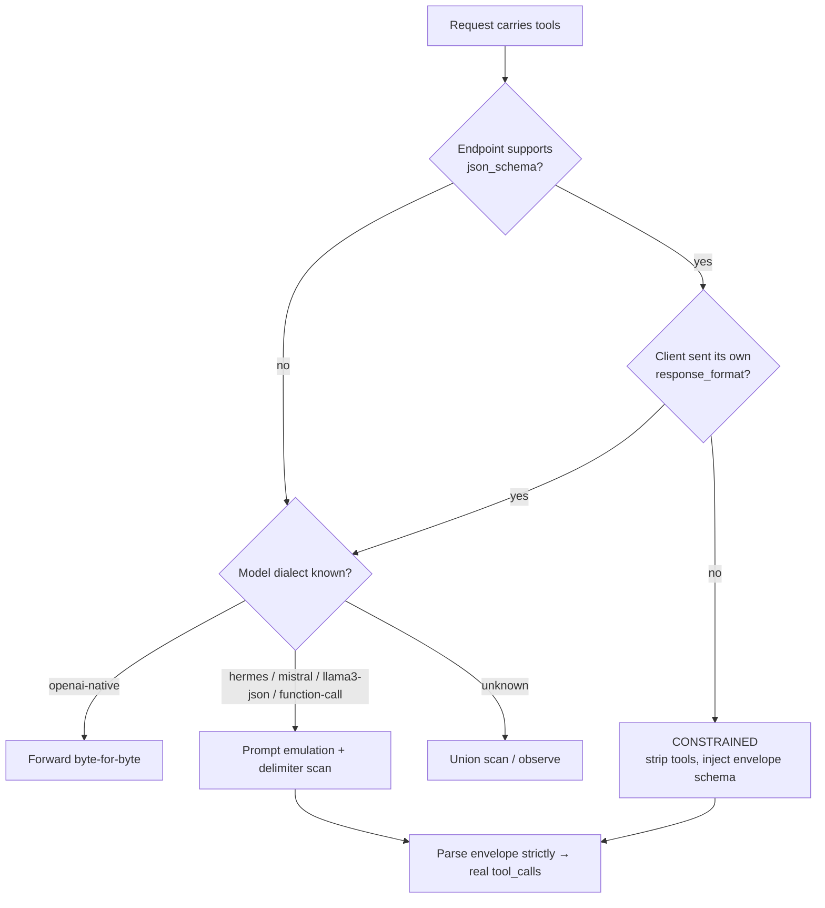

# Universal Tool-Call Normalization: Provider & Model Capability Scanning

> **Status: Phases 0–5 and 8 implemented; Phase 6 partial; Phase 7 proposed.** Dialect registry, capability
> store, endpoint-flavor scanning, tiers 1–4 of dialect detection, the normalizing translator, and
> emulation all ship today. Phase 4 deleted [`unified-api-translation.md`](unified-api-translation.md)
> §4.5's provider-scoped tool-call echo guard and carried its whole test suite forward as the regression
> contract; §4.5 remains the authoritative record of the original incident and root-cause
> investigation. Of Phase 6, the GUI's "Refresh from endpoint" action now triggers the scan and
> per-model dialect display, as one router-side operation (`ManagementFacade.RefreshFromEndpointAsync`)
> that also reconciles the model list itself — see [`docs/gui/provider-management.md`](../gui/provider-management.md)
> for that side of it, which is model-list bookkeeping rather than tool-call normalization proper. The
> operator override shipped alongside Phase 8 (a per-model tool-dialect dropdown writing at
> `DetectionConfidence.Operator` — see Phase 8's "Also shipped" note), so a wrong classification is
> correctable from the GUI. `EnableToolCallGuard` has since been removed (2026-08-25) now that its
> successor is in place; still missing from Phase 6 are the response/telemetry diagnostics. Native
> endpoints (Phase 7) remain proposed only. Phase 8 (constrained decoding) is implemented.

**Goal:** VS Code respects a model's intent to invoke a tool regardless of which provider and model
served it.

## 1. Problem

VS Code Copilot, routed through TotallyHotArcRouter, silently drops a model's intent to invoke a tool
whenever that model doesn't emit a native OpenAI `tool_calls` delta. The operator sees the model's
tool-call template printed as prose, or "Sorry, no response was returned."

The chain is sound everywhere except the last mile:

- The **TotallyHot Spark** VS Code extension declares `capabilities.toolCalling: true` and correctly
  converts `delta.tool_calls` into `vscode.LanguageModelToolCallPart` — the only representation
  VS Code's chat provider API has for a tool call.
- **TotallyHotArcRouter forwards `tools` unmodified.** `RequestInterceptor.BuildCandidate` mutates only the
  `model` field, and `ProxyMiddleware` uses `forwardBody = rewrittenBody` for any provider without a
  request-reshaping translator. Verified by reading, not assumed.

The break is that **a model's tool-call syntax is a property of its chat template, not of the server
hosting it.** The template ships inside the GGUF; the server renders whatever the loaded model
carries. Families diverge:

| Family | Reply framing | Argument key |
|---|---|---|
| Qwen 2.5 / Hermes | `<tool_call>{…}</tool_call>` | `arguments` |
| Mistral | `[TOOL_CALLS]` followed by a JSON array | `arguments` |
| Llama 3.x JSON | bare JSON object, sometimes `<|python_tag|>`-prefixed | `parameters` |
| DeepSeek | dedicated delimiter tokens | still unverified — probed 2026-07-31 and inconclusive, see [`tracked-todos.md`](tracked-todos.md) #3 |
| No tool training | nothing parseable | — |

### 1.1 Why the current guard is insufficient

`ToolCallEchoGuardTranslator` (§4.5) is hardcoded to one family and armed at the wrong granularity:

- **One dialect only.** `ToolCallEchoGuardStreamTranslator.OpenTags` is literally
  `["<tools>", "<tool_call>"]`, and `ToolCallEchoScanner.ExtractToolCalls` requires a top-level
  `name` **and** `arguments`. A Llama-family echo carrying `parameters` fails the shape check; a
  Mistral echo has no matching tag at all.
- **Provider-scoped arming.** `ProviderOptions.EnableToolCallGuard` applies to every model a provider
  serves. One LM Studio process serves many GGUFs, so this simultaneously misses models needing a
  different dialect *and* exposes capable models to false positives — a strong model emitting a
  `<tool_call>` block as a prose **example** gets it rewritten into a real invocation, which is
  routine work for a coding assistant.

§4.5's own root-cause analysis already identifies the correct axis — *"the underlying cause is model
quality, not one specific provider"* — but the implementation landed at provider level because two
distinct ideas were conflated: *don't bind the translator to a hardcoded provider **name*** (correct,
and what "provider-agnostic by design" argues for) versus *scope the **setting** to the provider* (a
separate axis that never got its own analysis).

### 1.2 What cannot be done

VS Code's chat provider API has exactly one representation of a tool call
(`LanguageModelToolCallPart{callId, name, input}`). There is **no channel to tell VS Code "this model
speaks Hermes syntax."** Conveying a dialect to the client is therefore not achievable, and not
useful if it were. The only thing worth conveying is an already-normalized call — which is what Spark
consumes today without modification. Normalization must happen server-side, in TotallyHot.ArcRouter.

That placement is also the right one on its merits: one implementation serves every client (Copilot,
Claude Code, `curl`, other IDEs), TotallyHotArcRouter already owns the translator seam and the streaming
infrastructure, and it is the only component that knows the (provider, model) identity needed to
cache a capability result.

## 2. Settled decisions

| Decision | Choice | Rationale |
|---|---|---|
| Probe timing | Metadata first; lazy detection on the first request that actually carries `tools` | Adding a 50-model provider costs zero inference; models never used for tools are never probed |
| Unknown-dialect fallback | Inject a canonical format and parse it back (full emulation) | The strongest form of "regardless of provider and model" — makes any instruction-following model usable |
| Persistence | Extend the existing SQLite catalog | Derived, refreshable, timestamped data keyed by (provider, model) — structurally identical to model prices |
| Client role | TotallyHotArcRouter normalizes; Spark unchanged except for diagnostic headers | See §1.2 |

## 3. Design

### 3.1 `ToolCallDialect` — declarative, not an enum of families

A dialect is **data**, so adding a model family is a table entry rather than a code path:

```csharp
public sealed record ToolCallDialect(
    string Name,                              // "hermes", "mistral", "llama3-json", "emulated", …
    IReadOnlyList<DialectDelimiter> Delimiters,
    string NameKey,                           // "name"
    string ArgumentsKey,                      // "arguments" | "parameters"
    bool PayloadIsArray,                      // Mistral emits an array after one opener
    string? EmulationSystemPrompt);           // non-null only for the emulated dialect

public sealed record DialectDelimiter(string Open, string? Close);  // Close == null => to end of message
```

This generalizes the two hardcoded dictionaries in `ToolCallEchoGuardStreamTranslator` (`OpenTags`,
`CloseTagByOpenTag`). Built-in dialects ship in a `ToolCallDialectRegistry`; operators can add more
through configuration without a rebuild.

**`FindTopLevelJsonObjects` is kept as-is and reused** (Phase 4 moved it, unchanged, from
`ToolCallEchoScanner` to `JsonObjectScanner` when the rest of that class was deleted). Its brace-balancing,
string-aware, escape-aware scan is dialect-independent and already correct — only the tag framing
above it becomes dialect-driven.

### 3.2 Detection: the first real request *is* the probe

Resolve in cost order:

| Tier | Source | Cost | Confidence |
|---|---|---|---|
| 1 | Ollama `POST /api/show` → returns the literal Go chat template; regex it for known delimiters | free | `template` |
| 2 | LM Studio `GET /api/v0/models` → richer metadata than `/v1/models` | free | `template` |
| 3 | Model-id family match (`qwen*`, `hermes*`, `mistral*`, `llama-3*`, `deepseek*`) | free | `heuristic` |
| 4 | **Observation of the first live tools-carrying request** | free | `observed` |

Tier 4 is the key move: it removes the need for a dedicated probe request entirely. When a model's
dialect is unknown and a request arrives carrying `tools`, TotallyHotArcRouter forwards it **natively and
unmodified** (tools intact) while arming a **union scanner** covering every registered dialect. That
one request classifies the model permanently:

- response carried native `delta.tool_calls` → record `openai-native`; all future requests revert to
  unarmed byte-for-byte passthrough
- a dialect's delimiters matched and yielded a well-shaped call → record that dialect; future
  requests arm only it
- neither, across a configurable number of observations → record `needs-emulation`

No user request pays probe latency, and the first request still works, because the union scanner
catches whatever it emits.

Tiers 1–3 run at provider-add / model-add time so most models are classified before their first
request; tier 4 confirms or corrects them. `observed` outranks `template` and `heuristic`. A
`confidence: 'operator'` value records a manual override that no scan may overwrite — the escape
hatch for a model whose detection misfires.

**Context windows ride along on tiers 1 and 2.** Both probes already fetch documents that carry the
model's context length — Ollama's `model_info` (`{arch}.context_length`, resolved by indirection through
`general.architecture`) and LM Studio's `loaded_context_length` / `max_context_length` — so the resolver
records it alongside the dialect at no extra cost. It is reported to Ollama-shaped clients through
`POST /api/show`; see [`ollama-show-capabilities-plan.md`](ollama-show-capabilities-plan.md).

Three things about that are deliberate and easy to misread as oversights:

- **The window is stored in its own table** (`model_context_windows`), not as a column on
  `model_tool_capabilities`, even though the two share a key and a probe. The request path rewrites
  capability rows without a window to supply, and clearing a dialect override `DELETE`s one — either
  would destroy a probed window if they shared a row. See
  [ADR-0002](../adr/0002-store-probed-model-context-windows-in-their-own-table.md).
- **The confidence ladder does not extend to it.** Window writes are unconditional, last-write-wins.
  The tiers are peers rather than a ranking here, and a model reloaded under a different `num_ctx`
  genuinely has a different window, so a `>=` gate would freeze the first reading forever. The
  invariant that keeps this safe is in the probe: a scan that read nothing writes nothing, so a failed
  re-probe never clears a known value.
- **The window is recorded independently of the dialect.** Several tiers classify no dialect yet read a
  perfectly good window — most notably a template that renders tools in an unregistered dialect, which
  is the single most authoritative context reading available. `ResolveAsync` returns both in a
  `ModelMetadataProbeResult` so no exit path discards one to report the other.

### 3.3 Endpoint flavor scan (provider-level)

On provider add/edit, probe well-known paths reusing the **existing** `DiscoverModelsCoreAsync`
pattern in `ManagementFacade` — same `ProviderCredentialResolver.BuildAuthHeaderValue` /
`ResolveExtraHeaders` credential application, same best-effort `Supported: false` + `Error` shape,
same "a provider that requires an extra header gets it with no provider-specific code" property:

| Probe | Implies |
|---|---|
| `GET {base}/v1/models` | OpenAI-compatible |
| `GET {base}/api/v0/models` | LM Studio native REST |
| `GET {base}/api/tags` | Ollama native |
| `GET {base}/v1/models` with `anthropic-version` accepted | Anthropic-compatible |

**Routing continues to use OpenAI-compatible endpoints only.** The other flavors are recorded and
used *immediately* for tier-1/2 metadata introspection — which is why this scan pays for itself now
rather than being speculative groundwork. Carrying routed traffic over native endpoints is deferred
to Phase 7.

### 3.4 Normalization pipeline

`ToolCallNormalizingTranslator` replaces `ToolCallEchoGuardTranslator`, implementing the same
`IPayloadTranslator`/`IStreamTranslator` seam so `ProxyMiddleware`'s existing streaming/buffered
dispatch, `Content-Length`/`Content-Encoding` stripping, and `isRequestReshapingTranslator` handling
all apply unchanged. Selection moves from `route.EnableToolCallGuard` to a capability-store lookup
keyed on (provider, model).

**Performance rules — all four are load-bearing:**

1. **Arm only when the request carries `tools`.** Today's guard scans every response on a guarded
   route regardless of whether tools were ever sent. Reuse the `JsonObject` `RequestInterceptor` has
   already parsed for the `model` rewrite; do not re-parse the body.
2. **Never install the translator for an `openai-native` model.** Preserves true byte-for-byte
   forwarding for the overwhelmingly common case.
3. **Cheap pre-filter before delimiter matching.** Precompute the distinct first characters of all
   armed openers (`<`, `[`, `{`) and `IndexOfAny` on those before attempting any match.
4. **Bounded pending buffer.** Cap unclassified carried-over text; past the cap, flush it as ordinary
   content. Prevents a stray `<` from holding an entire response in memory.

**Fail-open semantics are preserved exactly** as §4.5 specifies: an unparseable match is forwarded as
raw text with a logged warning, never an exception. This remains a heuristic best-effort rewrite, not
a real upstream protocol error.

### 3.5 Emulation (`needs-emulation`)

For models with no usable native tool calling:

- **Request side:** strip `tools`/`tool_choice`, append a system message carrying the tool schemas as
  JSON plus instructions to reply in one canonical syntax (reuse the Hermes framing so the same
  scanner parses it).
- **Response side:** parse that syntax back into `tool_calls` with `finish_reason: "tool_calls"`.
- **Multi-turn — the part naive implementations get wrong.** Follow-up requests contain
  `role: "tool"` messages and assistant messages carrying `tool_calls`, which a model we have told
  has no native tools will not understand. These must be **rendered back into plain text** in the
  same canonical syntax before forwarding. Without this, emulation works for exactly one turn and
  then degrades. This gets its own dedicated test set.

### 3.6 Diagnostics

Response headers, set pre-flight from the capability store:

- `x-arcrouter-tool-dialect: hermes`
- `x-arcrouter-tool-normalization: native-passthrough | armed | emulated`

**A constraint worth designing around:** on a streaming response, headers flush before the body is
scanned, so the *outcome* (how many calls were synthesized) cannot be a response header. It goes to
the telemetry event and the log, plus an optional SSE comment line
(`: arcrouter tool_calls=2 dialect=hermes`) that conformant clients ignore by spec.

The Spark change is confined to reading these headers and logging them at `debug` alongside its
existing `openai.stream.chunk` lines — no behavioral change.

## 4. Phases

Each phase is independently mergeable and independently testable.

### Phase 0 — Dialect model and registry (pure, no wiring)

New `src/TotallyHotArcRouter/Proxy/Translation/ToolCalling/`: `ToolCallDialect.cs`, `DialectDelimiter.cs`,
`ToolCallDialectRegistry.cs`, `DialectMatcher.cs`. Built-in dialects as shipped: `openai-native`,
`hermes`, `mistral`, `llama3-json`, `function-call`, `constrained`, `emulated`.

> `deepseek` was in this list when the plan was written and is **deliberately not implemented** — its
> delimiters are non-ASCII full-width tokens, and a guessed spelling that never matches is
> indistinguishable from the bug this workstream exists to fix. See the comment in
> `ToolCallDialectRegistry.cs` and tracked TODO #3. `function-call` and `constrained` were added later
> from live observation; see Phase 8.

*Tests:* table-driven across every dialect — well-formed single call, multiple sequential calls,
`arguments` as object vs pre-serialized string, `parameters` key, schema-echo shape correctly
rejected, malformed JSON rejected. No I/O, no mocks.

### Phase 1 — Capability store (SQLite)

Two new tables in `PriceCatalogDatabase.SchemaSql`, keyed on the provider **key** (text) rather than
the numeric `provider_id` — matching the `provider_budgets` precedent and its stated reason ("a
budget can exist for a provider the price catalog has never seen"), which applies identically here:

```sql
CREATE TABLE IF NOT EXISTS provider_endpoint_capabilities (
    provider_key         TEXT PRIMARY KEY,
    openai_compatible    INTEGER NOT NULL DEFAULT 0,
    lmstudio_native      INTEGER NOT NULL DEFAULT 0,
    ollama_native        INTEGER NOT NULL DEFAULT 0,
    anthropic_compatible INTEGER NOT NULL DEFAULT 0,
    scanned_at_utc       TEXT NOT NULL,
    scan_error           TEXT
);

CREATE TABLE IF NOT EXISTS model_tool_capabilities (
    provider_key      TEXT NOT NULL,
    model_name        TEXT NOT NULL,
    dialect           TEXT NOT NULL,
    confidence        TEXT NOT NULL,   -- observed | template | heuristic | operator
    evidence          TEXT,            -- redacted matched snippet or template pattern
    observation_count INTEGER NOT NULL DEFAULT 0,
    detected_at_utc   TEXT NOT NULL,
    PRIMARY KEY (provider_key, model_name)
);
```

New tables need no migration (`CREATE TABLE IF NOT EXISTS` suffices). Any *later* column addition
must follow the explicit-PRAGMA pattern of `PriceCatalogDatabase.MigrateEnabledColumn`, since there
is no migration framework in this repo.

`IToolCallCapabilityStore` + `ToolCallCapabilityStore` with an in-memory cache over the DB, modeled
on `PriceSourceToggleStore`, which already owns exactly this cache-over-SQLite-with-invalidation
shape.

*Tests:* round-trip upsert/read; confidence ranking (`observed` overwrites `heuristic`; nothing
overwrites `operator`); cache invalidation on write.

### Phase 2 — Endpoint flavor scan

`ProviderEndpointScanner`, extracted alongside `DiscoverModelsCoreAsync` so both share credential
application. Wired into `ManagementFacade.UpsertProviderAsync`, best-effort and non-blocking — a scan
failure must never fail a provider save. New `POST /admin/providers/{key}/scan-capabilities`
mirroring the existing `discover-models` endpoint, plus a matching `ProviderMcpTools` entry.

*Tests:* stub `HttpMessageHandler` returning each flavor's shape; assert correct flags, that a
404-everywhere provider records all-false with an error rather than throwing, and that a provider
save still succeeds when the scan fails.

### Phase 3 — Model dialect resolution (tiers 1–3)

`ModelDialectResolver` consuming the Phase 2 flags: Ollama `/api/show`, LM Studio `/api/v0/models`,
then model-id heuristics. Runs on model add and on the capability-scan endpoint, both best-effort —
neither can fail the save that triggered it.

Three decisions the plan above did not settle, each made during implementation:

- **The template is matched against the dialect registry, not against a table of detection regexes.**
  One table means adding a dialect entry buys detection and normalization at once, and makes it
  impossible for the two to drift into disagreeing about what a dialect looks like — which would
  surface as a model detected correctly and then scanned with delimiters that never match.
- **A template that was read and matched nothing is conclusive**, so detection stops there rather
  than falling through to a model-id guess. The lower tiers only ever read a name, and the ground
  truth just read has already contradicted every dialect they could propose. A failed *read* is
  different and does fall through.
- **The LM Studio architecture map is deliberately incomplete.** `llama` is absent: it is reported by
  Llama 2, Llama 3, and the whole population of fine-tunes built on them — including Hermes, whose
  template is not Llama's. Mapping it would write a `confidence: template` row that is wrong for a
  large share of the models carrying it *and* outrank the tier-3 read that gets those right.

*Tests:* `/api/show` fixtures for Qwen, Llama 3, and Mistral; assert dialect + `confidence: template`.
Heuristic fallback by model id, including that a Hermes fine-tune is attributed to Hermes rather than
the base it names. An unknown model writes **no row** — so tier 4 handles it — rather than recording a
wrong guess.

### Phase 4 — Normalization translator (tier 4; replaces the echo guard) *(implemented)*

`ToolCallNormalizingTranslator` / `ToolCallNormalizingStreamTranslator`, built per request by
`ToolCallNormalizerFactory`. Selection in `ProxyMiddleware` moved from `route.EnableToolCallGuard` to
a capability-store lookup, and the echo-guard classes were deleted. All four performance rules in
§3.4 are implemented; rules 1 and 2 live in the factory, because the cheapest scan is the one never
installed. `RouteCandidate.CarriesTools` is read off the `JsonObject` `RequestInterceptor` had already
parsed, so rule 1 costs nothing.

`ProviderOptions.EnableToolCallGuard` was retained for one release as a forced-on override — it armed a
route even with no `tools` in the request and even for an `openai-native` model — before being removed
(2026-08-25) now that arming is entirely per-(provider, model).

Four decisions the plan above did not settle, each made during implementation:

- **An unmatched response records nothing.** The plan proposed condemning a model to `needs-emulation`
  after several unmatched tools-carrying responses. That is *not* implemented, and should not be: the
  overwhelmingly common response to a tools-carrying request is prose, because the model had no reason
  to call a tool. At this layer "chose not to call a tool" and "cannot call tools" produce identical
  evidence, so such a counter would downgrade well-behaved models for answering questions. Only a
  native `tool_calls` field or a matched dialect is recorded. Selecting emulation needs a signal this
  phase does not have, and moves to Phase 5 — which found it in the chat template itself rather than in
  response text, for the reason given there.
- **An unconfirmed classification still arms the union**, with the believed dialect ranked first.
  Arming only a `template`/`heuristic` guess would make a wrong guess permanent, because the evidence
  that would correct it is exactly what a single-dialect scan discards — which contradicts §3.2's
  "tier 4 confirms or corrects them." An `observed` or `operator` row arms only its own dialect and
  stops observing.
- **A close-less region is resolved on the chunk carrying `finish_reason`**, not in `Flush`. Mistral's
  `[TOOL_CALLS]` has no closing token, so the region can only end when the message does. Deferring to
  `Flush` would emit `finish_reason: "stop"` first and the synthesized call after it, which a client
  reading the finish reason as end-of-turn has every right to act on.
- **Native `tool_calls` mid-stream disarms the scanner for the rest of the response**, and any text
  held back at that moment is handed back verbatim rather than run through the region logic. A model
  that has just proved it speaks the protocol must not have its prose *example* of a call extracted —
  that is the exact false positive per-model arming exists to prevent.

*Tests:* `ToolCallNormalizingTranslatorTests` carries the entire former `ToolCallEchoGuardTranslatorTests`
suite forward — including the live-captured token-by-token LM Studio fragment sequence — as the
regression contract for the original incident. Added: Mistral and Llama-3 classification (the dialects
the echo guard could not see), native `tool_calls` recorded as `openai-native` and left untouched,
one classification per response rather than one per call, a prose answer recording nothing, the
bounded-buffer abandonment, and three end-to-end tests through the real `ProxyMiddleware` covering
arming by `tools`, no arming without them, and the legacy flag. `ToolCallNormalizerFactoryTests`
covers the arming decision on its own.

### Phase 5 — Emulation *(implemented)*

`ToolCallEmulatingTranslator` pairs a new request rewriter (`ToolCallEmulationRewriter`) with the
Phase 4 response path *unchanged* — emulation teaches the `emulated` dialect precisely because its
framing is one the existing scanner already reads, so a taught reply and a native Hermes reply travel
the same code. The rewriter strips `tools`/`tool_choice`/`parallel_tool_calls`, appends the dialect's
instruction preamble plus the serialized schemas to the system prompt, and re-renders tool-calling
history into text.

Four decisions the plan above did not settle, each made during implementation:

- **Emulation is selected by a template that renders no tools, not by counting unmatched responses.**
  This is the signal Phase 4 deliberately did without. When tier 1 reads a model's literal Ollama
  chat template and finds no registered dialect's framing **and** no `.Tools`/`.ToolCalls` reference
  at all, the model has no path by which a tool schema could reach it — that is mechanical, read off
  the artifact, not inferred from behavior, which is exactly what disqualified Phase 4's proposed
  counter. The `.Tools` half is load-bearing in the other direction: a template can support tools in
  framing this build has not registered (DeepSeek today), and emulating *that* would strip the native
  tool support it actually has. Such a model still writes no row and falls to tier 4.
- **A taught reply is never recorded as an observation.** When a model emits `<tool_call>` because
  TotallyHotArcRouter's own injected prompt told it to, recording that as `observed`/`hermes` would outrank
  the `emulated` row that produced the instructions — so the next request would arrive un-emulated,
  the instructions would be gone, and the model would emit nothing. A classification that erases the
  reason it was made. `ToolCallNormalizationPlan.IsEmulating` suppresses the dialect write while
  still recording a native `tool_calls` response, which is the one piece of evidence an emulated
  request cannot manufacture and the signal that this model should never have been emulated.
- **"Reshapes the request" and "owns the upstream URL" became two axes.** Every translator before this
  did both (Gemini) or neither (`IResponseOnlyTranslator`). Emulation rewrites the body heavily while
  still addressing the same OpenAI-compatible endpoint on the client's own path, so it gets a second
  marker, `IClientPathTranslator`, rather than being forced through `BuildRequestUri` — which never
  sees that path and would silently drop a provider's `/v1` prefix.
- **Arming for emulation also triggers on tool-calling *history*, not only on `tools`.** §3.4's rule 1
  asks whether there is anything to scan for; emulation additionally has to clean up a conversation
  that already contains `role: "tool"` messages, which is true of a follow-up turn whether or not the
  client re-offered its tools. `RouteCandidate.CarriesToolHistory` is read off the same already-parsed
  body. Guarding on `tools` alone would reintroduce a version of the very "works for exactly one turn"
  failure this phase exists to prevent.

Bounded overhead is enforced at 16 KiB of injected schema, dropping **whole** tools at the boundary
and logging how many — a truncated schema is worse than an absent one, because the model would
confidently call a tool with a signature it half-read.

#### The prompt is measured, not written

Tuned against a live LM Studio serving `qwen2.5.1-coder-7b-instruct` — the original incident model —
over a fixed five-scenario probe (single call, call with arguments, pick-one-of-three, a question
needing *no* tool, and two calls at once), three runs each at temperature 0. Three hand-written
prompts scored **3/15**, and in every case the three passes were the negative scenario, which passes
by doing nothing:

| Prompt | Score | Failure |
|---|---|---|
| Plain English, `<tool_call>` shown inline | 3/15 | Correct JSON, **no delimiters at all**, every run |
| Same, plus "the tags are literal" and a worked example | 3/15 | Identical, and added code fences |
| Qwen wording, schemas **not** wrapped in `<tools>` | 3/15 | Code fences; invented a `function_calls` wrapper |
| **Qwen/Hermes template wording, near-verbatim** | **15/15** | — |

The measurements are preserved as recordings, and **no test requires a live server**. Four fixture sets
divide the evidence by the question each answers:

| Fixture | Question it answers | Replayed by |
|---|---|---|
| `RecordedModelTranscripts` | Can this model be *taught* to call tools? | `ToolCallEmulationReplayTests` |
| `RecordedNativeToolCallProbes` | Does anything happen if we just *send* the tools? | `NativeToolCallProbeTests` |
| `RecordedStreamTranscripts` | Does the same hold token-by-token, across chunk boundaries? | `ToolCallEmulationStreamReplayTests` |
| `ToolCallEmulationCaptureTests` | Why is the prompt worded the way it is? | itself |

The first holds complete upstream responses to the five scenarios captured through the shipped rewriter.
The second holds the same five asked with `tools` forwarded untouched — separate because conflating them
is how a model that *silently ignores* tools gets mistaken for one that considered them and declined; read
`prompt_tokens`, not the prose. The third stores each streamed reply as its ordered `delta.content`
sequence rather than raw SSE (1.9 MB, almost all reasoning tokens), which is lossless for this purpose
because the stream translator reads only `delta.content` and `delta.tool_calls`. The fourth holds the
individual replies that decided each wording choice — the bare JSON, the `<tools>`-tagged call, the
invented `<json>` tag, the code fences — and asserts what each does or does not yield.

Two findings came out of the second model recorded (2026-07-31):

- **LM Studio's empty `tool_calls` is buffered-only.** It attaches `"tool_calls": []` to every buffered
  message — the quirk that mis-classified an entire provider — and omits the field entirely when
  streaming. Zero of ten recorded streams carried it. The stream translator already assumed this in a
  comment; it is now measured.
- **Buffered and streamed replies to the identical request differ**, at temperature 0, with only `stream`
  changed. A streamed transcript therefore cannot be derived by re-chunking a buffered one — each path
  has to be recorded from its own request.

**Evaluating a different model** means recording it, not pointing a test at it: load it, replay
`ToolCallEmulationScenarios.All` through `ToolCallEmulationRewriter`, store the response bodies verbatim,
and add a `RecordedModelTranscript`. The replay theory picks it up with no other change. A transcript
that *fails* is a finding worth keeping — it says emulation does not work for that model — so record it
and assert the failure rather than dropping it. `RecordedModelTranscript.EmulationFailures` is how: it
maps each failing scenario to what the pipeline *actually* yields, so the theory asserts both that the
behavior is unchanged and that it still differs from the expectation — a later prompt fix breaks the test
and forces the stale entry out. `DeepSeekR1DistillQwen7B` is the worked example, failing four of five
scenarios with a different invented framing each time.

The limit is worth stating: replay proves the code still handles what these models actually said, so any
change to the prompt, delimiters, schema format, or scanner that would have broken them breaks the build.
It cannot prove a *new* prompt works, because the recorded replies were produced by the current one. That
question needs a live model and a fresh recording.

Three findings, each now pinned by a test:

- **Novel phrasing loses to phrasing the model has seen in training.** The plain-English prompts
  produced the right call with no framing on every single run — the exact bug this workstream exists
  to fix, reproduced by our own prompt. The emulated dialect therefore *borrows* the Qwen template's
  instruction text rather than inventing better prose. Rewriting it is a change that must be
  re-measured, not reasoned about.
- **The `emulated` dialect needs both Hermes delimiters.** Told to wrap schemas in `<tools>` and reply
  in `<tool_call>`, the model deterministically replied in `<tools>` — the tag it had just seen
  framing JSON, the same blending §4.5 documents. With only `<tool_call>` registered the winning
  prompt scores 3/15; with both, 15/15. Removing the `<tools>` wrapper to avoid the blend was tried
  and is worse (the model invents `<json>` or falls back to a fence).
- **Schemas keep their `{"type":"function",…}` wrapper.** The first implementation stripped it as
  "pure protocol overhead carrying nothing a model needs". Bare function objects score 12/15 and push
  the model into inventing tags. The wrapper is not information for the model, it is a shape the model
  recognizes, and those are not the same thing.

#### A Phase 4 bug this probe exposed

LM Studio emits `"tool_calls": []` on **every** non-streaming response, prose included. Phase 4's
native check was `message["tool_calls"] is not null`, so an empty array read as a native tool call:
normalization was skipped for that response, and — far worse — `openai-native` was recorded at
`observed` confidence, the highest automatic tier, which no template or model-id scan may overwrite.
**One non-streaming request permanently disabled tool-call normalization for that model, including
for the streaming clients that were working.** Both translators now require `Count > 0`. Streaming
deltas from LM Studio omit the field entirely, so that half was not broken in practice, but the two
paths must agree about what a native call is.

*Tests:* `ToolCallEmulationTests` covers the full two-turn round trip through the real `ProxyMiddleware`
— request with `tools` → emulated prompt → model text reply → synthesized `tool_calls` → client sends
`role: "tool"` result → history correctly re-rendered on the next outbound request — plus `tools` never
reaching the upstream, the client's path surviving, the bounded injection budget, consecutive tool
results merging into one `user` message (many local templates require alternating turns), and the two
guards above: a taught reply recording nothing, and a native reply still recording.

### Phase 6 — Diagnostics and GUI *(partial)*

**Shipped:** "Refresh from endpoint" in Governance → Providers now runs
`ManagementFacade.RefreshFromEndpointAsync` — a single router-side operation, not the GUI orchestrating
separate calls — which persists the endpoint-flavor scan and tiers 1–3 dialect detection for every model
on that provider, alongside reconciling the model list itself (added/removed models — see
[`docs/gui/provider-management.md`](../gui/provider-management.md) for that part).
`ManagementFacade.BuildProvidersResponse` reads those results on every provider-list projection, so
`ProviderView.EndpointCapabilities` and `ModelView.Dialect`/`Confidence` are populated wherever a
`ProvidersResponse` goes out — REST, MCP, and the GUI, which renders them as badges on the provider card
(endpoint flavors) and each model row (dialect). The narrower `ScanCapabilitiesAsync`/`scan-capabilities`
route this rode on is kept as an independently callable building block, but the GUI itself now calls only
the consolidated `refresh-from-endpoint` route.

**Not shipped:** response headers and telemetry fields on `RoutingTelemetryEvent`. The operator
override this section originally listed as the larger remaining piece has since shipped — with
Phase 8, not here (see that phase's "Also shipped" note). `EnableToolCallGuard` itself has since been
deleted (2026-08-25). Spark does not yet read any header into its debug log.

*Tests:* `ScanCapabilitiesTests` covers the capability/dialect fields surfacing through
`ListProviders()`; `RefreshFromEndpointTests` covers the consolidated operation's model-list
reconciliation and its capability/dialect side; `ProviderAdminClientTests` covers the client
(de)serializing them and both the `scan-capabilities` and `refresh-from-endpoint` requests. Still
missing: header presence/values per capability state, and a GUI admin test for the operator-override
path.

### Phase 7 — Native endpoints *(design now, build later)*

`IProviderEndpointAdapter` seam so LM Studio native and Anthropic-compatible endpoints can carry
routed traffic, not just supply metadata. Recorded as design intent with no implementation.

### Phase 8 — Constrained decoding *(implemented)*

The correction Phases 4 and 5 could not make. Both **ask** a model to reply in a syntax: Phase 4 guesses
which one it will choose, Phase 5 teaches it one. Neither can make it comply. Measured live against
`qwen2.5-coder-7b-instruct-ghidra-v2`, one identical request produced three different shapes across three
runs — a native `tool_calls` field, a `<function-call>` wrapper, and bare undelimited JSON. Registering a
dialect per observed framing is a race that cannot be won: the third shape has no framing to register, and
a delimiter-less scan would fire on any JSON-shaped prose.

Constrained decoding removes the choice instead of predicting it. The request carries a
`response_format` JSON-schema envelope and the server's own sampler (llama.cpp GBNF under LM Studio,
the equivalent under Ollama) makes any other shape unrepresentable. This is what LiteLLM does for Ollama
— *"litellm defaults to json mode tool calls if native tool calling not supported"* — and it is the one
place LiteLLM's design is measurably better than what this document had specified.



The envelope is `{"content", "tool_calls"}`, and the shape is load-bearing. A schema describing only a
call would make *declining* unrepresentable, forcing a grammar-constrained model to invent one — turning
the false-positive risk §3.4 guards against into a certainty. With `tool_calls` present but allowed to be
empty, declining is legal: asked for a haiku with two tools offered, the model returned prose and
`"tool_calls": []`.

Each call is **one branch of a `oneOf`, with its name pinned by `const` beside its own argument schema**.
A hallucinated tool name is therefore not detected-and-rejected after the fact — it is unreachable in the
grammar, and so is a real name carrying the wrong tool's arguments. The flatter shape this replaced (a
shared `name` enum and a `oneOf` of argument schemas as sibling properties) looked equivalent and was not:
siblings have no discriminator, so `{"name": "get_weather", "arguments": {"timezone": "UTC"}}` satisfied
every constraint. Binding the two structurally is what makes the pairing a property of the grammar rather
than something the injected prompt has to be trusted for.

**A grammar constrains shape, not semantics — both halves are required.** The schema is compiled by the
server and never enters the model's context. Asked to read a file under a schema naming `read_file` but
with no tool descriptions in the prompt, the model emitted a flawlessly-shaped envelope containing
*fabricated file contents* and an empty `tool_calls`. Constrained mode therefore reuses Phase 5's measured
instruction block verbatim and constrains to exactly the tools that block described — the injection budget
can drop trailing tools, and a grammar naming a tool the prompt never mentioned is a mismatch in the other
direction.

Streaming decodes the envelope's `content` incrementally (`EnvelopeContentScanner`) rather than buffering,
because agent-mode clients attach tools to nearly every request, so buffering would make *most* replies
arrive in one lump. A real JSON walk, not a search for `"content":`, since that key can legally appear
inside a tool argument.

Selection is "prefer it wherever the endpoint supports it", so it is self-configuring. It is held back
only where constraining would be wrong: the client already set `response_format` (theirs wins — silently
replacing a caller's structured-output contract is worse than the bug), the model is known
`openai-native`, or an operator pinned something else.

**Also shipped: the operator override** (`PUT /admin/providers/{key}/models/{modelName}/tool-dialect`,
plus a dropdown in Governance → Providers) — LiteLLM's `register_model(..., supports_function_calling=…)`
equivalent, closing [`backlog.md`](backlog.md)'s missing-GUI-surface item. It exists because automatic
detection has a **self-sealing failure mode**: a model that emits a real `tool_calls` field on only *some*
replies is recorded `openai-native` at `observed` on the first lucky one, after which performance rule 2
stops arming it — so no later reply is inspected, no contrary evidence is ever collected, and the
misclassification can never correct itself. This was not hypothetical; it is what was actually wrong with
`qwen2.5-coder-7b-instruct-ghidra-v2` when constrained decoding was first switched on, and it is why
registering the `function-call` dialect alone had not fixed the original report. Making that
self-correcting automatically is left open — see tracked TODO.

*Live verification:* the same five-run repro that produced 1/5 correct tool calls produced **5/5** under
constrained decoding, with prose still streaming incrementally (21 separate `delta.content` chunks) and no
spurious call on the no-tool-needed question.

## 5. Prerequisite

[`backlog.md`](backlog.md) item 1 — `ManagementFacade`'s `MergeProvider`/`WithEnabled` silently
dropping provider fields — should land before or alongside Phase 2. Both phases add provider-level
state through the same write paths that currently drop fields, so building on them unfixed
reproduces the same class of bug in new fields.

## 6. Verification

**Unit/integration:** `dotnet test` at each phase boundary. Phase 4's ported echo-guard suite is the
key regression gate — if the live-captured LM Studio fragment sequence stops passing, the
generalization broke the original fix.

**Live end-to-end**, reproducing the incident §4.5 documents:

1. LM Studio serving `qwen2.5.1-coder-7b-instruct` (the original repro) — VS Code Copilot through
   Spark must execute a tool rather than print JSON. Confirm the capability row records
   `hermes` / `observed`.
2. A native-capable model on the **same** LM Studio provider — confirm `openai-native`, no translator
   installed, byte-for-byte passthrough preserved. This is the case provider-level arming got wrong,
   so it is the headline proof.
3. A model with no tool training at all — confirm emulation drives a successful multi-turn tool
   exchange.
4. A paid OpenAI/Anthropic route — confirm zero behavioral change and no added latency.

**Negative test:** ask a capable model to *explain* Qwen's tool-call format. Its `<tool_call>` example
must render as text, not fire a tool. This is the false-positive case provider-wide arming causes,
and the clearest single demonstration of why detection must be per-model.

