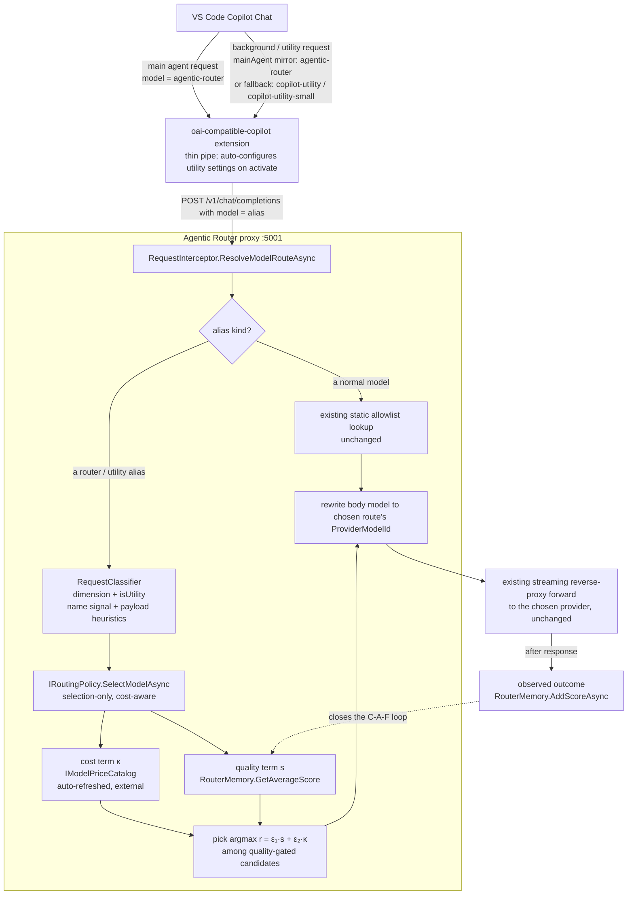

# Utility-Model Routing under BYOK

Status: **Plan / not yet implemented**
Scope: **two repos** — the proxy (this repo) and the VS Code extension (`spark-vscode-extension`, published as `davidpizon.oai-compatible-copilot`).

## Context

The `oai-compatible-copilot` extension registers a **single** language-model chat provider (vendor `oaicopilot`) that exposes one model to GitHub Copilot Chat and forwards its traffic to the Agentic Router proxy at `http://127.0.0.1:5001/v1`. From VS Code's perspective this single model is a **BYOK (Bring Your Own Key)** main agent.

When that BYOK model is selected as the main agent, VS Code Copilot Chat shows:

> **No utility model is configured for 'copilot-utility-small' while the selected main agent model is BYOK.**

### Why it happens

Copilot Chat does not send every request to the main agent model. For **background/auxiliary work** — chat-title generation, intent detection, commit-message summaries, agent-mode multi-turn scaffolding — it uses lightweight "utility" models. With a normal GitHub-hosted Copilot account those utility models are GitHub-provided. Once the main agent is a BYOK model (and especially when signed out of the Copilot backend), VS Code loses access to those defaults and instead demands an explicitly designated fallback for two tiers:

1. **`chat.utilityModel`** — general background workflows.
2. **`chat.utilitySmallModel`** — lightweight tasks (intent detection); this is the `copilot-utility-small` identity named in the error.

If neither is configured while running BYOK, Copilot raises the "No utility model is configured" error and the affected background workflow fails. `copilot-utility-small` is VS Code's **internal utility identity**, not a model our stack defines.

> ⚠️ **Verify before implementing.** The setting names `chat.utilityModel`, `chat.utilitySmallModel`, and `chat.byokUtilityModelDefault`, and the exact value format they expect (bare id vs. `vendor/family/id`), are newer than this author's knowledge and were **not** web-verified for this plan. Confirm them against the installed VS Code version (`Preferences: Open Settings (JSON)` + search `utility`, or the VS Code release notes / `chatProvider` proposed-API changelog) as **step 0** of implementation. The design below is structured so that whichever mechanism VS Code actually exposes plugs into the same fallback chain.

## Goals

- **Zero UI prompts.** A user who installs the extension and selects the Agentic Router model should never see the utility-model error.
- **Credentials stay in the proxy.** The extension remains a thin pipe; all provider keys, cost tracking, and model selection stay server-side.
- **Cost-optimized background traffic.** Lightweight utility calls (e.g. a 3-word chat title) must not drain an expensive main-agent model — the proxy should route them to the cheapest backend that still does the job acceptably.
- **Ground the decision in real data, not hand-maintained config.** The routing choice must be driven by recently-fetched price data — or not made at all (see "Cost signal" below).
- **Reuse existing machinery.** Build on the existing allowlist resolver, `RouterMemory`, and the (currently-dormant) `AgentAsARouter` engine rather than inventing a parallel path.

## Requirements

### R1 — Utility aliases must self-route (normative)

> **IF** the VS Code extension sends utility traffic under the model name `copilot-utility` or `copilot-utility-small`, **THEN** the proxy MUST automatically route that request to the best lightweight, cost-efficient utility model available — **without any operator configuration mapping the alias to a concrete backend.**

This is the acceptance criterion for the whole utility path. Concretely, the proxy:

1. **MUST NOT reject the request.** Today an unrecognized `model` is rejected with HTTP 400 by `RequestInterceptor.ResolveModelRouteAsync` (`src/TotallyHotArcRouter/Proxy/RequestInterceptor.cs`) → `ProxyMiddleware.WriteModelNotFoundResponseAsync` (`src/TotallyHotArcRouter/Proxy/ProxyMiddleware.cs`). A utility alias MUST bypass that allowlist rejection.
   > **Generalized statement of this decision — IMPLEMENTED (2026-07-25):** whenever the proxy is **not** running in single-model serving mode (`SingleModelServingOptions.ForcedModelName` unset — see the constructor validation in [`RequestInterceptor`](../../src/TotallyHotArcRouter/Proxy/RequestInterceptor.cs)) and the caller's `model` does not match any configured `ModelList` entry, the proxy accepts the request and hands it to agentic routing rather than rejecting it with 400. The router alias (`agentic-router`) and the utility aliases (`copilot-utility`, `copilot-utility-small`) are the two named shapes of "unresolved model" this plan enumerates, but the rule is general: *any* not-found model name, outside forced single-model mode, is a routing decision — not a hard error. Single-model serving is the one mode where an unconfigured name still fails, since it force-routes to one operator-chosen model by design (see `RequestInterceptor`'s constructor validation).
   >
   > **What shipped, concretely** (`RequestInterceptor.TryAgenticallyRouteUnresolvedModel`, `RequestInterceptor.cs`): when `TryResolve` fails and single-model serving isn't forced, every currently-configured model (`IModelRouteResolver.ListModels()` — the pick can never escape the allowlist, satisfying requirement 4 below) is ranked by `RouterMemory.GetAverageScore` under a single fixed dimension (`RequestInterceptor.AgenticFallbackDimension = "unresolved-model-fallback"`), and the highest scorer wins; cold start (no scores yet, or no `RouterMemory` supplied) deterministically picks the first configured model. **This is intentionally the minimal slice, not the full plan**: there is no `RequestClassifier`, no per-tier (`copilot-utility` vs `copilot-utility-small`) weighting, and no cost signal (`IModelPriceCatalog`/κ) feeding the ranking — every unresolved name, utility or not, is scored identically under the one dimension. `UtilityRoutingPolicy` (requirement 3 below), the tier distinction, and the cost-aware selection remain the open follow-up work items 2–6 describe. Tests: `RequestInterceptorTests.cs` (`ResolveModelRouteAsync_UnknownModel_*`), `ProxyMiddlewareTests.InvokeAsync_UnknownModel_ModelsConfigured_AgenticallyRoutesToConfiguredModel_AndCallsUpstream`.
   >
   > **The reserved `auto` name — IMPLEMENTED (2026-07-29):** the fallback above is a *recovery* from a name we didn't recognize. `"model": "auto"` (matched case-insensitively, `RequestInterceptor.AutoSelectModelName`) is the way a client asks for that same selection **deliberately**. It skips the `ModelList` lookup entirely and runs the identical ranked auto-select, so `auto` needs no `ModelList` entry and — because the check precedes `TryResolve` — a configured model literally named `auto` cannot shadow it. Two consequences worth stating: single-model serving still wins (`_forcedModelName` overwrites `model` before the check, so a `--model`-forced proxy serves its one model and never auto-selects), and when no model is currently eligible (every provider stopped or every circuit open) the request fails with an auto-select-specific message instead of "unknown model". `auto` is deliberately **not** advertised by `GET /v1/models`, which lists only real routable models. Tests: `RequestInterceptorTests.ResolveModelRouteAsync_AutoModel_*`.
2. **MUST NOT require a hand-authored `ModelList` entry** mapping the alias to a specific model. The alias is a *request for a decision*, not a static route. (This is exactly why the interim `copilot-utility-small → claude-haiku-4-5-20251001` entry is a stopgap to be removed — it satisfies #1 while violating #2.)
3. **MUST make the choice dynamically** via `UtilityRoutingPolicy` (B3) — cost-aware, quality-gated, grounded in the price catalog + `RouterMemory`, and only on prices fresher than 24h.
4. **MUST resolve to an allowlisted route** and rewrite `model` → that route's `ProviderModelId`, so the existing forwarder and the "never route back to the proxy itself" invariant are preserved.
5. **MUST recognize the alias case-insensitively**, matching `ModelRouteResolver`'s existing `OrdinalIgnoreCase` lookup semantics.
6. **MUST degrade safely for unknown tiers.** VS Code owns these identities and may add more (`copilot-utility-*`). Recognition is therefore the configured `UtilityAliases` list **plus a `copilot-utility` prefix rule as a safety net**, so a tier this plan never saw routes as utility rather than 400-ing. An unknown tier is a routing decision, not an error.

#### Tier distinction

The two known aliases are **not** equivalent, and the policy SHOULD treat them differently rather than collapsing both to one answer:

| Alias | VS Code setting | Workload | Policy treatment |
|---|---|---|---|
| `copilot-utility` | `chat.utilityModel` | General background workflows | Utility dimension, standard cost/quality balance |
| `copilot-utility-small` | `chat.utilitySmallModel` | Lightweight (intent detection, titles) | Stronger cost weight and/or lower quality bar — the cheapest tier |

Implement this as a per-tier `(ε₁, ε₂)` weight pair and quality threshold rather than two separate policies; the selection logic is identical, only the weighting differs.

> **Scope note.** R1 is conditional ("IF the extension sends…") because it covers the **fallback** extension path (explicit `chat.utilityModel`/`chat.utilitySmallModel` → distinct ids). Under the *preferred* path (`byokUtilityModelDefault: "mainAgent"`) utility traffic arrives as `agentic-router` and is classified by payload heuristics instead (B2). **Both paths must work** — R1 must hold regardless of which mechanism the installed VS Code ends up supporting, and it is the one that survives if assumption 1 or 2 turns out badly.

## Non-goals

- Full productionization of the `AgentAsARouter` research engine (execution-grounded verifier, memory-driven per-dimension exploit/explore) for *all* traffic. This plan wires **selection-only** routing for the utility/router-alias path and leaves the richer engine as a follow-up.
- Changing how normal, explicitly-named model requests (e.g. `gpt-5.4`, `claude-sonnet-5`) are handled — those keep flowing through the existing static allowlist unchanged.

## Design decisions (locked)

| Question | Decision |
|---|---|
| Doc location | `TotallyHot-ArcRouter/docs/router/` (this file) |
| Scope | **Both** extension auto-config **and** proxy handling |
| Extension mechanism | **Both, with fallback**: prefer `chat.byokUtilityModelDefault: "mainAgent"`; fall back to writing explicit `chat.utilityModel` + `chat.utilitySmallModel` when that key is unsupported |
| Proxy routing | **Feed utility requests into smart routing** — select the cheapest appropriate backend rather than a hard-coded single model |
| Cost signal | **Auto-refreshed price catalog** ([`model-price-catalog.md`](model-price-catalog.md)) for cost (κ) — aggregator-sourced rows fresher than 24h (that doc's D1), plus a known 0 for `IsFree` providers — + **`RouterMemory`** for observed quality (s), combined via the paper's reward |
| Cold start | **Bootstrap the ranking from aggregator-sourced catalog prices**, then let observed feedback refine it |
| Fitness metric | **Cost-aware, quality-gated** — cheapest model that still scores acceptably on the utility dimension |

### Cost signal: real prices or none

**There is exactly one cost signal:** aggregator-sourced catalog prices fetched within the last 24h ([`model-price-catalog.md`](model-price-catalog.md)'s D1), plus a known 0 for a provider flagged `IsFree`. There is no fallback table to fence off — TotallyHotArcRouter used to carry a hand-maintained `Pricing` section in `appsettings.json`, and it was **deleted** rather than demoted to a display-only layer.

That deletion is this section's argument, now settled in code. The table self-described as *"Illustrative placeholder values, not verified against current provider price sheets."* Ranking models on hand-maintained placeholder numbers would have been a **static heuristic wearing a smart-routing label** — precisely the baseline the TotallyHotArcRouter paper (see [`../research/paper-notes.md`](../research/paper-notes.md)) shows is beaten by loop-complete adaptive routing and collapses under distribution shift. So the numbers are gone, and with them the risk that a later change quietly readmits them through a fallback path.

What remains is the distinction the router must still get right: **"cheap" and "unknown" are not the same answer.** A model the catalog has no fresh price for is *unpriced* — excluded from cost ranking, reachable only via exploration — rather than ranked as though its cost were zero or guessed. Cost display and the routing decision now read the same source and give the same answer, so no separation-of-concerns carve-out is needed; the only asymmetry left is staleness, where telemetry will show a price of any age (annotated with how old it is) and the router won't touch anything past 24h.

### Key interaction to understand

The preferred extension mechanism (`byokUtilityModelDefault: "mainAgent"`) makes VS Code send utility traffic **as the main agent model** — i.e. the proxy receives them under the same model id as normal chat (`agentic-router` by default). **In that path the proxy cannot distinguish "utility" from "normal" by model name alone.** The fallback mechanism (explicit `chat.utilityModel`/`chat.utilitySmallModel` → dedicated ids) *does* give the proxy a distinct name.

The synthesis that satisfies both decisions:

- The proxy treats a designated **router alias** (default `agentic-router`) as a signal to run **dynamic selection** instead of a static allowlist lookup. All `agentic-router` traffic — normal *and* mainAgent-mirrored utility — flows through the selection policy, which naturally routes lightweight requests to cheap backends.
- When the fallback path is active, the proxy additionally recognizes dedicated **utility aliases** (`copilot-utility`, `copilot-utility-small`) as an *explicit* "this is utility, force the cheapest-tier policy" signal.
- A lightweight **request classifier** (payload heuristics) lets the router recognize utility-shaped requests even in the mainAgent-mirrored path where the name is ambiguous.

> Note: `agentic-router` is **not** in the proxy's `ModelList` today, so a default-config request (`oaicopilot.modelId = "agentic-router"`) would currently be rejected with HTTP 400. Introducing router-alias handling is therefore required for the out-of-the-box configuration to work at all — not merely a utility nicety.

> Interim state to reconcile: earlier in development a **static** `copilot-utility-small → claude-haiku-4-5-20251001` entry was added to `src/TotallyHotArcRouter/appsettings.json` and the live `bin/.../model-routing.json`. That hard-codes in config exactly the decision this plan moves into the router, so it should be **removed** once dynamic selection ships (keep it only until then, as a stopgap that stops the error).

## Architecture

The critical structural point: **selection is decoupled from generation.** The existing streaming forward path in `ProxyMiddleware` stays intact; the router only *chooses the target model id* and hands back to the normal forwarder.

## Part A — Extension changes (`spark-vscode-extension`)

**Files:** `src/extension.ts` (activation), `package.json` (new config contributions), plus a small new helper module (e.g. `src/utilityModelConfig.ts`).

1. **Auto-configure on activation.** In `activate()` (`src/extension.ts:9`), after registering the provider, run a one-time (idempotent) reconciliation that ensures VS Code has a utility model designated whenever the Agentic Router model is the active BYOK agent:
   - **Preferred:** if `chat.byokUtilityModelDefault` exists in the running VS Code's configuration schema, set it to `"mainAgent"` (global scope) so utility tasks reuse the Agentic Router model. One setting, no id-string matching, and it feeds the proxy's router alias.
   - **Fallback:** if that key is not recognized, write `chat.utilityModel` and `chat.utilitySmallModel` pointing at this extension's model. The value format must match what VS Code expects (bare model id vs. `oaicopilot/<family>/<id>` — **verify**).
   - Detect key support via `vscode.workspace.getConfiguration().inspect("chat.byokUtilityModelDefault")` returning a defined `defaultValue`, rather than assuming.
2. **Respect user overrides.** Only write a setting when it is unset/empty (`inspect()` shows no user/workspace value). Never clobber an explicit user choice. Gate the whole behavior behind a new opt-out setting, e.g. `oaicopilot.autoConfigureUtilityModel` (default `true`).
3. **Expose utility model(s) if the fallback path requires it.** If VS Code requires the referenced utility model to be *advertised by a provider*, extend `prepareLanguageModelChatInformation` (`src/provideModel.ts:52`) to also return `copilot-utility` / `copilot-utility-small` entries (marked non-default, `isUserSelectable: false`), each carrying the alias as its `id` so the proxy receives the distinct name. Only needed for the fallback path — confirm during the setting-name verification.
4. **Re-run on relevant config change.** Extend the existing `onDidChangeConfiguration` handler (`src/extension.ts:62`) to re-reconcile if `oaicopilot.modelId`, `oaicopilot.autoConfigureUtilityModel`, or the `chat.*utility*` keys change.

## Part B — Proxy changes (`TotallyHot-ArcRouter`)

### B1. Router alias + config

- Add a `ModelRouting.RouterAlias` option (default `"agentic-router"`) and an optional `ModelRouting.UtilityAliases` list (default `["copilot-utility", "copilot-utility-small"]`) to `ModelRoutingOptions` (`src/TotallyHotArcRouter/Models/ModelRoutingOptions.cs`). These names trigger dynamic selection instead of a static allowlist entry.
- Per **R1.6**, alias recognition is *list membership OR a `copilot-utility` prefix match* (both case-insensitive), so an unseen VS Code tier still routes as utility. Expose the prefix as `ModelRouting.UtilityAliasPrefix` (default `"copilot-utility"`) so it can be disabled by clearing it.
- Per **R1 Tier distinction**, carry per-tier weights (`ε₁`, `ε₂`, `UtilityMinQualityScore`) — e.g. a `Routing.UtilityTiers` map keyed by alias, with the `-small` tier weighted harder toward cost. Unknown prefix-matched tiers inherit the `-small` (cheapest) defaults.
- **Aliases must not collide with real routes.** `ModelRoutingOptions.EnsureValid()` (`:29-83`) already rejects duplicate `ModelName`s; extend it to also reject a `ModelList` entry whose name is the router alias or matches a utility alias/prefix, so config can't shadow a dynamic alias with a static route (which would silently reintroduce the very hard-coding R1.2 forbids).
- Advertise the router alias (and, when enabled, the utility aliases) from `RequestInterceptor.ListAvailableModels` (`src/TotallyHotArcRouter/Proxy/RequestInterceptor.cs:78`) so `GET /v1/models` shows them.

### B2. Request classification

- New `RequestClassifier` producing `{ dimension, isUtility }` from the parsed request body:
  - `isUtility = true` when the alias is a utility alias **or** payload heuristics indicate a lightweight background call (small `max_tokens`, short/system-only prompt, title/intent-style system content). Heuristics are the signal in the mainAgent-mirrored path where the name is ambiguous.
  - `dimension` best-effort from prompt shape (reuse the paper's dimension taxonomy where practical); utility requests can map to a dedicated `"utility"` dimension.

  > **Shipped (PLAN.md Phase H):** `IRequestClassifier` / `HeuristicRequestClassifier`
  > (`src/TotallyHotArcRouter/Router/Classification/`) produces `{ Dimension, Difficulty, Language, IsUtility }`
  > from the parsed request body, wired into `RequestInterceptor.InferLiveDimension` so every routing
  > decision (auto-select and the unresolved-model fallback) runs the classifier ahead of routing rather
  > than a raw dimension-only inferrer. `Dimension` delegates to the shared `IDimensionInferrer`
  > (`KeywordDimensionInferrer`, now covering all nine research-doc §4.4 dimensions including
  > `multi_language`) so the pre-route and post-response sandbox paths can never classify the same
  > prompt differently. `IsUtility` uses this section's exact payload heuristics (small `max_tokens`,
  > short prompt naming a title/summary/commit-message-style workflow) but is **not yet consumed by any
  > routing decision** — that wiring, plus the dedicated `"utility"` dimension and the alias-based
  > `isUtility` signal (B1), lands with B3/B4 below. `Difficulty` (`easy`/`medium`/`hard`, research doc's
  > few-shot example vocabulary) is additional Phase H scope beyond this section's original `{ dimension,
  > isUtility }` shape, added because PLAN.md's classifier contract also includes it for the
  > LinUCB/LinTS one-hot context (§5's baselines) — it is likewise unconsumed until a later phase reads
  > it.

### B3. Selection-only routing policy

- Introduce `IRoutingPolicy` with `Task<string> SelectModelAsync(RoutingContext ctx, CancellationToken ct)` returning an **allowlisted `ModelName`** (never generates a response). This is the seam that makes smart routing compatible with the streaming reverse-proxy.

**`UtilityRoutingPolicy`** — cost-aware, quality-gated, over the paper's reward:

1. **Candidates**: every entry in the live `ModelList` (via `IModelRouteResolver.ListModels()`), minus the router/utility aliases themselves. Optionally narrowed by a configurable utility-eligible pool.
2. **Cost term κ**: `IModelPriceCatalog.GetFreshPriceForRouting(new ModelKey(modelName, provider), priceCtx, maxAge: 24h)` → blended input/output cost per token (see [B3a](#b3a-price-catalog-dependency)). Both halves of the key come straight from the candidate's own `ListModels()` entry — price is keyed (model, provider) because the same model costs different amounts on different providers ([`model-price-catalog.md`](model-price-catalog.md)'s D7). `priceCtx` is a **`PriceContext`** the policy builds from this request (is it batch-eligible? does it repeat cached context?) — a rate-tier selector, distinct from this doc's own `RoutingContext`, which the catalog neither takes nor knows about. It is per-request while the key is per-candidate, so one `priceCtx` is reused across every candidate in the loop. A model the catalog has **no** price for — or none fetched within 24h ([`model-price-catalog.md`](model-price-catalog.md)'s D1) — is *unpriced*: excluded from cost ranking, reachable only via exploration. A provider flagged `IsFree` is exempt: its κ is a known 0.
3. **Quality term s**: `RouterMemory.GetAverageScore(utilityDimension, modelName)` (`src/TotallyHotArcRouter/Router/RouterMemory.cs:67`). Returns `double?` — **`null` is the cold-start signal**.
4. **Quality gate**: drop any candidate whose observed `s` is below a configurable `UtilityMinQualityScore` (models with `s == null` are *not* dropped — they're unobserved, not bad). This is what prevents a "cheapest but useless" pick.
5. **Select**: `argmax r = ε₁·s + ε₂·κ` over the surviving candidates. Start from the manuscript's `(ε₁, ε₂) = (1, -0.1)` (see [`../research/paper-notes.md`](../research/paper-notes.md)) and make both weights configurable under `Routing`.
6. **Cold start** (no memory for the utility dimension yet): rank on the **catalog price alone** (cheapest first) and take the cheapest priced candidate. As observations accumulate, the `s` term progressively takes over — no code-path switch, it falls out of `s` going from `null` to a real value. The existing `EnableExploration`/`ExplorationRate` knobs (`RoutingOptions:37-43`) still apply so unobserved models get sampled.
7. **Close the loop**: after the response is forwarded, record the observed outcome via `AgentAsARouter.ObserveAsync` / `RouterMemory.AddScoreAsync` under the utility dimension. Without this write, the memory term never populates and the policy stays permanently at its cold-start bootstrap. The Sandbox verifier's live scores (`Sandbox.LiveMemoryPrefix`, `appsettings.json`) are the natural feeding mechanism where applicable; for utility traffic a cheap success/failure + latency signal may be all that's warranted — decide at build time.

**General (`agentic-router`, non-utility)**: delegate to `AgentAsARouter` (`src/TotallyHotArcRouter/Router/AgentAsARouter.cs`). This requires refactoring the engine to a **selection-only** shape — today `RouteAsync` also *invokes the model* via `IRouterModelClient.GetResponseAsync` (the `NotImplementedRouterModelClient` placeholder wired in `Program.cs:81`). Extract the model-choice logic (`ExploitAsync`/`ExploreAsync` selection) into a method returning a `ModelName` without calling the model, and have the general policy call it. Full engine productionization stays a follow-up; the interface lets utility ship first.

#### B3a. Price catalog dependency

The cost term requires `IModelPriceCatalog` — designed but **not implemented**. Its plan is [`model-price-catalog.md`](model-price-catalog.md), the single canonical doc for price data (it supersedes the earlier single-source sketch that lived in `agent-cost-tracking.md` §3.2). Read it for the aggregator set, the schema, units, and failover rules — noting its current scope: **LiteLLM is the only active source**, and the multi-source machinery (priority ranking, cascade failover) is deferred until a second one exists. That does not weaken this plan's dependency: the κ term needs *a* fresh price, not several sources' worth. It does mean a LiteLLM outage has nothing to fail over to, so cold-start behavior is reached more often than the multi-source design implies. This plan **pulls that component into scope**; what utility routing specifically depends on:

- **Only the catalog is required here.** The `usage_ledger` / provider-reconciliation halves of [`agent-cost-tracking.md`](agent-cost-tracking.md) are **not** needed for utility routing and stay out of scope.
- **Never block the hot path**: `GetFreshPriceForRouting` — this consumer's method, and the only one that applies D1's 24h floor — is an in-memory read; refresh is the background ingestion service's job. (Its display-side sibling `GetBestPriceForModel` is too, but that one serves stale rows and must never back the cost term.) This matters more for routing than for telemetry — selection runs *inline with the request*, unlike `PublishTelemetryAsync` which runs after the response is forwarded. A catalog miss must degrade to cold-start behavior, never to an awaited network fetch. This is why the catalog's in-memory cache (its Phase 4) is a correctness enabler for *this* consumer, not a perf tweak.
- **Unpriced must stay unpriced.** Two things used to threaten this and are now gone: the `appsettings.json` `Pricing` table (deleted) and the catalog's embedded baseline seed (dropped from the design). What remains is staleness. The catalog's D1 handles it with a 24h freshness floor, exposed as its own query (`GetFreshPriceForRouting`) rather than a flag a caller can forget. If that floor is not built, this plan's quality/cost ranking is ranking whatever the catalog last managed to fetch, however long ago — which is a subtler version of the same failure.

If pulling in SQLite is unacceptable for a first cut, the fallback is to ship the memory-only path (quality gate + exploration, no κ term) and add the cost term when the catalog lands — but that defers the cost optimization that motivates this work.

### B4. Wire selection into the interceptor

- In `RequestInterceptor.ResolveModelRouteAsync` (`src/TotallyHotArcRouter/Proxy/RequestInterceptor.cs:95`), before the existing `TryResolve`:
  1. If `modelName` equals the router alias or a utility alias, run the classifier, call `IRoutingPolicy.SelectModelAsync`, and use the returned `ModelName` for the subsequent `_modelRouteResolver.TryResolve` + `model` rewrite. The rest of the method (rewrite `model` → `ProviderModelId`, return `Success`) is unchanged.
  2. Otherwise, keep today's exact-match allowlist behavior.
- The `--model` single-model-serving override (`_forcedModelName`) must still short-circuit selection (forced model wins), matching current semantics.
- Register the real `IRoutingPolicy` implementation(s) in `AddTotallyHotArcRouter` / `Program.cs` (replacing reliance on the `NotImplementedRouterModelClient` for the utility path).

### B5. Telemetry

- Emit the routing decision (alias in, chosen `ModelName`, `isUtility`, dimension, estimated cost) through the existing telemetry publisher so the GUI Console/analytics can see utility routing, consistent with existing routing-event logging.

## Assumptions to verify (do these first)

1. **Exact VS Code setting names & value format** for `chat.byokUtilityModelDefault`, `chat.utilityModel`, `chat.utilitySmallModel` in the installed VS Code build (web check was declined; confirm locally).
2. Whether a utility model referenced by those settings must be **advertised by a provider** (drives Part A step 3).
3. Whether, in the `byokUtilityModelDefault: "mainAgent"` path, VS Code sends any distinguishing marker (header/field) for utility requests — if so, prefer it over payload heuristics in B2.

## Verification / test plan

**R1 acceptance (the criterion the feature is judged on):**
- With **no `ModelList` entry for any utility alias**, `POST /v1/chat/completions` with `{"model":"copilot-utility-small"}` and `{"model":"copilot-utility"}` each return **200** and are served by a dynamically-selected cheap backend — asserting R1.1 + R1.2 together. This test MUST fail if someone reintroduces a static alias→model mapping to make it pass.
- Alias recognition is case-insensitive (`"Copilot-Utility-Small"` behaves identically) — R1.5.
- An **unknown** tier (`{"model":"copilot-utility-tiny"}`) routes as utility via the prefix rule rather than returning 400 — R1.6.
- `copilot-utility-small` selects a cheaper backend than `copilot-utility` given the same catalog/memory state, per the tier weights — R1 tier distinction.
- The forwarded upstream body carries the chosen route's `ProviderModelId`, not the alias — R1.4.
- `EnsureValid()` rejects a `ModelList` entry that shadows the router alias or a utility alias/prefix.

**Proxy (unit / integration):**
- `RequestInterceptor` routes `agentic-router` and each utility alias through `IRoutingPolicy`; normal ids still use the static allowlist; `--model` override still wins.
- `UtilityRoutingPolicy`, with a **stubbed** `IModelPriceCatalog` + in-memory `RouterMemory` (both injectable, so no SQLite or network in tests):
  - cold start (empty memory) → picks the cheapest **catalog**-priced candidate;
  - with memory populated → picks `argmax(ε₁·s + ε₂·κ)`;
  - a candidate scoring below `UtilityMinQualityScore` is excluded **even when it is the cheapest** (the quality gate);
  - a candidate the catalog has no price for is excluded from cost ranking — assert this explicitly, it is the whole point of the constraint;
  - a candidate whose newest catalog price is **older than 24h** is likewise excluded ([`model-price-catalog.md`](model-price-catalog.md) D1) — assert this separately from the case above, since it fails through a different path: the price *exists*, it just isn't current. A stub catalog returning a 25h-old row must not be cost-ranked;
  - a candidate served by a provider flagged **`IsFree`** *is* cost-ranked, at κ = 0, and is **not** excluded by the freshness gate — assert this explicitly. Its price was never fetched, so it can never be fresh, and a naive reading of the gate would permanently exclude `llama3`: the one model whose cost is certain. This test is what stops the gate from being "fixed" in the wrong direction;
  - a candidate with `s == null` is not gate-dropped (unobserved ≠ bad) — note the polarity is the **inverse** of the price rule above, and deliberately so: an unobserved model may still be good, whereas an unpriced one cannot be cost-compared.
- Feedback loop: after a utility request completes, a score is written to `RouterMemory` under the utility dimension (otherwise the policy is frozen at cold start forever).
- End-to-end: `POST http://localhost:5001/v1/chat/completions` with `{"model":"copilot-utility-small", ...}` and with `{"model":"agentic-router", ...}` both return 200 and (via logs/telemetry) show selection of a cheap backend — not an HTTP 400.
- `GET http://localhost:5001/v1/models` lists the router alias (and utility aliases when enabled).

**Extension (`@vscode/test-electron`):**
- On activate with the Agentic Router model selected and no user utility setting, the reconciler sets `byokUtilityModelDefault: "mainAgent"` (or writes the fallback settings when the key is absent) and does **not** overwrite a pre-existing user value.
- Opt-out (`oaicopilot.autoConfigureUtilityModel: false`) suppresses all writes.

**Manual smoke:**
- Fresh VS Code profile → install extension → select Agentic Router model → trigger a chat title / commit-message generation → confirm the "No utility model is configured" toast is gone and background calls succeed, with the proxy log showing a cheap backend serving the utility call.

## Rollout / follow-ups

1. **Unblock:** Part A (extension auto-config) + B1/B2/B4 with the interim static utility route — clears the error immediately.
2. **Land the catalog** (B3a): `IModelPriceCatalog` + the price schema per [`model-price-catalog.md`](model-price-catalog.md) (Phases 1–4). Prerequisite for the cost term. Its D1 freshness floor is not optional for this plan — without it the κ term ranks prices of unknown age.
3. **Switch utility to dynamic selection** (B3): cost-aware, quality-gated policy + the feedback write. Remove the interim static `copilot-utility-small` entry from `appsettings.json` / `model-routing.json` at this point.
4. Follow-up: productionize `AgentAsARouter` selection for the general `agentic-router` path.
5. Follow-up: replace payload heuristics with a first-class utility marker if VS Code provides one (assumption 3).
6. Follow-up: `usage_ledger` + provider reconciliation (the rest of `agent-cost-tracking.md`) — would let κ be validated against provider-reported spend rather than trusted from the catalog.

