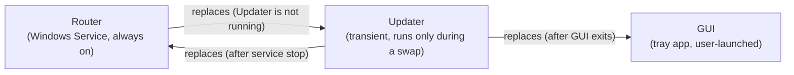

# Version Compatibility: Router, GUI, and Updater

> **Status.** The versioning model below is **decided and in force**. Phase 0's single-source `<Version>`
> and Phase 2's Router self-update implement it for the Router and the Updater. **GUI self-update is
> decided here but not yet built** — see [`auto-update-plan.md`](auto-update-plan.md) for its phase status.
> This document is the authority on *how the three components relate by version*; the plan doc owns the
> *phase-by-phase delivery*.

TotallyHot Arc Router ships as three separate executables that update each other in a closed loop. This
document records why they are versioned in lockstep, which component may replace which, and what actually
breaks when versions do skew.

## 1. The decision: lockstep, one release, three artifacts

**All three components carry the same version number, cut from the same release, and are installed
together in a single apply operation.** There is no independent per-component versioning and no
compatibility matrix to maintain.

The version is stamped exactly once, in [`src/Directory.Build.props`](../../src/Directory.Build.props)'s
`<Version>`. Every component derives from it — the Router and Updater directly, the GUI via
`ApplicationDisplayVersion` (padded to the 4-part form Windows package versions require). The GitHub
Release tag is `v<Version>`, and that one release publishes all three zips plus a single `checksums.txt`.

**Why not independent versions.** Independent semver per component would buy the ability to ship a fix to
one component without touching the others — real value when components are consumed separately. These are
not: nobody installs the Updater without the Router, and the GUI is useless without a Router to talk to.
The cost is a compatibility matrix that must be reasoned about and tested on every release. Lockstep pays
nothing for a guarantee that would otherwise need enforcing, so lockstep it is.

**What this buys.** "Which Updater works with which Router?" is not a question anyone has to answer. The
three binaries in a given install either all came from release *N*, or the install is broken in a way the
GUI surfaces (§5).

## 2. Who may replace whom

The binding physical constraint on Windows: **a running process cannot overwrite its own image or loaded
DLLs.** Every component therefore needs some *other* process to replace it, and the assignments fall out
of which processes are running when.

- **The Updater replaces the Router.** The Router cannot overwrite itself, and because it runs under the
  Service Control Manager, it cannot even restart itself — a clean self-stop is not a failure, so SCM
  recovery actions never fire. Something outside the process must sequence stop → swap → start → verify.
- **The Updater replaces the GUI.** Same self-overwrite constraint. The GUI is an *unpackaged* MAUI app
  (`<WindowsPackageType>None</WindowsPackageType>`), so a plain directory swap works. Were it MSIX-packaged
  this would be impossible without going through the MSIX install pipeline instead.
- **The Router replaces the Updater.** The Updater is transient — it is not running at the moment the
  Router is deciding to update, so the Router can overwrite its directory freely. This is the exact mirror
  of why the Updater can replace the Router.

The loop is closed: the Updater is the only component that can never replace itself under any
circumstance, and the Router covers it.

## 3. The ordering invariant

**The Updater is refreshed before it is used, so it is never older than the payload it installs.**

An apply runs in this order:

1. The Router downloads and SHA256-verifies every zip in the release.
2. The Router backs up and swaps `Updater\`, then confirms the new `TotallyHotArcRouter.Updater.exe` is
   present. Any failure here restores the backup and aborts **without touching the Router or GUI**.
3. The Router launches the now-current Updater, which swaps the Router and the GUI.

This is what makes the Router→Updater CLI contract safe to change. Adding a **required**
`--expected-sha256` argument would ordinarily be a breaking change to that surface; it is safe here
because a Router of version *N* only ever invokes an Updater of version *N*, refreshed moments earlier in
the same operation. Any future required argument is safe for the same reason — but only as long as step 2
stays ahead of step 3.

## 4. Atomicity and skew

**Apply is always operator-initiated from the GUI.** The background poller in the Router detects and
notifies; it never applies unattended. This is a deliberate policy (see the plan doc), and it has a useful
consequence for versioning: *the GUI is by construction running at the moment an apply begins*, so a single
apply can update both the Router and the GUI in one Updater run — waiting on both processes to exit,
swapping both directories, then restarting the service and relaunching the GUI.

Version skew between Router and GUI is therefore **transient by design** — it exists only inside the
seconds an apply is in flight. Steady state is an exact match across all three components.

A skew that *persists* means an apply failed partway. The rollback policy is all-or-nothing: if either the
Router or the GUI swap fails, both roll back to their backups. The one asymmetry the design accepts is
recorded in the plan doc's settled-deferrals section — a successful Updater refresh followed by a failed
Router swap leaves an old Router beside a new Updater, which is harmless because the Updater's CLI contract
is the only surface between them and it is never older.

## 5. Compatibility surfaces — what actually breaks on skew

Skew should not occur, but "should not" is not "cannot", so each seam has a defined degradation:

| Seam | Contract | Behavior under skew |
|---|---|---|
| GUI ↔ Router | the gRPC contract in [`src/Protos/telemetry.proto`](../../src/Protos/telemetry.proto) | proto3's additive field rules mean a mismatched pair degrades — unknown fields are ignored, absent fields read as defaults — rather than failing to connect. A GUI older than its Router simply does not render the newest panes. |
| Router → Updater | the `Updater.exe` command-line argument contract | Structurally cannot skew, per §3's invariant. A malformed or missing argument is a hard parse error with a clear message, never a silent partial run. |
| Router → GitHub | the release asset + `checksums.txt` naming convention | A release missing any expected asset or checksum line is reported as `AssetOrChecksumMissing` and the update is **not offered**. An update that cannot be applied is never reported as available. |

**The GUI surfaces detected skew.** The GUI knows its own compiled version and reads the Router's from
`GetUpdateStatus`, so a mismatch is directly observable and should be shown to the operator rather than
left to manifest as confusing behavior. That check is cheap and falls out of data the GUI already has.

## 6. Consequences for contributors

- **Bump `<Version>` in `Directory.Build.props` and nowhere else.** A component with its own hardcoded
  version is a bug — Phase 0 exists specifically to make that unrepresentable.
- **A release publishes all three zips or it publishes nothing usable.** Partial releases are rejected by
  the release check, not partially applied.
- **Changing the Updater's CLI contract is allowed** — §3's invariant covers it — but the change must land
  in the same release as the Router change that depends on it.
- **Changing the gRPC contract follows proto3 additive rules.** Never renumber or repurpose a field; skew
  is supposed to degrade, and renumbering turns degradation into corruption.

## Related

- [`auto-update-plan.md`](auto-update-plan.md) — the phased delivery of the update mechanism itself.
- [`grpc-migration.md`](grpc-migration.md) — the GUI ↔ Router contract this document treats as a
  compatibility surface.
- [`../../AGENTS.md`](../../AGENTS.md) — the repository-wide rules every phase validates against.
