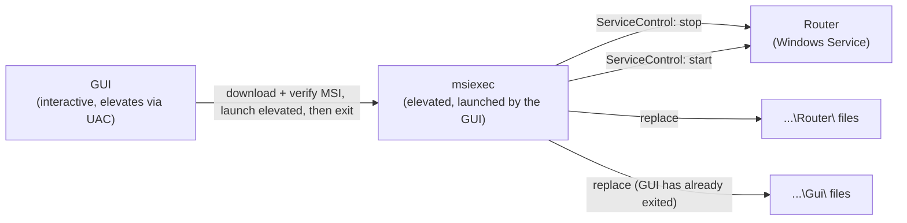

# Version Compatibility: Router and GUI

> **Status.** This document was rewritten 2026-08-26 for the MSI packaging decision
> ([`packaging-and-distribution.md`](packaging-and-distribution.md)), which replaced the three-executable
> Router↔Updater↔GUI closed loop described in the prior revision of this document (still readable in git
> history) with a single Windows Installer transaction. There is no Updater component anymore, so there is
> no closed loop, no ordering invariant between a Router-launched helper and its payload, and no
> Router→Updater compatibility surface to reason about. What remains genuinely unchanged from the prior
> revision: `<Version>` in `Directory.Build.props` as the single source of truth (§1), and the GUI↔Router
> gRPC contract as a compatibility surface (§4).

TotallyHot ArcRouter ships as two executables — the Router (a Windows Service) and the GUI (a MAUI tray
app) — packaged and versioned together. This document records how they relate by version and what happens
when they skew.

## 1. The decision: lockstep, one release, one artifact

**Both components carry the same version number, cut from the same release, and are installed together by
one MSI in one Windows Installer transaction.** There is no independent per-component versioning.

The version is stamped exactly once, in [`src/Directory.Build.props`](../../src/Directory.Build.props)'s
`<Version>`. The Router compiles it directly into `AssemblyInformationalVersionAttribute`; the GUI does the
same and additionally derives `ApplicationDisplayVersion` (padded to the 4-part form Windows package
versions require); the installer project derives the MSI's `ProductVersion` from the same property via
MSBuild passthrough (`src/TotallyHotArcRouter.Installer/TotallyHotArcRouter.Installer.wixproj`) — never a
second, hand-typed version. The GitHub Release tag is `v<Version>`, and that one release publishes exactly
one `.msi` asset plus a single `checksums.txt`.

**Why not independent versions.** Independent semver per component would buy the ability to ship a fix to
one without touching the other — real value when components are consumed separately. They are not: the GUI
is useless without a Router to talk to, and both are installed by the same MSI. Lockstep pays nothing for a
guarantee that would otherwise need enforcing.

## 2. How the swap actually happens now

The physical constraint that shaped the old three-executable design is still real: **a running process
cannot overwrite its own image or loaded DLLs.** What changed is *who* does the overwriting. Windows
Installer's own transaction — not a hand-rolled helper process — is the "someone else" that replaces both
the Router and the GUI:

The GUI downloads the release's MSI, verifies it against the published SHA256
(`TotallyHot.ArcRouter.Gui.Telemetry.MsiUpdateApplier`), launches
`msiexec /i <path> /qn REBOOT=ReallySuppress /l*v <logpath>` elevated (`UseShellExecute = true`,
`Verb = "runas"` — the single UAC prompt an operator sees), and **exits immediately** so it is not holding
its own files locked when the MSI tries to replace `...\Gui\`. The Router does not participate in its own
replacement beyond that — Windows Installer's `ServiceControl` element stops the
`TotallyHotArcRouter` service before the file swap and restarts it after, the same stop/swap/restart
sequence the deleted `Updater.exe` used to perform by hand, now a property of the MSI transaction instead
of application code.

**Why GUI-elevated rather than Router-launched.** The original intent explored during this design was
having the always-on Router (running as `LocalSystem` under the Windows Service) launch `msiexec` detached,
so applying an update needed no interactive session at all. That could not be empirically verified in this
project's development environment — testing it requires an admin/UAC-capable interactive Windows session to
install a real service and observe whether a `msiexec` process launched detached by that service survives
the service being stopped mid-transaction by the very same MSI, and no such session was available (`sc.exe
create` returned `OpenSCManager FAILED 5: Access is denied` in every session that attempted it; a
containerized Windows target was also considered and ruled out — the available container backend on the
development machine is a Linux/WSL2 backend, which cannot host a real Windows Service either). Rather than
ship an unverified detached-launch-from-a-service design, the repo owner decided on GUI-elevated: one
ordinary UAC prompt, the same pattern virtually every other Windows desktop installer uses, and simpler to
reason about than a service launching a process that outlives the service's own shutdown.

## 3. Atomicity and skew

**Apply is always operator-initiated from the GUI**, behind a confirmation dialog. The Router's background
poller (`UpdateCheckHostedService`) only *detects* an available update and records it — it never applies
unattended.

Because the entire swap is now one Windows Installer transaction, atomicity is Windows Installer's problem,
not this codebase's: **a failed MSI transaction rolls back automatically** — there is no partial-apply state
where the Router is on version *N+1* and the GUI is still on version *N*, or vice versa, the way a failed
step mid-`Updater.exe`-run could previously leave one component ahead of the other. `MajorUpgrade`'s
scheduling (`src/TotallyHotArcRouter.Installer/Package.wxs`) means a successful install always leaves both
components at the same version, and a failed one leaves both at whatever version was there before the
transaction began.

Version skew between Router and GUI can now only happen from an *operator* action outside the MSI's control
— e.g. downgrading one component's files by hand, which nothing about this design prevents or needs to
prevent, since it is not a path the shipped tooling offers.

## 4. Compatibility surfaces — what actually breaks on skew

| Seam | Contract | Behavior under skew |
|---|---|---|
| GUI ↔ Router | the gRPC contract in [`src/Protos/telemetry.proto`](../../src/Protos/telemetry.proto) | proto3's additive field rules mean a mismatched pair degrades — unknown fields are ignored, absent fields read as defaults — rather than failing to connect. A GUI older than its Router simply does not render the newest panes. |
| Router → GitHub | the release asset + `checksums.txt` naming convention | A release missing the `.msi` asset or its checksum line is reported as `AssetOrChecksumMissing` and the update is **not offered**. An update that cannot be applied is never reported as available. |
| GUI → installer | the MSI's `ServiceControl`/`ServiceInstall` naming (`TotallyHotArcRouter`) | Must exactly match `Program.cs`'s `UseWindowsService(options => options.ServiceName = "TotallyHotArcRouter")`. A mismatch here would mean the installer registers or controls a service that does not exist, which `dotnet build`-time XML review and the "verify for real" step of any installer change are the only guards — there is no runtime skew-detection possible for this seam, since it is fixed at build time on both sides. |

**The GUI surfaces detected skew.** The GUI knows its own compiled version and reads the Router's from
`GetUpdateStatus`, so a mismatch is directly observable and should be shown to the operator rather than
left to manifest as confusing behavior.

## 5. Consequences for contributors

- **Bump `<Version>` in `Directory.Build.props` and nowhere else.** A component with its own hardcoded
  version is a bug — this is the single source of truth for the Router, the GUI, and the installer's
  `ProductVersion` alike.
- **A release publishes one `.msi` and one `checksums.txt` or it publishes nothing usable.** A partial
  release is rejected by the release check, not partially applied.
- **Changing the gRPC contract follows proto3 additive rules.** Never renumber or repurpose a field; skew
  is supposed to degrade, and renumbering turns degradation into corruption.
- **Changing the Windows Service name requires updating three places in lockstep**: `Program.cs`'s
  `UseWindowsService` call, `Package.wxs`'s `ServiceInstall`/`ServiceControl` `Name` attributes, and
  `scripts/service/Install-RouterService.ps1`'s `$ServiceName` (dev-only path, but should still agree).

## Related

- [`packaging-and-distribution.md`](packaging-and-distribution.md) — the MSI decision itself, the MSIX
  evaluation that preceded it, and the WiX v7 licensing note.
- [`auto-update-plan.md`](auto-update-plan.md) — the original Router-self-update design; its Phase 2 apply
  mechanism is superseded by this document and by packaging-and-distribution.md.
- [`grpc-migration.md`](grpc-migration.md) — the GUI ↔ Router contract this document treats as a
  compatibility surface.
- [`../../AGENTS.md`](../../AGENTS.md) — the repository-wide rules every change validates against.
