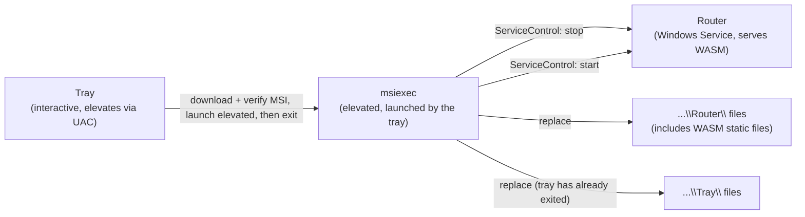

# Version Compatibility: Router, tray, and WASM dashboard

> **Status.** Rewritten 2026-09-20 for the current product: a cross-platform Router that serves a
> Blazor WebAssembly dashboard, plus a Windows-only WinForms tray. The previous revision described a
> "Router + MAUI tray GUI" pair and a mermaid of deleted `...\Gui\` install paths; that GUI is gone
> (`src/TotallyHotArcRouter.Gui` deleted with the web GUI migration). Updated 2026-09-16: the version's
> single source of truth is the `vMAJOR.MINOR.PATCH` release tag, not `<Version>` in
> `Directory.Build.props` (§1).

TotallyHot Arc Router ships as:

| Piece | What it is | Where it lives |
|---|---|---|
| **Router** | Kestrel host: LLM proxy, gRPC-Web admin/telemetry, static WASM dashboard | Windows Service / systemd / LaunchDaemon / GHCR; `%ProgramFiles%\TotallyHotArcRouter\Router\` on Windows |
| **WASM dashboard** | Blazor WebAssembly in `TotallyHotArcRouter.Gui.Web`, Razor UI in `Gui.Components` | Served by the Router on the web port (`https://localhost:47104` by default) — not a separate install |
| **Tray** | Small WinForms companion (`TotallyHotArcRouter.Tray` / `Tray.Core`) | Windows only; `%ProgramFiles%\TotallyHotArcRouter\Tray\` |

Linux and macOS run the Router (and therefore the browser dashboard) without a tray. This document
records how those pieces relate by version and what happens when they skew.

## 1. The decision: lockstep, one release, one artifact set

**Every shipped component carries the same version number, cut from the same release.** There is no
independent per-component versioning. On Windows the Router and the tray are installed together by
one MSI in one Windows Installer transaction. The WASM files are published *with* the Router, so they
cannot skew from it via the installer.

The version is stamped exactly once, as the MSBuild `<Version>` property: for a release,
`release.yml` sets it from the `vMAJOR.MINOR.PATCH` git tag (`-p:Version`); for a local build it
falls back to [`src/Directory.Build.props`](../../src/Directory.Build.props)
([`packaging-and-distribution.md`](packaging-and-distribution.md) §7.1). Router, tray, and WASM
compile it into `AssemblyInformationalVersionAttribute`; the installer project derives the MSI's
`ProductVersion` from the same property via MSBuild passthrough
(`src/TotallyHotArcRouter.Installer/TotallyHotArcRouter.Installer.wixproj`) — never a second,
hand-typed version. That one release publishes the `.msi`, the `totallyhotarcrouter-<rid>.tar.gz`
archives, a GHCR image, and a single `checksums.txt`.

**Why not independent versions.** The dashboard is useless without a Router to serve it, and the tray
is useless without a Router to talk to. On Windows both binaries are installed by the same MSI.
Lockstep pays nothing for a guarantee that would otherwise need enforcing.

## 2. How the Windows swap actually happens

The physical constraint is still real: **a running process cannot overwrite its own image or loaded
DLLs.** Windows Installer's transaction — not a hand-rolled helper — replaces both the Router and the
tray:

The tray downloads the release's MSI, verifies it against the published SHA256
(`TotallyHot.ArcRouter.Gui.Telemetry.MsiUpdateApplier`, invoked from `Tray.Core`), launches
`msiexec /i <path> /qn REBOOT=ReallySuppress /l*v <logpath>` elevated (`UseShellExecute = true`,
`Verb = "runas"` — the single UAC prompt an operator sees), and **exits immediately** so it is not
holding its own files locked when the MSI tries to replace `...\Tray\`. The Router does not
participate in its own replacement beyond that — Windows Installer's `ServiceControl` element stops
the `TotallyHotArcRouter` service before the file swap and restarts it after.

**Why tray-elevated rather than Router-launched.** A detached `msiexec` from the `LocalSystem`
service could not be empirically verified in this project's development environment (no admin/UAC
session; `sc.exe create` returned `OpenSCManager FAILED 5`). Rather than ship an unverified
detached-launch-from-a-service design, apply is tray-elevated: one ordinary UAC prompt. See
[`packaging-and-distribution.md`](packaging-and-distribution.md) §6.

On Linux/macOS an update is **detected** (`GitHubReleaseCheckClient` looks for
`totallyhotarcrouter-<rid>.tar.gz`) but must be applied by re-running the install script with a
newer archive — there is no in-process apply path.

## 3. Atomicity and skew

**Apply is always operator-initiated from the tray** (Windows), behind a confirmation. The Router's
background poller (`UpdateCheckHostedService`) only *detects* an available update and records it —
it never applies unattended. Promoted GitHub Releases are the only ones offered; prereleases are
invisible to the check ([`packaging-and-distribution.md`](packaging-and-distribution.md) §7).

Because the Windows swap is one Windows Installer transaction, **a failed MSI rolls back
automatically** — there is no partial-apply state where the Router is on version *N+1* and the tray
is still on version *N*. `MajorUpgrade` in
`src/TotallyHotArcRouter.Installer/Package.wxs` means a successful install always leaves both at the
same version.

The WASM dashboard cannot skew from the Router through the installer: it is static files inside the
Router's publish output. Browser cache can show a stale dashboard until refresh; that is not a
version-skew of shipped artifacts.

Version skew between Router and tray can now only happen from an *operator* action outside the MSI
(e.g. copying one component's files by hand), which nothing about this design prevents or needs to
prevent.

## 4. Compatibility surfaces — what actually breaks on skew

| Seam | Contract | Behavior under skew |
|---|---|---|
| Dashboard / tray ↔ Router | gRPC-Web on the web port (`https://localhost:47104`), protos under [`src/Protos/`](../../src/Protos/) | proto3 additive field rules: a mismatched pair degrades — unknown fields ignored, absent fields default — rather than failing to connect. An older dashboard simply does not render the newest panes. |
| Router → GitHub | release asset + `checksums.txt` naming | A release missing the platform asset (`.msi` on Windows, `totallyhotarcrouter-<rid>.tar.gz` elsewhere) or its checksum line is `AssetOrChecksumMissing` and the update is **not offered**. |
| Tray → installer | the MSI's `ServiceControl`/`ServiceInstall` naming (`TotallyHotArcRouter`) | Must exactly match `Program.cs`'s `UseWindowsService(options => options.ServiceName = "TotallyHotArcRouter")`. A mismatch would register or control a service that does not exist. Guarded at build/review time, not at runtime. |

The tray knows its own compiled version and reads the Router's from `GetUpdateStatus`, so a mismatch
is observable and should be shown rather than left as confusing behavior. The WASM dashboard is the
same build as the Router that served it.

## 5. Consequences for contributors

- **Never hand-edit a version to release.** Run `cut-release.yml`; the release tag is the single
  source of truth for the Router, the tray, the WASM dashboard, and the installer's `ProductVersion`.
- **A Windows release publishes one `.msi` and a `checksums.txt` covering every asset, or it
  publishes nothing usable.** Linux/macOS tarballs and the GHCR image are part of the same tag.
- **Changing the gRPC contract follows proto3 additive rules.** Never renumber or repurpose a field;
  skew is supposed to degrade, and renumbering turns degradation into corruption.
- **Changing the Windows Service name requires updating three places in lockstep:** `Program.cs`'s
  `UseWindowsService` call, `Package.wxs`'s `ServiceInstall`/`ServiceControl` `Name` attributes, and
  `scripts/service/Install-RouterService.ps1`'s `$ServiceName` (dev-only path, but should still agree).

## Related

- [`packaging-and-distribution.md`](packaging-and-distribution.md) — the MSI decision, MSIX
  evaluation, WiX v7 licensing note, and the tagged release/GHCR flow.
- [`../archive/router/auto-update-plan.md`](../archive/router/auto-update-plan.md) — historical
  Router-self-update / `Updater.exe` design; superseded.
- [`telemetry.md`](telemetry.md) — the gRPC-Web contract this document treats as a compatibility
  surface.
- [`../../AGENTS.md`](../../AGENTS.md) — the repository-wide rules every change validates against.
