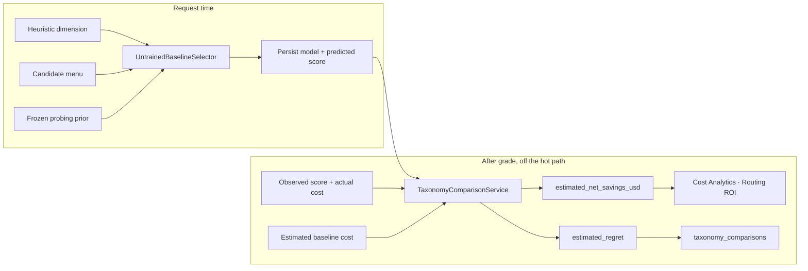

# Score-delta versus the frozen baseline

**Status:** as-built. This document describes what TotallyHot Arc Router computes today. It does not
propose a new metric.

The Cost Analytics **Routing ROI** chart and the Governance **Regret Harness** pane are the product's
report card: they answer *"did the live router beat the policy that never learned?"* This is the
citable method behind those numbers — the same formulas the code runs, named, signed, and qualified
so a "prove it" claim can be checked rather than trusted.

Plain-language walkthrough: [`how-it-learns.md`](how-it-learns.md) Step 7. Implementation history:
[`router/routing-roi-regret-plan.md`](router/routing-roi-regret-plan.md) (live drain) and
[`router/regret-evaluation-harness-plan.md`](router/regret-evaluation-harness-plan.md) (offline
harness). Canonical reward in Zhou et al., [arXiv:2606.22902](https://arxiv.org/abs/2606.22902) §3.2.

---

## Three numbers, one frozen policy

The product publishes three related figures. They share a frozen DimensionBest rule. They do **not**
all share a reward function, they do **not** share an oracle, and they must not be quoted as if they
were the same measurement.

| Figure | What it answers | Where it lives | Oracle |
|---|---|---|---|
| **Estimated regret** | Did this live request beat the untrained baseline under the *configured* live reward \(r = \varepsilon_1 s + \varepsilon_2 \kappa\)? | `taxonomy_comparisons.estimated_regret`, computed by [`RewardWeights.ComputeEstimatedRegret`](https://github.com/davidpizon/TotallyHot-ArcRouter/blob/main/src/TotallyHotArcRouter/CodeRouterBench/Evaluation/RewardWeights.cs) | Predicted: the baseline response was never produced |
| **Estimated net savings** | Did this live request cost less than the untrained baseline? \(\kappa_{\text{base}} - \kappa_{\text{act}}\) — cost only, **not** \(r\) | `taxonomy_comparisons.estimated_net_savings_usd`; this is the **only** half the Cost Analytics Routing ROI chart plots | Predicted cost, observed actual cost |
| **CumReg** | Over a CodeRouterBench split, how far was this policy from the per-task oracle under \(r\)? | Governance → Regret Harness markdown table, via [`RegretReplayResult`](https://github.com/davidpizon/TotallyHot-ArcRouter/blob/main/src/TotallyHotArcRouter/CodeRouterBench/Evaluation/RegretReplayResult.cs) | Measured: every model was scored on every task |

Estimated regret and CumReg share the *algebra* of \(r\). Their *weights* need not match: live
regret reads `RoutingOptions.Epsilon1`/`Epsilon2` (shipped defaults \((1, -0.1)\)), while the
offline harness always uses `RewardWeights.Canonical`. Net savings never enters \(r\).

**Score-delta**, as used in this document, is the quality half of the live comparison:

$$\Delta s = s_{\text{observed}} - s_{\text{baseline}}$$

Positive \(\Delta s\) means the served model out-scored the frozen policy's predicted score. That
difference is **not stored as its own column**. It is recovered from two fields that already exist
on every comparison row (`ObservedScore`, `BaselinePredictedScore`) and is the first term of
estimated regret below. Inventing a fourth published metric would be a product change; this
document does not.



---

## Reward

The two reward-based figures above - estimated regret and CumReg - use the paper's cost-aware
reward

$$r = \varepsilon_1\, s + \varepsilon_2\, \kappa$$

with the shipped defaults \((\varepsilon_1, \varepsilon_2) = (1, -0.1)\):

- Live: [`RoutingOptions.Epsilon1`](https://github.com/davidpizon/TotallyHot-ArcRouter/blob/main/src/TotallyHotArcRouter/Models/RoutingOptions.cs) / `Epsilon2`
- Offline: [`RewardWeights.Canonical`](https://github.com/davidpizon/TotallyHot-ArcRouter/blob/main/src/TotallyHotArcRouter/CodeRouterBench/Evaluation/RewardWeights.cs)

\(\varepsilon_2\) is negative by convention, so a higher cost lowers reward. The live comparison
reads whatever values are currently bound — an operator who changes the weights changes the
report card, on purpose, so the figure and the selection criterion cannot disagree about what
"better" means. The offline harness always uses the canonical pair so its tables stay comparable
to the paper.

The scalar is computed by one static function:

```csharp
RewardWeights.ComputeReward(score, costUsd, epsilon1, epsilon2)
    => epsilon1 * score + epsilon2 * costUsd;
```

---

## The frozen policy

The counterfactual is **not** "the most expensive model" and **not** the live `dim_best` voter.

Live `DimBestVoter` prefers `RouterMemory` the instant any observation exists. Measuring the router
against a baseline that learns alongside it holds the gap constant and reports an improvement of
zero no matter how much the router has actually learned. That is why the yardstick is a separate
selector.

**Frozen policy.** For a request with heuristic dimension \(d\) and candidate menu \(C\), pick

$$\hat{a}(d, C) = \arg\max_{m \in C} \bar{s}(d, m)$$

where \(\bar{s}(d, m)\) is the CodeRouterBench **probing-split** average for that pair. Ties break
by ordinal model-id order. The rule returns no pick (an abstention) when the corpus is unsynced or
has no average for any candidate — never a fabricated model.

One implementation, two callers:

- Live: [`UntrainedBaselineSelector.SelectWithScore`](https://github.com/davidpizon/TotallyHot-ArcRouter/blob/main/src/TotallyHotArcRouter/Router/UntrainedBaselineSelector.cs)
- Offline: [`DimensionBestBaseline.Route`](https://github.com/davidpizon/TotallyHot-ArcRouter/blob/main/src/TotallyHotArcRouter/CodeRouterBench/Evaluation/DimensionBestBaseline.cs)

Both delegate to [`DimensionModelScoreMatrix.SelectBest`](https://github.com/davidpizon/TotallyHot-ArcRouter/blob/main/src/TotallyHotArcRouter/CodeRouterBench/DimensionModelScoreMatrix.cs).
Keeping one copy is the point: the savings figure claims to compare against the untrained router
the harness measures, and two implementations that merely resembled each other would let that
claim quietly stop being true.

**Captured at request time.** `RequestInterceptor` persists both the picked model
(`request_transcripts.untrained_baseline_model`) and the average it was picked on
(`untrained_baseline_predicted_score`) from the **same** prior snapshot. A later CodeRouterBench
sync cannot pair yesterday's model with today's score. Comparison prefers the persisted score and
falls back to a fresh prior lookup only for rows written before that column existed.

**No leave-one-out on the baseline half.** A table-only prediction never absorbed the observation
being compared, so there is nothing to hold out. Leave-one-out **is** still applied to the
taxonomy-accuracy columns (`DimensionPredictedScore` / `ClusterPredictedScore`) — those ledgers
*have* absorbed the observation, and they answer a different question (did the taxonomy predict
the served model's score?). They are not the frozen-policy yardstick.

---

## Live estimated regret

[`TaxonomyComparisonService`](https://github.com/davidpizon/TotallyHot-ArcRouter/blob/main/src/TotallyHotArcRouter/Transcripts/TaxonomyComparisonService.cs)
runs off the hot path, on a one-minute drain that **hard-pauses** while any proxy request is in
flight. For each scored, dimensioned transcript it computes:

$$
\begin{aligned}
r_{\text{routed}} &= \varepsilon_1\, s_{\text{obs}} + \varepsilon_2\, \kappa_{\text{act}} \\
r_{\text{base}}   &= \varepsilon_1\, s_{\text{base}} + \varepsilon_2\, \kappa_{\text{base}} \\
\widehat{\text{regret}} &= r_{\text{base}} - r_{\text{routed}}
\end{aligned}
$$

via `RewardWeights.ComputeEstimatedRegret`. Sign convention:

- **Positive** — the frozen policy would likely have earned more reward (the router lost).
- **Negative** — routing beat the frozen policy.
- **Null, never zero** — any input missing (baseline abstained, score not yet predicted, actual
  cost unknown, baseline unpriceable). A zero would read as "broke even", which is a measurement,
  not the absence of one.

The identity that ties this to the dashboard's dollar bars:

$$
\widehat{\text{regret}} = -\varepsilon_1\,\Delta s + \varepsilon_2\,\widehat{\text{savings}}
$$

where \(\widehat{\text{savings}} = \kappa_{\text{base}} - \kappa_{\text{act}}\) (positive when
routing was cheaper). With the canonical weights, beating the baseline on quality *and* on cost
makes regret more negative on both terms.

### Worked example

Routed model scored \(s_{\text{obs}} = 0.90\) at \(\kappa_{\text{act}} = \$0.01\). Frozen policy
predicted \(s_{\text{base}} = 0.50\) at \(\kappa_{\text{base}} = \$0.10\). Canonical weights:

| | Score | Cost | Reward |
|---|---:|---:|---:|
| Routed | 0.90 | 0.01 | \(1\cdot 0.90 + (-0.1)\cdot 0.01 = 0.899\) |
| Frozen baseline | 0.50 | 0.10 | \(1\cdot 0.50 + (-0.1)\cdot 0.10 = 0.490\) |

\(\widehat{\text{regret}} = 0.490 - 0.899 = -0.409\) (router won).
\(\Delta s = 0.40\), \(\widehat{\text{savings}} = \$0.09\), and
\(-1\cdot 0.40 + (-0.1)\cdot 0.09 = -0.409\) recovers the same number.

### What is estimated

- \(s_{\text{obs}}\) and \(\kappa_{\text{act}}\) are **observed** (verifier score of the served
  response; billed cost of that response).
- \(s_{\text{base}}\) is a **probing-split average**, not a grade of a counterfactual response.
  The baseline model was never asked to serve this request.
- \(\kappa_{\text{base}}\) is **priced, not observed**. Input tokens are this turn's own billed
  input, scaled by the two models' tokenizer ratio ([ADR-0009](adr/0009-per-request-counterfactual-token-estimation.md));
  output tokens stay a per-model observed average, because a model that never ran produced no
  output to count. The figure is priced at the **standard** input rate with no cache discount —
  the baseline would have met a cold prompt cache. Ingredients (tokens, prices, tokenizer ratio)
  are persisted on the row so a published number is auditable from itself.

Rows are **first-write-wins**. Token averages and catalog prices drift; a rescan must not silently
reprice an already-published figure against today's inputs.

Exploratory (ε-greedy) turns are included in the all-in net. The Routing ROI chart mutes their
bars so a deliberate probe is not misread as a routing miss, but still counts them.

---

## What the dashboard plots

Cost Analytics → **Routing ROI** is a dual-directional bar chart of
\(\widehat{\text{savings}}\) per compared request, built by
[`CostChartBuilder.BuildRoi`](https://github.com/davidpizon/TotallyHot-ArcRouter/blob/main/src/TotallyHotArcRouter.Gui.Charts/CostChartBuilder.cs).
Gains above 0, losses below. The headline is the window sum. Every tooltip labels the baseline
cost as an estimate.

This chart **does not plot** estimated regret or \(\Delta s\), and it does not evaluate \(r\). The
bars are the cost difference above; the reward-weighted comparison stays in the comparison store
and the structured `[TAXONOMY-COMPARE]` logs. The predictive-adequacy (taxonomy MAE) series is
deliberately not projected either — it gates a promotion decision, not an operator metric
([`RoutingRoiPoint`](https://github.com/davidpizon/TotallyHot-ArcRouter/blob/main/src/TotallyHotArcRouter/Proxy/Management/RoutingRoiPoint.cs)).

A turn whose baseline cost is unknown is **skipped**, not drawn at zero.

The feed is `/admin/usage/routing-roi` (`ManagementReportingService.GetRoutingRoiAsync`), polled
every 30 seconds, because comparison work is a background drain rather than request-time
telemetry.

---

## Offline CumReg (exact, benchmark-only)

The Governance **Regret Harness** replays CodeRouterBench through the router's actual decision
code and a family of comparison baselines, including `dim_best` — the same frozen rule as the
live yardstick. Metrics are accumulated by `RegretReplayResult.Record`:

$$
\text{CumReg}_N(\pi) = \sum_{i=1}^{N} \bigl(r^*_i - r_i(a_i)\bigr)
$$

where \(r^*_i = \max_j R_{ij}\) is the **per-task oracle** (every model scored on that task).
Lower is better. This is a measurement: the corpus authors filled the whole row.

CumReg is **not** regret versus DimensionBest. The gap between two rows of the table is:

$$
\text{CumReg}_N(\texttt{dim\_best}) - \text{CumReg}_N(\pi)
= \sum_i \bigl(r_i(\pi) - r_i(\texttt{dim\_best})\bigr)
$$

which is the negative of summed live estimated regret **only in form**. Offline, both rewards are
observed cells. Live, the baseline half is predicted. Do not subtract the two CumReg columns and
quote the result as the live report card.

Skipped tasks (a baseline that abstained) are excluded from every metric, not counted as
zero-reward picks — the same "never fabricate" rule as a null live regret.

The harness is read-only: a run never mutates a live voter. N5's own exit criterion (Orchestrator
beats DimensionBest and reproduces the paper's ordering) was measured and **not met** as the
harness is currently scoped; see that plan's N5 status note. Publishing the method is not a claim
that the criterion has been met.

---

## What this does not prove

- **Correctness of the answer.** \(s\) is a verifier score (parser + G-Eval judge), not a test
  suite. See [`how-it-learns.md`](how-it-learns.md) "Honest gaps".
- **What a different model would have written.** The live baseline score is a dimension-level
  prior average. Only CodeRouterBench has full rows.
- **Causal "routing saved $X" in an accounting sense.** Net savings prices a counterfactual. The
  tooltip says "estimate" because it is one.
- **That the ensemble currently beats DimensionBest on the benchmark.** The method is in
  production; the N5 exit criterion is a separate, currently unmet, measurement.

---

## Source map

| Claim | Code |
|---|---|
| \(r = \varepsilon_1 s + \varepsilon_2 \kappa\) | `RewardWeights.ComputeReward` |
| Live estimated regret | `RewardWeights.ComputeEstimatedRegret`, called from `TaxonomyComparisonService.EstimateRegret` |
| Frozen pick | `DimensionModelScoreMatrix.SelectBest` via `UntrainedBaselineSelector` / `DimensionBestBaseline` |
| Persist pick + score at request time | `RequestInterceptor` → `TranscriptRecord.UntrainedBaselineModel` / `UntrainedBaselinePredictedScore` |
| Prefer persisted score at comparison time | `TaxonomyComparisonService.PredictBaselineScore` |
| Baseline cost ingredients | `TaxonomyComparisonService.EstimateCounterfactual` (ADR-0009) |
| First-write-wins | `SqliteTaxonomyComparisonStore.UpsertAsync` |
| Dashboard bars | `CostChartBuilder.BuildRoi` over `RoutingRoiPoint` (cost half only) |
| Offline CumReg | `RegretReplayResult.Record` |
