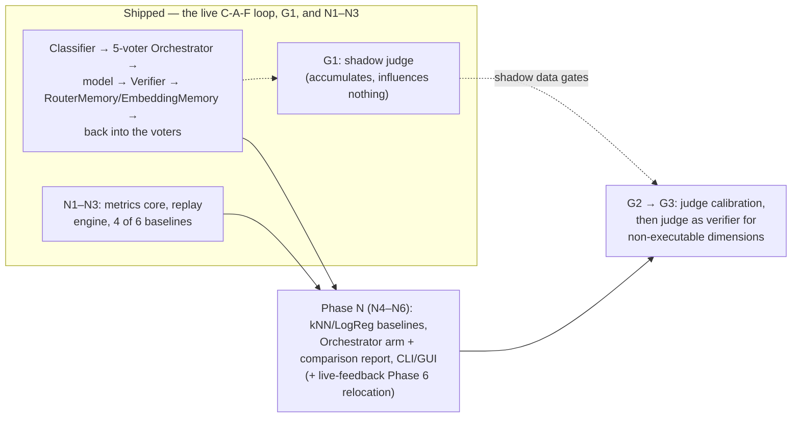

# Current Implementation Plan: Measuring and Extending the Live C-A-F Loop

This plan tracks only unfinished work. Completed phases are removed rather than archived; the
narrative for anything already shipped lives in the design doc that owns it (see the pointer table
below).

**Objective.** Bring the running router to the architecture described in
[`../docs/research/technical-reference.md`](../docs/research/technical-reference.md) — a
loop-complete **C-A-F** router (Context → Action → Feedback → Context) built from an **Orchestrator**,
a **Verifier**, and a **Memory**, selecting under the cost-aware reward
`r = ε₁·s + ε₂·κ` and measured by cumulative regret against a per-task oracle.

## Where things stand

**The C-A-F loop is closed and live.** The classifier (Phase H), the cost-aware `IRoutingPolicy` seam
(Phase I), the embedding memory (Phase J), the benchmark corpus in SQLite (Phases K/K2), the
Orchestrator ensemble (Phase L — four voters, joined later by a fifth, `cluster_best`, from Phase T3),
the Orchestrator on the live path with requested-vs-routed telemetry (Phase M, M1–M4), live feedback
capture plus the embedding-backed `logreg` trainer and its Governance admin surface
(`live-feedback-learning-plan.md` Phases 1–5), Routing ROI's expense-and-regret comparison
(`routing-roi-regret-plan.md`), self-organizing request classification end to end
(`self-organizing-classification-plan.md` Phases T1–T6), and the first three sub-phases of the regret
harness (`regret-evaluation-harness-plan.md` N1–N3) have all shipped. Narratives:

| Shipped work | Owning doc |
|---|---|
| Phases H, I — classifier, `IRoutingPolicy`, cost-aware utility routing | [`../docs/router/utility-model-routing.md`](../docs/router/utility-model-routing.md) (§B1–B5 status blockquotes) |
| Phases G, J — feedback loop reconnection, `RouterMemory` + `EmbeddingMemory` persistence | [`../docs/router/memory-persistence.md`](../docs/router/memory-persistence.md) |
| Phases K, K2 — CodeRouterBench synced into SQLite | [`../docs/router/coderouterbench-sqlite-migration-plan.md`](../docs/router/coderouterbench-sqlite-migration-plan.md), [`../data/README.md`](../data/README.md), [`../docs/router/model-identity-canonicalization.md`](../docs/router/model-identity-canonicalization.md) |
| Phase L — the Orchestrator ensemble (four voters; `cluster_best` added as a fifth by Phase T3) | [`../docs/router/orchestrator-ensemble.md`](../docs/router/orchestrator-ensemble.md) |
| Phase M (M1–M4) — Orchestrator on the live path, requested-vs-routed end to end | [`../docs/router/orchestrator-live-path-plan.md`](../docs/router/orchestrator-live-path-plan.md), [`../docs/router/phase-m2-plan.md`](../docs/router/phase-m2-plan.md) |
| Live-feedback Phases 1–5 — importer repair, feedback capture, embedding-backed `logreg`, training, Governance admin surface | [`../docs/router/live-feedback-learning-plan.md`](../docs/router/live-feedback-learning-plan.md) |
| Routing ROI — regret vs `dim_best`, one-minute full drain, hard pause under load | [`../docs/router/routing-roi-regret-plan.md`](../docs/router/routing-roi-regret-plan.md), [`../docs/router/self-organizing-classification-plan.md`](../docs/router/self-organizing-classification-plan.md) (Phase T4 status block) |
| Phases T1–T6 — transcript capture, self-organizing clustering, `cluster_best` voter, baseline comparison, Cluster Model admin pane, System Settings adaptive-routing toggle | [`../docs/router/self-organizing-classification-plan.md`](../docs/router/self-organizing-classification-plan.md) |
| Phase N (N1–N3) — regret metrics core (`RegretReplayResult`), the no-leakage streaming replay engine (`RegretReplayEngine`), and the Always-*m* / DimensionBest / LinUCB / LinTS baselines | [`../docs/router/regret-evaluation-harness-plan.md`](../docs/router/regret-evaluation-harness-plan.md) (N1–N3 status notes) |
| Phase G1 — shadow judge observer (`PendingResponseTextCache`, `JudgeShadowScoreObserver`/`GEvalJudgeClient`/`JudgeModelSelector`/drain worker, `judge_shadow_scores` side table, `is_judge_scored` provenance columns), off by default, judging on a free Providers-screen model | [`../docs/router/geval-shadow-scoring-plan.md`](../docs/router/geval-shadow-scoring-plan.md) |

**What is still missing**, and which remaining workstream owns it:

- **Measurement is built but has not been run.** An earlier revision of this bullet said "nothing
  computes `R_ij`, the per-task oracle, `CumReg`, `AvgPerf`, `TotTok`, or `Perf/$`" — that is no longer
  true, and had not been for some time. **N1–N3 shipped:** `RegretReplayResult` computes all five
  metrics against the per-task oracle `a*_i = argmax_j R_ij`, `RegretReplayEngine` runs the offline
  streaming replay with no-leakage enforced at the call boundary, and four of the six comparison
  baselines exist (Always-*m*, DimensionBest, LinUCB, LinTS). **N4–N6 remain:** the kNN-retrieval and
  LogReg baselines (OOD only — the ID split publishes no task text), the Orchestrator arm plus the full
  comparison report, and the CLI/GUI surface for re-running the harness. Because N5 has not run, no
  comparison report exists, so every "the ensemble beats X" claim is still **unmeasured** — the harness
  to settle it is largely built, but it has not yet been pointed at the corpus → **Phase N (N4–N6)**.
- ~~**Live traffic is not yet usable as a training corpus.**~~ **Closed by Phases T1–T6.** Transcripts
  are captured opt-in with full provenance (`IsExploratory`, propensity, real cost), skipped embeddings
  are recovered by backfill, the learned cluster taxonomy is trained, voted on (`cluster_best`), and
  measured against the frozen nine-dimension baseline, and the System Settings window exposes the
  adaptive-routing toggle and sample size operators use to turn it on.
- ~~**The Verifier is blind on non-executable dimensions.**~~ **G1 shipped.** The shadow judge
  (`TotallyHot.ArcRouter.Judge`) now scores every request in parallel with `VerifierScorer` into
  `judge_shadow_scores`, off by default, influencing nothing. Non-executable dimensions are still
  syntax-only scored on the routing hot path until **G3**, gated on **G2**'s calibration analysis over
  the shadow data G1 is now accumulating.
- **A live corpus cannot be re-keyed after an embedding-model change.** `memory_entries` stores the
  embedding vector but never the prompt text (a deliberate choice — `live-feedback-learning-plan.md`'s
  "Deliberately out of scope" rejects turning router memory into a transcript store), so vectors produced
  by a superseded embedding model cannot be recomputed and are simply filtered out until they age out of
  the FIFO. `request_transcripts.prompt_text` *does* hold the text needed to re-embed them, but only when
  transcript capture is enabled, only within its retention bounds (30 days / 50,000 rows), and no job
  currently does it: `EmbeddingBackfillService` scans `WHERE memory_entry_id IS NULL`, which by
  construction excludes exactly the already-linked rows a re-key would need. Closing this would mean a
  background re-embedding pass over linked transcript rows — the same shape as the existing backfill.
  Unscheduled; recorded so the limitation is tracked rather than rediscovered. Provenance for detecting
  the condition shipped with `live-feedback-learning-plan.md`'s "Embedding-model provenance" section.
- **The general (non-utility) live path has no cost term.** `UtilityRoutingPolicy` prices candidates;
  the Orchestrator does not. T1's real-cost wiring makes the reward computable from live data; putting
  a cost term into the general path's selection is otherwise unscheduled.

## Remaining work, in order

1. **Phase N (N4–N6) — finish the regret evaluation harness.** N1–N3 shipped (see the shipped-work
   table above); what remains is the kNN-retrieval and LogReg baselines, the Orchestrator arm and its
   comparison report, and the CLI/GUI surface. Detail below; full component spec and per-sub-phase
   status notes:
   [`../docs/router/regret-evaluation-harness-plan.md`](../docs/router/regret-evaluation-harness-plan.md)
   (N1–N6). Also carries live-feedback Phase 6's remaining item (relocating the TF-IDF
   `LogRegTrainer` machinery into a Phase-N-facing namespace), deferred by that plan to land alongside
   the harness itself. Phase G1 (shipped; see the shipped-work table above) already accumulates shadow
   judge data passively in the background while this harness is built, so G2's gate has volume by the
   time it's ready.
2. **Phases G2 → G3 — judge calibration, then judge-as-verifier.**
   [`../docs/router/geval-shadow-scoring-plan.md`](../docs/router/geval-shadow-scoring-plan.md). G2's
   agreement/calibration analysis runs once G1 has accumulated shadow data; G3 (the judge as scorer of
   record for non-executable dimensions only, with `is_judge_scored` provenance) is gated on G2's
   criteria and never starts if the gate fails.

### Phase N: roadmap-level scope and exit bar

**Prerequisite status:** `live-feedback-learning-plan.md` Phase 4 shipped — every Orchestrator voter
can now cast a real vote on live traffic instead of three of the original four abstaining for lack of an
input, satisfying that plan's own ordering requirement ("measuring voters that structurally cannot fire would
produce a benchmark of `dim_best` wearing an ensemble's name"). The self-organizing-classification-plan's
T phases shipped ahead of N because every phase of them removed a blocker N would otherwise have had to
solve itself, but N never required them to complete.

- ~~Implement the metrics of research-doc §5.1 and A.2~~ — **shipped (N1).** `RegretReplayResult`
  computes the reward matrix `R_ij = ε₁·s_ij + ε₂·κ_ij` (via `RewardWeights`), the per-task oracle
  `a*_i = argmax_j R_ij`, cumulative regret `CumReg_N = Σ(r*_i − r_i(a_i))`, plus `AvgPerf`, `TotTok`,
  `$Total`, and `Perf/$`.
- ~~Offline streaming replay over the restored matrices~~ — **shipped (N1).** `RegretReplayEngine`
  makes no live API calls, matching the handbook's "no API keys required" property, and enforces
  no-leakage at the call boundary rather than trusting each baseline to police itself.
- Implement the comparison baselines as C-A-F configurations (research-doc Table 4). **Four of six
  shipped (N1–N3):** Always-*m* (`AlwaysModelBaseline`), DimensionBest (`DimensionBestBaseline`), and
  the LinUCB/LinTS contextual bandits (`α = λ = 1`; `v = 0.5, λ = 1`; warm-started on the probing set,
  seed 42) over a shared `CategoricalContextBanditBaselineBase`. **Remaining (N4):** frozen-kNN
  retrieval and LogReg — both need task text, so both are OOD-only.
- **Remaining (N5):** wire `OrchestratorRoutingPolicy` in as its own arm and produce the comparison
  report that the exit criterion below is judged against. **Remaining (N6):** the CLI/GUI surface for
  re-running the harness on demand.
- **Exit — the real acceptance criterion for this whole plan:** on the restored ID test split the
  Orchestrator reproduces the paper's regret *ordering* (ArcRouter < DimensionBest < static
  classifiers < bandits < single models) and beats DimensionBest on `CumReg`. Absolute parity with
  205.5 is not expected — the model pool, the verifier, and the embedding model all differ — and
  claiming it would be dishonest. Ordering is the falsifiable claim; publish the numbers actually
  obtained either way.

## Other open work (tracked elsewhere; referenced here so it is not lost)

- [`../docs/router/tracked-todos.md`](../docs/router/tracked-todos.md) — #3 DeepSeek dialect research,
  #4 zero-coverage classes (the `TotallyHot.ArcRouter.Sandbox` margin is 80.1%), #5 human review of
  tool-call-normalization Phase 5's three design decisions.
- [`../docs/router/backlog.md`](../docs/router/backlog.md) — #2: deleting `EnableToolCallGuard` now
  that its Phase 8 successor (the operator dialect override) shipped.
- [`../docs/router/tool-call-normalization.md`](../docs/router/tool-call-normalization.md) — Phase 6
  remainder (response/telemetry diagnostics), Phase 7 (native endpoints, design only).
- [`../docs/gui/backlog.md`](../docs/gui/backlog.md) — remaining live-telemetry gaps (Routing ROI /
  Tool Steps / Context Buffer, deliberately mock-backed) and
  [`../docs/gui/governance-model-cards.md`](../docs/gui/governance-model-cards.md)'s missing model
  price channel to the GUI.
- [`../docs/router/agent-resilience-strategies.md`](../docs/router/agent-resilience-strategies.md) —
  Leaky Bucket (pattern 2) not yet built.
- Proposed, unscheduled design docs:
  [`../docs/router/security-hardening-plan.md`](../docs/router/security-hardening-plan.md),
  [`../docs/router/proxy-coexistence.md`](../docs/router/proxy-coexistence.md),
  [`../docs/router/system-proxy-architecture.md`](../docs/router/system-proxy-architecture.md).

## Settled deferrals (do not re-open without new evidence)

- **Multimodal price tiers** — deferred; no upstream feed publishes a `resolution_tier` concept.
  Rationale: [`../docs/router/model-price-catalog.md`](../docs/router/model-price-catalog.md).
- **Routing ROI / Tool Steps / Context Buffer GUI metrics** — deliberately mock-backed; each needs a
  domain concept the codebase does not compute. Rationale:
  [`../docs/gui/backlog.md`](../docs/gui/backlog.md), Cost Analytics bullet.
- **Reasoning-token pricing** — `UsageInfo.ReasoningTokens` exists with no matching price column;
  reasoning tokens bill at the standard output rate. Noted, unscoped.
- **CodeRouterBench `outputs/`, `agentic-artifacts/`, and nested `raw_matrices/`** — not restored;
  nothing in the remaining phases as currently scoped reads them. Rationale: `data/README.md`'s "Not
  yet restored" section.
- **Exact per-cell Table 10 parity for GLM-5/Qwen3-Max/Qwen3.5-Plus/MiniMax-M2.7** — `bug_fixing`,
  `algorithm`, and `test_generation` cells for these four models diverge from the published table by up
  to 0.32 even though row averages (AvgPerf) match within 0.05 for every model; looks like run-to-run
  LLM-as-Judge noise baked into the released CSV, not a parsing bug. Rationale: `data/README.md`'s
  "Known data-fidelity limit" section.
- **`llm_router` substitutes an off-the-shelf model for the paper's unpublished fine-tuned
  checkpoint** — with its sub-deferrals (zero-shot only, no disagreement gating, community-sourced
  artifact URL). Rationale:
  [`../docs/router/orchestrator-ensemble.md`](../docs/router/orchestrator-ensemble.md).
- **Named-model requests are never routed** — a client naming a servable model is naming a command;
  Phase M considered and withdrew superseding `utility-model-routing.md`'s non-goal. Rationale:
  [`../docs/router/orchestrator-live-path-plan.md`](../docs/router/orchestrator-live-path-plan.md) §1.
  (Phase M3.2's editable-toggle deferral is *partially* reopened, deliberately, by
  [`../docs/router/self-organizing-classification-plan.md`](../docs/router/self-organizing-classification-plan.md)
  Phase T6, scoped to exactly two settings.)
- **G1's auto-CoT is a static per-dimension prompt constant, not generated-and-cached** —
  `GEvalJudgeClient.DimensionCriteria` is a hardcoded dictionary rather than a per-dimension prompt
  generated once by a separate LLM call and cached with artifact-version guards; `JudgeOptions.PromptVersion`
  still exists so a future move to generated-and-cached CoT is a version bump, not a schema change.
  **G1's n-sample fallback is a single best-effort numeric parse**, not the G-Eval paper's full n-sample
  estimation, when the judge backbone exposes no logprobs at all. Both are the plan's own allowed "iteration"
  minimum. Rationale: [`../docs/router/geval-shadow-scoring-plan.md`](../docs/router/geval-shadow-scoring-plan.md)
  Phase G1's status blockquote.
- **The judge backbone is a Providers-screen free model, not the hardcoded local endpoint G1 shipped** —
  `JudgeOptions.BaseUrl`/`Model` are removed. `JudgeModelSelector` resolves a route per call from the
  operator's own provider configuration (provider flagged `IsFree`, provider and model enabled, not a
  Bedrock route), and abstains when none is eligible rather than recording a fabricated score. The judge's
  own configuration (`Enabled`, `ModelName`) moved out of `appsettings.json` into `router_settings` behind
  the System Settings window, which also makes `Enabled` a live toggle — including the gate that authorizes
  retaining raw response text in memory. Rationale:
  [`../docs/router/geval-shadow-scoring-plan.md`](../docs/router/geval-shadow-scoring-plan.md) §1a's
  revision note.

---

## Final Validation Gate

Applies at the end of every phase, per [`../AGENTS.md`](../AGENTS.md):

1. `dotnet build` passes with zero warnings and zero errors (`TreatWarningsAsErrors` is on repo-wide).
2. Every new public/protected type and member carries accurate XML documentation; docs on code changed
   by a phase are re-read for staleness, which the compiler cannot check.
3. All unit tests pass; both non-GUI assemblies hold ≥ 80% line coverage per-assembly, as
   `.github/workflows/dotnet-ci.yml` measures it. `TotallyHot.ArcRouter.Sandbox` sits at ~80.1%, so
   phases touching it must add coverage, not just avoid removing it.
4. No unusually heavy test exceeds 5 seconds. The embedding model load and Phase N's replay harness
   are the live risks here — both belong behind fixtures or environment gates.
5. Every routing decision is logged through Serilog with a **static** message template and structured
   properties. The vote breakdown, the chosen model, and the reward terms are audit-trail data, not
   debug output.
6. Documentation matches delivered behavior — including `README.md` and `docs/HANDBOOK.md`, which
   describe `coderouterbench.db` as synced-on-demand and `outputs/`/`agentic-artifacts/` as not
   restored.
7. Any item deferred during a phase is recorded with its evidence, in the doc that owns the component,
   and summarized in one line under "Settled deferrals" above.
