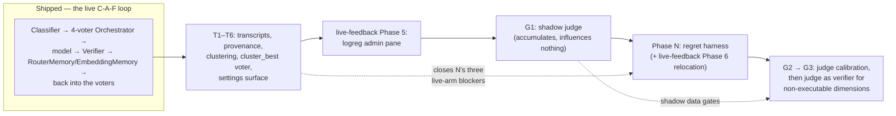

# Current Implementation Plan: Measuring and Extending the Live C-A-F Loop

This plan tracks only unfinished work. Completed phases are removed rather than archived; the
narrative for anything already shipped lives in the design doc that owns it (see the pointer table
below).

**Objective.** Bring the running router to the architecture described in
[`../docs/research/technical-reference.md`](../docs/research/technical-reference.md) — a
loop-complete **C-A-F** router (Context → Action → Feedback → Context) built from an **Orchestrator**,
a **Verifier**, and a **Memory**, selecting under the cost-aware reward
`r = ε₁·s + ε₂·κ` and measured by cumulative regret against a per-task oracle.

## Where things stand

**The C-A-F loop is closed and live.** The classifier (Phase H), the cost-aware `IRoutingPolicy` seam
(Phase I), the embedding memory (Phase J), the benchmark corpus in SQLite (Phases K/K2), the four-voter
Orchestrator ensemble (Phase L), the Orchestrator on the live path with requested-vs-routed telemetry
(Phase M, M1–M4), and live feedback capture plus the embedding-backed `logreg` trainer
(`live-feedback-learning-plan.md` Phases 1–4) have all shipped. Narratives:

| Shipped work | Owning doc |
|---|---|
| Phases H, I — classifier, `IRoutingPolicy`, cost-aware utility routing | [`../docs/router/utility-model-routing.md`](../docs/router/utility-model-routing.md) (§B1–B5 status blockquotes) |
| Phases G, J — feedback loop reconnection, `RouterMemory` + `EmbeddingMemory` persistence | [`../docs/router/memory-persistence.md`](../docs/router/memory-persistence.md) |
| Phases K, K2 — CodeRouterBench synced into SQLite | [`../docs/router/coderouterbench-sqlite-migration-plan.md`](../docs/router/coderouterbench-sqlite-migration-plan.md), [`../data/README.md`](../data/README.md), [`../docs/router/model-identity-canonicalization.md`](../docs/router/model-identity-canonicalization.md) |
| Phase L — the four-voter Orchestrator ensemble | [`../docs/router/orchestrator-ensemble.md`](../docs/router/orchestrator-ensemble.md) |
| Phase M (M1–M4) — Orchestrator on the live path, requested-vs-routed end to end | [`../docs/router/orchestrator-live-path-plan.md`](../docs/router/orchestrator-live-path-plan.md), [`../docs/router/phase-m2-plan.md`](../docs/router/phase-m2-plan.md) |
| Live-feedback Phases 1–4 — importer repair, feedback capture, embedding-backed `logreg`, training | [`../docs/router/live-feedback-learning-plan.md`](../docs/router/live-feedback-learning-plan.md) |

**What is still missing**, and which remaining workstream owns it:

- **No measurement.** Nothing computes `R_ij`, the per-task oracle, `CumReg`, `AvgPerf`, `TotTok`,
  `$Total`, or `Perf/$`; every "the ensemble beats X" claim is still an assertion → **Phase N**.
- **Live traffic is not yet usable as a training corpus.** CodeRouterBench's ID splits publish no task
  text, so three of the four voters (and any text/embedding learner) can only ever train on live
  traffic — which is not captured (no transcripts), loses samples (skipped embeddings are gone), and
  carries no provenance (`IsExploratory` unpersisted, propensity uncomputed,
  `EmbeddingMemoryScoreObserver` writes `cost: 0.0`) → **Phases T1–T6**.
- **The Verifier is blind on non-executable dimensions** — a prose answer is scored on syntax alone →
  **Phases G1–G3**.
- **The general (non-utility) live path has no cost term.** `UtilityRoutingPolicy` prices candidates;
  the Orchestrator does not. T1's real-cost wiring makes the reward computable from live data; putting
  a cost term into the general path's selection is otherwise unscheduled.

## Remaining work, in order

1. **Phases T1–T6 — self-organizing request classification.** Full plan:
   [`../docs/router/self-organizing-classification-plan.md`](../docs/router/self-organizing-classification-plan.md)
   (proposed, not started). Opt-in transcript capture with provenance (`IsExploratory`, propensity,
   real cost), embedding backfill, spherical k-means clustering with an OOD bootstrap, a fifth
   additive `cluster_best` voter, the clusters-vs-dimensions baseline comparison, the cluster-training
   admin pane, and the System Settings adaptive-routing toggle. Sequenced **before Phase N** by that
   plan's own ordering: T1 closes the three prerequisites the regret plan names as blocking any future
   live-regret arm.
2. **Live-feedback Phase 5 — `logreg` admin surface.**
   [`../docs/router/live-feedback-learning-plan.md`](../docs/router/live-feedback-learning-plan.md)
   Phase 5 (proposed). A `RouterModelAdminService` gRPC service plus a Governance "Router Model" pane
   mirroring `BenchmarkDataAdminService`. Non-blocking for Phase N; natural to land with or right
   after T5, which builds the same pane pattern for cluster training.
3. **Phase G1 — shadow judge.**
   [`../docs/router/geval-shadow-scoring-plan.md`](../docs/router/geval-shadow-scoring-plan.md)
   (proposed). The G-Eval judge scores in parallel with `VerifierScorer` into a side table and
   influences nothing. Deliberately sequenced *before* Phase N so agreement data accumulates passively
   while the harness is built — G2's gate needs volume, and shadow rows cost nothing on the hot path.
4. **Phase N — regret evaluation harness.** Detail below; full component spec:
   [`../docs/router/regret-evaluation-harness-plan.md`](../docs/router/regret-evaluation-harness-plan.md)
   (N1–N6). Also carries live-feedback Phase 6's remaining item (relocating the TF-IDF
   `LogRegTrainer` machinery into a Phase-N-facing namespace), deferred by that plan to land alongside
   the harness itself.
5. **Phases G2 → G3 — judge calibration, then judge-as-verifier.** G2's agreement/calibration analysis
   runs once G1 has accumulated shadow data; G3 (the judge as scorer of record for non-executable
   dimensions only, with `is_judge_scored` provenance) is gated on G2's criteria and never starts if
   the gate fails.

### Phase N: roadmap-level scope and exit bar

**Prerequisite status:** `live-feedback-learning-plan.md` Phase 4 shipped — all four Orchestrator
voters can cast a real vote on live traffic instead of three of them abstaining for lack of an input,
satisfying that plan's own ordering requirement ("measuring voters that structurally cannot fire would
produce a benchmark of `dim_best` wearing an ensemble's name"). The T phases (item 1 above) are
sequenced ahead of N because every phase of them removes a blocker N would otherwise have to solve
itself, but N does not require them to complete.

- Implement the metrics of research-doc §5.1 and A.2: reward matrix `R_ij = ε₁·s_ij + ε₂·κ_ij`,
  per-task oracle `a*_i = argmax_j R_ij`, cumulative regret `CumReg_N = Σ(r*_i − r_i(a_i))`, plus
  `AvgPerf`, `TotTok`, `$Total`, and `Perf/$`.
- Offline streaming replay over the restored matrices — no live API calls, matching the handbook's
  "no API keys required" property.
- Implement the comparison baselines as C-A-F configurations (research-doc Table 4): Always-*m*,
  DimensionBest, frozen-kNN retrieval, LogReg, and the LinUCB/LinTS contextual bandits
  (`α = λ = 1`; `v = 0.5, λ = 1`; warm-started on the probing set, seed 42).
- **Exit — the real acceptance criterion for this whole plan:** on the restored ID test split the
  Orchestrator reproduces the paper's regret *ordering* (ArcRouter < DimensionBest < static
  classifiers < bandits < single models) and beats DimensionBest on `CumReg`. Absolute parity with
  205.5 is not expected — the model pool, the verifier, and the embedding model all differ — and
  claiming it would be dishonest. Ordering is the falsifiable claim; publish the numbers actually
  obtained either way.

## Other open work (tracked elsewhere; referenced here so it is not lost)

- [`../docs/router/tracked-todos.md`](../docs/router/tracked-todos.md) — #3 DeepSeek dialect research,
  #4 zero-coverage classes (the `TotallyHot.ArcRouter.Sandbox` margin is 80.1%), #5 human review of
  tool-call-normalization Phase 5's three design decisions.
- [`../docs/router/backlog.md`](../docs/router/backlog.md) — #2: deleting `EnableToolCallGuard` now
  that its Phase 8 successor (the operator dialect override) shipped.
- [`../docs/router/tool-call-normalization.md`](../docs/router/tool-call-normalization.md) — Phase 6
  remainder (response/telemetry diagnostics), Phase 7 (native endpoints, design only).
- [`../docs/gui/backlog.md`](../docs/gui/backlog.md) — remaining live-telemetry gaps (Routing ROI /
  Tool Steps / Context Buffer, deliberately mock-backed) and
  [`../docs/gui/governance-model-cards.md`](../docs/gui/governance-model-cards.md)'s missing model
  price channel to the GUI.
- [`../docs/router/agent-resilience-strategies.md`](../docs/router/agent-resilience-strategies.md) —
  Leaky Bucket (pattern 2) not yet built.
- Proposed, unscheduled design docs:
  [`../docs/router/security-hardening-plan.md`](../docs/router/security-hardening-plan.md),
  [`../docs/router/proxy-coexistence.md`](../docs/router/proxy-coexistence.md),
  [`../docs/router/system-proxy-architecture.md`](../docs/router/system-proxy-architecture.md).

## Settled deferrals (do not re-open without new evidence)

- **Multimodal price tiers** — deferred; no upstream feed publishes a `resolution_tier` concept.
  Rationale: [`../docs/router/model-price-catalog.md`](../docs/router/model-price-catalog.md).
- **Routing ROI / Tool Steps / Context Buffer GUI metrics** — deliberately mock-backed; each needs a
  domain concept the codebase does not compute. Rationale:
  [`../docs/gui/backlog.md`](../docs/gui/backlog.md), Cost Analytics bullet.
- **Reasoning-token pricing** — `UsageInfo.ReasoningTokens` exists with no matching price column;
  reasoning tokens bill at the standard output rate. Noted, unscoped.
- **CodeRouterBench `outputs/`, `agentic-artifacts/`, and nested `raw_matrices/`** — not restored;
  nothing in the remaining phases as currently scoped reads them. Rationale: `data/README.md`'s "Not
  yet restored" section.
- **Exact per-cell Table 10 parity for GLM-5/Qwen3-Max/Qwen3.5-Plus/MiniMax-M2.7** — `bug_fixing`,
  `algorithm`, and `test_generation` cells for these four models diverge from the published table by up
  to 0.32 even though row averages (AvgPerf) match within 0.05 for every model; looks like run-to-run
  LLM-as-Judge noise baked into the released CSV, not a parsing bug. Rationale: `data/README.md`'s
  "Known data-fidelity limit" section.
- **`llm_router` substitutes an off-the-shelf model for the paper's unpublished fine-tuned
  checkpoint** — with its sub-deferrals (zero-shot only, no disagreement gating, community-sourced
  artifact URL). Rationale:
  [`../docs/router/orchestrator-ensemble.md`](../docs/router/orchestrator-ensemble.md).
- **Named-model requests are never routed** — a client naming a servable model is naming a command;
  Phase M considered and withdrew superseding `utility-model-routing.md`'s non-goal. Rationale:
  [`../docs/router/orchestrator-live-path-plan.md`](../docs/router/orchestrator-live-path-plan.md) §1.
  (Phase M3.2's editable-toggle deferral is *partially* reopened, deliberately, by
  [`../docs/router/self-organizing-classification-plan.md`](../docs/router/self-organizing-classification-plan.md)
  Phase T6, scoped to exactly two settings.)

---

## Final Validation Gate

Applies at the end of every phase, per [`../AGENTS.md`](../AGENTS.md):

1. `dotnet build` passes with zero warnings and zero errors (`TreatWarningsAsErrors` is on repo-wide).
2. Every new public/protected type and member carries accurate XML documentation; docs on code changed
   by a phase are re-read for staleness, which the compiler cannot check.
3. All unit tests pass; both non-GUI assemblies hold ≥ 80% line coverage per-assembly, as
   `.github/workflows/dotnet-ci.yml` measures it. `TotallyHot.ArcRouter.Sandbox` sits at ~80.1%, so
   phases touching it must add coverage, not just avoid removing it.
4. No unusually heavy test exceeds 5 seconds. The embedding model load and Phase N's replay harness
   are the live risks here — both belong behind fixtures or environment gates.
5. Every routing decision is logged through Serilog with a **static** message template and structured
   properties. The vote breakdown, the chosen model, and the reward terms are audit-trail data, not
   debug output.
6. Documentation matches delivered behavior — including `README.md` and `docs/HANDBOOK.md`, which
   describe `coderouterbench.db` as synced-on-demand and `outputs/`/`agentic-artifacts/` as not
   restored.
7. Any item deferred during a phase is recorded with its evidence, in the doc that owns the component,
   and summarized in one line under "Settled deferrals" above.
