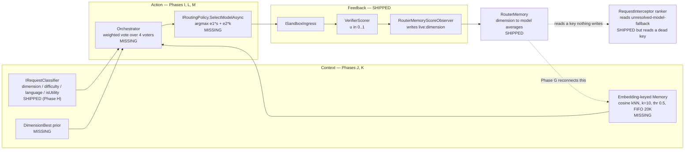

# Current Implementation Plan: Closing the C-A-F Gap

This plan tracks only unfinished work. Completed phases are removed rather than archived; the
narrative for anything already shipped lives in the design doc that owns it.

**Objective.** Bring the running router to the architecture described in
[`../docs/research/technical-reference.md`](../docs/research/technical-reference.md) — a
loop-complete **C-A-F** router (Context → Action → Feedback → Context) built from an **Orchestrator**,
a **Verifier**, and a **Memory**, selecting under the cost-aware reward
`r = ε₁·s + ε₂·κ` and measured by cumulative regret against a per-task oracle.

## Where the gap actually is

The **Feedback** leg is built. The **Action** and **Context** legs are not, and the loop is currently
severed at a single point.

Verified against the code:

- **The loop is severed by a key mismatch.**
  [`TotallyHotArcRouter/Router/RouterMemoryScoreObserver.cs:54`](TotallyHotArcRouter/Router/RouterMemoryScoreObserver.cs)
  writes verifier scores under `live:<inferred_dimension>`. The only production reader —
  [`TotallyHotArcRouter/Proxy/RequestInterceptor.cs:396`](TotallyHotArcRouter/Proxy/RequestInterceptor.cs)
  — reads dimension `"unresolved-model-fallback"`
  ([`:23`](TotallyHotArcRouter/Proxy/RequestInterceptor.cs)), which **no production code ever writes
  to**; only `RequestInterceptorTests` does. Every auto-select therefore falls back to the
  `ColdStartRankingScore` constant forever. This is the highest-leverage defect in the plan: until it
  is fixed, no amount of accumulated feedback can influence a decision.
- **There is no Action leg on the live path.** `AgentAsARouter` is registered
  ([`TotallyHotArcRouter/Hosting/ServiceCollectionExtensions.cs:38`](TotallyHotArcRouter/Hosting/ServiceCollectionExtensions.cs))
  but never invoked; its `IRouterModelClient` is `NotImplementedRouterModelClient`
  ([`TotallyHotArcRouter/Program.cs:81`](TotallyHotArcRouter/Program.cs)). Its `ExploitAsync`
  conflates *selecting* a model with *invoking* one, so it cannot be used by a streaming reverse proxy
  as written.
- **No cost term anywhere.** `IModelPriceCatalog` exists and is cache-backed for inline reads, but no
  selection path consumes it. `RoutingOptions` has no `ε₁`/`ε₂`.
- **Memory is dimension-hashed, not task-keyed.** `RouterMemory` stores
  `dimension → model → List<double>`. `VectorStoreRouterMemoryStore` computes Jaccard token overlap on
  the *dimension string*, not the task, and is wired to no decision. Three `RoutingOptions` knobs —
  `MaxNeighborCount` (10), `MaxCandidates` (8), and `PolicyName` — are declared and asserted in
  `RoutingOptionsTests` but read by no production code: configuration for a decision engine that was
  never built. Per D.3 of the research doc, dimension identity carries only ~27% of the oracle-choice
  entropy — the other ~73% is exactly what task-keyed memory exists to capture.
- **No oracle, no regret, no baselines.** Nothing computes `R_ij`, `CumReg`, `AvgPerf`, or `Perf/$`.
- **The benchmark corpus is absent.** `data/`, `outputs/`, and `agentic-artifacts/` are referenced
  throughout `README.md` and `docs/HANDBOOK.md` but do not exist in this checkout.

### Relationship to `utility-model-routing.md`

[`../docs/router/utility-model-routing.md`](../docs/router/utility-model-routing.md) is the **detailed
component spec** for the classifier, `IRoutingPolicy`, the cost-aware selection loop, and the feedback
write (its §B2–B5). This file is the **roadmap**: phases, ordering, and exit criteria. Detail is not
restated here, so the two cannot drift.

One correction that phase M lands: that doc's locked non-goal — *"Changing how normal,
explicitly-named model requests is out of scope"* — is **superseded**. The paper routes every task,
and this plan now does too, behind an opt-out.

### Settled deferrals (do not re-open without new evidence)

- **Multimodal price tiers** — deferred; no upstream feed publishes a `resolution_tier` concept.
  Rationale: [`../docs/router/model-price-catalog.md`](../docs/router/model-price-catalog.md).
- **Routing ROI / Tool Steps / Context Buffer GUI metrics** — deliberately mock-backed; each needs a
  domain concept the codebase does not compute. Rationale:
  [`../docs/gui/backlog.md`](../docs/gui/backlog.md), Cost Analytics bullet.
- **Reasoning-token pricing** — `UsageInfo.ReasoningTokens` exists with no matching price column;
  reasoning tokens bill at the standard output rate. Noted, unscoped.

---

## Active Phases

### Phase G: Reconnect the feedback loop — **prerequisite for everything below**

The smallest change with the largest effect: make the dimension the Verifier writes and the dimension
the router reads the *same value by construction*, rather than two independently-chosen string
constants that happen not to match.

- Introduce a single dimension contract (a `RouterDimension` type or shared helper) owning the
  `live:` prefix and the canonical dimension vocabulary from research-doc §4.4. Both
  `RouterMemoryScoreObserver` and every reader construct keys through it; neither hand-writes a
  literal.
- Retire the `"unresolved-model-fallback"` literal. The fallback ranker in
  [`TotallyHotArcRouter/Proxy/RequestInterceptor.cs`](TotallyHotArcRouter/Proxy/RequestInterceptor.cs)
  reads the classified dimension for the request in flight (Phase H supplies it; until then, the
  inferred dimension of the prompt).
- Keep `ColdStartRankingScore` as the genuine cold-start prior, but it must now be reachable *only*
  when memory is truly empty — not because the read key can never match.
- **Regression test that would have caught this:** ingest a scored sandbox result, then assert a
  subsequent auto-select for a same-dimension prompt ranks by that score. Today that test fails.
- Exit: an end-to-end test proves a verifier score written on request *N* changes the model selected
  on request *N+1*. Zero literal dimension strings outside the contract type.

### Phase I: Selection-only routing policy and the cost-aware reward (the Action leg)

- Introduce `IRoutingPolicy.SelectModelAsync(RoutingContext, CancellationToken) → ModelName`. Selection
  must be **decoupled from generation** so the existing streaming forward in `ProxyMiddleware` stays
  untouched. Spec: [`../docs/router/utility-model-routing.md`](../docs/router/utility-model-routing.md) §B3.
- **Refactor `AgentAsARouter` to selection-only.** Extract the choice logic from `ExploitAsync`/
  `ExploreAsync` into a method returning a model name without calling `IRouterModelClient`. Once no
  decision path invokes a model, `NotImplementedRouterModelClient`
  ([`TotallyHotArcRouter/Program.cs:81`](TotallyHotArcRouter/Program.cs)) is deleted rather than
  implemented.
- Add `ε₁`/`ε₂` to `RoutingOptions`, defaulting to the paper's canonical `(1, -0.1)`, with per-tier
  overrides for the utility aliases.
- Wire the κ term to `IModelPriceCatalog.GetFreshPriceForRouting` — in-memory read only, never an
  awaited fetch on the hot path. **Unpriced ≠ free:** a candidate with no price fresher than 24h is
  excluded from cost ranking and reachable only via exploration; an `IsFree` provider is κ = 0 and is
  exempt from the freshness gate. A catalog miss degrades to cold-start, never to a network call.
- Quality gate: drop candidates below `UtilityMinQualityScore`. `s == null` is *unobserved*, not bad —
  deliberately the inverse polarity of the price rule.
- Exit: policy unit-tested against a stubbed catalog and in-memory memory for every case enumerated in
  that doc's verification plan, including the `IsFree`-exempt-from-freshness case and the unpriced
  exclusion. No SQLite or network in tests.

### Phase J: Embedding-keyed Memory

Replaces dimension-hashed lookup with the paper's per-task vector store — the component that addresses
the ~73% of routing signal dimension identity cannot express.

- **Embeddings are local ONNX (BGE-large).** Add `IEmbeddingClient` with an in-process
  `Microsoft.ML.OnnxRuntime` implementation. No network hop inline with routing, no dependency on an
  operator having configured an embeddings-capable provider. Scope explicitly includes the tokenizer,
  model-artifact acquisition/caching, and a documented cold-start path for a first run before the model
  is present.
- `MemoryEntry`: task embedding (key) → chosen model, observed score `s`, monetary cost `κ`, and the
  Verifier trace, per research-doc §3.3.
- Retrieval to the paper's parameters: cosine kNN, similarity threshold **0.5**, **k=10** (wire the
  already-configured, currently-ignored `RoutingOptions.MaxNeighborCount`), **FIFO-bounded at 20,000
  entries**, committed in-place after each loop.
- Persist via SQLite — already a dependency (`PriceCatalogDatabase`) — with brute-force cosine over the
  in-memory working set. At a 20K FIFO bound this is well inside the hot-path budget; a vector index is
  not warranted and should not be introduced speculatively.
- **Delete `VectorStoreRouterMemoryStore`.** Its Jaccard-over-dimension-strings similarity is not an
  approximation of this design; keeping it invites a future caller to mistake it for one.
- Keep `RouterMemory`'s dimension averages — they become the DimensionBest voter's backing store in
  Phase L, not dead code.
- Exit: kNN retrieval unit-tested for threshold, k, and FIFO eviction; a similar-task lookup returns
  the model that previously succeeded on a near-duplicate prompt. Embedding + retrieval stays within
  the 5-second heavy-test bound.

### Phase K: Restore CodeRouterBench

Prerequisite for the DimensionBest and logreg voters (Phase L) and the entire regret harness
(Phase N). Also closes a live documentation defect: `README.md` and `docs/HANDBOOK.md` both describe
`data/`, `outputs/`, and `agentic-artifacts/` as present.

- Restore the canonical tables from the published Hugging Face dataset named in `README.md`:
  `id_results_long.csv`, `id_probing_results_long.csv`, `id_test_results_long.csv`,
  `ood176_results_long.csv`, `id_tasks.jsonl`, `ood176_tasks.jsonl`, `models.json`, `summary.json`.
- Verify integrity against the counts the handbook asserts (9,999 × 8 = 79,992; 7,080 × 8 = 56,640;
  2,919 × 8 = 23,352; 176 × 8 = 1,408) and fail loudly on mismatch rather than proceeding.
- Decide and document the checked-in-vs-fetched question — these are large files and the repo has no
  Python pipeline to regenerate them. If fetched, the fetch must be reproducible and integrity-checked.
- Reconcile `README.md` and `docs/HANDBOOK.md` with whatever is actually true afterwards, including the
  removed `scripts/export_coderouterbench.py` / `build_ood176_dataset.py` references.
- Exit: a loader reads the probing split and produces a dimension × model matrix matching research-doc
  Table 10 to published precision.

### Phase L: The Orchestrator ensemble

Four voters, weighted vote, argmax — research-doc §3.3 and A.1.

- **`dim_best`** — DimensionBest lookup from the Phase K probing matrix, refined by live
  `RouterMemory` averages.
- **`memory_kNN`** — top-10 neighbors from Phase J, voting by neighbor-weighted observed reward.
- **`logreg`** — TF-IDF → logistic regression trained on the probing set. Training and inference both
  in .NET; a checked-in trained model with a documented, reproducible training step.
- **`llm_router`** — **the paper's own fine-tuned Qwen3.5-0.8B, hosted locally via ONNX Runtime**
  (`Microsoft.ML.OnnxRuntime`, the same dependency Phase J adds for embeddings), not a call to a
  configured remote/hosted backend. This is a correction to this plan's earlier draft, which proposed
  substituting "a configured cheap backend" because the stack "cannot host" the fine-tune — that
  premise doesn't hold: Phase J already commits to in-process ONNX inference with local
  model-artifact acquisition/caching, and a 0.8B causal LM is squarely in that same class of
  local-model problem. Reusing a remote backend instead would be a static, network-dependent
  substitute for the one voter the paper's central finding is *about* — see the information-deficit
  result below — so it is the one voter this plan should least want to approximate.
  - **Scope beyond Phase J.** Embedding inference is a single forward pass; this voter is
    autoregressive generation (tokenizer, KV-cache, sampling, one forward pass per output token) over
    the **+Perf-stats prompt** of research-doc Appendix B.3 — the ablation the paper measures at 47.74
    AvgPerf, *above* DimensionBest (47.50), the entire information-deficit finding this voter exists to
    reproduce. Scope explicitly includes: sourcing/exporting the fine-tuned Qwen3.5-0.8B weights to
    ONNX (or the closest available fine-tune-compatible open checkpoint, documented if substituted),
    the tokenizer, and a documented cold-start path for a first run before the model is present —
    mirroring Phase J's cold-start requirement, not inventing a new one.
  - Implement the four-step response-parsing fallback chain (JSON → fenced-block regex → model-name
    match → default) verbatim; the paper shows a parser failure collapses a router to ~41.31.
  - **Cost control:** invoke this voter only when the three local voters disagree. Record the
    disagreement rate in telemetry so the trigger can be tuned against real traffic rather than guessed.
    Generation latency (not network cost) is the resource being rationed here, so this gate matters even
    though there is no remote spend to control.
  - Must degrade to a three-voter vote — never to a hard failure — when the model artifact isn't
    present yet, generation exceeds a configured time budget, or the parse chain exhausts. There is no
    circuit breaker here (nothing remote to trip one): the failure modes are local-model-unavailable and
    local-generation-timeout, not an unreachable backend.
  - Stays within the 5-second heavy-test bound (AGENTS.md); if a full unquantized 0.8B decode can't
    clear that bound in CI, gate the heavy path behind the same kind of fixture/environment gate Phase J
    uses for its embedding-model load, per the Final Validation Gate's item 4.
- Voter weights and per-voter enablement are configuration. Log the full vote breakdown (each voter's
  pick, each weighted score, the argmax) into `RoutingDecision.CandidateScores` so the GUI's decision
  log shows *why*, not just *what*.
- Exit: a reproduction of the worked example in research-doc §3.3 — voters picking MiniMax-M2.7 / GLM-5
  / Kimi-K2.5 / Kimi-K2.5 resolve to Kimi-K2.5 at 1.47 — passes as a unit test. Ensemble beats every
  single voter on the Phase N harness.

### Phase M: Route all traffic (opt-out)

- The Orchestrator becomes the default path for **every** request, not only `agentic-router`, `auto`,
  the utility aliases, and unresolved names. An explicitly-named model becomes a strong prior/voter
  rather than a command.
- Ship `ModelRouting.HonorRequestedModel` (opt-out) plus a per-request escape for pinning. `--model`
  single-model serving continues to win unconditionally.
- **This is a behavior change for every existing client.** Requirements: the response and telemetry
  must always surface *requested vs. routed* model; the GUI decision log must make a substitution
  visible at a glance; and the opt-out must be discoverable in `docs/` and the GUI, not only in
  `appsettings.json`.
- Update [`../docs/router/utility-model-routing.md`](../docs/router/utility-model-routing.md)'s
  non-goals section to record that this supersedes it, and why.
- Exit: a named-model request routes through the Orchestrator by default; `HonorRequestedModel = true`
  restores today's exact behavior byte-for-byte, proven by the existing allowlist test suite passing
  unchanged under that flag.

### Phase N: Regret evaluation harness

Makes every phase above measurable instead of asserted.

- Implement the metrics of research-doc §5.1 and A.2: reward matrix `R_ij = ε₁·s_ij + ε₂·κ_ij`,
  per-task oracle `a*_i = argmax_j R_ij`, cumulative regret `CumReg_N = Σ(r*_i − r_i(a_i))`, plus
  `AvgPerf`, `TotTok`, `$Total`, and `Perf/$`.
- Offline streaming replay over the restored matrices — no live API calls, matching the handbook's
  "no API keys required" property.
- Implement the comparison baselines as C-A-F configurations (research-doc Table 4): Always-*m*,
  DimensionBest, frozen-kNN retrieval, LogReg, and the LinUCB/LinTS contextual bandits
  (`α = λ = 1`; `v = 0.5, λ = 1`; warm-started on the probing set, seed 42).
- **Exit — the real acceptance criterion for this whole plan:** on the restored ID test split the
  Orchestrator reproduces the paper's regret *ordering* (ArcRouter < DimensionBest < static
  classifiers < bandits < single models) and beats DimensionBest on `CumReg`. Absolute parity with
  205.5 is not expected — the model pool, the verifier, and the embedding model all differ — and
  claiming it would be dishonest. Ordering is the falsifiable claim; publish the numbers actually
  obtained either way.

---

## Final Validation Gate

Applies at the end of every phase, per [`../AGENTS.md`](../AGENTS.md):

1. `dotnet build` passes with zero warnings and zero errors (`TreatWarningsAsErrors` is on repo-wide).
2. Every new public/protected type and member carries accurate XML documentation; docs on code changed
   by a phase are re-read for staleness, which the compiler cannot check.
3. All unit tests pass; both non-GUI assemblies hold ≥ 80% line coverage per-assembly, as
   `.github/workflows/dotnet-ci.yml` measures it. `TotallyHot.ArcRouter.Sandbox` sits at ~80.1%, so
   phases touching it must add coverage, not just avoid removing it.
4. No unusually heavy test exceeds 5 seconds. Phase J and Phase N are the live risks here — the
   embedding model load and the replay harness both belong behind fixtures or environment gates.
5. Every routing decision is logged through Serilog with a **static** message template and structured
   properties. The vote breakdown, the chosen model, and the reward terms are audit-trail data, not
   debug output.
6. Documentation matches delivered behavior — including `README.md` and `docs/HANDBOOK.md`, which are
   currently inaccurate about `data/`, `outputs/`, and `agentic-artifacts/` (Phase K).
7. Any item deferred during a phase is recorded with its evidence, in the doc that owns the component,
   and summarized in one line under "Settled deferrals" above.
