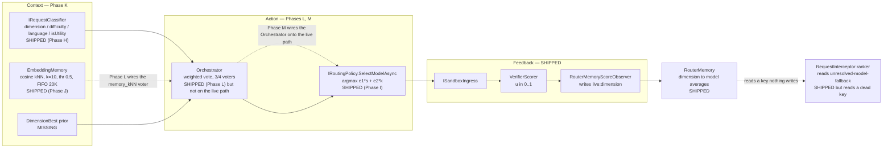

# Current Implementation Plan: Closing the C-A-F Gap

This plan tracks only unfinished work. Completed phases are removed rather than archived; the
narrative for anything already shipped lives in the design doc that owns it.

**Objective.** Bring the running router to the architecture described in
[`../docs/research/technical-reference.md`](../docs/research/technical-reference.md) — a
loop-complete **C-A-F** router (Context → Action → Feedback → Context) built from an **Orchestrator**,
a **Verifier**, and a **Memory**, selecting under the cost-aware reward
`r = ε₁·s + ε₂·κ` and measured by cumulative regret against a per-task oracle.

## Where the gap actually is

The **Feedback** leg is built. The **Action** and **Context** legs are not, and the loop is currently
severed at a single point.

Verified against the code:

- **The loop reconnection is complete (Phase G shipped).** Both reader and writer now construct dimension
  keys through a shared `RouterDimension.ToLiveKey` contract, eliminating the former mismatch where
  [`TotallyHotArcRouter/Router/RouterMemoryScoreObserver.cs`](TotallyHotArcRouter/Router/RouterMemoryScoreObserver.cs)
  wrote `live:<inferred_dimension>` but the fallback reader in
  [`TotallyHotArcRouter/Proxy/RequestInterceptor.cs`](TotallyHotArcRouter/Proxy/RequestInterceptor.cs)
  read the dead key `"unresolved-model-fallback"`. Accumulated feedback now influences routing decisions.
- **The Action leg is on the live path (Phase I shipped).** `IRoutingPolicy`/`RoutingContext` exist
  ([`TotallyHotArcRouter/Router/IRoutingPolicy.cs`](TotallyHotArcRouter/Router/IRoutingPolicy.cs)),
  `CompositeRoutingPolicy` is the registered default, and `RequestInterceptor.ResolveAgenticRouteAsync`
  consults it for the router alias and the unresolved-model fallback. `AgentAsARouter` is
  selection-only (`SelectModelAsync`, no `IRouterModelClient`); `NotImplementedRouterModelClient` and
  `RoutingResult` are deleted. See [`../docs/router/utility-model-routing.md`](../docs/router/utility-model-routing.md)
  §B3-B5 for what shipped exactly as specified versus documented narrowing (no per-tier utility
  weighting, no utility-side exploration, no dedicated utility feedback signal).
- **The cost term is wired for utility traffic.** `UtilityRoutingPolicy` consumes
  `IModelPriceCatalog.GetFreshPriceForRouting`; `RoutingOptions` has `Epsilon1`/`Epsilon2`/
  `UtilityMinQualityScore`. The general (non-utility) path still has no cost term - `AgentRouterPolicy`
  delegates to `AgentAsARouter`'s memory-only ranking, unchanged from before Phase I.
- **Task-embedding-keyed memory exists but is not yet on the decision path (Phase J shipped).**
  [`TotallyHotArcRouter/Router/Embeddings/OnnxEmbeddingClient.cs`](TotallyHotArcRouter/Router/Embeddings/OnnxEmbeddingClient.cs)
  embeds task text locally via ONNX Runtime + BGE-large-en-v1.5 (model/tokenizer artifacts cached on
  first use); [`TotallyHotArcRouter/Router/EmbeddingMemory.cs`](TotallyHotArcRouter/Router/EmbeddingMemory.cs)
  holds the working set and answers cosine kNN queries (`RoutingOptions.EmbeddingSimilarityThreshold`
  = 0.5, `MaxNeighborCount` = 10), evicting FIFO past `EmbeddingMemoryCapacity` (20,000), persisted via
  [`TotallyHotArcRouter/Router/SqliteMemoryEntryStore.cs`](TotallyHotArcRouter/Router/SqliteMemoryEntryStore.cs)
  in its own SQLite file. `VectorStoreRouterMemoryStore`'s Jaccard-over-dimension-strings similarity is
  deleted. `EmbeddingMemory.FindNearest` is now called by Phase L's `MemoryKnnVoter`, and
  `RouterMemory`'s `dimension → model → List<double>` averages are `DimBestVoter`'s backing store - but
  neither is on the *live* routing decision path yet, since the Orchestrator itself isn't (Phase M).
  Per D.3 of the research doc, dimension identity carries only ~27% of the oracle-choice entropy - the
  other ~73% is exactly what this task-keyed memory exists to capture, once Phase M puts the Orchestrator
  on the live path.
- **No oracle, no regret, no baselines.** Nothing computes `R_ij`, `CumReg`, `AvgPerf`, or `Perf/$`.
- **The benchmark corpus is restored, sync-on-demand into SQLite (Phase K shipped, superseded by Phase
  K2, also shipped).** Governance → Benchmark Data, the `sync_benchmark_data` MCP tool, or
  `--sync-benchmark-data` sync the eight canonical CodeRouterBench tables from
  [`huggingface.co/datasets/Lance1573/CodeRouterBench`](https://huggingface.co/datasets/Lance1573/CodeRouterBench)
  into `coderouterbench.db` (not checked in - see `data/README.md`), verifying each file's git blob
  SHA-1 checksum and row count and failing loudly on mismatch.
  [`TotallyHotArcRouter/CodeRouterBench/DimensionModelScoreMatrix.cs`](TotallyHotArcRouter/CodeRouterBench/DimensionModelScoreMatrix.cs)'s
  `FromDatabase` loads a split into a dimension x model score matrix - the `dim_best` voter's future
  backing store (Phase L). `outputs/` and `agentic-artifacts/`, which the same upstream dataset also
  publishes, are not restored; nothing in Phases K/L/N as currently scoped reads them (`data/README.md`'s
  "Not yet restored" section).

### Relationship to `utility-model-routing.md`

[`../docs/router/utility-model-routing.md`](../docs/router/utility-model-routing.md) is the **detailed
component spec** for the classifier, `IRoutingPolicy`, the cost-aware selection loop, and the feedback
write (its §B2–B5). This file is the **roadmap**: phases, ordering, and exit criteria. Detail is not
restated here, so the two cannot drift.

One correction that phase M lands: that doc's locked non-goal — *"Changing how normal,
explicitly-named model requests is out of scope"* — is **superseded**. The paper routes every task,
and this plan now does too, behind an opt-out.

### Settled deferrals (do not re-open without new evidence)

- **Multimodal price tiers** — deferred; no upstream feed publishes a `resolution_tier` concept.
  Rationale: [`../docs/router/model-price-catalog.md`](../docs/router/model-price-catalog.md).
- **Routing ROI / Tool Steps / Context Buffer GUI metrics** — deliberately mock-backed; each needs a
  domain concept the codebase does not compute. Rationale:
  [`../docs/gui/backlog.md`](../docs/gui/backlog.md), Cost Analytics bullet.
- **Reasoning-token pricing** — `UsageInfo.ReasoningTokens` exists with no matching price column;
  reasoning tokens bill at the standard output rate. Noted, unscoped.
- **CodeRouterBench `outputs/`, `agentic-artifacts/`, and nested `raw_matrices/`** — not restored;
  nothing in Phases K/L/N as currently scoped reads them. Rationale: `data/README.md`'s "Not yet
  restored" section.
- **Exact per-cell Table 10 parity for GLM-5/Qwen3-Max/Qwen3.5-Plus/MiniMax-M2.7** — `bug_fixing`,
  `algorithm`, and `test_generation` cells for these four models diverge from the published table by up
  to 0.32 even though row averages (AvgPerf) match within 0.05 for every model; looks like run-to-run
  LLM-as-Judge noise baked into the released CSV, not a parsing bug. Rationale: `data/README.md`'s
  "Known data-fidelity limit" section, PLAN.md Phase K.

---

## Active Phases

### Phase G: Reconnect the feedback loop — **prerequisite for everything below**

The smallest change with the largest effect: make the dimension the Verifier writes and the dimension
the router reads the *same value by construction*, rather than two independently-chosen string
constants that happen not to match.

- Introduce a single dimension contract (a `RouterDimension` type or shared helper) owning the
  `live:` prefix and the canonical dimension vocabulary from research-doc §4.4. Both
  `RouterMemoryScoreObserver` and every reader construct keys through it; neither hand-writes a
  literal.
- Retire the `"unresolved-model-fallback"` literal. The fallback ranker in
  [`TotallyHotArcRouter/Proxy/RequestInterceptor.cs`](TotallyHotArcRouter/Proxy/RequestInterceptor.cs)
  reads the classified dimension for the request in flight (Phase H supplies it; until then, the
  inferred dimension of the prompt).
- Keep `ColdStartRankingScore` as the genuine cold-start prior, but it must now be reachable *only*
  when memory is truly empty — not because the read key can never match.
- **Regression test:** an end-to-end test ingests a scored sandbox result, then asserts a
  subsequent auto-select for a same-dimension prompt ranks by that score. This test verifies
  the feedback loop reconnection.
- Exit: Zero literal dimension strings outside the contract type. Every verifier score written on request
  *N* propagates to influence model selection on request *N+1*.

### Phase K: Restore CodeRouterBench — **shipped, superseded by Phase K2**

Historical record of the original fetch-to-disk shape. Phase K2 below replaced every mechanism this
section describes (`scripts/fetch-coderouterbench.sh`, `data/coderouterbench/`,
`CodeRouterBenchCsvReader`'s file-path entry point) with the SQLite sync; nothing in the codebase still
does what this section says. Left as-is for the reasoning trail, not as current behavior.

Prerequisite for the DimensionBest and logreg voters (Phase L) and the entire regret harness (Phase N).

- Restored the canonical tables from the published Hugging Face dataset
  (`huggingface.co/datasets/Lance1573/CodeRouterBench`), named in `docs/README.md`:
  `id_results_long.csv`, `id_probing_results_long.csv`, `id_test_results_long.csv`,
  `ood176_results_long.csv`, `id_tasks.jsonl`, `ood176_tasks.jsonl`, `models.json`, `summary.json`, via
  `scripts/fetch-coderouterbench.sh`.
- The script verifies integrity against the counts the handbook asserts (9,999 × 8 = 79,992;
  7,080 × 8 = 56,640; 2,919 × 8 = 23,352; 176 × 8 = 1,408) and fails loudly, deleting the partial file,
  on any mismatch.
- **Decided: fetched, not checked in.** At ~137 MB total this is large for a git checkout and the
  dataset already has a stable, versioned home on Hugging Face; `data/coderouterbench/` is gitignored.
  `data/README.md` (new) documents the fetch, the file list, and what remains unrestored.
  `outputs/`, `agentic-artifacts/`, and the nested `raw_matrices/` audit trail the same dataset also
  publishes are explicitly deferred - nothing in Phases K/L/N as currently scoped reads them.
- Reconciled `README.md`, `docs/README.md`, and `docs/HANDBOOK.md`: they now describe the data as
  fetched-on-demand rather than checked-in, no longer claim `data/matrices/`, `data/id/`, `data/ood/`,
  `outputs/`, or `agentic-artifacts/` are present, and the `scripts/export_coderouterbench.py` /
  `build_ood176_dataset.py` references are marked as removed-tooling history, not live paths.
- Exit criterion met with a documented deferral: `CodeRouterBenchCsvReader` + `DimensionModelScoreMatrix`
  load the probing split into a dimension × model matrix, and
  `CodeRouterBenchTable10ReconciliationTests` (network/file-gated, like `LiteLlmParityTests`) checks it
  against research-doc Table 10. **Settled deferral:** per-model row averages (AvgPerf) match Table 10
  to within 0.05 for all eight models, and every cell matches to within 0.01 for Claude Opus 4.6,
  GPT-5.4, Claude Sonnet 4.6, and Kimi-K2.5 - but individual `bug_fixing`, `algorithm`, and
  `test_generation` cells for GLM-5, Qwen3-Max, Qwen3.5-Plus, and MiniMax-M2.7 diverge from the
  published table by up to 0.32. The errors are large in both directions and largely cancel in the row
  average, consistent with run-to-run noise in the LLM-as-Judge-scored dimensions (research-doc Table 5)
  baked into the released CSV rather than a parsing bug here. Full evidence in `data/README.md`. Exact
  per-cell parity is not pursued further, matching Phase N's own "ordering, not absolute parity"
  standard applied one phase earlier.
- **Model-id canonicalization (added after Phase K shipped):** the released tables and the router's
  configured `ModelName` vocabulary disagree on casing and version separators, so the loader maps the
  `model` column through `Models/ModelNameCanonicalizer.cs`, which collapses every spelling of a model
  onto one comparison key. It emits a *key*, never a name - the configured vocabulary is
  operator-authored and internally inconsistent (`claude-opus-4.6` is dotted, `claude-opus-4-8` dashed),
  so no rule can generate it. `ConfigModelIdentityResolver` shares the same normalization stages, applied
  one at a time to keep its `ResolutionRung` ladder's approximate-match labeling intact.

### Phase K2: Move CodeRouterBench into SQLite — **shipped, precedes Phase L**

Supersedes Phase K's fetch-to-disk model. The corpus moved out of `data/coderouterbench/` and into its
own `coderouterbench.db`, synchronized on demand from the same Hugging Face dataset and checked for
staleness at every application start against the git blob SHA-1 the dataset publishes. A Governance >
Benchmark Data pane exposes the state as a single button ("Current" / "Update" / "Check Failed"), with
`sync_benchmark_data`/`get_benchmark_data_status` MCP tools and a `--sync-benchmark-data` CLI flag
replacing the now-removed `scripts/fetch-coderouterbench.sh` for headless use.

Sequenced before Phase L on purpose: Phase L's `dim_best` voter and Phase N's regret harness are this
data's consumers, and pointing them at a file loader first would have meant writing that wiring twice.
`DimensionModelScoreMatrix.FromDatabase` is that backing store's read path; `FromRows` remains for
in-memory aggregation (e.g. tests) but nothing production reads a file path anymore.

`id_results_long.csv` and `id_tasks.jsonl` are derived rather than stored — each is the verified exact
union of its probing and test counterparts, discriminated by the `split` column already present in the
data — which drops the sync from ~21.5 MB to ~11.7 MB and stored result rows from ~171k to ~91k.

Full plan, schema, and phase breakdown:
[`docs/router/coderouterbench-sqlite-migration-plan.md`](../docs/router/coderouterbench-sqlite-migration-plan.md).

### Phase L: The Orchestrator ensemble — **shipped (4 of 4 voters; `llm_router` is a documented substitute, not the paper's voter)**

Four voters, weighted vote, argmax — research-doc §3.3 and A.1. Shipped as a self-contained,
DI-registered component: `OrchestratorRoutingPolicy` implements `IRoutingPolicy` and is registered in
`AddTotallyHotArcRouter`, but it is **not** the registered `IRoutingPolicy` — `CompositeRoutingPolicy`
keeps that role unchanged. Swapping the Orchestrator onto the live path for every request is Phase M's
job, deliberately not this one's.

- **`dim_best`** (`Router/Orchestrator/DimBestVoter.cs`) — looks up `DimensionModelScoreMatrix`'s
  probing-split prior (Phase K2's `BenchmarkDatabase`) for each candidate, preferring the live
  `RouterMemory.GetAverageScore` for the same (dimension, model) pair when one exists and falling back
  to the prior otherwise — live, execution-grounded feedback always wins once it exists. Tolerates an
  unsynced corpus (checks `BenchmarkDatabase.DatabasePath` for existence before opening a connection, so
  it never creates an empty database file as a side effect) by degrading to live-memory-only scoring,
  matching `CodeRouterBenchTable10ReconciliationTests`'s own handling of the same condition.
- **`memory_kNN`** (`Router/Orchestrator/MemoryKnnVoter.cs`) — calls `EmbeddingMemory.FindNearest`,
  computes the similarity-weighted average observed score per model among the neighbors restricted to
  current candidates, argmax. Abstains without a supplied task embedding or when no neighbor clears the
  similarity threshold.
- **`logreg`** — **historical record; superseded by `docs/router/live-feedback-learning-plan.md` Phase 3
  and Phase 6.** `Router/Orchestrator/LogRegVoter.cs` now scores `VotingContext.TaskEmbedding` against an
  `EmbeddingLogRegModelArtifact`, not the TF-IDF design described below. `CodeRouterBench/LogRegTrainer.cs`
  remains only as Phase N's static comparison baseline and no longer trains against the Phase K2 probing
  split — CodeRouterBench never publishes task text for the ID splits (`id_probing_tasks.jsonl`/
  `id_test_tasks.jsonl` carry only `task_id`/`split`/`source_split`/`dimension`), so it trains from the OOD
  split instead, the only one with published `prompt` text. There is no checked-in placeholder artifact
  anymore (`CodeRouterBench/Resources/logreg_voter_model.json` was deleted — it had no remaining consumer).
  Nothing in the paragraph below reflects current behavior; kept for the reasoning trail.

  ~~TF-IDF over a fixed vocabulary → a plain-C# one-vs-rest logistic regression (no external ML package),
  trained by `LogRegTrainer.Train` against the Phase K2 probing split and checked in as
  `CodeRouterBench/Resources/logreg_voter_model.json` (embedded resource). **Data-availability caveat:**
  `coderouterbench.db` was not synced in the environment this phase was implemented in (it is
  sync-on-demand per `data/README.md`, not checked in), so the checked-in artifact is a small, explicitly
  `IsPlaceholder`-flagged hand-built stand-in that exercises the tokenize → TF-IDF → score → argmax →
  abstain-without-text mechanics deterministically but carries no real predictive signal.
  `LogRegTrainerReconciliationTests.Train_OnRealCorpus_ProducesAUsableArtifact` is the documented,
  reproducible training step — self-skips like `CodeRouterBenchTable10ReconciliationTests` when the
  corpus isn't synced; run it against a synced `coderouterbench.db` and serialize its output over the
  placeholder to ship a real model.~~
- **`llm_router`** (`Router/Orchestrator/LlmRouterVoter.cs`) — **real, but a documented substitute for
  the paper's voter, agreed with the user ahead of implementation.** The paper's own fine-tuned
  Qwen3.5-0.8B checkpoint was never published anywhere (confirmed by search before implementation
  began), so it cannot be hosted regardless of runtime choice. This voter instead prompts a small,
  off-the-shelf, *un*-fine-tuned instruct model (Qwen2.5-0.5B-Instruct) locally via ONNX Runtime GenAI
  (`Microsoft.ML.OnnxRuntimeGenAI` — owns KV-cache/sampling internally, so no hand-rolled
  autoregressive-generation loop was needed), using research-doc Appendix B.3's **zero-shot** prompt
  (not the few-shot or +Perf-stats variants — those need oracle-labeled example curation from
  CodeRouterBench, a materially separate project) and a three-stage response-parsing fallback chain
  (JSON → fenced-block regex → model-name match; the paper's fourth stage, a hardcoded fallback model,
  becomes an abstention instead — see `LlmRouterVoter`'s remarks for why). No disagreement-gated
  invocation cost control — it runs on every decision like the other three voters, gated only by
  `RoutingOptions.EnableLlmRouterVoter`/`LlmRouterVoterWeight`. The default model artifact source
  (`Models/LlmRouterOptions.cs`) is a community-maintained Hugging Face export, not an official
  Microsoft one, pinned to its CPU build (`cpu_and_mobile/cpu-int4-rtn-block-32-acc-level-4`) because
  that repository publishes nothing at its root — every artifact sits under a per-execution-provider
  subfolder, and the graph's ~862 MB of weights are external, so `model.onnx.data` is a required
  download, not an optional one. If it ever stops resolving, the voter just abstains permanently — the exact
  "must degrade to a three-voter vote, never a hard failure, when the model artifact isn't present"
  path this phase originally required, still exercised, just no longer the *only* path this voter takes.
- Voter weights and per-voter enablement are configuration (`RoutingOptions.DimBestVoterWeight` /
  `MemoryKnnVoterWeight` / `LogRegVoterWeight` / `LlmRouterVoterWeight` and matching `Enable*Voter`
  flags). `OrchestratorRoutingPolicy` logs the full vote breakdown into `RoutingDecision.CandidateScores`:
  a per-model aggregate weighted score (what argmax runs over) plus every individual non-abstaining vote
  keyed `voter:{voterName}:{modelName}` — "each voter's pick, each weighted score, the argmax" — via
  static-template Serilog logging alongside it.
- Exit: `OrchestratorRoutingPolicyTests.DecideAsync_ResearchDocWorkedExample_ResolvesToKimiK25AtWeightedScore1_47`
  reproduces research-doc §3.3's worked example — voters picking MiniMax-M2.7 / GLM-5 / Kimi-K2.5 /
  Kimi-K2.5 resolve to Kimi-K2.5 at weighted score 1.47 — with fakes standing in for all four voters. The
  default voter weights (`dim_best` = 0.9, `memory_kNN` = 0.57, `logreg` = 0.43, `llm_router` = 0.64) are
  a documented implementation choice sized to reproduce this exact example (0.9 + 0.57 = 1.47), not a
  value the research doc publishes independently — see `RoutingOptions.DimBestVoterWeight`'s XML doc.
  "Ensemble beats every single voter on the Phase N harness" is **not yet measured** — Phase N's regret
  harness does not exist yet, so this half of the original exit criterion carries forward to Phase N.

**Settled deferral (updated when `llm_router` was filled in):** `llm_router` prompts an off-the-shelf,
un-fine-tuned small instruct model (Qwen2.5-0.5B-Instruct via ONNX Runtime GenAI), not the paper's
fine-tuned Qwen3.5-0.8B checkpoint — that checkpoint was never published, so no implementation choice
could have reproduced it; this is the plan's own documented escape hatch for exactly that situation,
agreed with the user ahead of implementation. Sub-deferrals carried forward with it: zero-shot prompting
only (no few-shot examples, no +Perf-stats ablation variant), no disagreement-gated invocation, and a
community-sourced (not officially Microsoft-published) default model artifact URL — see
`LlmRouterVoter`'s and `LlmRouterOptions`'s remarks for the full reasoning on each. The `logreg`
placeholder-artifact deferral this paragraph originally recorded is resolved and superseded by
`docs/router/live-feedback-learning-plan.md` (Phases 1-3, 6): the live voter no longer reads a checked-in
artifact at all (it scores task embeddings, abstaining cleanly with none present), and `LogRegTrainer` /
`LogRegTrainerReconciliationTests` now train Phase N's static comparison baseline from the OOD split.

### Phase M: Route all traffic (opt-out)

- The Orchestrator becomes the default path for **every** request, not only `agentic-router`, `auto`,
  the utility aliases, and unresolved names. An explicitly-named model becomes a strong prior/voter
  rather than a command.
- Ship `ModelRouting.HonorRequestedModel` (opt-out) plus a per-request escape for pinning. `--model`
  single-model serving continues to win unconditionally.
- **This is a behavior change for every existing client.** Requirements: the response and telemetry
  must always surface *requested vs. routed* model; the GUI decision log must make a substitution
  visible at a glance; and the opt-out must be discoverable in `docs/` and the GUI, not only in
  `appsettings.json`.
- Update [`../docs/router/utility-model-routing.md`](../docs/router/utility-model-routing.md)'s
  non-goals section to record that this supersedes it, and why.
- Exit: a named-model request routes through the Orchestrator by default; `HonorRequestedModel = true`
  restores today's exact behavior byte-for-byte, proven by the existing allowlist test suite passing
  unchanged under that flag.

### Phase N: Regret evaluation harness

Makes every phase above measurable instead of asserted.

- Implement the metrics of research-doc §5.1 and A.2: reward matrix `R_ij = ε₁·s_ij + ε₂·κ_ij`,
  per-task oracle `a*_i = argmax_j R_ij`, cumulative regret `CumReg_N = Σ(r*_i − r_i(a_i))`, plus
  `AvgPerf`, `TotTok`, `$Total`, and `Perf/$`.
- Offline streaming replay over the restored matrices — no live API calls, matching the handbook's
  "no API keys required" property.
- Implement the comparison baselines as C-A-F configurations (research-doc Table 4): Always-*m*,
  DimensionBest, frozen-kNN retrieval, LogReg, and the LinUCB/LinTS contextual bandits
  (`α = λ = 1`; `v = 0.5, λ = 1`; warm-started on the probing set, seed 42).
- **Exit — the real acceptance criterion for this whole plan:** on the restored ID test split the
  Orchestrator reproduces the paper's regret *ordering* (ArcRouter < DimensionBest < static
  classifiers < bandits < single models) and beats DimensionBest on `CumReg`. Absolute parity with
  205.5 is not expected — the model pool, the verifier, and the embedding model all differ — and
  claiming it would be dishonest. Ordering is the falsifiable claim; publish the numbers actually
  obtained either way.

---

## Final Validation Gate

Applies at the end of every phase, per [`../AGENTS.md`](../AGENTS.md):

1. `dotnet build` passes with zero warnings and zero errors (`TreatWarningsAsErrors` is on repo-wide).
2. Every new public/protected type and member carries accurate XML documentation; docs on code changed
   by a phase are re-read for staleness, which the compiler cannot check.
3. All unit tests pass; both non-GUI assemblies hold ≥ 80% line coverage per-assembly, as
   `.github/workflows/dotnet-ci.yml` measures it. `TotallyHot.ArcRouter.Sandbox` sits at ~80.1%, so
   phases touching it must add coverage, not just avoid removing it.
4. No unusually heavy test exceeds 5 seconds. Phase J and Phase N are the live risks here — the
   embedding model load and the replay harness both belong behind fixtures or environment gates.
5. Every routing decision is logged through Serilog with a **static** message template and structured
   properties. The vote breakdown, the chosen model, and the reward terms are audit-trail data, not
   debug output.
6. Documentation matches delivered behavior — including `README.md` and `docs/HANDBOOK.md`, reconciled
   in Phase K to describe `data/coderouterbench/` as fetched-on-demand and `outputs/`/`agentic-artifacts/`
   as not restored.
7. Any item deferred during a phase is recorded with its evidence, in the doc that owns the component,
   and summarized in one line under "Settled deferrals" above.
